# Materials

[](https://shields.io)

Learn in [https://threejs-journey.xyz/lessons/12](https://threejs-journey.xyz/lessons/12)

## Introduction

Materials are used to put a color on each visible pixel of the geometries.

The algorithms that decide on the color of each pixel are written in programs called shaders. Writing shaders is one of the most challenging parts of WebGL and Three.js, but don't worry; Three.js has many built-in materials with pre-made shaders.

We will discover how to create our own shaders in a future lesson. For now, let's use Three.js materials.

## Setup

The starter doesn't contain any object. This is an excellent occasion to revise the basics of creating [Meshes](https://threejs.org/docs/#api/en/objects/Mesh).

## Prepare our scene

To test the materials, we should prepare a lovely scene and load some textures.

Create 3 [Meshes](https://threejs.org/docs/#api/en/objects/Mesh) composed of 3 different geometries (a sphere, a plane, and a torus) and use the same [MeshBasicMaterial](https://threejs.org/docs/index.html#api/en/materials/MeshBasicMaterial) on all of the 3. Yes, you can use one material on multiple meshes. Move the sphere on the left and the torus on the right to separate them.

The `add(...)` method support adding multiple objects at once:

```js
/**
 * Objects
 */
const material = new THREE.MeshBasicMaterial()

const sphere = new THREE.Mesh(
    new THREE.SphereGeometry(0.5, 16, 16),
    material
)
sphere.position.x = - 1.5

const plane = new THREE.Mesh(
    new THREE.PlaneGeometry(1, 1),
    material
)

const torus = new THREE.Mesh(
    new THREE.TorusGeometry(0.3, 0.2, 16, 32),
    material
)
torus.position.x = 1.5

scene.add(sphere, plane, torus)
```

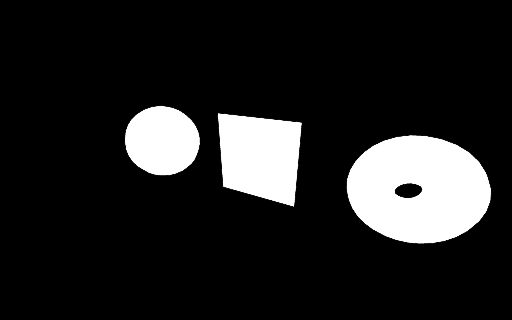

We can now rotate our objects on our `tick` function as we did on the Animation lesson:

```js
/**
 * Animate
 */
const clock = new THREE.Clock()

const tick = () =>
{
    const elapsedTime = clock.getElapsedTime()

    // Update objects
    sphere.rotation.y = 0.1 * elapsedTime
    plane.rotation.y = 0.1 * elapsedTime
    torus.rotation.y = 0.1 * elapsedTime

    sphere.rotation.x = 0.15 * elapsedTime
    plane.rotation.x = 0.15 * elapsedTime
    torus.rotation.x = 0.15 * elapsedTime

    // ...
}

tick()
```


_https://threejs-journey.xyz/assets/lessons/12/step-02.mp4_

You should see your 3 objects spinning slowly.

The materials we are going to discover are using textures in many different ways. Let's load some textures using the [TextureLoader](https://threejs.org/docs/#api/en/loaders/TextureLoader) as we did on the Textures lesson.

All the texture images are located in the `/static/textures/` folder. For now, we will load all the door textures located in the `/static/textures/door/` folder, the first matcap texture located in the `/static/textures/matcaps/` folder and the first gradient texture located in the `/static/textures/gradients/` folder.

Make sure to do that before instantiating the `material`:

```js
/**
 * Textures
 */
const textureLoader = new THREE.TextureLoader()

const doorColorTexture = textureLoader.load('/textures/door/color.jpg')
const doorAlphaTexture = textureLoader.load('/textures/door/alpha.jpg')
const doorAmbientOcclusionTexture = textureLoader.load('/textures/door/ambientOcclusion.jpg')
const doorHeightTexture = textureLoader.load('/textures/door/height.jpg')
const doorNormalTexture = textureLoader.load('/textures/door/normal.jpg')
const doorMetalnessTexture = textureLoader.load('/textures/door/metalness.jpg')
const doorRoughnessTexture = textureLoader.load('/textures/door/roughness.jpg')
const matcapTexture = textureLoader.load('/textures/matcaps/1.png')
const gradientTexture = textureLoader.load('/textures/gradients/3.jpg')
```

To ensure that all the textures are well loaded, you can use them on your material with the `map` property, as we saw in the Textures lesson.

```js
const material = new THREE.MeshBasicMaterial({ map: doorColorTexture })
```

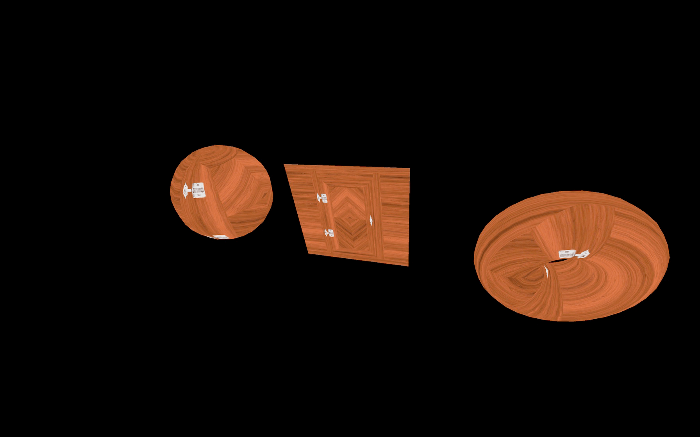

Until now, we only used the [MeshBasicMaterial](https://threejs.org/docs/index.html#api/en/materials/MeshBasicMaterial), which applies a uniform color or a texture on our geometry.

If you search for "material" on the [Three.js documentation](https://threejs.org/docs/), you'll see that there are many classes we can use. Let's try them.

## MeshBasicMaterial

[MeshBasicMaterial](https://threejs.org/docs/#api/en/materials/MeshBasicMaterial) is probably the most "basic" material... But there are multiple properties that we haven't cover yet.

You can set most of those properties while instancing the material in the object we send as a parameter, but you can also change those properties on the instance directly:

```js
const material = new THREE.MeshBasicMaterial({
    map: doorColorTexture
})

// Equals
const material = new THREE.MeshBasicMaterial()
material.map = doorColorTexture
```

We will use the second method, but feel free to do as you like.

- The `map` property will apply a texture on the surface of the geometry:

```js
material.map = doorColorTexture
```

- The `color` property will apply a uniform color on the surface of the geometry. When you are changing the `color` property directly, you must instantiate a [Color](https://threejs.org/docs/index.html#api/en/math/Color) class. You can use many different formats:

```js
material.color = new THREE.Color('#ff0000')
material.color = new THREE.Color('#f00')
material.color = new THREE.Color('red')
material.color = new THREE.Color('rgb(255, 0, 0)')
material.color = new THREE.Color(0xff0000)
```

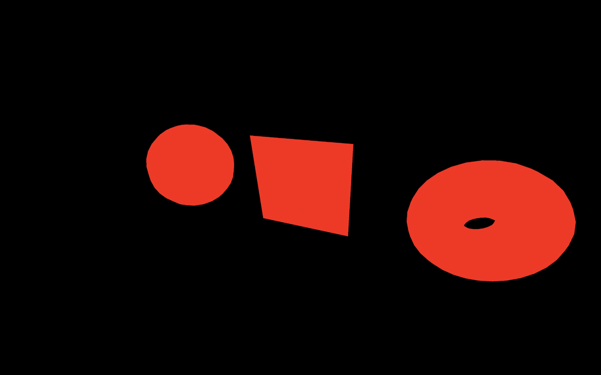

Combining `color` and `map` will tint the texture with the color:

```js
material.map = doorColorTexture
material.color = new THREE.Color('#ff0000')
```

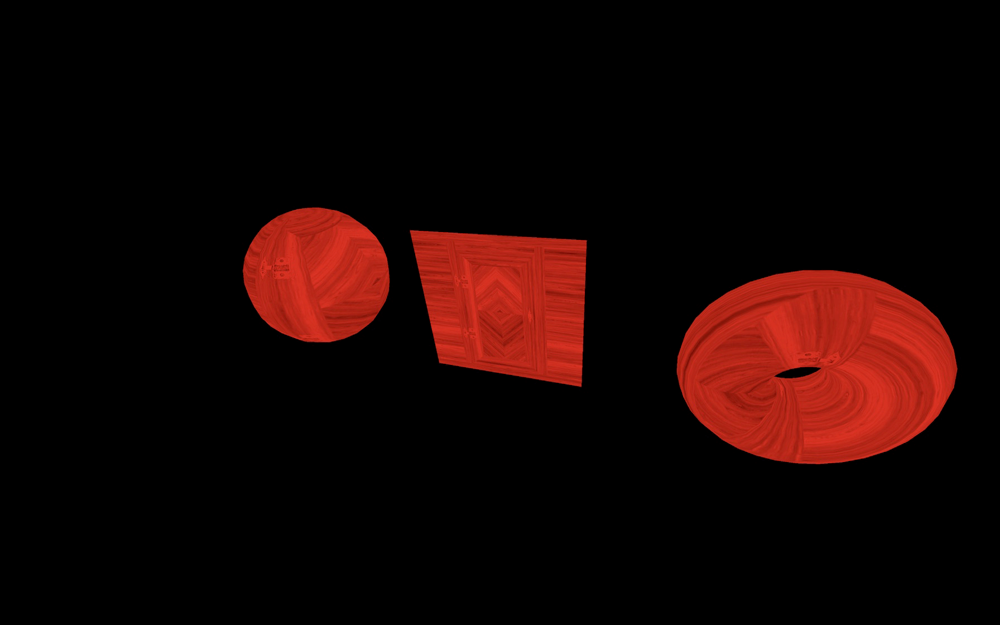

- The `wireframe` property will show the triangles that compose your geometry with a thin line of 1px regardless of the distance of the camera:

```js
material.wireframe = true
```

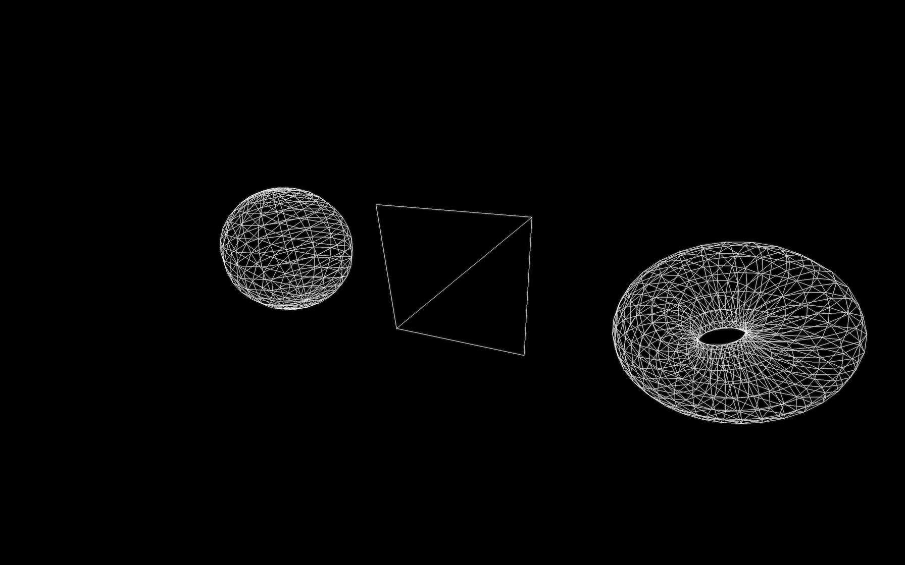

- The `opacity` property controls the transparency but, to work, you should set the `transparent` property to `true` to inform Three.js that this material now supports transparency:

```js
material.transparent = true
material.opacity = 0.5
```

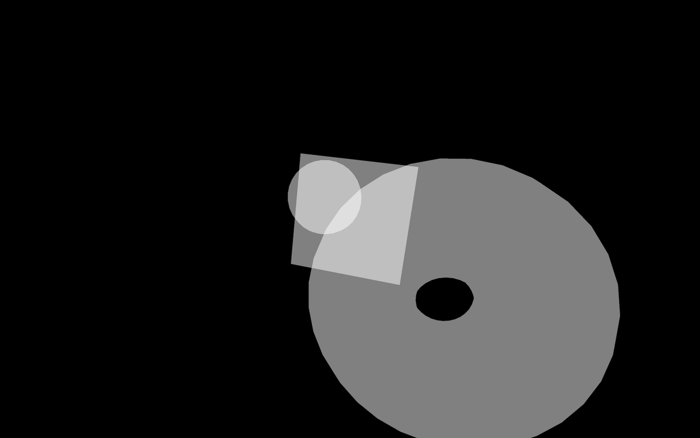

- Now that the transparency is working, we can use the `alphaMap` property to control the transparency with a texture:

```js
material.transparent = true
material.alphaMap = doorAlphaTexture
```

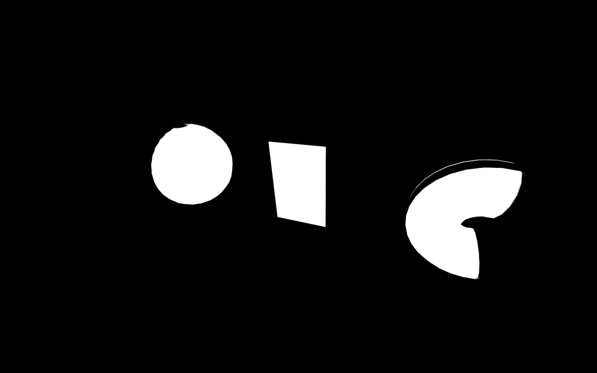

- The `side` property lets you decide which side of a face is visible. By default, the front side is visible (`THREE.FrontSide`), but you can show the backside instead (`THREE.BackSide`) or both (`THREE.DoubleSide`):

```js
material.side = THREE.DoubleSide
```

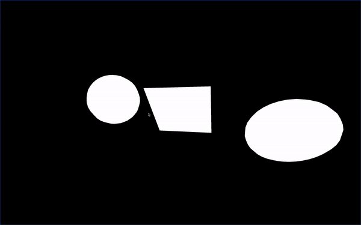

_https://threejs-journey.xyz/assets/lessons/12/step-09.mp4_

You should see both the front and the back of the plane.

Try to avoid using `THREE.DoubleSide` because rendering both sides means having twice more triangles to render.

Some of these properties like `wireframe` or `opacity` can be used with other types of materials. We won't repeat those every time.

## MeshNormalMaterial

The [MeshNormalMaterial](https://threejs.org/docs/#api/en/materials/MeshNormalMaterial) displays a nice purple, blueish, greenish color that looks like the normal texture we saw in the Textures lessons. That is no coincidence because both are related to what we call normals:

```js
const material = new THREE.MeshNormalMaterial()
```

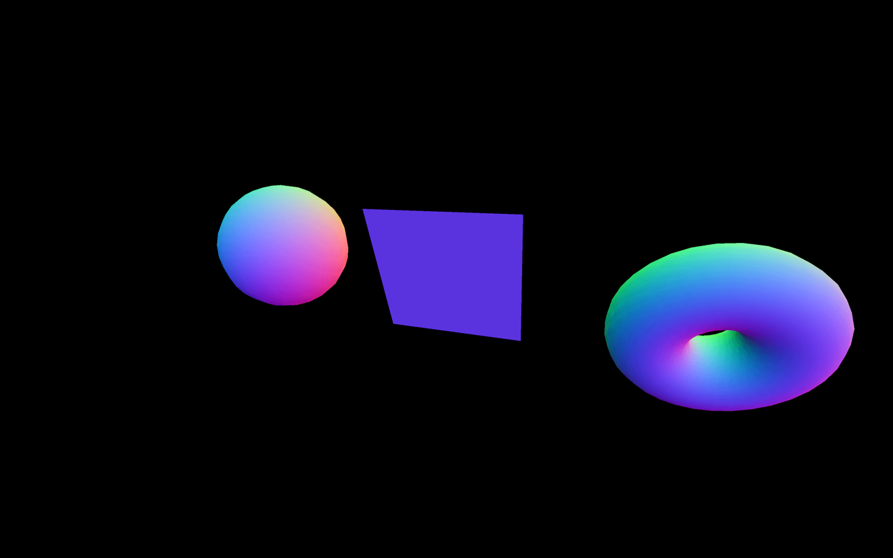

Normals are information encoded in each vertex that contains the direction of the outside of the face. If you displayed those normals as arrows, you would get straight lines comings out of each vertex that composes your geometry.

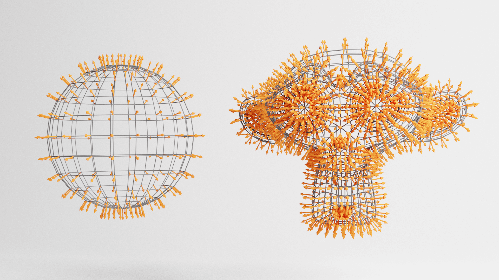

You can use Normals for many things like calculating how to illuminate the face or how the environment should reflect or refract on the geometries' surface.

When using the [MeshNormalMaterial](https://threejs.org/docs/#api/en/materials/MeshNormalMaterial), the color will just display the normal relative's orientation to the camera. If you rotate around the sphere, you'll see that the color is always the same, regardless of which part of the sphere you're looking at.

While you can use some of the properties we discovered with the [MeshBasicMaterial](https://threejs.org/docs/index.html#api/en/materials/MeshBasicMaterial) like `wireframe`, `transparent`, `opacity` and `side`, there is also a new property that you can use, which is called `flatShading`:

```js
material.flatShading = true
```

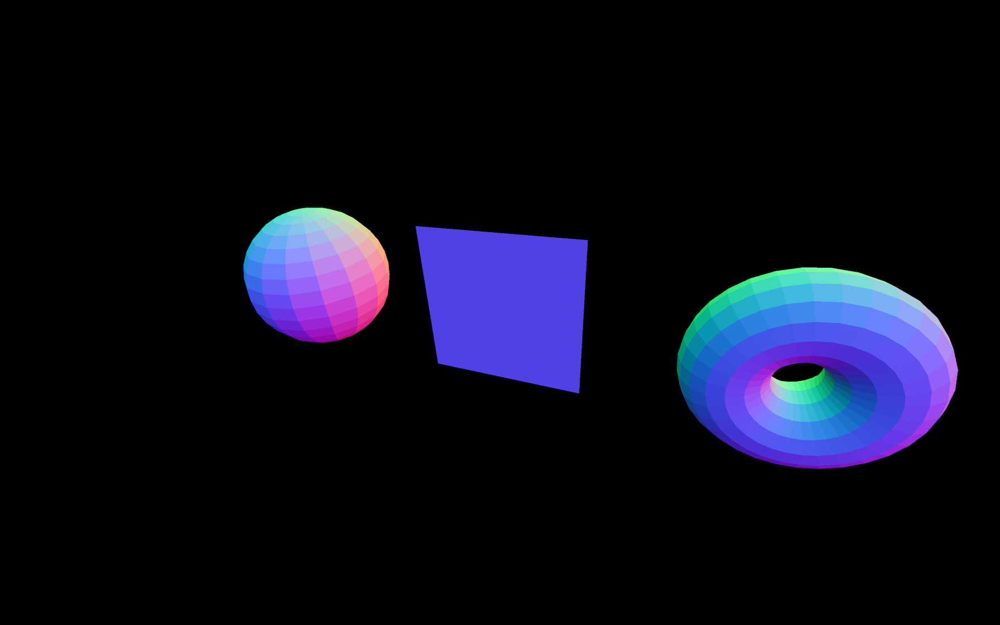

`flatShading` will flatten the faces, meaning that the normals won't be interpolated between the vertices.

[MeshNormalMaterial](https://threejs.org/docs/#api/en/materials/MeshNormalMaterial) can be useful to debug the normals, but it also looks great, and you can use it as it is just like ilithya did on her portfolio [https://www.ilithya.rocks](https://www.ilithya.rocks).

## MeshMatcapMaterial

[MeshMatcapMaterial](https://threejs.org/docs/#api/en/materials/MeshMatcapMaterial) is a fantastic material because of how great it can look while being very performant.

For it to work, the [MeshMatcapMaterial](https://threejs.org/docs/#api/en/materials/MeshMatcapMaterial) needs a reference texture that looks like a sphere.


The material will then pick colors on the texture according to the normal orientation relative to the camera.

To set that reference matcap texture, use the `matcap` property:

```js
const material = new THREE.MeshMatcapMaterial()
material.matcap = matcapTexture
```

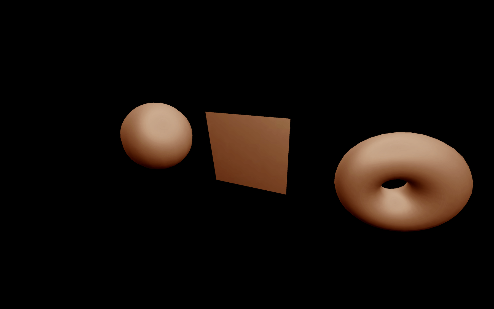

The meshes will appear illuminated, but it's just a texture that looks like it.

The only problem is that the illusion is the same regardless of the camera orientation. Also, you cannot update the lights because there are none.

Try different textures available on the `/static/textures/matcaps/` folder (just one of the lines below):

```js
const matcapTexture = textureLoader.load('/textures/matcaps/2.png')
const matcapTexture = textureLoader.load('/textures/matcaps/3.png')
const matcapTexture = textureLoader.load('/textures/matcaps/4.png')
const matcapTexture = textureLoader.load('/textures/matcaps/5.png')
const matcapTexture = textureLoader.load('/textures/matcaps/6.png')
const matcapTexture = textureLoader.load('/textures/matcaps/7.png')
const matcapTexture = textureLoader.load('/textures/matcaps/8.png')
```

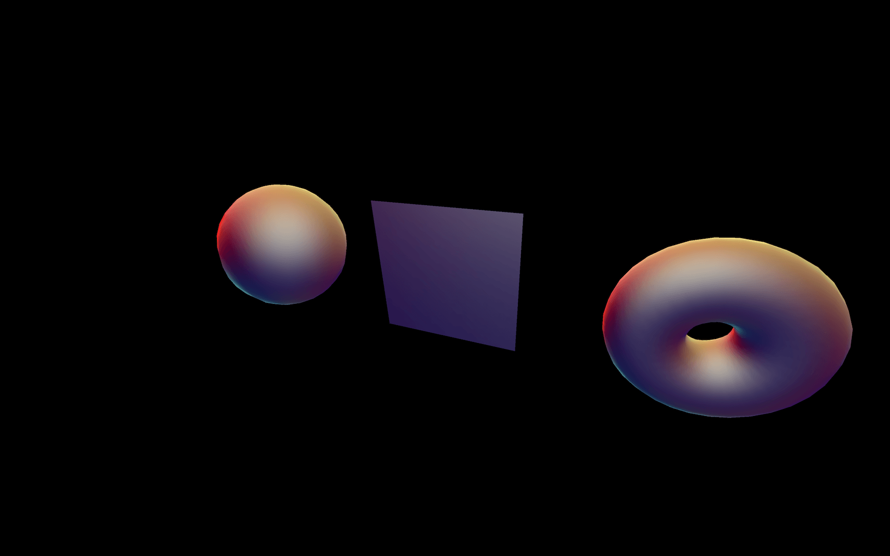

Regarding where to find matcaps textures, you can do a simple search on the web like any type of textures. Make sure you have the right to use the texture if it's not for personal usage. There is also this vast list of matcaps: [https://github.com/nidorx/matcaps](https://github.com/nidorx/matcaps)

You can also create your own matcaps using a 3D software by rendering a sphere in front of the camera in a square image. Finally, you can try to make a matcap in 2D software like Photoshop.

## MeshDepthMaterial

The [MeshDepthMaterial](https://threejs.org/docs/index.html#api/en/materials/MeshDepthMaterial) will simply color the geometry in white if it's close to the camera's `near` value and in black if it's close to the `far` value of the camera:

```js
const material = new THREE.MeshDepthMaterial()
```

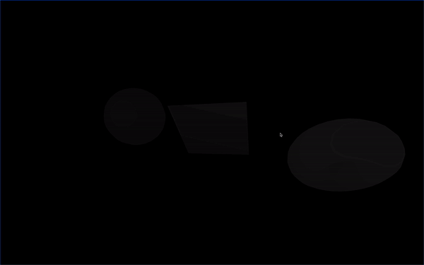

_https://threejs-journey.xyz/assets/lessons/12/step-14.mp4_

You can use this material for special effects where you need to know how far the pixel is from the camera. We will use it in a future lesson.

## Adding a few lights

The following materials need lights to be seen. Let's add two simple lights to our scene.

Create an [AmbientLight](https://threejs.org/docs/index.html#api/en/lights/AmbientLight) and add it to the scene:

```js
/**
 * Lights
 */
const ambientLight = new THREE.AmbientLight(0xffffff, 0.5)
scene.add(ambientLight)
```

Create a [PointLight](https://threejs.org/docs/#api/en/lights/PointLight) and add it to the scene:

```js
// ...

const pointLight = new THREE.PointLight(0xffffff, 0.5)
pointLight.position.x = 2
pointLight.position.y = 3
pointLight.position.z = 4
scene.add(pointLight)
```

We will see more about lights, how they work and how to tweak them in a future lesson.

## MeshLambertMaterial

The [MeshLambertMaterial](https://threejs.org/docs/#api/en/materials/MeshLambertMaterial) is the first material reacting to light that we are going to use:

```js
const material = new THREE.MeshLambertMaterial()
```

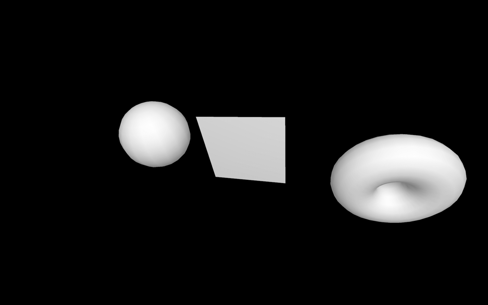

Things are getting realistic, as you can see. While the illumination isn't very convincing, it's a good start.

[MeshLambertMaterial](https://threejs.org/docs/#api/en/materials/MeshLambertMaterial) supports the same properties as the [MeshBasicMaterial](https://threejs.org/docs/index.html#api/en/materials/MeshBasicMaterial) but also some properties related to lights. We will see those properties later in the lesson with more adequate materials.

The [MeshLambertMaterial](https://threejs.org/docs/#api/en/materials/MeshLambertMaterial) is the most performant material that uses lights. Unfortunately, the parameters aren't convenient, and you can see strange patterns on the geometry if you look closely at rounded geometries like the sphere.

## MeshPhongMaterial

The [MeshPhongMaterial](https://threejs.org/docs/#api/en/materials/MeshPhongMaterial) is very similar to the [MeshLambertMaterial](https://threejs.org/docs/#api/en/materials/MeshLambertMaterial), but the strange patterns are less visible, and you can also see the light reflection on the surface of the geometry:

```js
const material = new THREE.MeshPhongMaterial()
```


[MeshPhongMaterial](https://threejs.org/docs/#api/en/materials/MeshPhongMaterial) is less performant than [MeshLambertMaterial](https://threejs.org/docs/#api/en/materials/MeshLambertMaterial). However, it doesn't really matter at this level.

You can control the light reflection with the `shininess` property. The higher the value, the shinier the surface. You can also change the color of the reflection by using the `specular` property:

```js
material.shininess = 100
material.specular = new THREE.Color(0x1188ff)
```

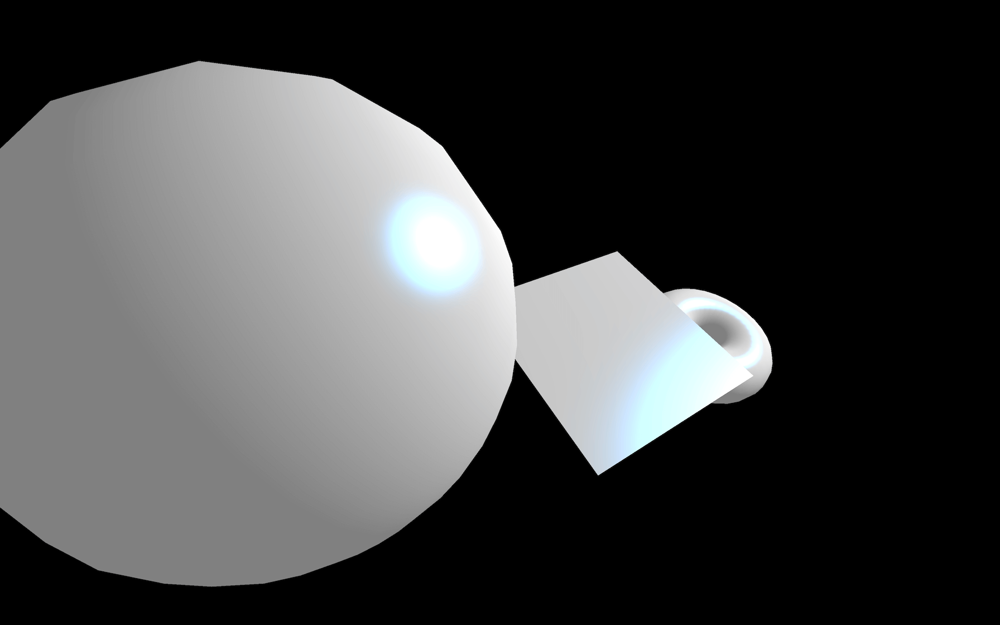

The light reflection will have a blue-ish color.

## MeshToonMaterial

The [MeshToonMaterial](https://threejs.org/docs/#api/en/materials/MeshToonMaterial) is similar to the [MeshLambertMaterial](https://threejs.org/docs/#api/en/materials/MeshLambertMaterial) in terms of properties but with a cartoonish style:

```js
const material = new THREE.MeshToonMaterial()
```


By default, you only get a two parts coloration (one for the shadow and one for the light). To add more steps to the coloration, you can use the `gradientMap` property and use the `gradientTexture` we loaded at the start of the lesson:

```js
material.gradientMap = gradientTexture
```

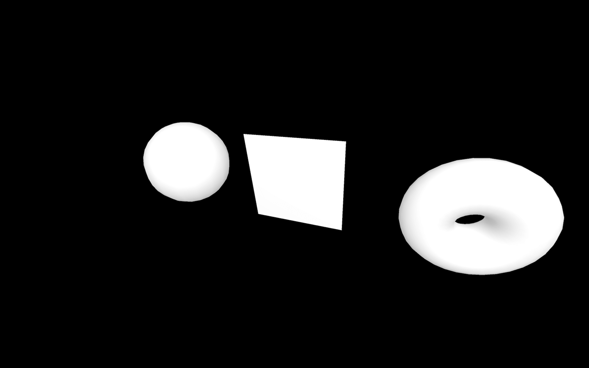

If you test this, you'll see that the cartoon effect doesn't work anymore. That is because the gradient texture we used is tiny, and the pixels of that texture are blended. Yes, it's a matter of `minFilter`, `magFilter`, and `mipmapping` like we saw in the Textures lesson.

To fix this, we can simply change the `minFilter` and `magFilter` to `THREE.NearestFilter`.

Using `THREE.NearestFilter` means that we are not using the mip mapping, we can deactivate it with `gradientTexture.generateMipmaps = false`:

```js
gradientTexture.minFilter = THREE.NearestFilter
gradientTexture.magFilter = THREE.NearestFilter
gradientTexture.generateMipmaps = false
```

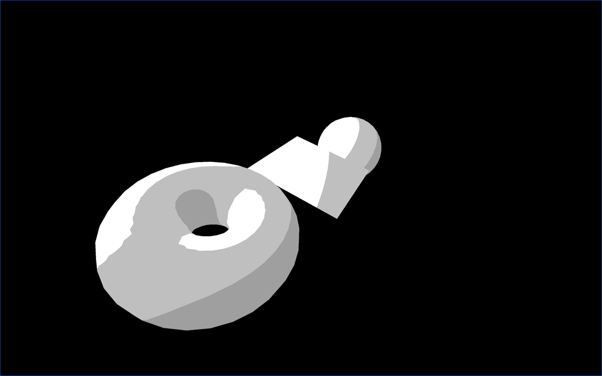

You should now see the cartoon effect with an intermediate step.

You can try with even more steps by using the image located in `/static/textures/gradients.5.jpg`:

```js
const gradientTexture = textureLoader.load('/textures/gradients/5.jpg')
```

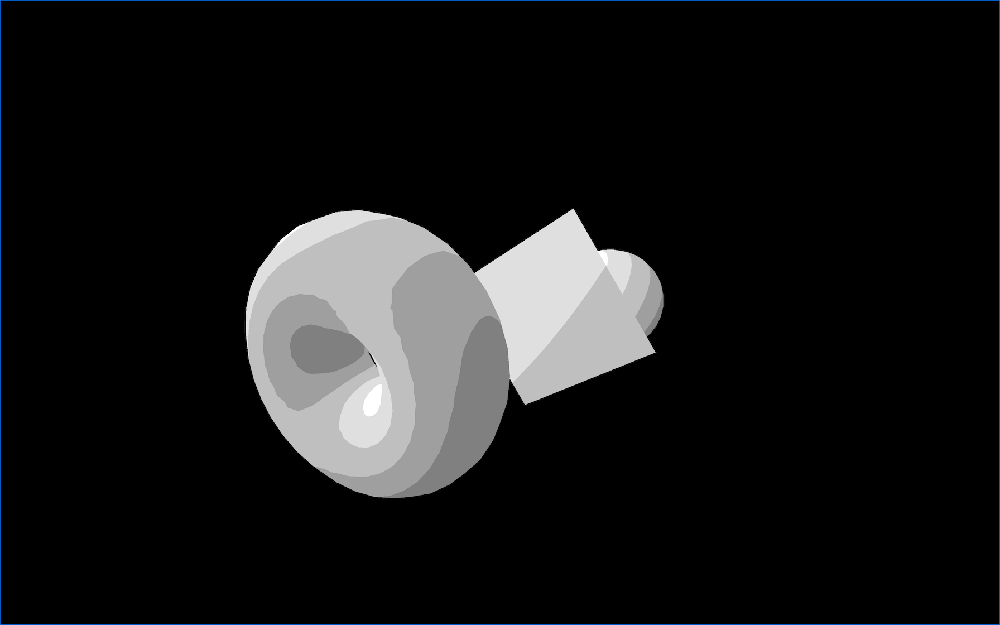

## MeshStandardMaterial

The [MeshStandardMaterial](https://threejs.org/docs/#api/en/materials/MeshStandardMaterial) uses physically based rendering principles. Yes, we are talking about the PBR we saw in the Textures lesson. Like the [MeshLambertMaterial](https://threejs.org/docs/#api/en/materials/MeshLambertMaterial) and the [MeshPhongMaterial](https://threejs.org/docs/#api/en/materials/MeshPhongMaterial), it supports lights but with a more realistic algorithm and better parameters like roughness and metalness.

It's called "standard" because the PBR is becoming a standard in many software, engines, and libraries. The idea is to have a realistic result with realistic parameters, and you should have a very similar result regardless of the technology you are using:

```js
const material = new THREE.MeshStandardMaterial()
```


You can change the `roughness` and the `metalness` properties directly:

```js
material.metalness = 0.45
material.roughness = 0.65
```

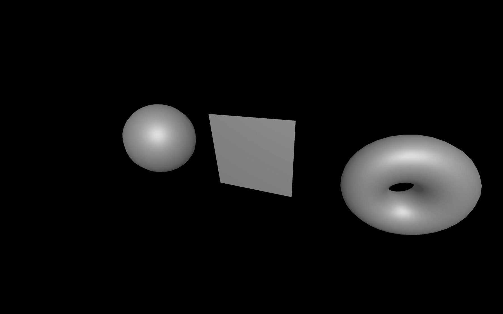

### Add a debug UI

While this isn't required, now would be an excellent time to add a debug UI. That will be very useful to test the different properties.

First, we must add the [Dat.GUI](https://www.npmjs.com/package/dat.gui) dependency to our project. In the terminal, on the project folder (where the server should be currently running), use the following command:

```bash
npm install --save dat.gui
```

Then, on top of your code, import `dat.gui` (don't forget to re-launch the server with `npm run dev` if you stopped it):

```js
import * as dat from 'dat.gui'
```

You can now create an instance of it:

```js
/**
 * Debug
 */
const gui = new dat.GUI()
```

And add the tweaks (after creating the material):

```js
gui.add(material, 'metalness').min(0).max(1).step(0.0001)
gui.add(material, 'roughness').min(0).max(1).step(0.0001)
```


_https://threejs-journey.xyz/assets/lessons/12/step-24.mp4_

And that's it. You can now change the `metalness` and the `roughness` as you like.

Let's continue with the other properties of the [MeshStandardMaterial](https://threejs.org/docs/#api/en/materials/MeshStandardMaterial).

The `map` property allows you to apply a simple texture. You can use `doorColorTexture`:

```js
material.map = doorColorTexture
```


The `aoMap` property (literally "ambient occlusion map") will add shadows where the texture is dark. For it to work, you must add what we call a second set of UV (the coordinates that help position the textures on the geometries).

We can simply add new attributes like we did on the Geometries lesson and use the default `uv` attribute. In more simple terms, we duplicated the `uv` attribute.

Call this new attribute `uv2`:

```js
sphere.geometry.setAttribute('uv2', new THREE.BufferAttribute(sphere.geometry.attributes.uv.array, 2))
plane.geometry.setAttribute('uv2', new THREE.BufferAttribute(plane.geometry.attributes.uv.array, 2))
torus.geometry.setAttribute('uv2', new THREE.BufferAttribute(torus.geometry.attributes.uv.array, 2))
```

You can now add the `aoMap` using the `doorAmbientOcclusionTexture` texture and control the intensity using the `aoMapIntensity` property:

```js
material.aoMap = doorAmbientOcclusionTexture
material.aoMapIntensity = 1
```

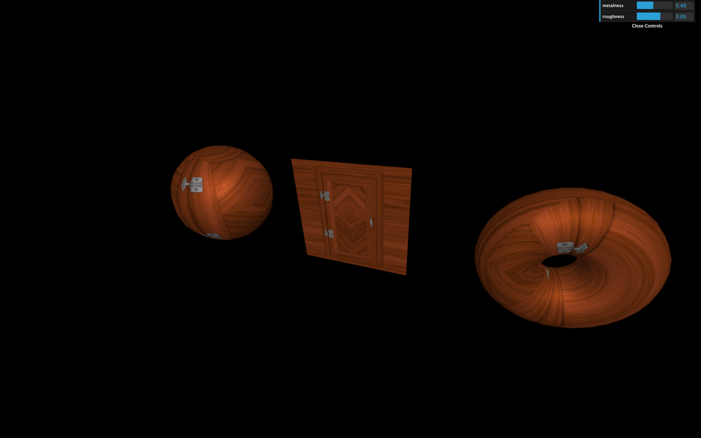

The crevices should look darker, which creates contrast and adds dimension.

The `displacementMap` property will move the vertices to create true relief:

```js
material.displacementMap = doorHeightTexture
```

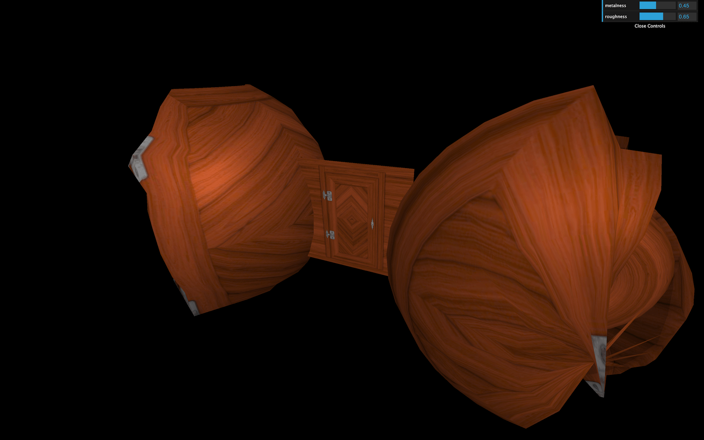

It should look terrible. That is due to the lack of vertices on our geometries (we need more subdivisions) and the displacement being way too strong:

```js
material.displacementScale = 0.05

// ...

new THREE.SphereGeometry(0.5, 64, 64),

// ...

new THREE.PlaneGeometry(1, 1, 100, 100),

// ...

new THREE.TorusGeometry(0.3, 0.2, 64, 128),
```

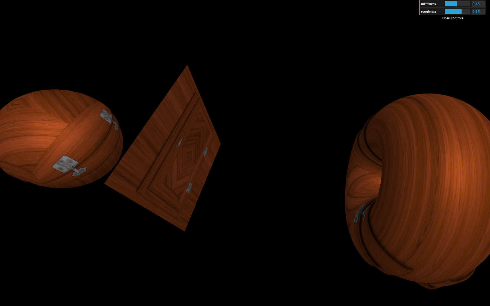

Instead of specifying uniform `metalness` and `roughness` for the whole geometry, we can use `metalnessMap` and `roughnessMap`:

```js
material.metalnessMap = doorMetalnessTexture
material.roughnessMap = doorRoughnessTexture
```

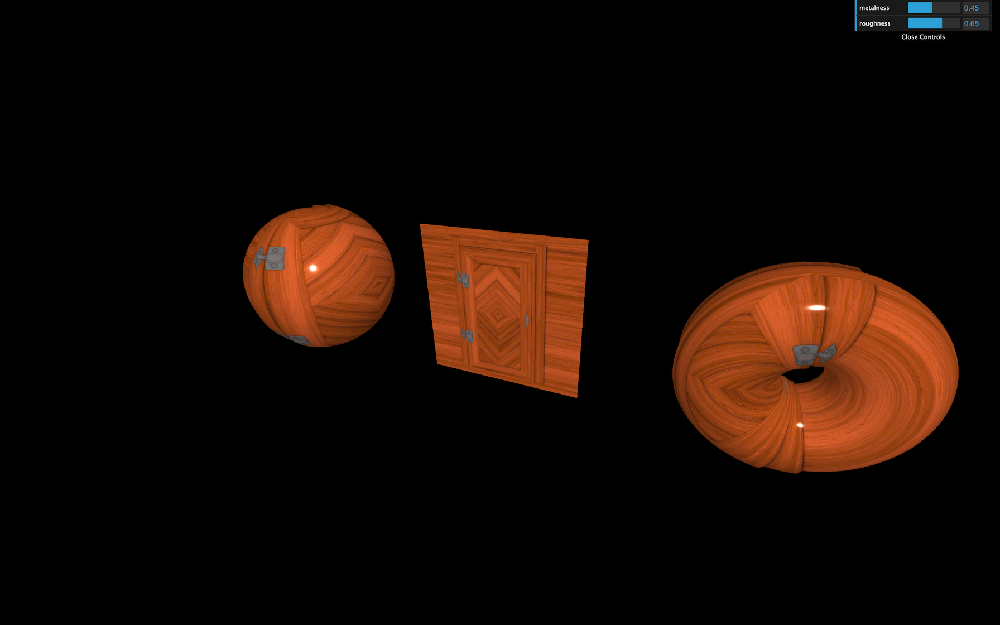

The reflection looks weird because the `metalness` and `roughness` properties still affect each map respectively. We should comment them or use their original values:

```js
material.metalness = 0
material.roughness = 1
```

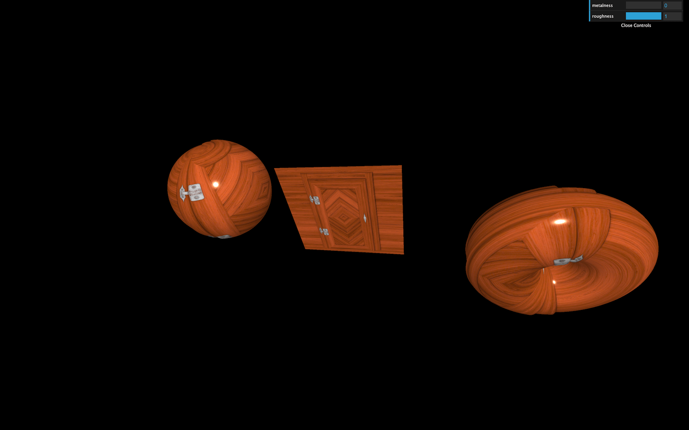

The `normalMap` will fake the normal orientation and add details on the surface regardless of the subdivision:

```js
material.normalMap = doorNormalTexture
```

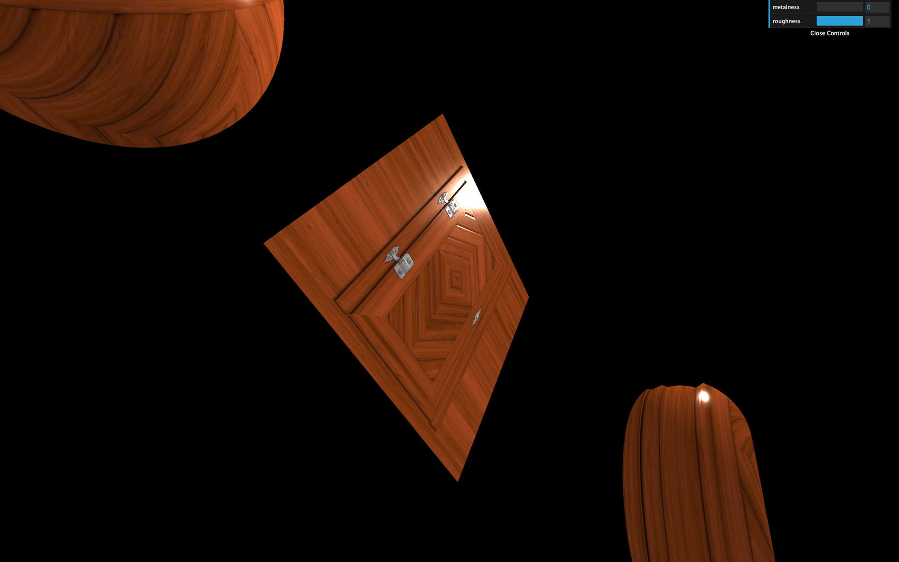

You can change the normal intensity with the `normalScale` property. Be careful, it's a [Vector2](https://threejs.org/docs/index.html#api/en/math/Vector2):

```js
material.normalScale.set(0.5, 0.5)
```

And finally, you can control the alpha using the `alphaMap` property. Don't forget to set the `transparent` property to `true`:

```js
material.transparent = true
material.alphaMap = doorAlphaTexture
```

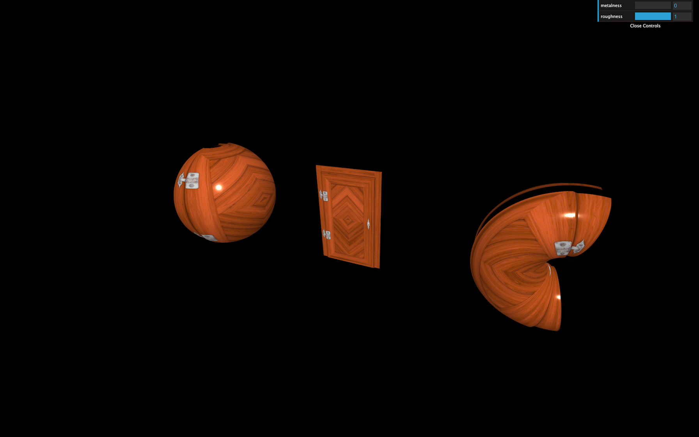

Here's a beautiful door. Feel free to tweak the properties and try stuff.

## MeshPhysicalMaterial

The [MeshPhysicalMaterial](https://threejs.org/docs/index.html#api/en/materials/MeshPhysicalMaterial) is the same as the [MeshStandardMaterial](https://threejs.org/docs/#api/en/materials/MeshStandardMaterial) but with support of a clear coat effect. You can control that clear coat's properties and even use a texture as in this [Three.js example](https://threejs.org/examples/#webgl_materials_physical_clearcoat), but we won't try this one here.

## PointsMaterial

You can use [PointsMaterial](https://threejs.org/docs/index.html#api/en/materials/PointsMaterial) with particles. We will see more about that in a dedicated lesson.

## ShaderMaterial and RawShaderMaterial

[ShaderMaterial](https://threejs.org/docs/index.html#api/en/materials/ShaderMaterial) and [RawShaderMaterial](https://threejs.org/docs/index.html#api/en/materials/RawShaderMaterial) can both be used to create your own materials but we will see more about that in a dedicated lesson.

## Environment map

The environment map is like an image of what's surrounding the scene. You can use it to add reflection or refraction to your objects. It can also be used as lighting information.

We haven't covered it yet, but you can use it with many of the materials we saw.

First, let's setup a very simple [MeshStandardMaterial](https://threejs.org/docs/index.html#api/en/materials/MeshStandardMaterial) with the debug UI as we did earlier:

```js
const material = new THREE.MeshStandardMaterial()
material.metalness = 0.7
material.roughness = 0.2
gui.add(material, 'metalness').min(0).max(1).step(0.0001)
gui.add(material, 'roughness').min(0).max(1).step(0.0001)
```

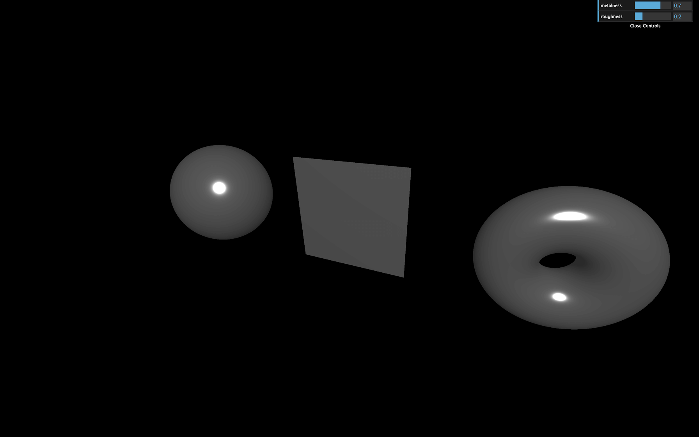

To add the environment map to our material, we must use the `envMap` property. Three.js only supports cube environment maps. Cube environment maps are 6 images with each one corresponding to a side of the environment.

You can find multiple environment maps in the `/static/textures/environmentMap/` folder.

To load a cube texture, you must use the [CubeTextureLoader](https://threejs.org/docs/index.html#api/en/loaders/CubeTextureLoader) instead of the [TextureLoader](https://threejs.org/docs/index.html#api/en/loaders/TextureLoader).

Instantiate the [CubeTextureLoader](https://threejs.org/docs/index.html#api/en/loaders/CubeTextureLoader) before instantiating the `material` and call its `load(...)` method but use an array of paths instead of one path:

```js
const cubeTextureLoader = new THREE.CubeTextureLoader()

const environmentMapTexture = cubeTextureLoader.load([
    '/textures/environmentMaps/0/px.jpg',
    '/textures/environmentMaps/0/nx.jpg',
    '/textures/environmentMaps/0/py.jpg',
    '/textures/environmentMaps/0/ny.jpg',
    '/textures/environmentMaps/0/pz.jpg',
    '/textures/environmentMaps/0/nz.jpg'
])
```

You can now use the `environmentMapTexture` in the `envMap` property of your material:

```js
material.envMap = environmentMapTexture
```

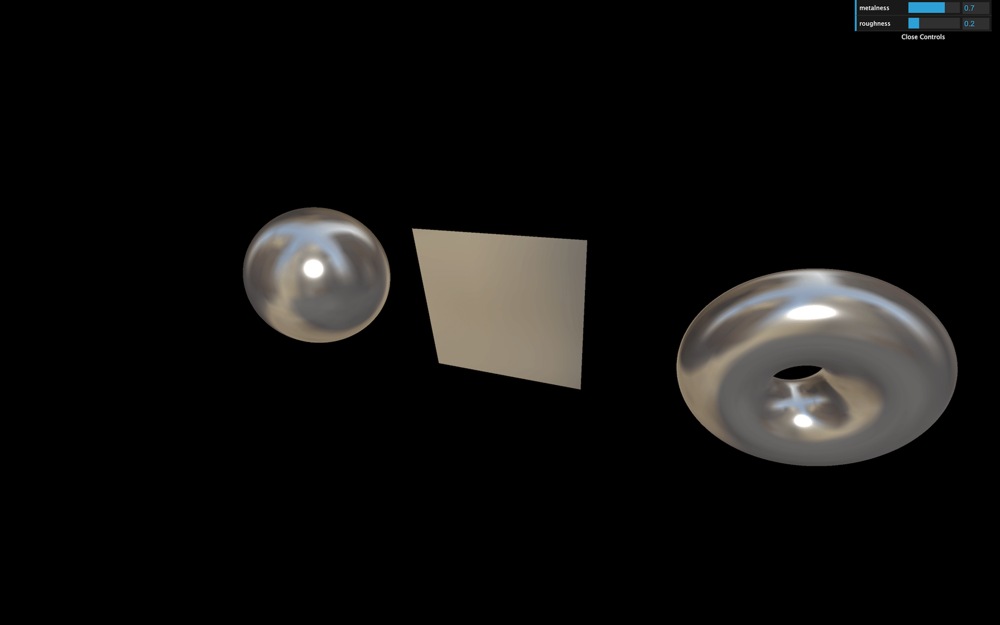

You should see the environment reflect on the surface of the geometry. Try to tweak the `metalness` and `roughness` for different results.

You can also test the other environment maps in the `/static/textures/environmentMap/` folder.

### Where to find environment maps

To find cool environment maps, you can always do a simple search on the web and make sure you have the right to use the environment map if it's not for personal usage.

One of the best sources is [HDRIHaven](https://hdrihaven.com/). This website has hundreds of awesome HDRIs. HDRI stands for **High Dynamic Range Imaging**. They are composed of one image (not a cube map) and contain more data than a simple image, thus improving lighting information for a more realistic result. [HDRIHaven](https://hdrihaven.com/) images are free and under [CC0 license](https://hdrihaven.com/p/license.php), which means that you can do anything you want with them without having to credit the authors. But if you appreciate their work, you can thank them by subscribing to [their Patreon](https://www.patreon.com/hdrihaven/overview).

But we have a problem. As we said, Three.js only supports cube maps. To convert an HDRI to a cube map, you can use this online tool: [https://matheowis.github.io/HDRI-to-CubeMap/](https://matheowis.github.io/HDRI-to-CubeMap/)

Upload an HDRI, rotate it as you please, and download a cubemap version composed of 6 images. The default format is `.png`, and you'll have to convert them to `.jpg` if you want.
