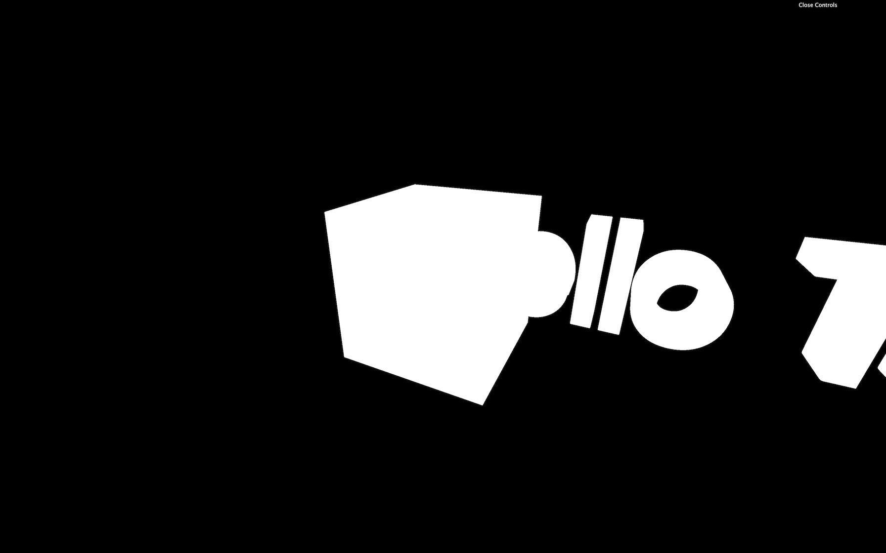
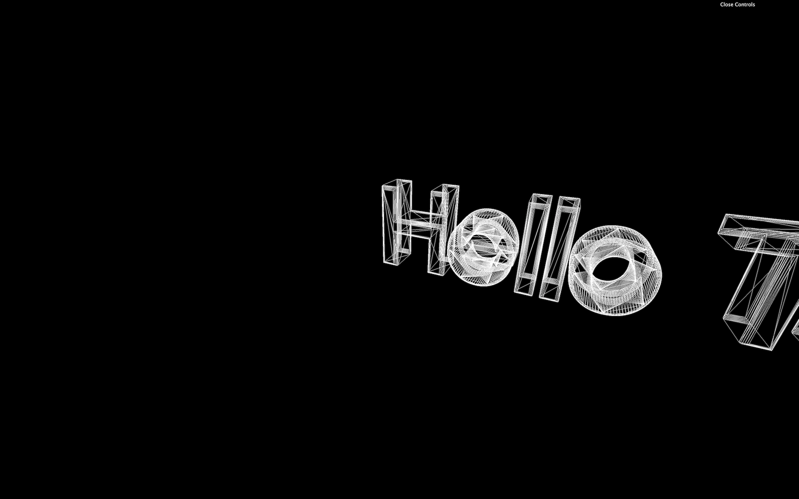
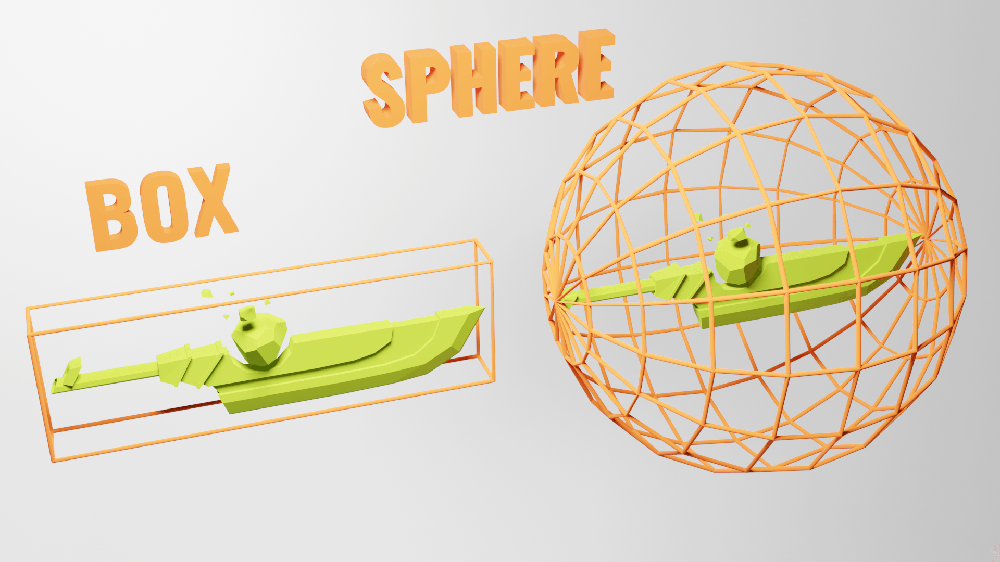
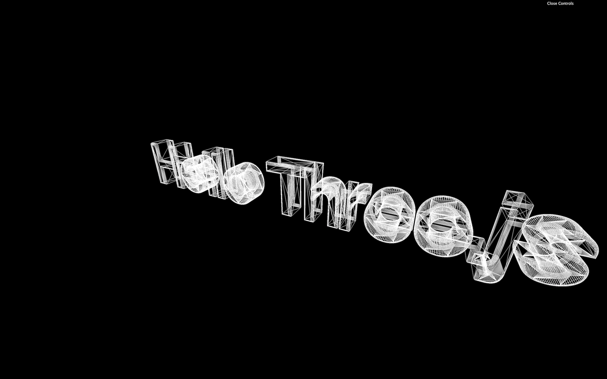
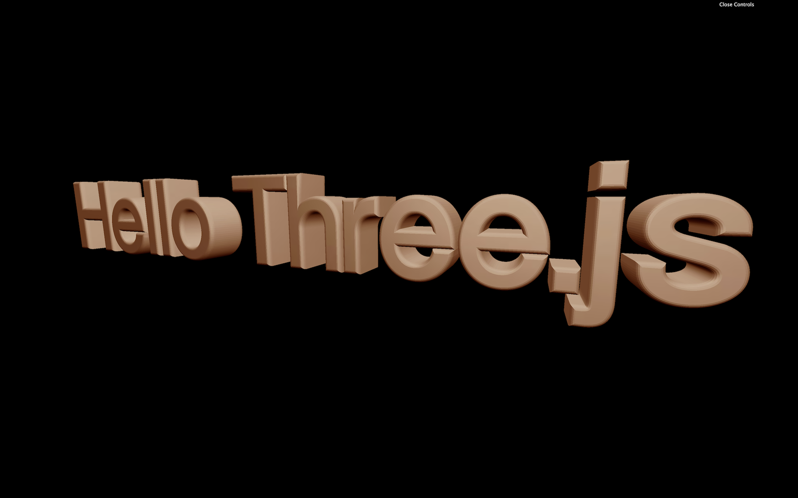
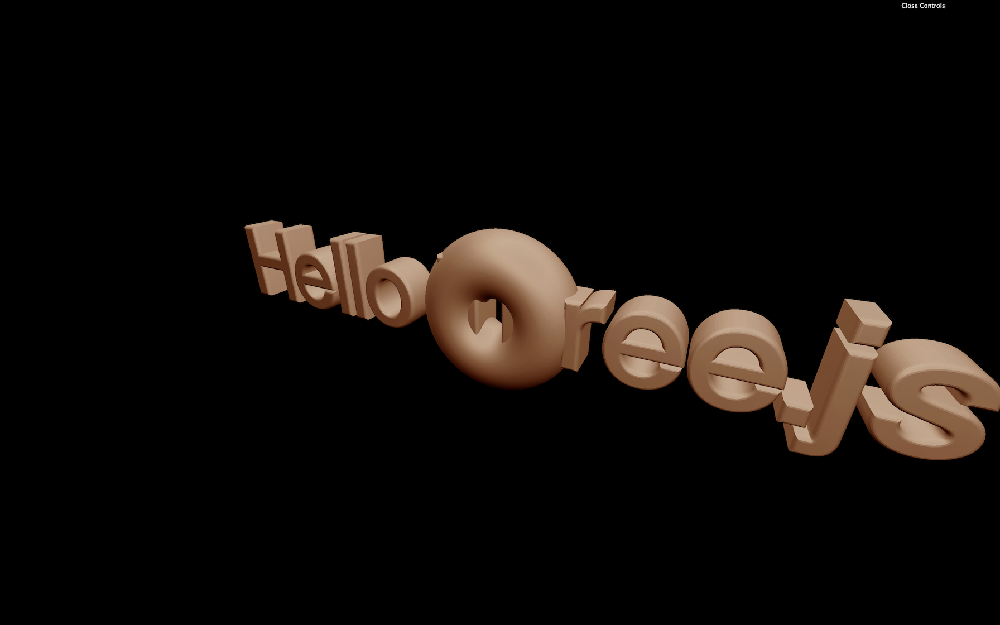
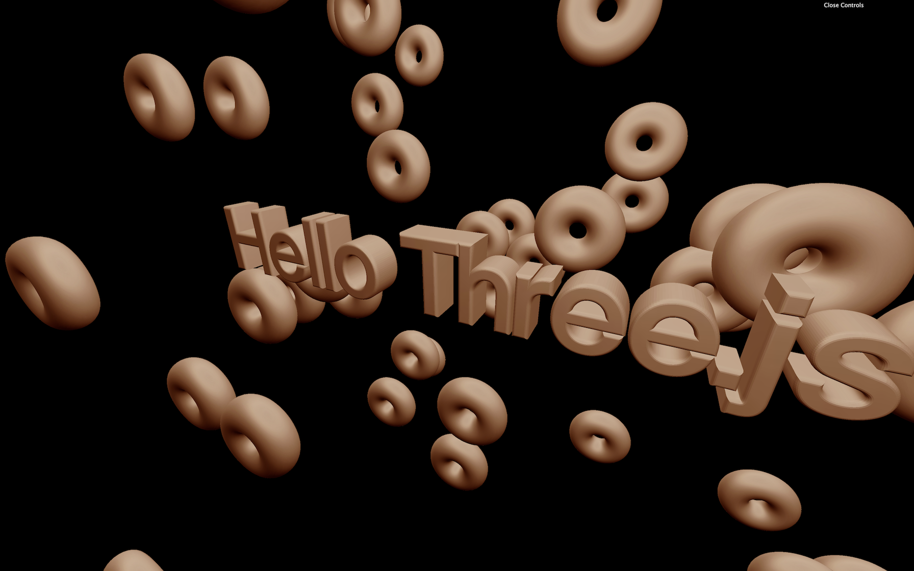
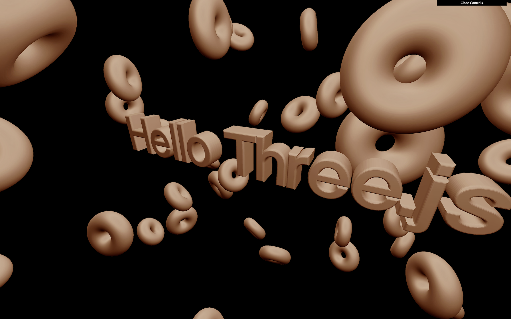
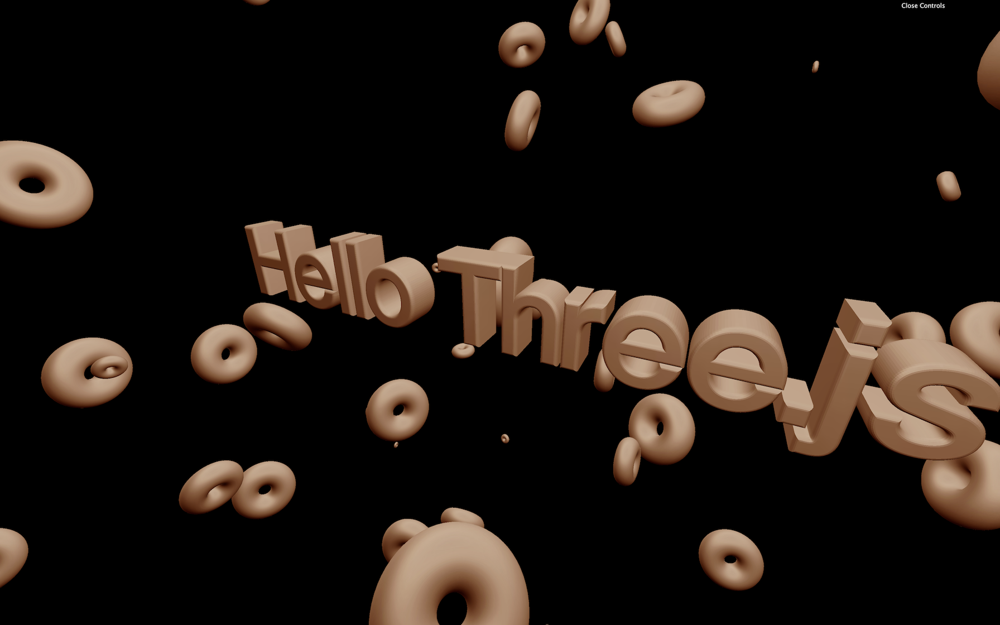
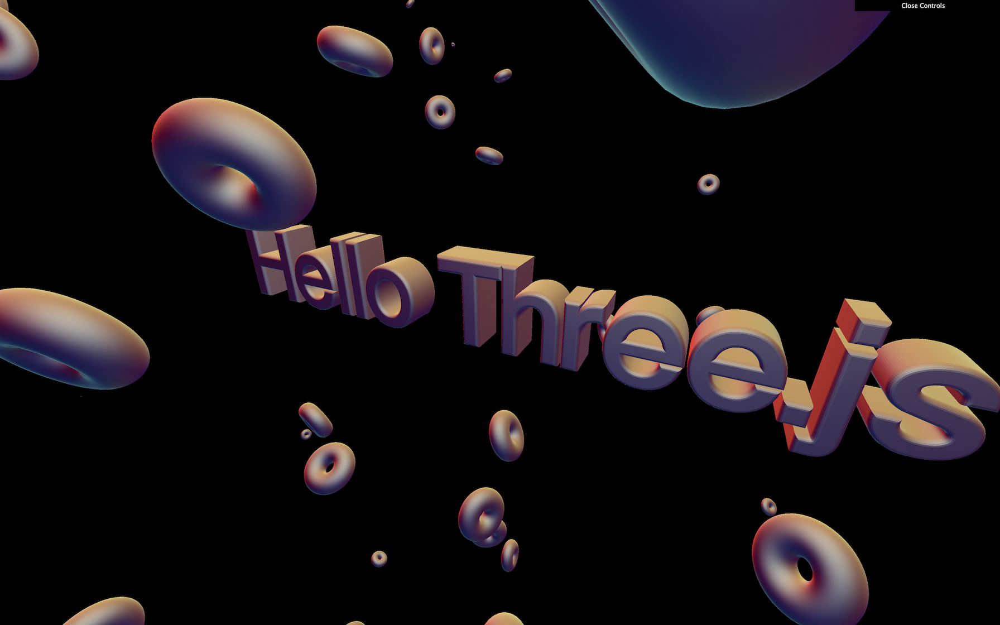

# 3D Text

[](https://shields.io)

Learn in [https://threejs-journey.xyz/lessons/13](https://threejs-journey.xyz/lessons/13)

## Introduction

We already know enough basics to create some content. For our first project, we will re-create what ilithya did with her cool portfolio [https://www.ilithya.rocks/](https://www.ilithya.rocks/) and have a big 3D text in the middle of the scene with objects floating around.

This portfolio is an excellent example of what you can do quite early when learning Three.js. It simple, efficient, and it looks great.

Three.js already supports 3D text geometries with the [TextGeometry](https://threejs.org/docs/index.html#api/en/geometries/TextGeometry) class. The problem is that you must specify a font, and this font must be in a particular json format called typeface.

We won't talk about licenses, but you must have the right to use the font unless it's for personal usage.

## How to get a typeface font

There are many ways of getting fonts in that format. First, you can convert your font with converters like this one: [https://gero3.github.io/facetype.js/](http://gero3.github.io/facetype.js/). You have to provide a file and click on the convert button.

You can also find fonts in the Three.js examples located in the `/node_modules/three/examples/fonts/` folder. You can take those fonts and put them in the `/static/` folder, or you can import them directly in your JavaScript file because they are json and `.json` files are supported just like `.js` files in Webpack:

```js
import typefaceFont from 'three/examples/fonts/helvetiker_regular.typeface.json'
```

We will mix those two techniques by opening the `/node_modules/three/examples/fonts/`, taking the `helvetiker_regular.typeface.json` and `LICENSE` files, and putting these in the `/static/fonts/` folder (that you need to create).

The font is now accessible just by writing `/fonts/helvetiker_regular.typeface.json` at the end of the base URL.

## Load the font

To load the font, we must use a new loader class called [FontLoader](https://threejs.org/docs/index.html#api/en/loaders/FontLoader). This loader works just like the [TextureLoader](https://threejs.org/docs/index.html#api/en/loaders/TextureLoader). Add the following code after the `textureLoader` part (if you are using another font, don't forget to change the path):

```js
/**
 * Fonts
 */
const fontLoader = new THREE.FontLoader()

fontLoader.load(
    '/fonts/helvetiker_regular.typeface.json',
    (font) =>
    {
        console.log('loaded')
    }
)
```

You should get `'loaded'` in you console. If not, check the previous steps and search for potential errors in the console.

We now have access to the font by using the `font` variable inside the function. Unlike the [TextureLoader](https://threejs.org/docs/index.html#api/en/loaders/TextureLoader), we have to write the rest of our code inside that success function.

## Create the geometry

As we said earlier, we are going to use [TextGeometry](https://threejs.org/docs/index.html#api/en/geometries/TextGeometry). Be careful with the example code on the [documentation page](https://threejs.org/docs/index.html#api/en/geometries/TextBufferGeometry); the values are much bigger than those in our scene.

Make sure to write your code inside the success function:

```js
fontLoader.load(
    '/fonts/helvetiker_regular.typeface.json',
    (font) =>
    {
        const textGeometry = new THREE.TextGeometry(
            'Hello Three.js',
            {
                font: font,
                size: 0.5,
                height: 0.2,
                curveSegments: 12,
                bevelEnabled: true,
                bevelThickness: 0.03,
                bevelSize: 0.02,
                bevelOffset: 0,
                bevelSegments: 5
            }
        )
        const textMaterial = new THREE.MeshBasicMaterial()
        const text = new THREE.Mesh(textGeometry, textMaterial)
        scene.add(text)
    }
)
```



You should get a white 3D text that needs improvements.

First, get rid of the cube. Its purpose was to make sure that everything is working.


If you want to see something cool, add `wireframe: true` to your material.

```js
const textMaterial = new THREE.MeshBasicMaterial({ wireframe: true })
```



You can now see how the geometry is generated, and there are a lot of triangles. Creating a text geometry is long and hard for the computer. Avoid doing it too many times and keep the geometry as low poly as possible by reducing the `curveSegments` and `bevelSegments` properties.

Remove the `wireframe` once you're happy with the level of details.

## Center the text

There are several ways to center the text. One way of doing it is by using bounding. The bounding is the information associated with the geometry that tells what space is taken by that geometry. It can be a box or a sphere.



You cannot actually see those boundings, but it helps Three.js easily calculate if the object is on the screen, and if not, the object won't even be rendered. That is called frustum culling, but it's not the subject of this lesson.

What we want is to use this bounding to know the size of the geometry and recenter it. By default, Three.js is using sphere bounding. What we want is a box bounding, to be more precise. To do so, we can ask Three.js to calculate this box bounding by calling `computeBoundingBox()` on the geometry:

```js
textGeometry.computeBoundingBox()
```

And we can check this box with the `boundingBox` property on the geometry.

```js
console.log(textGeometry.boundingBox)
```

The result is an object called [Box3](https://threejs.org/docs/index.html#api/en/math/Box3) that has a `min` property and a `max` property. The `min` property isn't at `0` as we could have expected. That is due to the `bevelThickness` and `bevelSize`, but we can ignore this for now.

Now that we have the measures, we can move the object. Instead of moving the mesh, we are going to move the whole geometry. This way, the mesh will still be in the center of the scene, but the text geometry will also be centered inside our mesh.

To do this, we can use the `translate(...)` method on our geometry right after the `computeBoundingBox()` method:

```js
textGeometry.translate(
    - textGeometry.boundingBox.max.x * 0.5,
    - textGeometry.boundingBox.max.y * 0.5,
    - textGeometry.boundingBox.max.z * 0.5
)
```



The text should be centered but if you want to be very precise, you should also subtract the `bevelSize` which is `0.02`:

```js
textGeometry.translate(
    - (textGeometry.boundingBox.max.x - 0.02) * 0.5, // Subtract bevel size
    - (textGeometry.boundingBox.max.y - 0.02) * 0.5, // Subtract bevel size
    - (textGeometry.boundingBox.max.z - 0.03) * 0.5  // Subtract bevel thickness
)
```

What we did here can actually be done much faster by calling the `center()` method on the geometry:

```js
textGeometry.center()
```

So much easier, isn't it? The point of doing it ourselves was to learn about boundings and frustum culling.

## Add a matcap material

It's time to add a cool material to our text. We are going to use a [MeshMatcapMaterial](https://threejs.org/docs/index.html#api/en/materials/MeshMatcapMaterial) because it looks cool, and it has great performance.

First, let's choose a matcap texture. We are going to use the matcaps located in the `/static/textures/matcaps/` folder but feel free to use your own matcaps.

You can also download one from this repository [https://github.com/nidorx/matcaps](https://github.com/nidorx/matcaps). Don't spend too much time choosing it! If it's not for personal usage, make sure you have the right to use it. You don't need a high-resolution texture and `256x256` should be more than enough.

We can now load the texture by using the [TextureLoader](https://threejs.org/docs/index.html#api/en/loaders/TextureLoader) already in the code:

```js
const matcapTexture = textureLoader.load('/textures/matcaps/1.png')
```

We can now replace our ugly [MeshBasicMaterial](https://threejs.org/docs/index.html#api/en/materials/MeshBasicMaterial) by a beautiful [MeshMatcapMaterial](https://threejs.org/docs/index.html#api/en/materials/MeshMatcapMaterial) and use our `matcapTexture` variable with the `matcap` property:

```js
const textMaterial = new THREE.MeshMatcapMaterial({ matcap: matcapTexture })
```



You should have a lovely text with a cool looking material on it.

## Add objects

Let's add objects floating around. To do that, we will create one donut but inside a loop function.

In the success function, right after the `text` part, add the loop function:

```js
for(let i = 0; i < 100; i++)
{

}
```

We could have done this outside of the success function but we are going to need the text and the objects being created together for a good reason that you'll see a little later.

In this loop, create a [TorusGeometry](https://threejs.org/docs/#api/en/geometries/TorusGeometry) (such a technical name for a donut), the same material as for the text and the [Mesh](https://threejs.org/docs/#api/en/objects/Mesh):

```js
for(let i = 0; i < 100; i++)
{
    const donutGeometry = new THREE.TorusGeometry(0.3, 0.2, 20, 45)
    const donutMaterial = new THREE.MeshMatcapMaterial({ matcap: matcapTexture })
    const donut = new THREE.Mesh(donutGeometry, donutMaterial)
    scene.add(donut)
}
```



You should get 100 donuts all in the same place.

Let's add some randomness for their position:

```js
donut.position.x = (Math.random() - 0.5) * 10
donut.position.y = (Math.random() - 0.5) * 10
donut.position.z = (Math.random() - 0.5) * 10
```



You should get the 100 donuts dispersed on the scene.

Add randomness to the rotation. No need to rotate all 3 axes, and because the donut is symmetric, half of a revolution is enough:

```js
donut.rotation.x = Math.random() * Math.PI
donut.rotation.y = Math.random() * Math.PI
```



The donuts should have rotate in all directions.

Finally, we can add randomness to the scale. Be careful, though; we need to use the same value for all 3 axes (`x`, `y`, `z`):

```js
const scale = Math.random()
donut.scale.set(scale, scale, scale)
```



## Optimize

Our code isn't very optimized. As we saw in a previous lesson, we can use the same material on multiple [Meshes](https://threejs.org/docs/#api/en/objects/Mesh), but we can also use the same geometry.

Move the `donutGeometry` and the `donutMaterial` out of the loop:

```js
const donutGeometry = new THREE.TorusGeometry(0.3, 0.2, 20, 45)
const donutMaterial = new THREE.MeshMatcapMaterial({ matcap: matcapTexture })

for(let i = 0; i < 100; i++)
{
    // ...
}
```

You should get the same result, but we can go even further. The material of the `text` is the same as for the `donut`.

Let's remove the `donutMaterial`, rename the `textMaterial` by `material` and use it for both the `text` and the `donut`:

```js
const material = new THREE.MeshMatcapMaterial({ matcap: matcapTexture })

// ...

const text = new THREE.Mesh(textGeometry, material)

// ...

for(let i = 0; i < 100; i++)
{
    const donut = new THREE.Mesh(donutGeometry, material)

    // ...
}
```

We could go even further, but there is a dedicated lesson about optimizations.

## Go further

If you want, you can add more shapes, animate them and even try other matcaps.


