# Lights

[](https://shields.io)

Learn in [https://threejs-journey.xyz/lessons/14](https://threejs-journey.xyz/lessons/14)

## Introduction

As we saw in the previous lesson, adding lights is as simple as adding meshes. You instantiate a light using the proper class, and you add it to the scene.

There are multiple types of lights, and we already discovered the [AmbientLight](https://threejs.org/docs/#api/en/lights/AmbientLight) and the [PointLight](https://threejs.org/docs/#api/en/lights/PointLight).

In this lesson, we will see all the different classes in detail and how to use them.

## Setup

A scene is already set up in the starter (complete with a sphere, a cube, a torus, and a plane as the floor), but feel free to try this yourself if you want to practice.

Because we are going to use lights, we must use a material that reacts to lights. We could have used [MeshLambertMaterial](https://threejs.org/docs/index.html#api/en/materials/MeshLambertMaterial), [MeshPhongMaterial](https://threejs.org/docs/index.html#api/en/materials/MeshPhongMaterial) or [MeshToonMaterial](https://threejs.org/docs/index.html#api/en/materials/MeshToonMaterial), but instead we will use the [MeshStandardMaterial](https://threejs.org/docs/index.html#api/en/materials/MeshStandardMaterial) because it's the most realistic one as we saw in the previous lesson. We also reduced the `roughness` of the material to `0.4` to see the reflections of the lights.

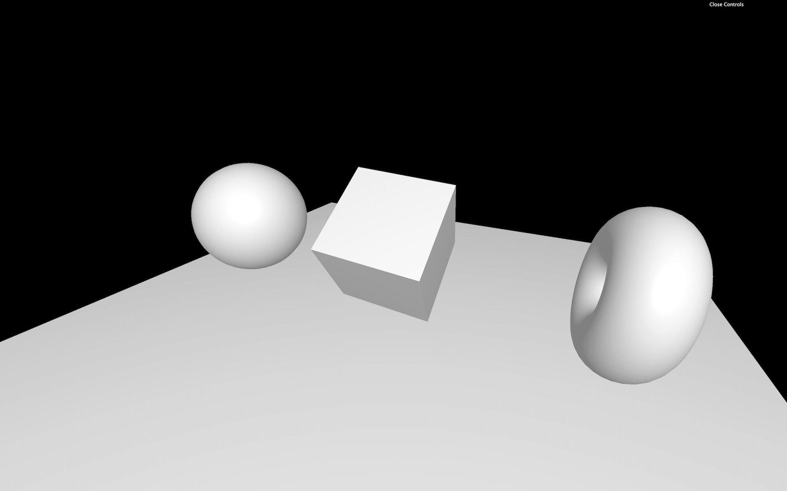

Once the starter is working remove the [AmbientLight](https://threejs.org/docs/index.html#api/en/lights/AmbientLight) and the [PointLight](https://threejs.org/docs/index.html#api/en/lights/PointLight) to start from scratch. You should get a black render with nothing visible in it.

## AmbientLight

The [AmbientLight](https://threejs.org/docs/index.html#api/en/lights/AmbientLight) applies omnidirectional lighting on all geometries of the scene. The first parameter is the `color` and the second parameter is the `intensity`. As for the materials, you can set the properties directly when instantiating or you can change them after:

```js
const ambientLight = new THREE.AmbientLight(0xffffff, 0.5)
scene.add(ambientLight)

// Equals
const ambientLight = new THREE.AmbientLight()
ambientLight.color = new THREE.Color(0xffffff)
ambientLight.intensity = 0.5
scene.add(ambientLight)
```

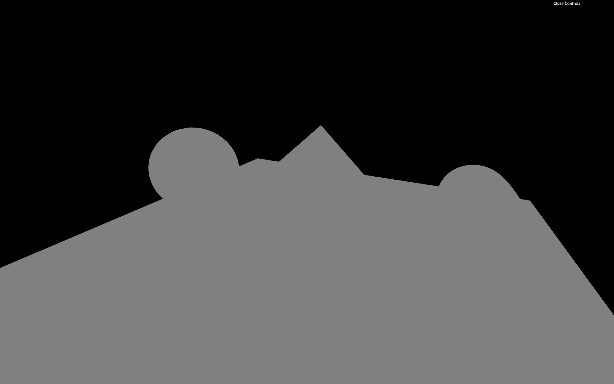

And like we did for the materials, you can add the properties to the Debug UI. We won't do that in the rest of the lesson but feel free to add tweaks if you want to ease the testing:

```js
gui.add(ambientLight, 'intensity').min(0).max(1).step(0.001)
```

If all you have is an [AmbientLight](https://threejs.org/docs/index.html#api/en/lights/AmbientLight) you'll have the same effect as for a [MeshBasicMaterial](https://threejs.org/docs/index.html#api/en/materials/MeshBasicMaterial) because all faces of the geometries will be lit equally.

In real life, when you light up an object, the sides of the objects at the opposite of the light won't be totally black because light bounces on the walls and other objects. Light bouncing is not supported in Three.js for performance reasons, but you can use a dim [AmbientLight](https://threejs.org/docs/index.html#api/en/lights/AmbientLight) to fake this light bounce.

## DirectionalLight

The [DirectionalLight](https://threejs.org/docs/index.html#api/en/lights/DirectionalLight) will have a sun-like effect as if the sun rays were traveling in parallel. The first parameter is the `color` and the second parameter is the `intensity`:

```js
const directionalLight = new THREE.DirectionalLight(0x00fffc, 0.3)
scene.add(directionalLight)
```

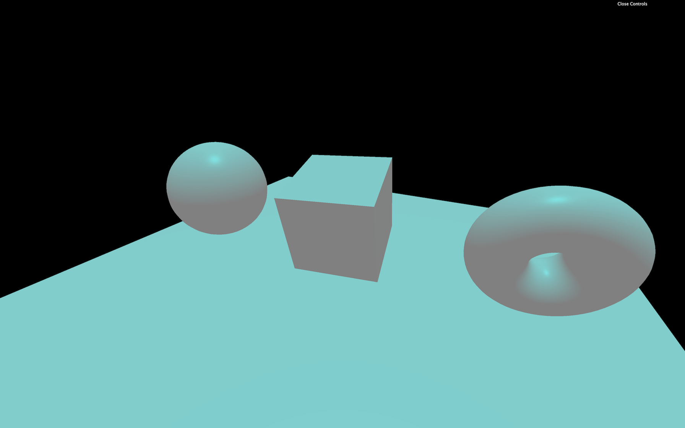

By default, the light will seems to come from above. To change that, you must move the whole light by using the `position` property like if it were a normal object.

```js
directionalLight.position.set(1, 0.25, 0)
```


The distance of the light doesn't matter for now. The rays come from an infinite space and travel in parallel to the infinite opposite.

## HemisphereLight

The [HemisphereLight](https://threejs.org/docs/index.html#api/en/lights/HemisphereLight) is similar to the [AmbientLight](https://threejs.org/docs/index.html#api/en/lights/AmbientLight) but with a different color from the sky than the color coming from the ground. Faces facing the sky will be lit by one color while another color will lit faces facing the ground.

The first parameter is the `color` corresponding to the sky color, the second parameter is the `groundColor` and the third parameter is the `intensity`:

```js
const hemisphereLight = new THREE.HemisphereLight(0xff0000, 0x0000ff, 0.3)
scene.add(hemisphereLight)
```

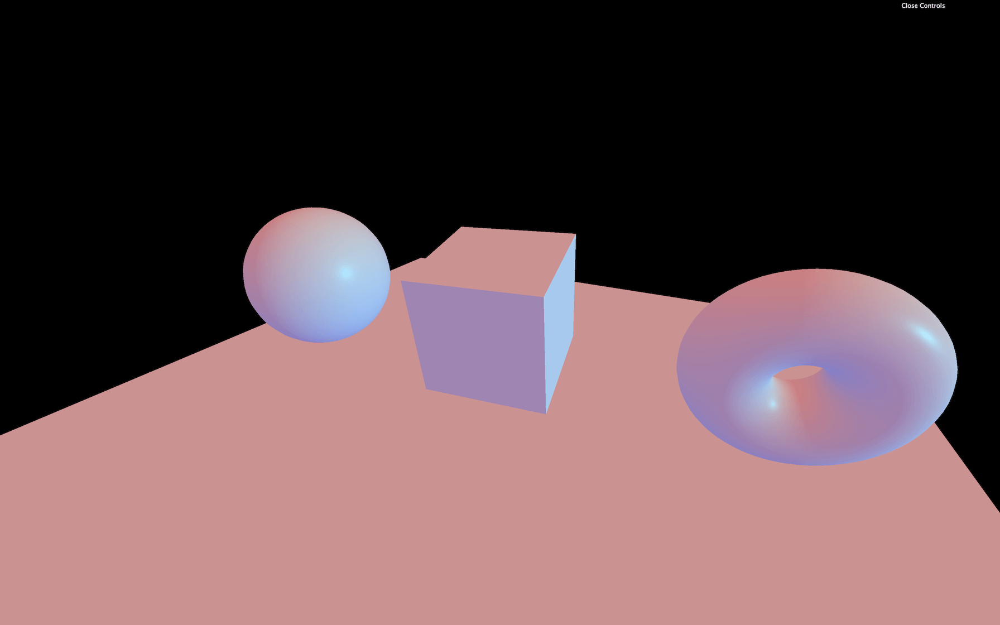

## PointLight

The [PointLight](https://threejs.org/docs/index.html#api/en/lights/PointLight) is almost like a lighter. The light source is infinitely small, and the light spreads uniformly in every direction. The first parameter is the `color` and the second parameter is the `intensity`:

```js
const pointLight = new THREE.PointLight(0xff9000, 0.5)
scene.add(pointLight)
```

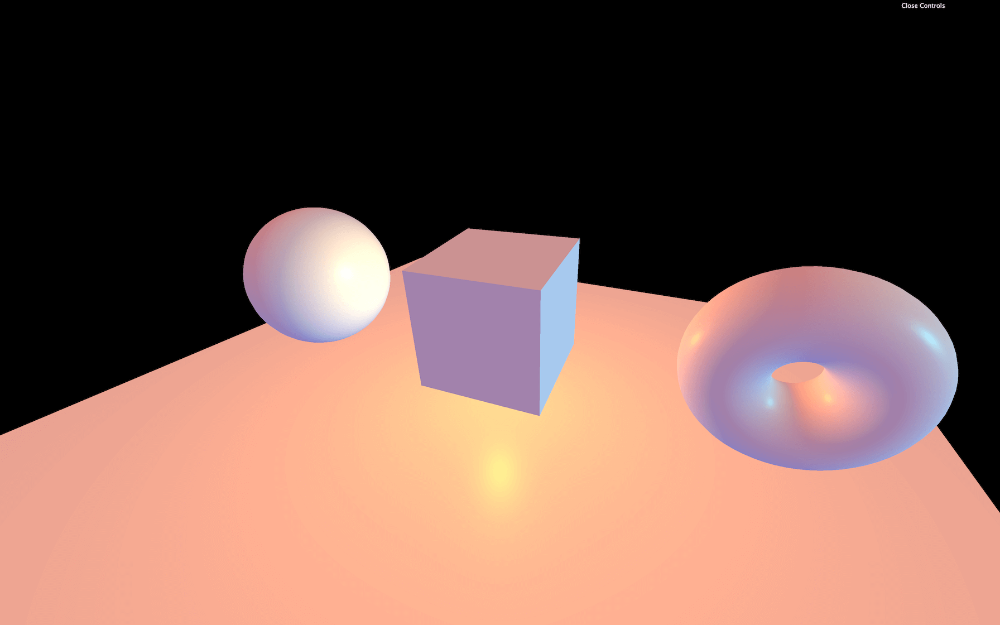

We can move it like any object:

```js
pointLight.position.set(1, - 0.5, 1)
```

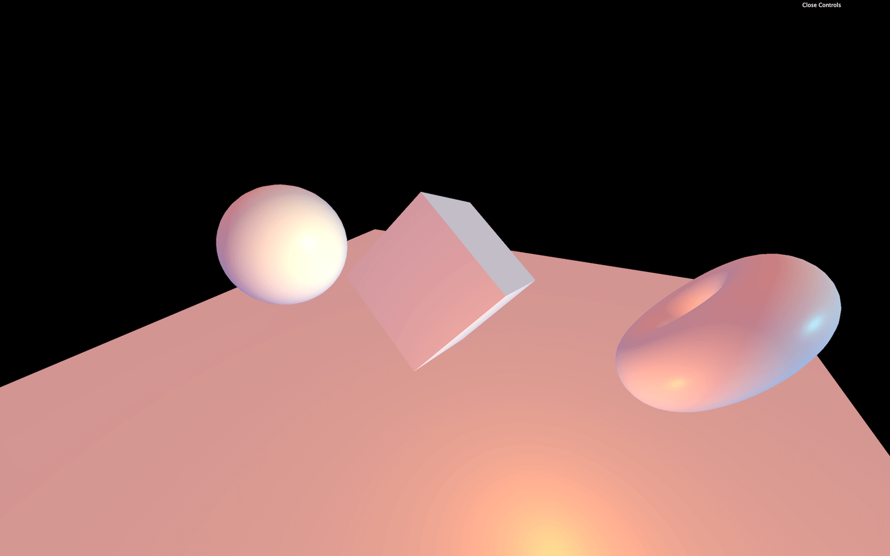

By default, the light intensity doesn't fade. But you can control that fade distance and how fast it is fading using the `distance` and `decay` properties. You can set those in the parameters of the class as the third and fourth parameters, or in the properties of the instance:

```js
const pointLight = new THREE.PointLight(0xff9000, 0.5, 10, 2)
```

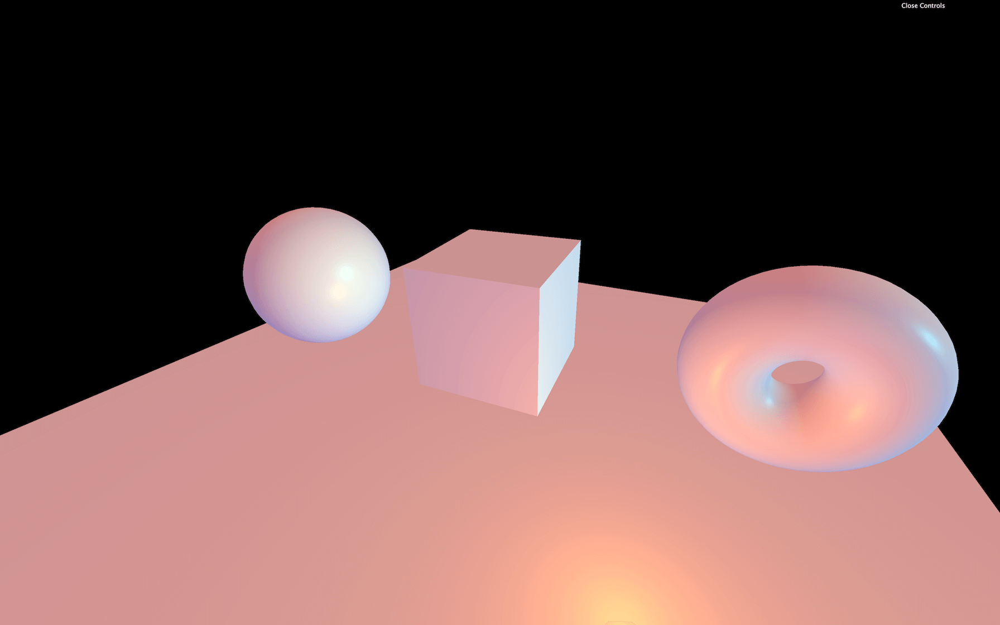

## RectAreaLight

The [RectAreaLight](https://threejs.org/docs/index.html#api/en/lights/RectAreaLight) works like the big rectangle lights you can see on the photoshoot set. It's a mix between a directional light and a diffuse light. The first parameter is the `color`, the second parameter is the `intensity`, the third parameter is `width` of the rectangle, and the fourth parameter is its `height`:

```js
const rectAreaLight = new THREE.RectAreaLight(0x4e00ff, 2, 1, 1)
scene.add(rectAreaLight)
```

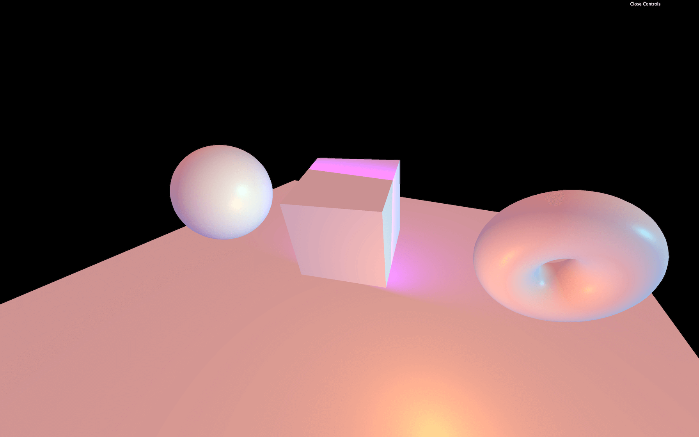

The [RectAreaLight](https://threejs.org/docs/index.html#api/en/lights/RectAreaLight) only works with [MeshStandardMaterial](https://threejs.org/docs/#api/en/materials/MeshStandardMaterial) and [MeshPhysicalMaterial](https://threejs.org/docs/#api/en/materials/MeshPhysicalMaterial).

You can then move the light and rotate it. To ease the rotation, you can use the `lookAt(...)` method that we saw in a previous lesson:

```js
rectAreaLight.position.set(- 1.5, 0, 1.5)
rectAreaLight.lookAt(new THREE.Vector3())
```

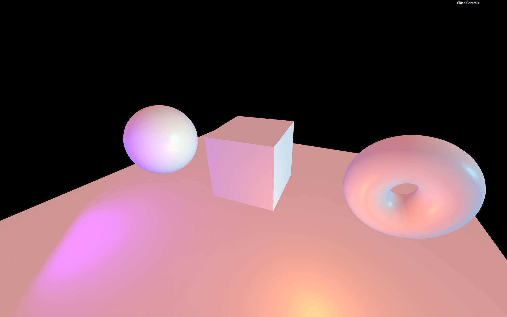

A [Vector3](https://threejs.org/docs/index.html#api/en/math/Vector3) without any parameter will have its `x`, `y`, and `z` to `0` (the center of the scene).

## SpotLight

The [SpotLight](https://threejs.org/docs/index.html#api/en/lights/SpotLight) works like a flashlight. It's a cone of light starting at a point and oriented in a direction. Here the list of its parameters:

- `color`: the color
- `intensity`: the strength
- `distance`: the distance at which the intensity drops to `0`
- `angle`: how large is the beam
- `penumbra`: how diffused is the contour of the beam
- `decay`: how fast the light dims

```js
const spotLight = new THREE.SpotLight(0x78ff00, 0.5, 10, Math.PI * 0.1, 0.25, 1)
spotLight.position.set(0, 2, 3)
scene.add(spotLight)
```

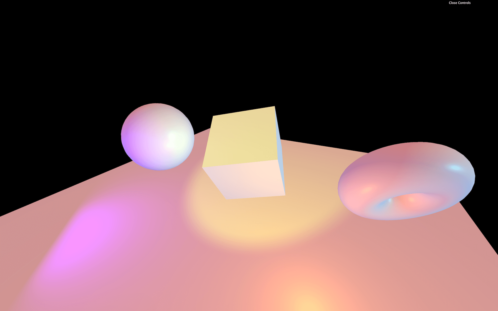

Rotating our [SpotLight](https://threejs.org/docs/index.html#api/en/lights/SpotLight) is a little harder. The instance has a property named `target`, which is an [Object3D](https://threejs.org/docs/index.html#api/en/core/Object3D). The [SpotLight](https://threejs.org/docs/index.html#api/en/lights/SpotLight) is always looking at that `target` object. But if you try to change its position, the [SpotLight](https://threejs.org/docs/index.html#api/en/lights/SpotLight) won't budge:

```js
spotLight.target.position.x = - 0.75
```

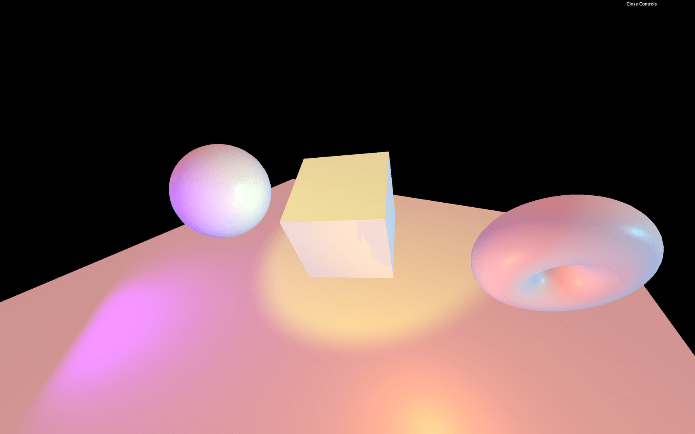

That is due to our `target` not being in the scene. Simply add the `target` to the scene, and it should work:

```js
scene.add(spotLight.target)
```

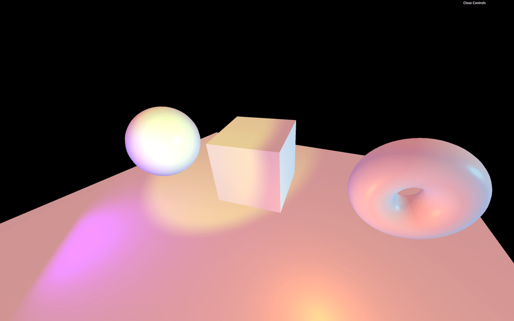

## Performance

Lights are great and can be realistic if well used. The problem is that lights can cost a lot when it comes to performance. The GPU will have to do many calculations like the distance from the face to the light, how much that face is facing the light, if the face is in the spot light cone, etc.

Try to add as few lights as possible and try to use the lights that cost less.

Minimal cost:

- AmbientLight
- HemisphereLight

Moderate cost:

- DirectionalLight
- PointLight

High cost:

- SpotLight
- RectAreaLight

## Baking

A good technique for lighting is called baking. The idea is that you bake the light into the texture. This can be done in a 3D software. Unfortunately, you won't be able to move the lights, because there are none and you'll probably need a lot of textures.

A good example is **[Three.js Journey](https://threejs-journey.xyz/)** home page

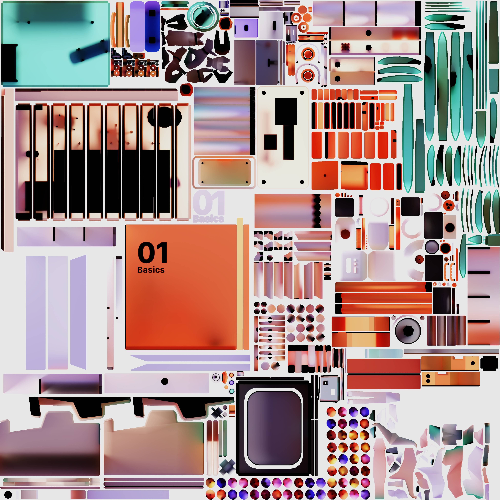

## Helpers

Positioning and orienting the lights is hard. To assist us, we can use helpers. Only the following helpers are supported:

- [HemisphereLightHelper](https://threejs.org/docs/index.html#api/en/helpers/HemisphereLightHelper)
- [DirectionalLightHelper](https://threejs.org/docs/index.html#api/en/helpers/DirectionalLightHelper)
- [PointLightHelper](https://threejs.org/docs/index.html#api/en/helpers/PointLightHelper)
- [RectAreaLightHelper](https://threejs.org/docs/index.html#examples/en/helpers/RectAreaLightHelper)
- [SpotLightHelper](https://threejs.org/docs/index.html#api/en/helpers/SpotLightHelper)

To use them, simply instantiate those classes. Use the corresponding light as a parameter, and add them to the scene. The second parameter enables you to change the helper's `size`:

```js
const hemisphereLightHelper = new THREE.HemisphereLightHelper(hemisphereLight, 0.2)
scene.add(hemisphereLightHelper)

const directionalLightHelper = new THREE.DirectionalLightHelper(directionalLight, 0.2)
scene.add(directionalLightHelper)

const pointLightHelper = new THREE.PointLightHelper(pointLight, 0.2)
scene.add(pointLightHelper)
```


For the [SpotLightHelper](https://threejs.org/docs/index.html#api/en/helpers/SpotLightHelper), there is no `size` parameter. Also, after moving the target, you need to call the `update(...)` method but on the next frame:

```js
const spotLightHelper = new THREE.SpotLightHelper(spotLight)
scene.add(spotLightHelper)
window.requestAnimationFrame(() =>
{
    spotLightHelper.update()
})
```


The [RectAreaLightHelper](https://threejs.org/docs/index.html#examples/en/helpers/RectAreaLightHelper) is even harder to use. Right now, the class isn't part of the `THREE` variable. You must import it from the `examples` dependencies as we did with [OrbitControls](https://threejs.org/docs/#examples/en/controls/OrbitControls):

```js
import { RectAreaLightHelper } from 'three/examples/jsm/helpers/RectAreaLightHelper.js'
```

Then you can use it:

```js
const rectAreaLightHelper = new RectAreaLightHelper(rectAreaLight)
scene.add(rectAreaLightHelper)
```

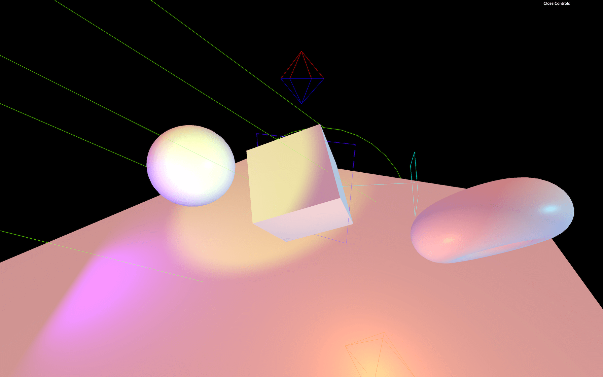

Regrettably, like for the [SpotLightHelper](https://threejs.org/docs/index.html#api/en/helpers/SpotLightHelper), you must update it on the next frame and also update its `position` and `rotation` manually:

```js
window.requestAnimationFrame(() =>
{
    rectAreaLightHelper.position.copy(rectAreaLight.position)
    rectAreaLightHelper.quaternion.copy(rectAreaLight.quaternion)
    rectAreaLightHelper.update()
})
```

That's a little complicated for something that is supposed to "help".

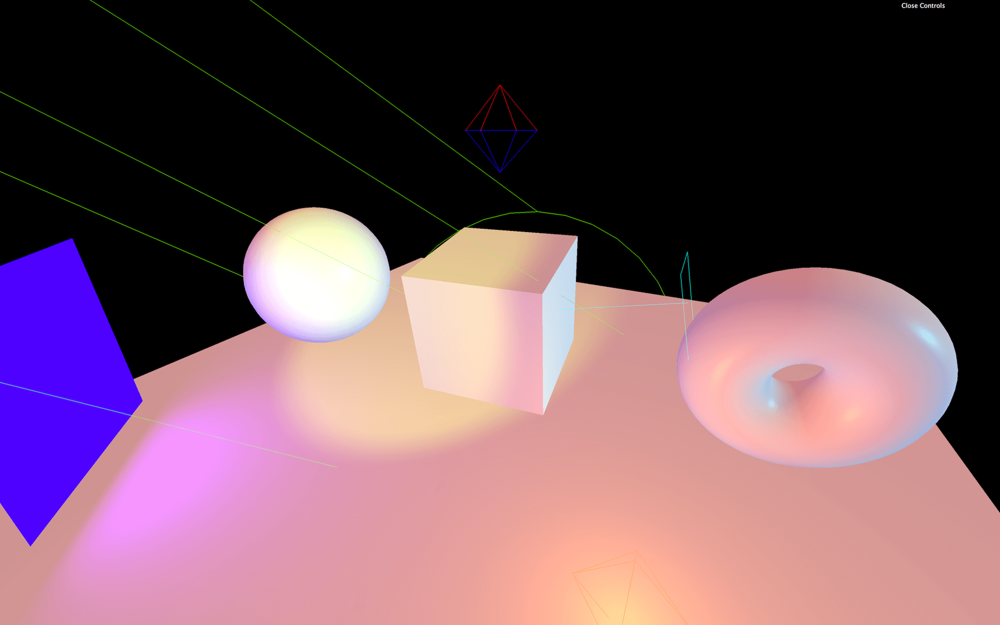
