# Shadows

[](https://shields.io)

Learn in [https://threejs-journey.xyz/lessons/15](https://threejs-journey.xyz/lessons/15)

## Introduction

Now that we have lights, we want shadows. The back of the objects are indeed in the dark, and this is called the **core shadow**. What we are missing is the **drop shadow**, where objects create shadows on the other objects.

Shadows have always been a challenge for real-time 3D rendering, and developers must find tricks to display realistic shadows at a reasonable frame rate.

There are many ways of implementing them, and Three.js has a built-in solution. Be aware, this solution is convenient, but it's far from perfect.

## How it works

We won't detail how shadows are working internally, but we will try to understand the basics.

When you do one render, Three.js will first do a render for each light supposed to cast shadows. Those renders will simulate what the light sees as if it was a camera. During these lights renders, [MeshDepthMaterial](https://threejs.org/docs/index.html#api/en/materials/MeshDepthMaterial) replaces all meshes materials.

The results are stored as textures and named shadow maps.

You won't see those shadow maps directly, but they are used on every material supposed to receive shadows and projected on the geometry.

Here's an excellent example of what the directional light and the spotlight see: [https://threejs.org/examples/webgl_shadowmap_viewer.html](https://threejs.org/examples/webgl_shadowmap_viewer.html)

## Setup

Our starter is composed of one simple sphere on a plane with one directional light and one ambient light.

You can control these lights and the material metalness and roughness in Dat.GUI.

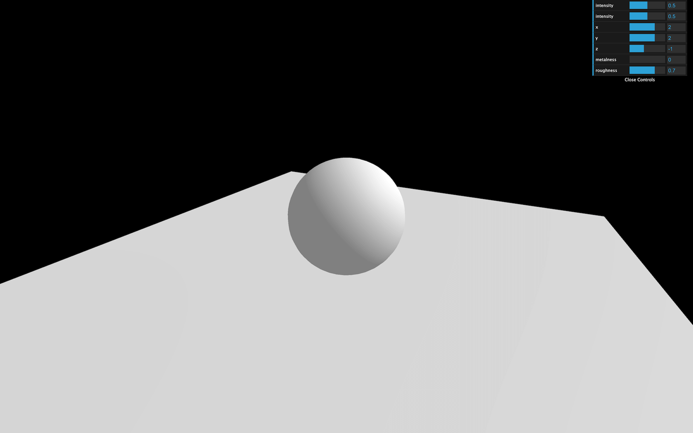

## How to activate shadows

First, we need to activate the shadow maps on the `renderer`:

```js
renderer.shadowMap.enabled = true
```

Then, we need to go through each object of the scene and decide if the object can cast a shadow with the `castShadow` property, and if the object can receive shadow with the `receiveShadow` property.

Try to activate these on as few objects as possible:

```js
sphere.castShadow = true

// ...
plane.receiveShadow = true
```

Finally, activate the shadows on the light with the `castShadow` property.

Only the following types of lights support shadows:

- [PointLight](https://threejs.org/docs/index.html#api/en/lights/PointLight)
- [DirectionalLight](https://threejs.org/docs/index.html#api/en/lights/DirectionalLight)
- [SpotLight](https://threejs.org/docs/index.html#api/en/lights/SpotLight)

And again, try to activate shadows on as few lights as possible:

```js
directionalLight.castShadow = true
```


You should get a shadow of the sphere on the plane.

Sadly, that shadow looks terrible. Let's try to improve it.

## Shadow map optimizations

### Render size

As we said at the start of the lesson, Three.js is doing renders called shadow maps for each light. You can access this shadow map (and many other things) using the `shadow` property on the light:

```js
console.log(directionalLight.shadow)
```

As for our render, we need to specify a size. By default, the shadow map size is only `512x512` for performance reasons. We can improve it but keep in mind that you need a power of 2 value for the mipmapping:

```js
directionalLight.shadow.mapSize.width = 1024
directionalLight.shadow.mapSize.height = 1024
```

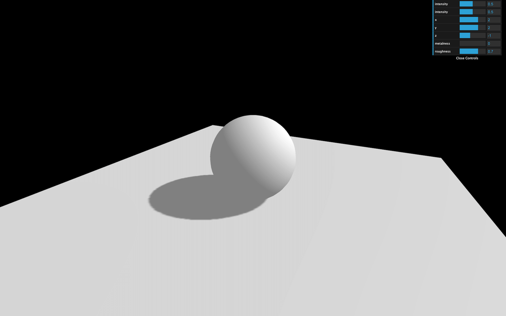

The shadow should already look better.

### Near and far

Three.js is using cameras to do the shadow maps renders. Those cameras have the same properties as the cameras we already used. This means that we must define a `near` and a `far`. It won't really improve the shadow's quality, but it might fix bugs where you can't see the shadow or where the shadow appears suddenly cropped.

To help us debug the camera and preview the `near` and `far`, we can use a [CameraHelper](https://threejs.org/docs/#api/en/helpers/CameraHelper) with the camera used for the shadow map located in the `directionalLight.shadow.camera` property:

```js
const directionalLightCameraHelper = new THREE.CameraHelper(directionalLight.shadow.camera)
scene.add(directionalLightCameraHelper)
```

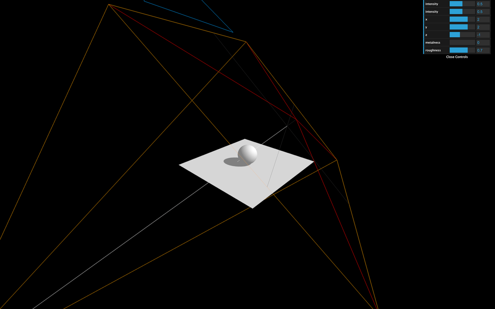

Now you can visually see the `near` and `far` of the camera. Try to find a value that fits the scene:

```js
directionalLight.shadow.camera.near = 1
directionalLight.shadow.camera.far = 6
```

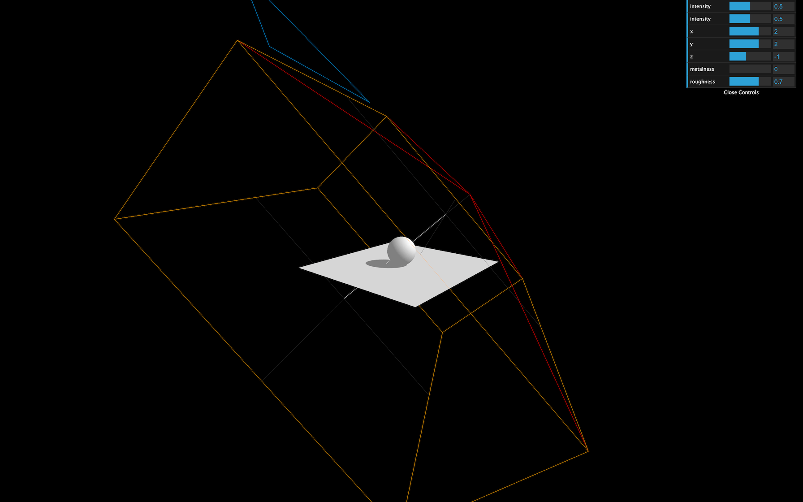

### Amplitude

With the camera helper we just added, we can see that the camera's amplitude is too large.

Because we are using a [DirectionalLight](https://threejs.org/docs/#api/en/lights/DirectionalLight), Three.js is using an [OrthographicCamera](https://threejs.org/docs/#api/en/cameras/OrthographicCamera). If you remember from the Cameras lesson, we can control how far on each side the camera can see with the `top`, `right`, `bottom`, and `left` properties. Let's reduce those properties:

```js
directionalLight.shadow.camera.top = 2
directionalLight.shadow.camera.right = 2
directionalLight.shadow.camera.bottom = - 2
directionalLight.shadow.camera.left = - 2
```

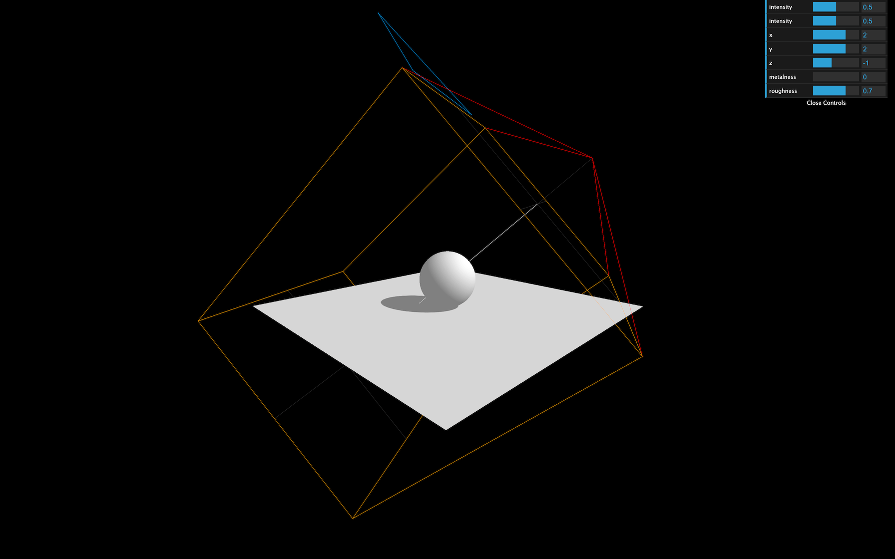

The smaller the values, the more precise the shadow will be. But if it's too small, the shadows will just be cropped.

You can hide the camera helper once you're done:

```js
directionalLightCameraHelper.visible = false
```


### Blur

You can control the shadow blur with the `radius` property:

```js
directionalLight.shadow.radius = 10
```


This technique doesn't use the proximity of the camera with the object. It's just a general and cheap blur.

### Shadow map algorithm

Different types of algorithms can be applied to shadow maps:

- **THREE.BasicShadowMap**
  Very performant but lousy quality
- **THREE.PCFShadowMap**
  Less performant but smoother edges
- **THREE.PCFSoftShadowMap**
  Less performant but even softer edges
- **THREE.VSMShadowMap**
  Less performant, more constraints, can have unexpected results

To change it, update the `renderer.shadowMap.type` property. The default is `THREE.PCFShadowMap` but you can use `THREE.PCFSoftShadowMap` for better quality.

```js
renderer.shadowMap.type = THREE.PCFSoftShadowMap
```


Be aware that the radius property doesn't work with `THREE.PCFSoftShadowMap`. You'll have to choose.

## SpotLight

Let's try to add a [SpotLight](https://threejs.org/docs/index.html#api/en/lights/SpotLight) like we did in the **Lights** lesson and add the `castShadow` property to `true`. Don't forget to add the `target` property to the `scene`.

We will also add a camera helper:

```js
// Spot light
const spotLight = new THREE.SpotLight(0xffffff, 0.4, 10, Math.PI * 0.3)

spotLight.castShadow = true

spotLight.position.set(0, 2, 2)
scene.add(spotLight)
scene.add(spotLight.target)

const spotLightCameraHelper = new THREE.CameraHelper(spotLight.shadow.camera)
scene.add(spotLightCameraHelper)
```

You can reduce the other lights intensity if the scene is too bright:

```js
const ambientLight = new THREE.AmbientLight(0xffffff, 0.4)

// ...

const directionalLight = new THREE.DirectionalLight(0xffffff, 0.4)
```


As you can see, shadows don't merge nicely. They are handled independently, and, unfortunately, there is not much to do about it.

But we can improve the shadow quality using the same techniques that we used for the directional light.

Change the `shadow.mapSize`:

```js
spotLight.shadow.mapSize.width = 1024
spotLight.shadow.mapSize.height = 1024
```


Because we are now using a [SpotLight](https://threejs.org/docs/index.html#api/en/lights/SpotLight), internally, Three.js is using a [PerspectiveCamera](https://threejs.org/docs/index.html#api/en/cameras/PerspectiveCamera). That means that instead of the `top`, `right`, `bottom`, and `left` properties, we must change the `fov` property. Try to find an angle as small as possible without having the shadows cropped:

```js
spotLight.shadow.camera.fov = 30
```

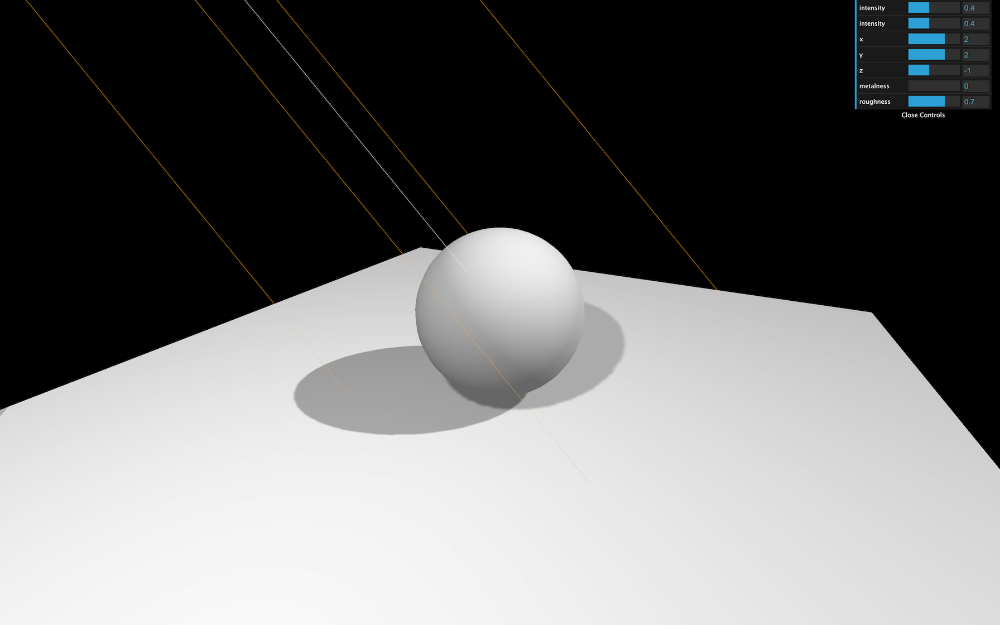

Change the `near` and `far` values:

```js
spotLight.shadow.camera.near = 1
spotLight.shadow.camera.far = 6
```


You can hide the camera helper once you're done:

```js
spotLightCameraHelper.visible = false
```


## PointLight

Let's try the last light supporting shadows, the [PointLight](https://threejs.org/docs/index.html#api/en/lights/PointLight):

```js
// Point light
const pointLight = new THREE.PointLight(0xffffff, 0.3)

pointLight.castShadow = true

pointLight.position.set(- 1, 1, 0)
scene.add(pointLight)

const pointLightCameraHelper = new THREE.CameraHelper(pointLight.shadow.camera)
scene.add(pointLightCameraHelper)
```

You can reduce the other lights intensity if the scene is too bright:

```js
const ambientLight = new THREE.AmbientLight(0xffffff, 0.3)

// ...

const directionalLight = new THREE.DirectionalLight(0xffffff, 0.3)

// ...

const spotLight = new THREE.SpotLight(0xffffff, 0.3, 10, Math.PI * 0.3)
```


As you can see, the camera helper is a [PerspectiveCamera](https://threejs.org/docs/index.html#api/en/cameras/PerspectiveCamera) (like for the [SpotLight](https://threejs.org/docs/index.html#api/en/lights/SpotLight)) but facing downward. That is due to how Three.js handles shadow maps for the [PointLight](https://threejs.org/docs/index.html#api/en/lights/PointLight).

Because the point light illuminates in every direction, Three.js will have to render each of the 6 directions to create a cube shadow map. The camera helper you see is the camera's position in the last of those 6 renders (which is downward).

Doing all those renders can generate performance issues. Try to avoid having too much [PointLight](https://threejs.org/docs/index.html#api/en/lights/PointLight) with shadows enabled.

The only properties you can tweak here are the `mapSize`, `near` and `far`:

```js
pointLight.shadow.mapSize.width = 1024
pointLight.shadow.mapSize.height = 1024

pointLight.shadow.camera.near = 0.1
pointLight.shadow.camera.far = 5
```

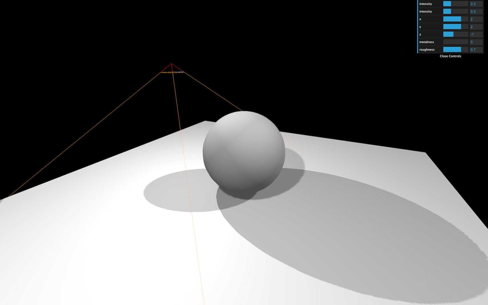

You can hide the camera helper once you're done:

```js
pointLightCameraHelper.visible = false
```

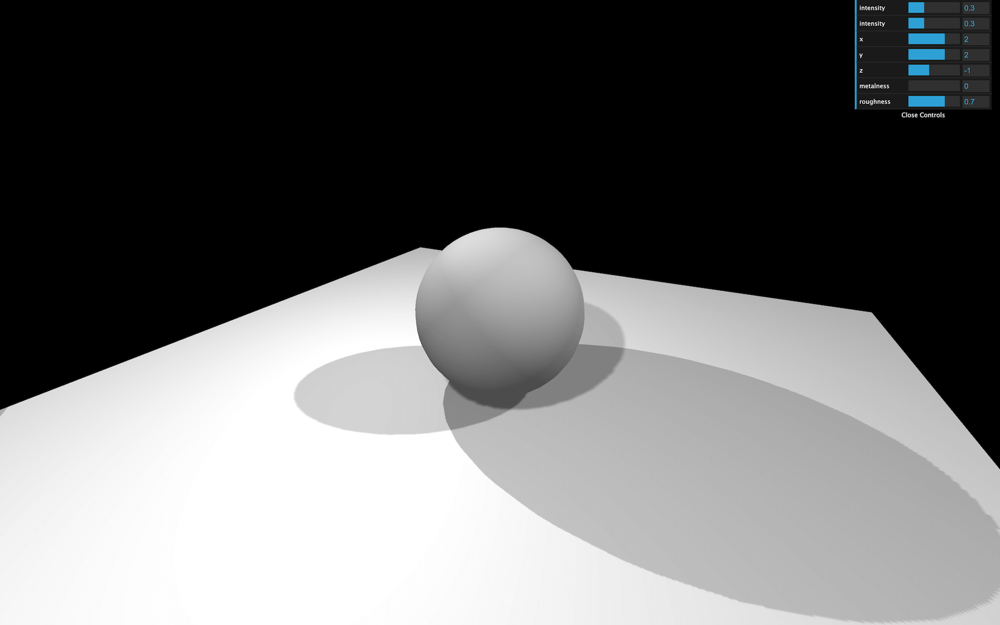

## Baking shadows

Three.js shadows can be very useful if the scene is simple, but it might otherwise become messy.

A good alternative is baked shadows. We talk about baked lights in the previous lesson and it is exactly the same thing. Shadows are integrated into textures that we apply on materials.

Instead of commenting all the shadows related lines of code, we can simply deactivate them in the renderer:

```js
renderer.shadowMap.enabled = false
```

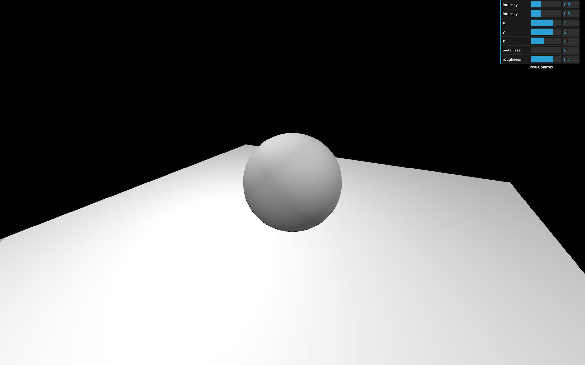

Now we can load a shadow texture located in `/static/textures/backedShadow.jpg` using the classic [TextureLoader](https://threejs.org/docs/index.html#api/en/loaders/TextureLoader).


Add the following code before creating the objects and lights:

```js
/**
 * Textures
 */
const textureLoader = new THREE.TextureLoader()
const bakedShadow = textureLoader.load('/textures/bakedShadow.jpg')
```

And finally, instead of using a [MeshStandardMaterial](https://threejs.org/docs/index.html#api/en/materials/MeshStandardMaterial) on the plane, we'll use a simple [MeshBasicMaterial](https://threejs.org/docs/index.html#api/en/materials/MeshBasicMaterial) with the `bakedShadow` as `map`:

```js
const plane = new THREE.Mesh(
    new THREE.PlaneGeometry(5, 5),
    new THREE.MeshBasicMaterial({
        map: bakedShadow
    })
)
```

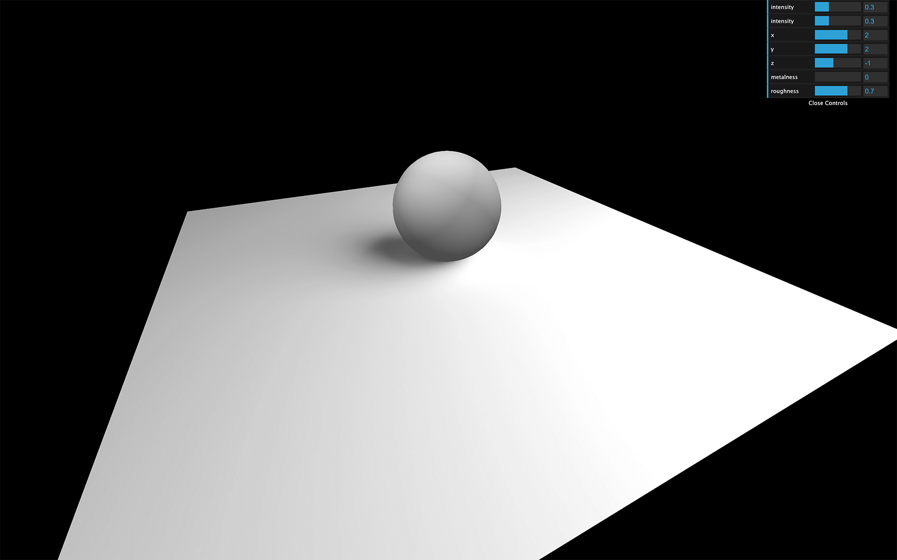

You should see a nice blurred, and realistic fake shadow. The main problem is that it's not dynamic, and if the sphere or the lights moves, the shadows won't.

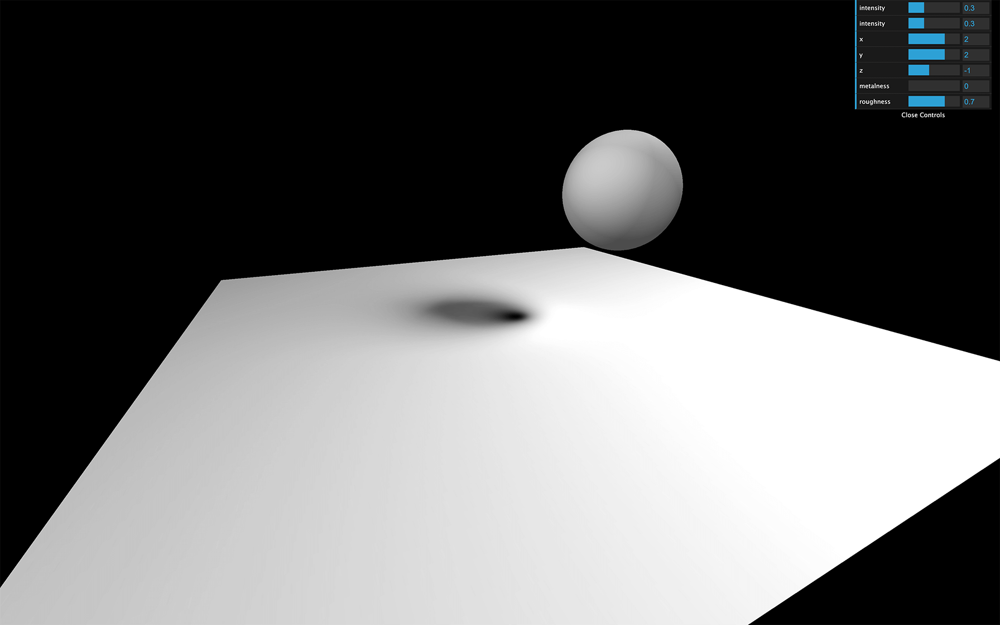

## Baking shadows alternative

A less realistic but more dynamic solution would be to use a more simple shadow under the sphere and slightly above the plane.


The texture is a simple halo. The white part will be visible and the black part will be invisible.

Then, we move that shadow with the sphere.

First, let's remove the previous baked shadow by putting back the [MeshStandardMaterial](https://threejs.org/docs/index.html#api/en/materials/MeshStandardMaterial) on the plane:

```js
const plane = new THREE.Mesh(
    new THREE.PlaneGeometry(5, 5),
    material
)
```

Then, we can load a basic shadow texture located in `/static/textures/backedShadow.jpg`.

```js
const simpleShadow = textureLoader.load('/textures/simpleShadow.jpg')
```

We can create the shadow by using a simple plane that we rotate and place slightly above the floor. The material must be black but with the shadow texture as the `alphaMap`. Don't forget to change `transparent` to `true`, and to add the mesh to the `scene`:

```js
const sphereShadow = new THREE.Mesh(
    new THREE.PlaneGeometry(1.5, 1.5),
    new THREE.MeshBasicMaterial({
        color: 0x000000,
        transparent: true,
        alphaMap: simpleShadow
    })
)
sphereShadow.rotation.x = - Math.PI * 0.5
sphereShadow.position.y = plane.position.y + 0.01

scene.add(sphere, sphereShadow, plane)
```

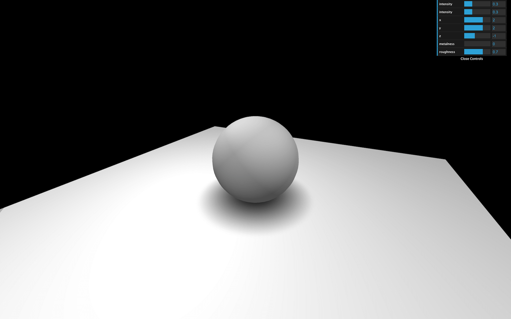

There you go, a not so realistic but very performant shadow.

If you're going to animate the sphere, you can simply animate the shadow accordingly and change its opacity depending on the elevation of the sphere:

```js
const clock = new THREE.Clock()

const tick = () =>
{
    const elapsedTime = clock.getElapsedTime()

    // Update the sphere
    sphere.position.x = Math.cos(elapsedTime) * 1.5
    sphere.position.z = Math.sin(elapsedTime) * 1.5
    sphere.position.y = Math.abs(Math.sin(elapsedTime * 3))

    // Update the shadow
    sphereShadow.position.x = sphere.position.x
    sphereShadow.position.z = sphere.position.z
    sphereShadow.material.opacity = (1 - sphere.position.y) * 0.3

    // ...
}

tick()
```

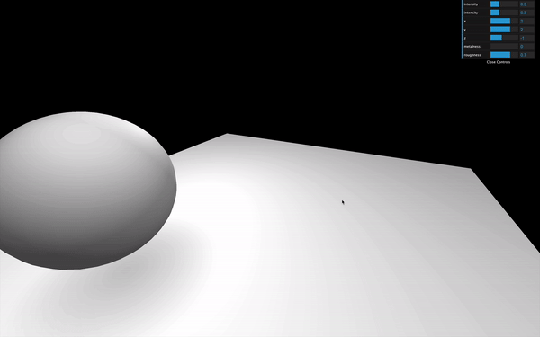

_https://threejs-journey.xyz/assets/lessons/15/step-22.mp4_

## Which technique to use

<p>Finding the right solution to handle shadows is up to you. It depends on the project, the performances and the techniques you know. You can also combine them.
