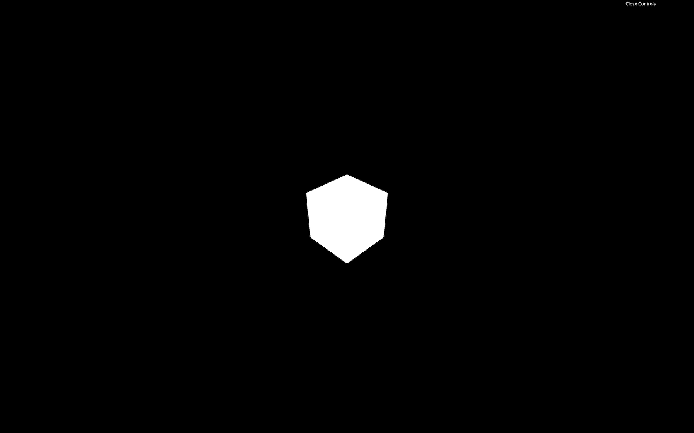
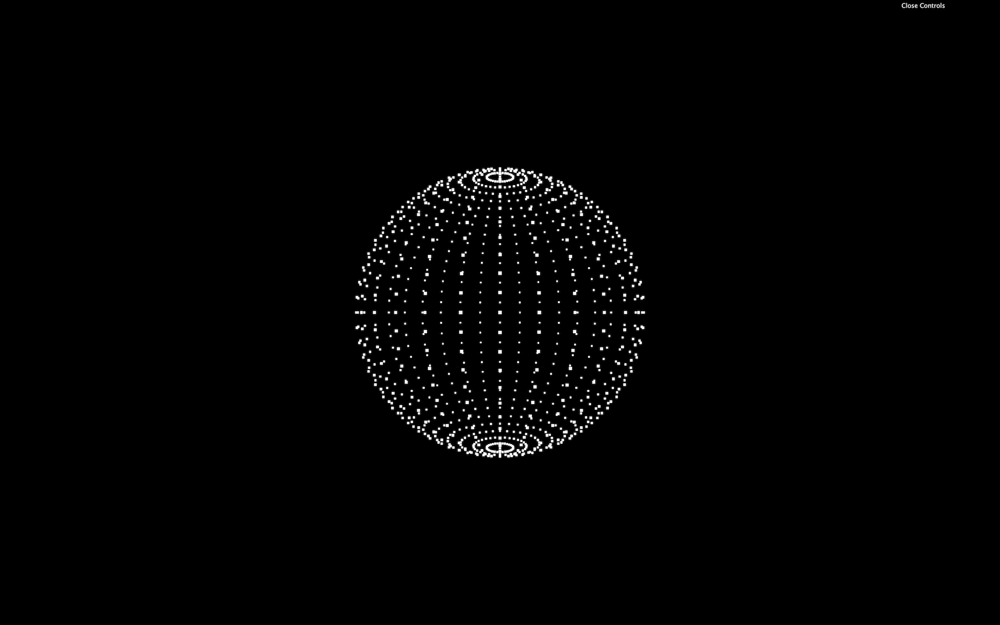
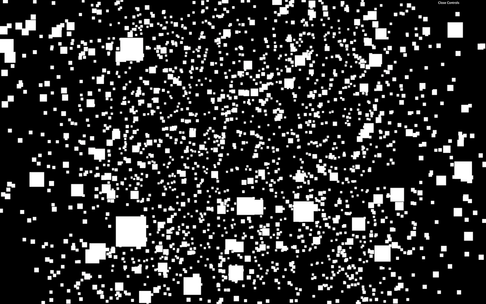
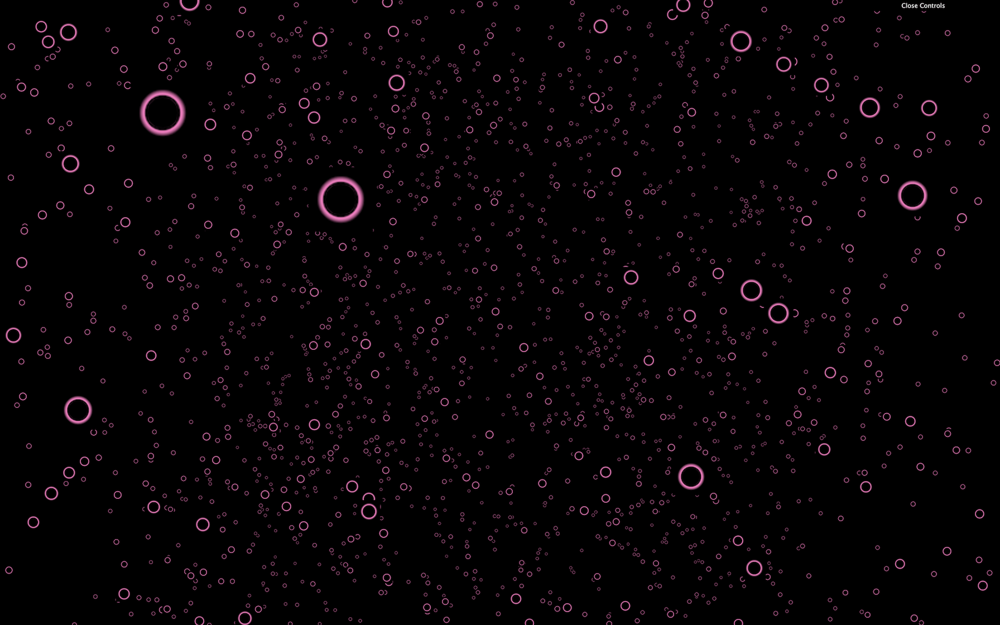
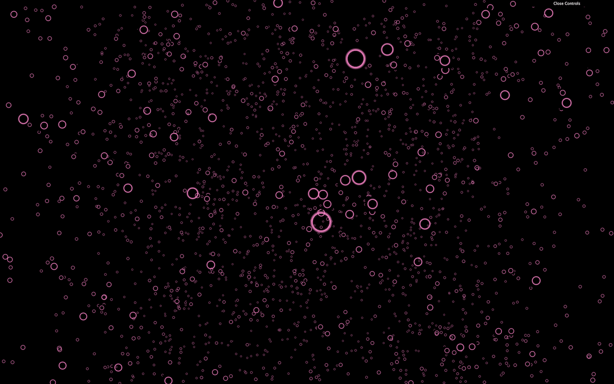
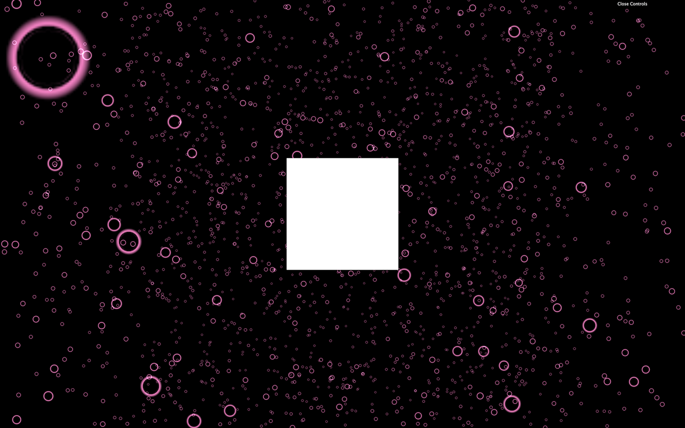
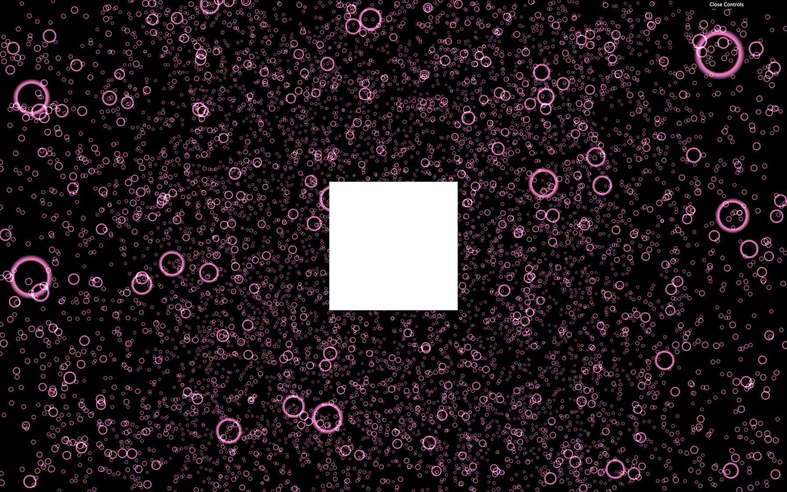
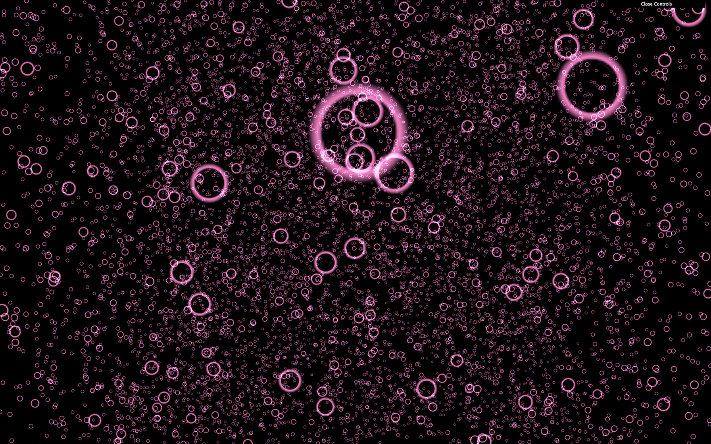
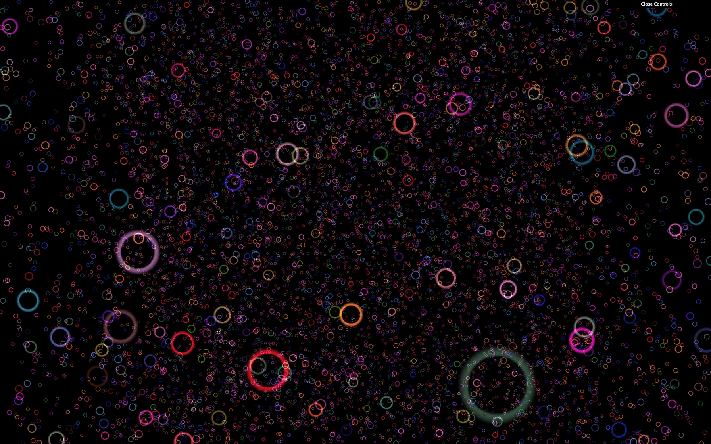
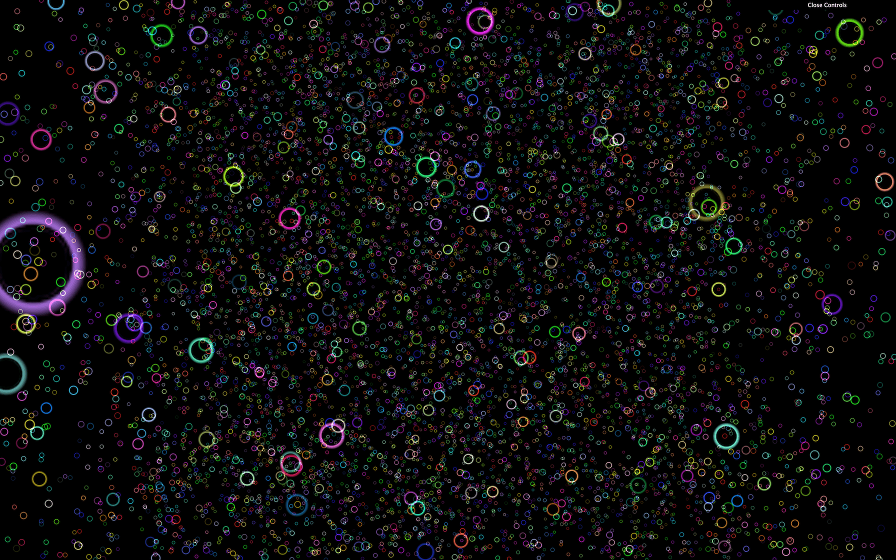

# Particles

[](https://shields.io)

Learn in [https://threejs-journey.xyz/lessons/17](https://threejs-journey.xyz/lessons/17)

## Introduction

Particles are precisely what you expect from that name. They are very popular and can be used to achieve various effects such as stars, smoke, rain, dust, fire, and many other things.

The good thing with particles is that you can have hundreds of thousands of them on screen with a reasonable frame rate. The downside is that each particle is composed of a plane (two triangles) always facing the camera.

Creating particles is as simple as making a [Mesh](https://threejs.org/docs/#api/en/objects/Mesh). We need a [BufferGeometry](https://threejs.org/docs/#api/en/core/BufferGeometry), a material that can handle particles ([PointsMaterial](https://threejs.org/docs/#api/en/materials/PointsMaterial)), and instead of producing a [Mesh](https://threejs.org/docs/#api/en/objects/Mesh) we need to create a [Points](https://threejs.org/docs/#api/en/objects/Points).

## Setup

The starter is only composed of a cube in the middle of the scene. That cube ensures that everything is working.



## First particles

Let's get rid of our cube and create a sphere composed of particles to start.

### Geometry

You can use any of the basic Three.js geometries. For the same reasons as for the Mesh, it's preferable to use [BufferGeometries](https://threejs.org/docs/#api/en/core/BufferGeometry). Each vertex of the geometry will become a particle:

```js
/**
 * Particles
 */
// Geometry
const particlesGeometry = new THREE.SphereGeometry(1, 32, 32)
```

### PointsMaterial

We need a special type of material called [PointsMaterial](https://threejs.org/docs/#api/en/materials/PointsMaterial). This material can already do a lot, but we will discover how to create our own particles material to go even further in a future lesson.

The [PointsMaterial](https://threejs.org/docs/#api/en/materials/PointsMaterial) has multiple properties specific to particles like the `size` to control all particles size and the `sizeAttenuation` to specify if distant particles should be smaller than close particles:

```js
// Material
const particlesMaterial = new THREE.PointsMaterial({
    size: 0.02,
    sizeAttenuation: true
})
```

As always, we can also change those properties after creating the material:

```js
const particlesMaterial = new THREE.PointsMaterial()
particlesMaterial.size = 0.02
particlesMaterial.sizeAttenuation = true
```

### Points

Finally, we can create the final particles the same way we create a [Mesh](https://threejs.org/docs/#api/en/objects/Mesh), but this time by using the [Points](https://threejs.org/docs/#api/en/objects/Points) class. Don't forget to add it to the scene:

```js
// Points
const particles = new THREE.Points(particlesGeometry, particlesMaterial)
scene.add(particles)
```



That was easy. Let's customize those particles.

## Custom geometry

To create a custom geometry, we can start from a [BufferGeometry](https://threejs.org/docs/#api/en/core/BufferGeometry), and add a `position` attribute as we did in the **Geometries** lesson. Replace the [SphereGeometry](https://threejs.org/docs/#api/en/geometries/SphereGeometry) with custom geometry and add the `'position'` attribute as we did before:

```js
// Geometry
const particlesGeometry = new THREE.BufferGeometry()
const count = 500

const positions = new Float32Array(count * 3) // Multiply by 3 because each position is composed of 3 values (x, y, z)

for(let i = 0; i < count * 3; i++) // Multiply by 3 for same reason
{
    positions[i] = (Math.random() - 0.5) * 10 // Math.random() - 0.5 to have a random value between -0.5 and +0.5
}

particlesGeometry.setAttribute('position', new THREE.BufferAttribute(positions, 3)) // Create the Three.js BufferAttribute and specify that each information is composed of 3 values
```


Don't be frustrated if you can't pull out this code by yourself. It's a little complex, and variables are using strange formats.

You should get a bunch of particles all around the scene. Now is an excellent time to have fun and test the limits of your computer. Try `5000`, `50000`, `500000` maybe. You can have millions of particles and still have a reasonable frame rate.

You can imagine that there are limits. On an inferior computer or a smartphone, you won't be able to have a 60fps experience with millions of particles. We are also going to add effects that will drastically reduce the frame rate. But still, that's quite impressive.

For now, let's keep the count to `5000` and change the size to `0.1`:

```js
const count = 5000

// ...

particlesMaterial.size = 0.1

// ...
```



## Color, map and alpha map

We can change the color of all particles with the `color` property on the [PointsMaterial](https://threejs.org/docs/#api/en/materials/PointsMaterial). Don't forget that you need to use the [Color](https://threejs.org/docs/#api/en/math/Color) class if you're changing this property after instancing the material:

```js
particlesMaterial.color = new THREE.Color('#ff88cc')
```

We can also use the `map` property to put a texture on those particles. Use the [TextureLoader](https://threejs.org/docs/#api/en/loaders/TextureLoader) already in the code to load one of the textures located in `/static/textures/particles/`:

```js
/**
 * Textures
 */
const textureLoader = new THREE.TextureLoader()
const particleTexture = textureLoader.load('/textures/particles/2.png')

// ...

particlesMaterial.map = particleTexture
```



These textures are resized versions of the pack provided by [Kenney](https://twitter.com/KenneyNL) and you can find the full pack here: [https://www.kenney.nl/assets/particle-pack](https://www.kenney.nl/assets/particle-pack). But you can also create your own.

As you can see, the `color` property is changing the map, just like with the other materials.

If you look closely, you'll see that the front particles are hiding the back particles.


_https://threejs-journey.xyz/assets/lessons/17/step-06.mp4_

We need to activate transparency with `transparent` and use the texture on the `alphaMap` property instead of the `map`:

```js
// particlesMaterial.map = particleTexture
particlesMaterial.transparent = true
particlesMaterial.alphaMap = particleTexture
```



Now that's better, but we can still randomly see some edges of the particles.


_https://threejs-journey.xyz/assets/lessons/17/step-08.mp4_

That is because the particles are drawn in the same order as they are created, and WebGL doesn't really know which one is in front of the other.

There are multiple ways of fixing this.

### Using alphaTest

The `alphaTest` is a value between `0` and `1` that enables the WebGL to know when not to render the pixel according to that pixel's transparency. By default, the value is `0` meaning that the pixel will be rendered anyway. If we use a small value such as `0.001`, the pixel won't be rendered if the alpha is `0`:

```js
particlesMaterial.alphaTest = 0.001
```


_https://threejs-journey.xyz/assets/lessons/17/step-09.mp4_

This solution isn't perfect and if you watch closely, you can still see glitches, but it's already more satisfying.

### Using depthTest

When drawing, the WebGL tests if what's being drawn is closer than what's already drawn. That is called depth testing and can be deactivated (you can comment the `alphaTest`):

```js
// particlesMaterial.alphaTest = 0.001
particlesMaterial.depthTest = false
```


_https://threejs-journey.xyz/assets/lessons/17/step-10.mp4_

While this solution seems to completely fix our problem, deactivating the depth testing might create bugs if you have other objects in your scene or particles with different colors. The particles might be drawn as if they were above the rest of the scene.

Add a cube to the scene to see that:

```js
const cube = new THREE.Mesh(
    new THREE.BoxGeometry(),
    new THREE.MeshBasicMaterial()
)
scene.add(cube)
```


_https://threejs-journey.xyz/assets/lessons/17/step-11.mp4_

### Using depthWrite

As we said, the WebGL is testing if what's being drawn is closer than what's already drawn. The depth of what's being drawn is stored in what we call a depth buffer. Instead of not testing if the particle is closer than what's in this depth buffer, we can tell the WebGL not to write particles in that depth buffer (you can comment the `depthTest`):

```js
// particlesMaterial.alphaTest = 0.001
// particlesMaterial.depthTest = false
particlesMaterial.depthWrite = false
```


_https://threejs-journey.xyz/assets/lessons/17/step-12.mp4_

In our case, this solution will fix the problem with almost no drawback. Sometimes, other objects might be drawn behind or in front of the particles depending on many factors like the transparency, in which order you added the objects to your scene, etc.

We saw multiple techniques, and there is no perfect solution. You'll have to adapt and find the best combination according to the project.

## Blending

Currently, the WebGL draws the pixels one on top of the other.

By changing the `blending` property, we can tell the WebGL not only to draw the pixel, but also to **add** the color of that pixel to the color of the pixel already drawn. That will have a saturation effect that can look amazing.

To test that, simply change the `blending` property to `THREE.AdditiveBlending` (keep the `depthWrite` property):

```js
// particlesMaterial.alphaTest = 0.001
// particlesMaterial.depthTest = false
particlesMaterial.depthWrite = false
particlesMaterial.blending = THREE.AdditiveBlending
```



Add more particles (let's say `20000`) to better enjoy this effect.



But be careful, this effect will impact the performances, and you won't be able to have as many particles as before at 60fps.

Now, we can remove the `cube`.



## Different colors

We can have a different color for each particle. We first need to add a new attribute named `color` as we did for the position. A color is composed of red, green, and blue (3 values), so the code will be very similar to the `position` attribute. We can actually use the same loop for these two attributes:

```js
const positions = new Float32Array(count * 3)
const colors = new Float32Array(count * 3)

for(let i = 0; i < count * 3; i++)
{
    positions[i] = (Math.random() - 0.5) * 10
    colors[i] = Math.random()
}

particlesGeometry.setAttribute('position', new THREE.BufferAttribute(positions, 3))
particlesGeometry.setAttribute('color', new THREE.BufferAttribute(colors, 3))
```

Be careful with singulars and plurals.

To activate those vertex colors, simply change the `vertexColors` property to `true`:

```js
particlesMaterial.vertexColors = true
```



The main color of the material still affects these vertex colors. Feel free to change that color or even comment it.

```js
// particlesMaterial.color = new THREE.Color('#ff88cc')
```



## Animate

There are multiple ways of animating particles.

### By using the points as an object

Because the [Points](https://threejs.org/docs/#api/en/objects/Points) class inherits from the [Object3D](https://threejs.org/docs/#api/en/core/Object3D) class, you can move, rotate and scale the points as you wish.

Rotate the particles in the `tick` function:

```js
const tick = () =>
{
    const elapsedTime = clock.getElapsedTime()

    // Update particles
    particles.rotation.y = elapsedTime * 0.2

    // ...
}
```


_https://threejs-journey.xyz/assets/lessons/17/step-18.mp4_

While this is already cool, we want more control over each particle.

### By changing the attributes

Another solution would be to update each vertex position separately. This way, vertices can have different trajectories. We are going to animate the particles as if they were floating on waves but first, let's see how we can update the vertices.

Start by commenting the previous rotation we did on the whole `particles`:

```js
const tick = () =>
{
    // ...

    // particles.rotation.y = elapsedTime * 0.2

    // ...
}
```

To update each vertex, we have to update the right part in the `position` attribute because all the vertices are stored in this one dimension array where the first 3 values correspond to the `x`, `y` and `z` coordinates of the first vertex, then the next 3 values correspond to the `x`, `y` and `z` of the second vertex, etc.

We only want the vertices to move up and down, meaning that we are going to update the `y` axis only. Because the `position` attribute is a one dimension array, we have to go through it 3 by 3 and only update the second value which is the `y` coordinate.

Let's start by going through each vertices:

```js
const tick = () =>
{
        // ...

    for(let i = 0; i < count; i++)
    {
        const i3 = i * 3
    }

    // ...
}
```

Here, we chose to have a simple `for` loop that goes from `0` to `count` and we created a `i3` variable inside that goes 3 by 3 simply by multiplying `i` by 3.

The easiest way to simulate waves movement is to use a simple **sinus**. First, we are going to update all vertices to go up and down on the same frequency.

The `y` coordinate can be access in the array at the index `i3 + 1`:

```js
const tick = () =>
{
    // ...

    for(let i = 0; i < count; i++)
    {
        const i3 = i * 3

        particlesGeometry.attributes.position.array[i3 + 1] = Math.sin(elapsedTime)
    }

    // ...
}
```

Unfortunately, nothing is moving. The problem is that Three.js has to be notified that the geometry changed. To do that, we have to set the `needsUpdate` to `true` on the `position` attribute once we are done updating the vertices:

```js
const tick = () =>
{
    // ...

    for(let i = 0; i < count; i++)
    {
        const i3 = i * 3

        particlesGeometry.attributes.position.array[i3 + 1] = Math.sin(elapsedTime)
    }
    particlesGeometry.attributes.position.needsUpdate = true 

    // ...
}
```


_https://threejs-journey.xyz/assets/lessons/17/step-19.mp4_

All the particles should be moving up and down like a plane.

That's a good start and we are almost there. All we need to do now is apply an offset to the **sinus** between the particles so that we get that wave shape.

To do that, we can use the `x` coordinate. And to get this value we can use the same technique that we used for the `y` coordinate but instead of `i3 + 1`, it's just `i3`:

```js
const tick = () =>
{
    // ...

    for(let i = 0; i < count; i++)
    {
        let i3 = i * 3

        const x = particlesGeometry.attributes.position.array[i3]
        particlesGeometry.attributes.position.array[i3 + 1] = Math.sin(elapsedTime + x)
    }
    particlesGeometry.attributes.position.needsUpdate = true

    // ...
}
```


_https://threejs-journey.xyz/assets/lessons/17/step-20.mp4_

You should get beautiful waves of particles. Unfortunately, you should avoid this technique. If we have `20000` particles, we are going through each one, calculating a new position, and updating the whole attribute on each frame. That can work with a small number of particles, but we want millions of particles.

### By using a custom shader

To update these millions of particles on each frame with a good framerate, we need to create our own material with our own shaders. But shaders are for a later lesson.
