# Galaxy Generator

[](https://shields.io)

Learn in [https://threejs-journey.xyz/lessons/18](https://threejs-journey.xyz/lessons/18)

## Introduction

Now that we know how to use particles, we could create something cool like a Galaxy. But instead of producing just one galaxy, let's do a galaxy generator.

For that, we're going to use **Dat.GUI** to let the user tweak the parameters and generate a new galaxy on each change.

## Setup

The starter is only composed of a cube in the middle of the scene. It ensures that everything is working.


## Base particles

First, remove the cube and create a `generateGalaxy` function. Each time we call that function, we will remove the previous galaxy (if there is one) and create a new one.

We can call that function immediately:

```js
/**
 * Galaxy
 */
const generateGalaxy = () =>
{

}

generateGalaxy()
```

We can create an object that will contain all the parameters of our galaxy. Create this object before the `generateGalaxy` function. We will populate it progressively and also add each parameter to **Dat.GUI**:

```js
const parameters = {}
```

In our `generateGalaxy` function, we're going to create some particles just to make sure that everything is working. We can start with the geometry and add the particles count to the parameters:

```js
const parameters = {}
parameters.count = 1000

const generateGalaxy = () =>
{
    /**
     * Geometry
     */
    const geometry = new THREE.BufferGeometry()

    const positions = new Float32Array(parameters.count * 3)

    for(let i = 0; i < parameters.count; i++)
    {
        const i3 = i * 3

        positions[i3    ] = (Math.random() - 0.5) * 3
        positions[i3 + 1] = (Math.random() - 0.5) * 3
        positions[i3 + 2] = (Math.random() - 0.5) * 3
    }

    geometry.setAttribute('position', new THREE.BufferAttribute(positions, 3))
}
generateGalaxy()
```

That's the same code as before, but we handled the loop a little differently.

We can now create the material by using the [PointsMaterial](https://threejs.org/docs/#api/en/materials/PointsMaterial) class. This time again, we can add tweaks to the `parameters` object:

```js
parameters.size = 0.02

const generateGalaxy = () =>
{
    // ...

    /**
     * Material
     */
    const material = new THREE.PointsMaterial({
        size: parameters.size,
        sizeAttenuation: true,
        depthWrite: false,
        blending: THREE.AdditiveBlending
    })
}
```

Finally, we can create the points by using the [Points](https://threejs.org/docs/#api/en/objects/Points) class and add it to the scene:

```js
const generateGalaxy = () =>
{
    // ...

    /**
     * Points
     */
    const points = new THREE.Points(geometry, material)
    scene.add(points)
}
```

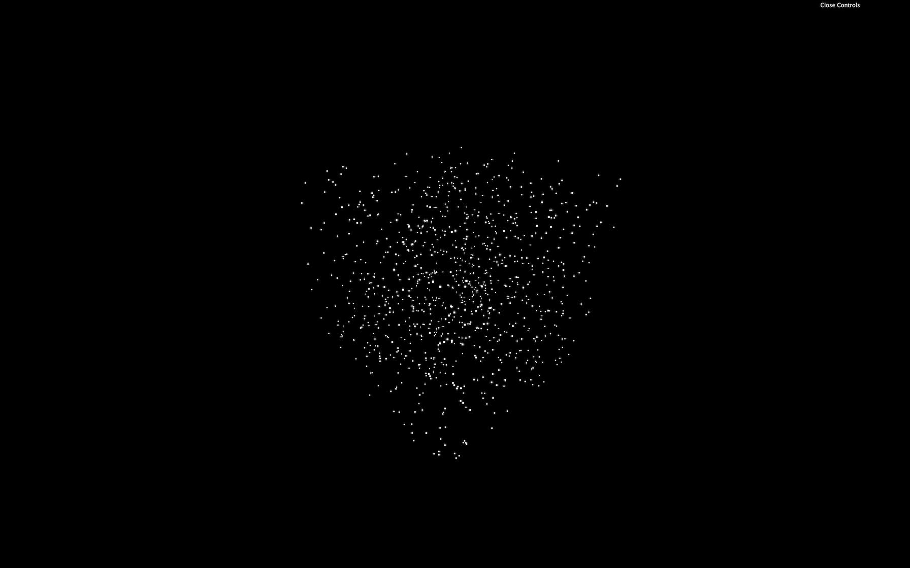

You should see few points floating around.

## Tweaks

We have already two parameters, `count` and `size`. Let's add them to the **Dat.GUI** instance that we already created at the start of the code. As you can imagine, we must add those tweaks after creating the parameters:

```js
parameters.count = 1000
parameters.size = 0.02

gui.add(parameters, 'count').min(100).max(1000000).step(100)
gui.add(parameters, 'size').min(0.001).max(0.1).step(0.001)
```

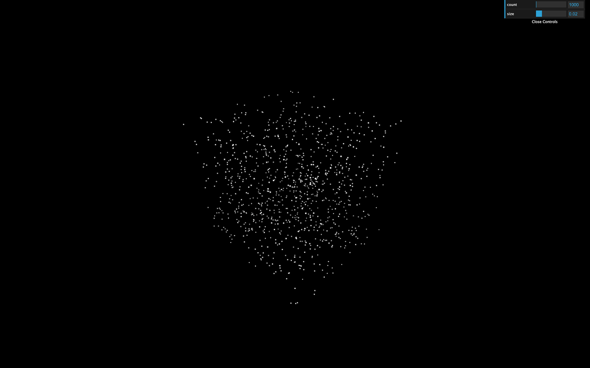

You should have two new ranges in the tweaks but changing them doesn't generate a new galaxy. To generate a new galaxy, you must listen to the change event. More precisely to the `finishChange` event to prevent generating galaxies while you are drag and dropping the range value:

```js
gui.add(parameters, 'count').min(100).max(1000000).step(100).onFinishChange(generateGalaxy)
gui.add(parameters, 'size').min(0.001).max(0.1).step(0.001).onFinishChange(generateGalaxy)
```

This code won't work because the `generateGalaxy` doesn't exist yet. You must move those tweaks after the `generateGalaxy` function.

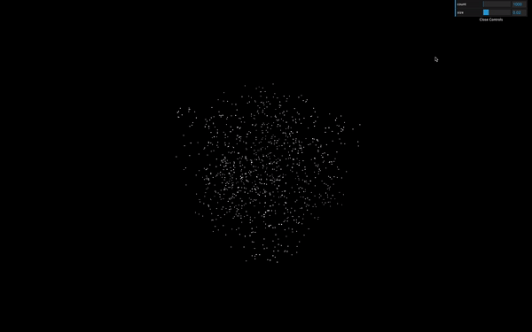

_https://threejs-journey.xyz/assets/lessons/18/step-04.mp4_

Be careful, we still have a problem, and if you play too much with the tweaks, your computer will start to heat. It's because we didn't destroy the previously created galaxy. We are creating galaxies one above the other.

To make things right, we must first move the `geometry`, `material` and `points` variables outside the `generateGalaxy`.

```js
let geometry = null
let material = null
let points = null

const generateGalaxy = () =>
{
    // ...

    geometry = new THREE.BufferGeometry()

    // ...

    material = new THREE.PointsMaterial({
        size: parameters.size,
        sizeAttenuation: true,
        depthWrite: false,
        blending: THREE.AdditiveBlending
    })

    // ...

    points = new THREE.Points(geometry, material)

    // ...
}
```

Then, before assigning those variables, we can test if they already exist. If so, we can call the `dispose()` method on the geometry and the material. Then remove the points from the scene with the `remove()` method:

```js
const generateGalaxy = () =>
{
    // Destroy old galaxy
    if(points !== null)
    {
        geometry.dispose()
        material.dispose()
        scene.remove(points)
    }

    // ...
}
```

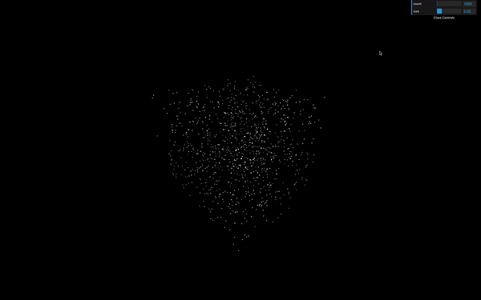

_https://threejs-journey.xyz/assets/lessons/18/step-05.mp4_

Instead of using a texture that can create depth and alpha issues as we saw in the previous lesson, we will just let the default square shape. Don't worry; there will be so many small particles that we won't notice that they are squares.

Now that we can estimate how much particles we can have and their size, let's update the parameters:

```js
parameters.count = 100000
parameters.size = 0.01
```

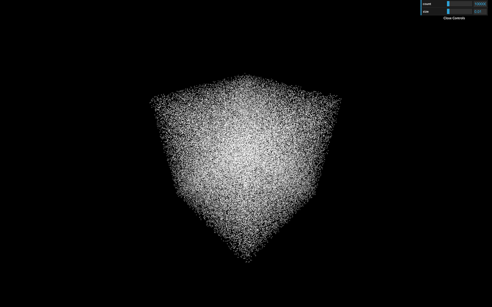

## Shape

Galaxies can have several different shapes. We will focus on the spirals one. There are many ways to position the particles to create a galaxy. Feel free to try your way before testing the lesson way.

### Radius

First, let's create a `radius` parameter:

```js
parameters.radius = 5

// ...

gui.add(parameters, 'radius').min(0.01).max(20).step(0.01).onFinishChange(generateGalaxy)
```

Each star will be positioned accordingly to that radius. If the radius is `5`, the stars will be positioned at a distance from `0` to `5`. For now, let's position all the particles on a straight line:

```js
for(let i = 0; i < parameters.count; i++)
{
    const i3 = i * 3

    const radius = Math.random() * parameters.radius

    positions[i3    ] = radius
    positions[i3 + 1] = 0
    positions[i3 + 2] = 0
}
```

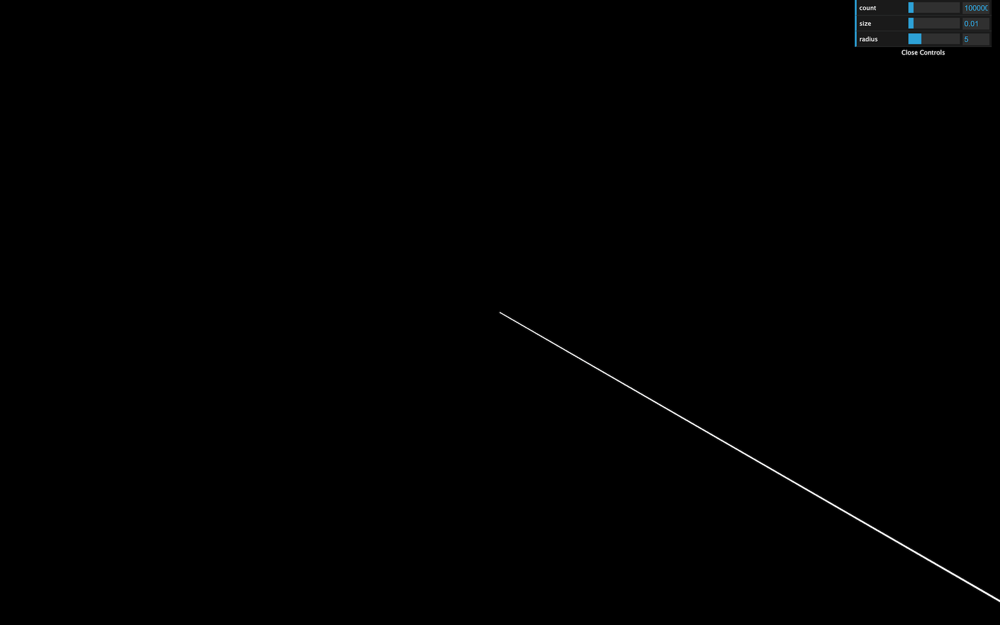

### Branches

Spin galaxies always seem to have at least two branches, but it can have much more.

Create a `branches` parameter:

```js
parameters.branches = 3

// ...

gui.add(parameters, 'branches').min(2).max(20).step(1).onFinishChange(generateGalaxy)
```

We can use `Math.cos(...)` and `Math.sin(...)` to position the particles on those branches. We first calculate an angle with the modulo (`%`), divide the result by the branches count parameter to get an angle between `0` and `1`, and multiply this value by `Math.PI * 2` to get an angle between `0` and a full circle. We then use that angle with `Math.cos(...)` and `Math.sin(...)` for the `x` and the `z` axis and we finally multiply by the radius:

```js
for(let i = 0; i < parameters.count; i++)
{
    const i3 = i * 3

    const radius = Math.random() * parameters.radius
    const branchAngle = (i % parameters.branches) / parameters.branches * Math.PI * 2

    positions[i3    ] = Math.cos(branchAngle) * radius
    positions[i3 + 1] = 0
    positions[i3 + 2] = Math.sin(branchAngle) * radius
}
```

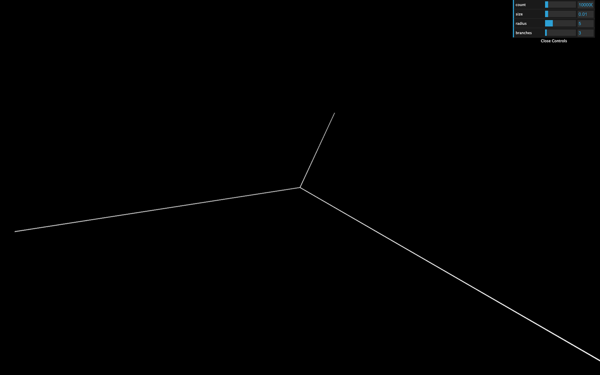

### Spin

Let's add the spin effect.

Create a `spin` parameter:

```js
parameters.spin = 1

// ...

gui.add(parameters, 'spin').min(- 5).max(5).step(0.001).onFinishChange(generateGalaxy)
```

Then we can multiply the `spinAngle` by that `spin` parameter. To put it differently, the further the particle is from the center, the more spin it'll endure:

```js
for(let i = 0; i < parameters.count; i++)
{
    const i3 = i * 3

    const radius = Math.random() * parameters.radius
    const spinAngle = radius * parameters.spin
    const branchAngle = (i % parameters.branches) / parameters.branches * Math.PI * 2

    positions[i3    ] = Math.cos(branchAngle + spinAngle) * radius
    positions[i3 + 1] = 0
    positions[i3 + 2] = Math.sin(branchAngle + spinAngle) * radius
}
```

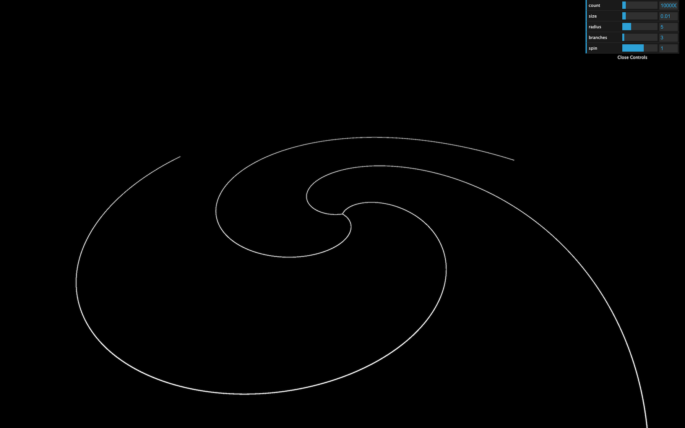

## Randomness

Those particles are perfectly aligned. We need randomness. But what we truly need is spread stars on the outside and more condensed star on the inside.

Create a `randomness` parameter:

```js
parameters.randomness = 0.2

// ...

gui.add(parameters, 'randomness').min(0).max(2).step(0.001).onFinishChange(generateGalaxy)
```

Now create a random value for each axis with `Math.random()`, multiply it by the `radius` and then add those values to the `postions`:

```js
for(let i = 0; i < parameters.count; i++)
{
    const i3 = i * 3

    const radius = Math.random() * parameters.radius

    const spinAngle = radius * parameters.spin
    const branchAngle = (i % parameters.branches) / parameters.branches * Math.PI * 2

    const randomX = (Math.random() - 0.5) * parameters.randomness * radius
    const randomY = (Math.random() - 0.5) * parameters.randomness * radius
    const randomZ = (Math.random() - 0.5) * parameters.randomness * radius

    positions[i3    ] = Math.cos(branchAngle + spinAngle) * radius + randomX
    positions[i3 + 1] = randomY
    positions[i3 + 2] = Math.sin(branchAngle + spinAngle) * radius + randomZ
}
```

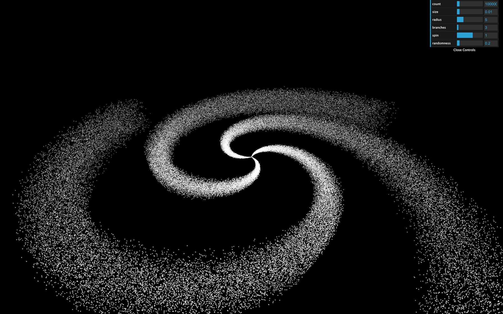

It's working but it's not very convincing, right? And we can still see the pattern. To fix that, we can use `Math.pow()` to crush the value. The more power you apply, the closest to `0` it will get. The problem is that you can't use a negative value with `Math.pow()`. What we will do is calculate the power then multiply it by `-1` randomly.

First create the power parameter:

```js
parameters.randomnessPower = 3

// ...

gui.add(parameters, 'randomnessPower').min(1).max(10).step(0.001).onFinishChange(generateGalaxy)
```

Then apply the power with `Math.pow()` and multiply it by `-1` randomly:

```js
const randomX = Math.pow(Math.random(), parameters.randomnessPower) * (Math.random() < 0.5 ? 1 : - 1) * parameters.randomness * radius
const randomY = Math.pow(Math.random(), parameters.randomnessPower) * (Math.random() < 0.5 ? 1 : - 1) * parameters.randomness * radius
const randomZ = Math.pow(Math.random(), parameters.randomnessPower) * (Math.random() < 0.5 ? 1 : - 1) * parameters.randomness * radius
```

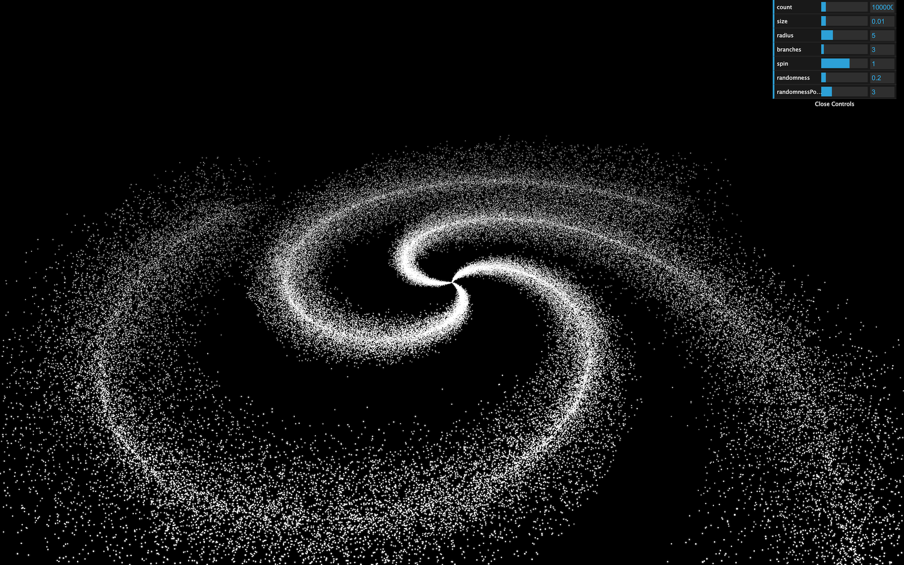

## Colors

For a better effect, we need to add some colors to our creation. A cool thing would be to have different colors inside the galaxy and on its edges.

First, add the colors parameters:

```js
parameters.insideColor = '#ff6030'
parameters.outsideColor = '#1b3984'

// ...

gui.addColor(parameters, 'insideColor').onFinishChange(generateGalaxy)
gui.addColor(parameters, 'outsideColor').onFinishChange(generateGalaxy)
```

We're going to provide a color for each vertex. We must active the `vertexColors` on the material:

```js
material = new THREE.PointsMaterial({
    size: parameters.size,
    sizeAttenuation: true,
    depthWrite: false,
    blending: THREE.AdditiveBlending,
    vertexColors: true
})
```

Then add a `color` attribute on our geometry just like we added the `position` attribute. For now, we're not using the `insideColor` and `outsideColor` parameters:

```js
geometry = new THREE.BufferGeometry()

const positions = new Float32Array(parameters.count * 3)
const colors = new Float32Array(parameters.count * 3)

for(let i = 0; i < parameters.count; i++)
{
    // ...

    colors[i3    ] = 1
    colors[i3 + 1] = 0
    colors[i3 + 2] = 0
}

geometry.setAttribute('position', new THREE.BufferAttribute(positions, 3))
geometry.setAttribute('color', new THREE.BufferAttribute(colors, 3))
```

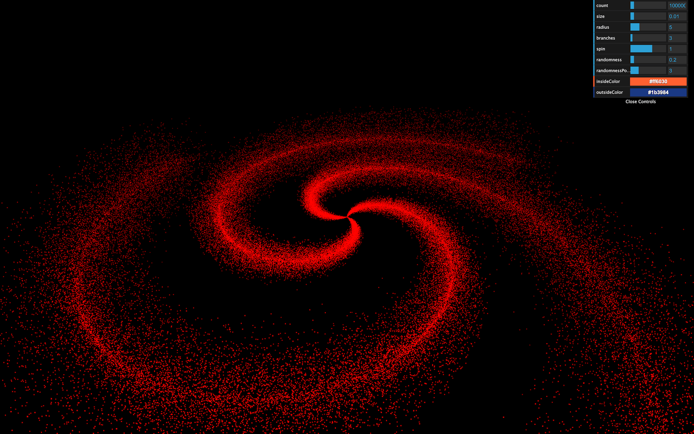

You should get a red galaxy.

To use the colors from the parameters, we first need to create a [Color](https://threejs.org/docs/index.html#api/en/math/Color) instance for each one. We have to do it inside the `generateGalaxy` function for reasons you'll understand in a bit:

```js
const generateGalaxy = () =>
{
    // ...

    const colorInside = new THREE.Color(parameters.insideColor)
    const colorOutside = new THREE.Color(parameters.outsideColor)

    // ...
}
```

Inside the loop function, we want to mix these colors into a third color. That mix depends on the distance from the center of the galaxy. If the particle is at the center of the galaxy, it'll have the `insideColor` and the further it gets from the center, the more it will get mixed with the `outsideColor`.

Instead of creating a third [Color](https://threejs.org/docs/index.html#api/en/math/Color), we are going to clone the `colorInside` and then use the `lerp(...)` method to interpolate the color from that base color to another one. The first parameter of `lerp(...)` is the other color, and the second parameter is a value between `0` and `1`. If it's `0`, the color will keep its base value, and if it's `1` the result color will be the one provided. We can use the `radius` divided by the radius parameter:

```js
const mixedColor = colorInside.clone()
mixedColor.lerp(colorOutside, radius / parameters.radius)
```

We can then use the `r`, `g` and `b` properties in our `colors` array:

```js
colors[i3    ] = mixedColor.r
colors[i3 + 1] = mixedColor.g
colors[i3 + 2] = mixedColor.b
```

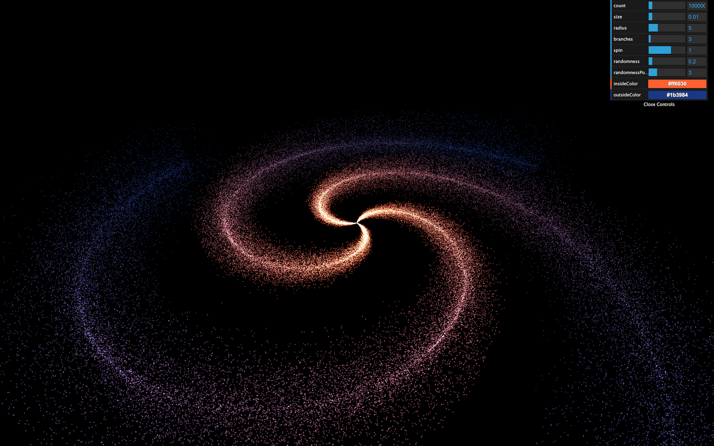

And here you have a beautiful galaxy generator. You can play with the tweaks and continue to add parameters and improve the style of your galaxies.

Try not to burn your computer.

## Go further

To go further, you can try to add more tweaks or test other galaxy shapes. We will learn how to animate all the particles in a cool spin animation in a future lesson.
