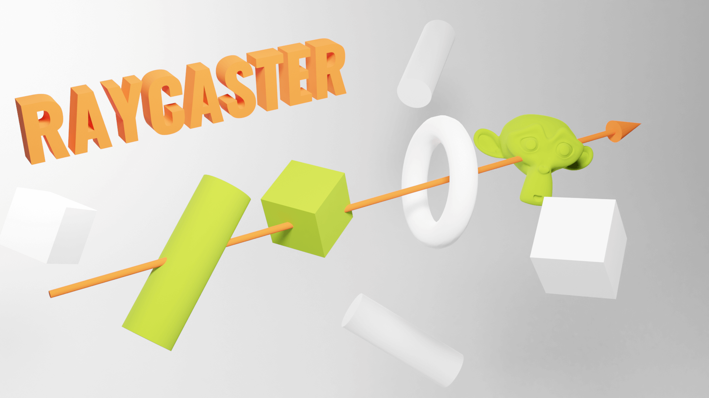
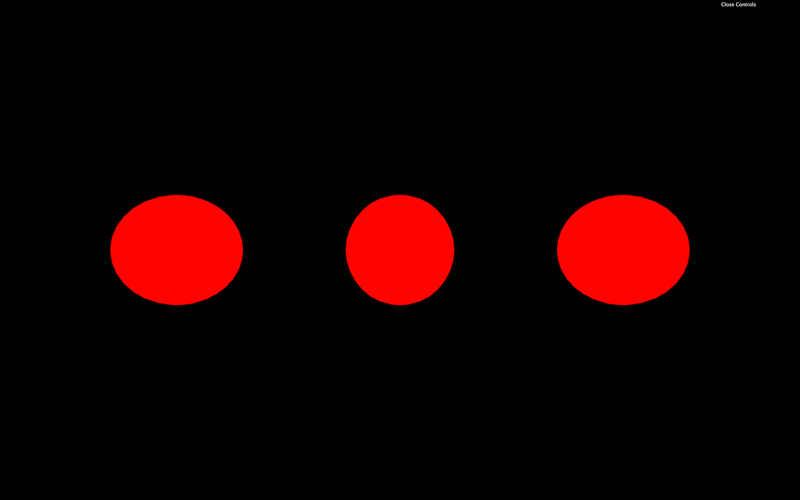
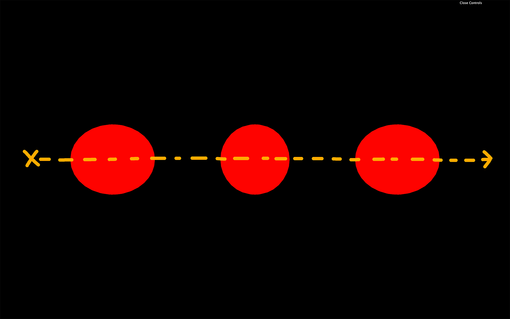
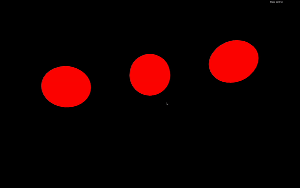
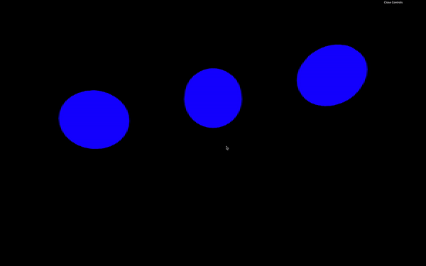
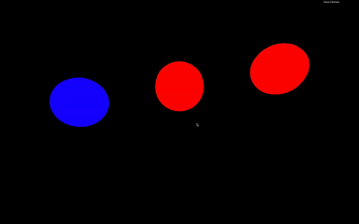
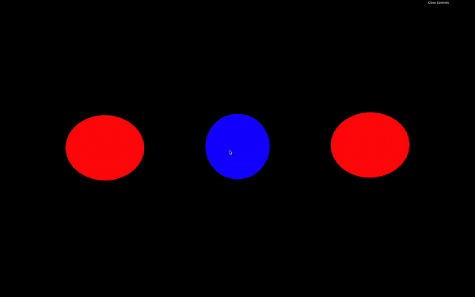

# Raycaster

[](https://shields.io)

Learn in [https://threejs-journey.xyz/lessons/19](https://threejs-journey.xyz/lessons/19)

## Introduction

As the name suggests, a Raycaster can cast (or shoot) a ray in a specific direction and test what objects intersect with it.



You can use that technique to detect if there is a wall in front of the player, test if the laser gun hit something, test if something is currently under the mouse to simulate mouse events, and many other things.

## Setup

In our starter, we have 3 red spheres, and we are going to shoot a ray through and see if those spheres intersect.



## Create the Raycaster

Instantiate a [Raycaster](https://threejs.org/docs/index.html#api/en/core/Raycaster):

```js
/**
 * Raycaster
 */
const raycaster = new THREE.Raycaster()
```

To change the position and direction where ray will be cast, we can use the `set(...)` method. The first parameter is the `position` and the second parameter is the `direction`.

Both are [Vector3](https://threejs.org/docs/index.html#api/en/math/Vector3), but the `direction` has to be normalized. A normalized vector has a length of `1`. Don't worry, you don't have to do the mathematics by yourself, and you can call the `normalize()` method on the vector:

```js
const rayOrigin = new THREE.Vector3(- 3, 0, 0)
const rayDirection = new THREE.Vector3(10, 0, 0)
rayDirection.normalize()

raycaster.set(rayOrigin, rayDirection)
```

This example of a normalized vector isn't very relevant because we could have set `1` instead of `10`, but if we change the values, we will still have the `normalize()` method making sure that the vector is `1` unit long.

Here, the ray position supposedly start a little on the left in our scene, and the direction seems to go to the right. Our ray should go through all the spheres.



## Cast a ray

To cast a ray and get the objects that intersect we can use two methods, `intersectObject(...)` (singular) and `intersectObjects(...)` (plural).

`intersectObject(...)` will test one object and `intersectObjects(...)` will test an array of objects:

```js
const intersect = raycaster.intersectObject(object2)
console.log(intersect)

const intersects = raycaster.intersectObjects([object1, object2, object3])
console.log(intersects)
```

If you look at the logs, you'll see that `intersectObject(...)` returned an array of one item (probably the second sphere) and `intersectObjects(...)`, returned an array of three items (probably the 3 spheres).

## Result of an intersection

The result of an intersection is always an array, even if you are testing only one object. That is because a ray can go through the same object multiple times. Imagine a donut. The ray will go through the first part of the ring, then the middle's hole, then again the second part of the ring.


Each item of that returned array contains much useful information:

- `distance`: the distance between the origin of the ray and the collision point.
- `face`: what face of the geometry was hit by the ray.
- `faceIndex`: the index of that face.
- `object`: what object is concerned by the collision.
- `point`: a [Vector3](https://threejs.org/docs/index.html#api/en/math/Vector3) of the exact position in 3D space of the collision.
- `uv`: the UV coordinates in that geometry.

It's up to you to use that data. If you want to test if there is a wall in front of the player, you can test the `distance`. If you're going to change the object's color, you can update the `object`'s material. If you want to show an explosion on the impact point, you can create this explosion at the `point` position.

## Test on each frame

Currently, we only cast one ray at the start. If we want to test things while they are moving, we have to do the test on each frame. Let's animate the spheres and turn them blue when the ray intersects with them.

Remove the code we did previously and only keep the raycaster instantiation:

```js
const raycaster = new THREE.Raycaster()
```

Animate the spheres by using the elapsed time and classic `Math.sin(...)` in the `tick` function:

```js
const clock = new THREE.Clock()

const tick = () =>
{
    const elapsedTime = clock.getElapsedTime()

    // Animate objects
    object1.position.y = Math.sin(elapsedTime * 0.3) * 1.5
    object2.position.y = Math.sin(elapsedTime * 0.8) * 1.5
    object3.position.y = Math.sin(elapsedTime * 1.4) * 1.5

    // ...
}
```



_https://threejs-journey.xyz/assets/lessons/19/step-02.mp4_

You should see the spheres waving up and down at different frequencies.

Now let's update our raycaster like we did before but in the `tick` function:

```js
const clock = new THREE.Clock()

const tick = () =>
{
    // ...

    // Cast a ray
    const rayOrigin = new THREE.Vector3(- 3, 0, 0)
    const rayDirection = new THREE.Vector3(1, 0, 0)
    rayDirection.normalize()

    raycaster.set(rayOrigin, rayDirection)

    const objectsToTest = [object1, object2, object3]
    const intersects = raycaster.intersectObjects(objectsToTest)
    console.log(intersects)

    // ...
}
```

Yet again, we don't really need to normalize the `rayDirection` because its length is already `1`. But it's good practice to keep the `normalize()` in case we change the direction.

We also put the array of objects to test in a variable `objectsToTest`. That will get handy later.

If you look at the console, you should get an array with intersections in it, and those intersections keep changing depending on the spheres' positions.

We can now update the material of the `object` property for each item of the `intersects` array:

```js
for(const intersect of intersects)
{
    intersect.object.material.color.set('#0000ff')
}
```



_https://threejs-journey.xyz/assets/lessons/19/step-03.mp4_

Unluckily, they all go blue but never go back red. There are many ways to turn the objects that didn't intersect back to red. What we can do is turn all the spheres red and then turn the ones that intersect blue:

```js
for(const object of objectsToTest)
{
    object.material.color.set('#ff0000')
}

for(const intersect of intersects)
{
    intersect.object.material.color.set('#0000ff')
}
```



_https://threejs-journey.xyz/assets/lessons/19/step-04.mp4_

## Use the raycaster with the mouse

As we said earlier, we can also use the raycaster to test if an object is behind the mouse. In other words, if you are hovering an object.

Mathematically speaking, it's a little complex because we need to cast a ray from the camera in the mouse's direction, but, fortunately, Three.js is doing all the heavy lifting.

For now, let's comment the code related to the raycaster in the `tick` function.

### Hovering

First, let's handle hovering.

To begin with, we need the coordinates of the mouse. We cannot use the basic native JavaScript coordinates, which are in pixels. We need a value that goes from `-1` to `+1` in both the horizontal and the vertical axis, with the vertical coordinate being positive when moving the mouse upward.

This is how WebGL works and it's related to things like clip space but we don't need to understand those complex concepts.

Examples:

- The mouse is on the top left of the page: `-1 / 1`
- The mouse is on the bottom left of the page: `-1 / - 1`
- The mouse is on the middle vertically and at right horizontally: `1 / 0`
- The mouse is in the center of the page: `0 / 0`

First, let's create a `mouse` variable with a [Vector2](https://threejs.org/docs/index.html#api/en/math/Vector2), and update that variable when the mouse is moving:

```js
/**
 * Mouse
 */
const mouse = new THREE.Vector2()

window.addEventListener('mousemove', (event) =>
{
    mouse.x = event.clientX / sizes.width * 2 - 1
    mouse.y = - (event.clientY / sizes.height) * 2 + 1

    console.log(mouse)
})
```

Look at the logs and make sure that the values match the previous examples.

We could cast the ray in the `mousemove` event callback, but it's not recommend because the `mousemove` event might be triggered more than the frame rate for some browsers. Instead, we will cast the ray in the `tick` function as we did before.

To orient the ray in the right direction, we can use the `setFromCamera()` method on the [Raycaster](https://threejs.org/docs/index.html#api/en/core/Raycaster). The rest of the code is the same as before. We just update the objects materials to red or blue if they intersect or not:

```js
const tick = () =>
{
    // ...

    raycaster.setFromCamera(mouse, camera)

    const objectsToTest = [object1, object2, object3]
    const intersects = raycaster.intersectObjects(objectsToTest)

    for(const intersect of intersects)
    {
        intersect.object.material.color.set('#0000ff')
    }

    for(const object of objectsToTest)
    {
        if(!intersects.find(intersect => intersect.object === object))
        {
            object.material.color.set('#ff0000')
        }
    }

    // ...
}
```



_https://threejs-journey.xyz/assets/lessons/19/step-05.mp4_

The spheres should become red if the cursor is above them.

### Mouse enter and mouse leave events

Mouse events like `'mouseenter'`, `'mouseleave'`, etc. aren't supported either. If you want to be inform when the mouse "enters" an object or "leaves" that object, you'll have to do it by yourself.

What we can do to reproduce the `mouseenter` and `mouseleave` events, is to have a variable containing the currently hovered object.

If there is one object intersecting, but there wasn't one before, it means a `mouseenter` has happened on that object.

If no object intersects, but there was one before, it means a `mouseleave` has happened.

We just need to save the currently intersecting object:

```js
let currentIntersect = null
```

And then, test and update the `currentIntersect` variable:

```js
const tick = () =>
{
    // ...
    raycaster.setFromCamera(mouse, camera)
    const objectsToTest = [object1, object2, object3]
    const intersects = raycaster.intersectObjects(objectsToTest)

    if(intersects.length)
    {
        if(!currentIntersect)
        {
            console.log('mouse enter')
        }

        currentIntersect = intersects[0]
    }
    else
    {
        if(currentIntersect)
        {
            console.log('mouse leave')
        }

        currentIntersect = null
    }

    // ...
}
```

### Mouse click event

Now that we have a variable containing the currently hovered object, we can easily implement a `click` event.

First, we need to listen to the `click` event regardless of where it happens:

```js
window.addEventListener('click', () =>
{

})
```

Then, we can test if the there is something in the `currentIntersect` variable:

```js
window.addEventListener('click', () =>
{
    if(currentIntersect)
    {
        console.log('click')
    }
})
```

We can also test what object was concerned by the click:

```js
window.addEventListener('click', () =>
{
    if(currentIntersect)
    {
        switch(currentIntersect.object)
        {
            case object1:
                console.log('click on object 1')
                break

            case object2:
                console.log('click on object 2')
                break

            case object3:
                console.log('click on object 3')
                break
        }
    }
})
```

Reproducing native events takes time, but once you understand it, it's pretty straightforward.
