# Physics

[](https://shields.io)

Learn in [https://threejs-journey.xyz/lessons/20](https://threejs-journey.xyz/lessons/20)

## Introduction

Physics can be one of the coolest features you can add to a WebGL experience. People enjoy playing with objects, see them collide, collapse, fall and bounce like in my portfolio: [https://bruno-simon.com/](https://bruno-simon.com/)

There are many ways of adding physics to your project, and it depends on what you want to achieve. You can create your own physics with some mathematics and solutions like [Raycaster](https://threejs.org/docs/index.html#api/en/core/Raycaster), but if you wish to get realistic physics with tension, friction, bouncing, constraints, pivots, etc. and all that in 3D space, you better use a library.

## Theory

The idea is simple. We are going to create a physics world. This physics world is purely theoretical, and we cannot see it. But in this world, things fall, collide, rub, slide, etc.

When we create a Three.js mesh, we will also create a version of that mesh inside the physics world. If we make a Box in Three.js, we also create a box in the physics world.

Then, on each frame, before rendering anything, we tell the physics world to update itself; we take the coordinates (position and rotation) of the physics objects and apply them to the corresponding Three.js mesh.

And that's all. What is most difficult is to organize our code in a decent structure. That is a part where paths separate. Each developer will have its habits, and it also depends on what you want to do and how complex the physics can become.

To begin with, we will simply create spheres and boxes.

## Libraries

There are multiple available libraries. First, you must decide if you need a 3D library or a 2D library. While you might think it has to be a 3D library because Three.js is all about 3D, you might be wrong. 2D libraries are usually much more performant, and if you can sum up your experience physics up to 2D collisions, you better use a 2D library.

One example is if you want to create a pool game. The balls can collide and bounce on the walls, but you can project everything on a 2D plane. You can design balls as circles in the physics world, and the walls are simple rectangles. Indeed, you won't be able to do tricks hitting the bottom of the ball so that it can jump over the other balls.

An excellent example of a project done like this is [Ouigo Let's play](http://letsplay.ouigo.com/) by [Merci Michel](https://www.merci-michel.com/). They used a 2D physics library because every collision and animation can be represented in a 2D space.

For 3D physics, there are three main libraries:

- Ammo.js
  - Website: [http://schteppe.github.io/ammo.js-demos/](http://schteppe.github.io/ammo.js-demos/)
  - Git repository: [https://github.com/kripken/ammo.js/](https://github.com/kripken/ammo.js/)
  - Documentation: No documentation
  - Direct JavaScript port of Bullet (a physics engine written in C++)
  - A little heavy
  - Still updated by a community
- Cannon.js
  - Website: [https://schteppe.github.io/cannon.js/](https://schteppe.github.io/cannon.js/)
  - Git repository: [https://github.com/schteppe/cannon.js](https://github.com/schteppe/cannon.js)
  - Documentation: [http://schteppe.github.io/cannon.js/docs/](http://schteppe.github.io/cannon.js/docs/)
  - Lighter than Ammo.js
  - More comfortable to implement than Ammo.js
  - Mostly maintained by one developer
  - Hasn't been updated for many years
  - There is a maintained fork
- Oimo.js
  - Website: [https://lo-th.github.io/Oimo.js/](https://lo-th.github.io/Oimo.js/)
  - Git repository: [https://github.com/lo-th/Oimo.js](https://github.com/lo-th/Oimo.js)
  - Documentation: [http://lo-th.github.io/Oimo.js/docs.html](http://lo-th.github.io/Oimo.js/docs.html#world)
  - Lighter than Ammo.js
  - Easier to implement than Ammo.js
  - Mostly maintained by one developer
  - Hasn't been updated for 2 years

For 2D physics, there are many libraries, but here's the most popular:

- Matter.js
  - Website: [https://brm.io/matter-js/](https://brm.io/matter-js/)
  - Git repository: [https://github.com/liabru/matter-js](https://github.com/liabru/matter-js)
  - Documentation: [https://brm.io/matter-js/docs/](https://brm.io/matter-js/docs/)
  - Mostly maintained by one developer
  - Still kind of updated
- P2.js
  - Website: [https://schteppe.github.io/p2.js/](https://schteppe.github.io/p2.js/)
  - Git repository: [https://github.com/schteppe/p2.js](https://github.com/schteppe/p2.js)
  - Documentation: [http://schteppe.github.io/p2.js/docs/](http://schteppe.github.io/p2.js/docs/)
  - Mostly maintained by one developer (Same as Cannon.js)
  - Hasn't been update for 2 years
- Planck.js
  - Website: [https://piqnt.com/planck.js/](https://piqnt.com/planck.js/)
  - Git repository: [https://github.com/shakiba/planck.js](https://github.com/shakiba/planck.js)
  - Documentation: [https://github.com/shakiba/planck.js/tree/master/docs](https://github.com/shakiba/planck.js/tree/master/docs)
  - Mostly maintained by one developer
  - Still updated nowadays
- Box2D.js
  - Website: [http://kripken.github.io/box2d.js/demo/webgl/box2d.html](http://kripken.github.io/box2d.js/demo/webgl/box2d.html)
  - Git repository: [https://github.com/kripken/box2d.js/](https://github.com/kripken/box2d.js/)
  - Documentation: No documentation
  - Mostly maintained by one developer (same as Ammo.js)
  - Still updated nowadays

We won't use a 2D library in this lesson, but the 2D library code would be very similar to a 3D library code. The main difference is the axes you have to update.

There are already solutions that try to combine Three.js with libraries like [Physijs](https://chandlerprall.github.io/Physijs/). Still, we won't use any of those solutions to get a better learning experience and better understand what's going on.

While Ammo.js is the most used library and particularly with Three.js, as you can see in [the examples](https://threejs.org/examples/?q=ammo#physics_ammo_break), we will go for Cannon.js. The library is more comfortable to implement in our project and easier to use.

## Import Cannon.js

To add Cannon.js to our project, we first need to add the dependency.

In your terminal, on the project folder, run this command `npm install --save cannon`.

We can now import Cannon.js in our JavaScript with a classic `import`:

```js
import CANNON from 'cannon' 
```

Everything we need is available in the `CANNON` variable.

## Setup

Our starter is composed of one sphere on a plane, and shadows are already enabled for aesthetic reasons.

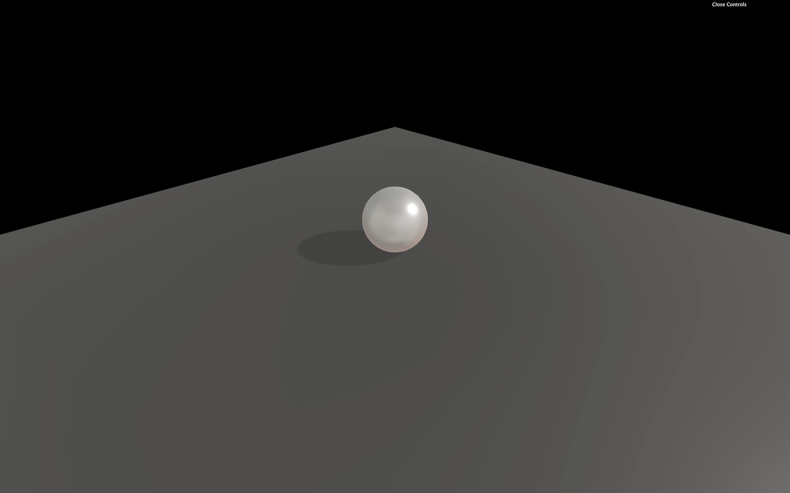

## Base

### World

First, we need to create a Cannon.js [World](http://schteppe.github.io/cannon.js/docs/classes/World.html):

```js
/**
 * Physics
 */
const world = new CANNON.World()
```

We could make a WebGL experience in space where there is no gravity, but let's keep our feet on Earth and add gravity. You can change this value with the `gravity` property, which is a Cannon.js [Vec3](http://schteppe.github.io/cannon.js/docs/classes/Vec3.html).

Cannon.js [Vec3](http://schteppe.github.io/cannon.js/docs/classes/Vec3.html) is just like Three.js [Vector3](https://threejs.org/docs/#api/en/math/Vector3). It has `x`, `y`, and `z` properties, but also a `set(...)` method:

```js
world.gravity.set(0, - 9.82, 0)
```

We used `- 9.82` as the value because it's the gravity constant on earth, but you can use any other value if you want things to fall slower or if your scene happens on Mars.

### Object

Because we already have a sphere in our scene, let's create a sphere inside our Cannon.js [World](http://schteppe.github.io/cannon.js/docs/classes/World.html).

To do that, we must create a [Body](http://schteppe.github.io/cannon.js/docs/classes/Body.html). Bodies are simply objects that will fall and collide with other bodies.

Before we can create a [Body](http://schteppe.github.io/cannon.js/docs/classes/Body.html), we must decide on a shape. There are many available primitive shapes like [Box](http://schteppe.github.io/cannon.js/docs/classes/Box.html), [Cylinder](http://schteppe.github.io/cannon.js/docs/classes/Cylinder.html), [Plane](http://schteppe.github.io/cannon.js/docs/classes/Plane.html), etc. We will go for a [Sphere](http://schteppe.github.io/cannon.js/docs/classes/Sphere.html) with the same radius as our Three.js sphere:

```js
const sphereShape = new CANNON.Sphere(0.5)
```

Then we can create our [Body](http://schteppe.github.io/cannon.js/docs/classes/Body.html) and specify a mass and a position:

```js
const sphereBody = new CANNON.Body({
    mass: 1,
    position: new CANNON.Vec3(0, 3, 0),
    shape: sphereShape
})
```

Finally, we can add the [Body](http://schteppe.github.io/cannon.js/docs/classes/Body.html) to the world with `addBody(...)`:

```js
world.addBody(sphereBody)
```

Nothing is happening because we still need to update our Cannon.js world and update our Three.js sphere accordingly.

### Update the Cannon.js world and the Three.js scene

To update our [World](http://schteppe.github.io/cannon.js/docs/classes/World.html), we must use the `step(...)`. The code behind this method is hard to understand, and we won't explain it in this lesson, but you can find more about it in [this article](https://gafferongames.com/post/fix_your_timestep/).

For it to work, you must provide a fixed time step, how much time passed since the last step, and how much iterations the world can apply to catch up with a potential delay.

We won't explain what is a time step, but because we want our experience to run at 60fps, we are going to use `1 / 60`. Don't worry, the experience will work at the same speed on devices with higher and lower frame rates.

It's up to you for the number of iterations, but it's not that important if the experience is running smoothly. Let's use `3`.

For the delta time, it's a little harder. We need to calculate how much time has passed since the last frame. Do not use the `getDelta()` method from the [Clock](https://threejs.org/docs/#api/en/core/Clock) class. You won't get the intended result, and you'll mess up with the class's internal logic.

To get the right delta time, we need to subtract the `elapsedTime` from the previous frame to the current `elapsedTime`:

```js
const clock = new THREE.Clock()
let oldElapsedTime = 0

const tick = () =>
{
    const elapsedTime = clock.getElapsedTime()
    const deltaTime = elapsedTime - oldElapsedTime
    oldElapsedTime = elapsedTime

    // ...
}
```

We can finally update our world:

```js
const tick = () =>
{
    // ...

    // Update physics
    world.step(1 / 60, deltaTime, 3)
}
```

Still, nothing seems to be moving. But our `sphereBody` is falling, and you can see that by logging its position after updating the world:

```js
world.step(1 / 60, deltaTime, 3)
console.log(sphereBody.position.y)
```

What we need to do now is update our Three.js `sphere` by using the `sphereBody` coordinates. There are two ways of doing it. You can either update each `position` property separately:

```js
sphere.position.x = sphereBody.position.x
sphere.position.y = sphereBody.position.y
sphere.position.z = sphereBody.position.z
```

Or you can copy all the properties as one with the `copy(...)` method:

```js
sphere.position.copy(sphereBody.position)
```

`copy(...)` is available in many classes such as [Vector2](https://threejs.org/docs/#api/en/math/Vector2), [Vector3](https://threejs.org/docs/#api/en/math/Vector3), [Euler](https://threejs.org/docs/#api/en/math/Euler), [Quaternion](https://threejs.org/docs/#api/en/math/Quaternion), and even classes like [Material](https://threejs.org/docs/#api/en/materials/Material), [Object3D](https://threejs.org/docs/#api/en/core/Object3D), [Geometry](https://threejs.org/docs/#api/en/core/Geometry), etc.


_https://threejs-journey.xyz/assets/lessons/20/step-02.mp4_

You should eventually see your sphere falling. The problem is that our sphere seems to fall through the floor. It's because that floor exists in the Three.js scene but not in the Cannon.js world.

We can simply add a new [Body](http://schteppe.github.io/cannon.js/docs/classes/Body.html) using a [Plane](http://schteppe.github.io/cannon.js/docs/classes/Plane.html) shape, but we don't want our floor to be affected by gravity and fall. In other words, we want our floor to be static. To make a [Body](http://schteppe.github.io/cannon.js/docs/classes/Body.html) static, set its `mass` to `0`:

```js
const floorShape = new CANNON.Plane()
const floorBody = new CANNON.Body()
floorBody.mass = 0
floorBody.addShape(floorShape)
world.addBody(floorBody)
```

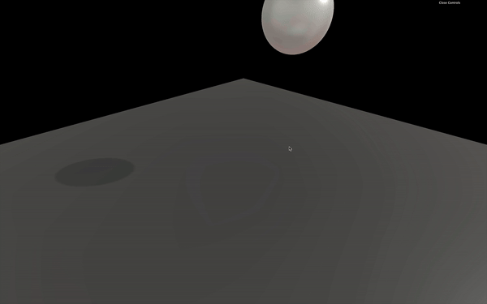

_https://threejs-journey.xyz/assets/lessons/20/step-03.mp4_

As you can see, we did things quite differently this time. We created a [Body](http://schteppe.github.io/cannon.js/docs/classes/Body.html) with no parameter, and we set those parameters after. The result is the same, and the only reason we did this is for the lesson's sake. One interesting thing is that you can create a [Body](http://schteppe.github.io/cannon.js/docs/classes/Body.html) composed of multiple [Shapes](http://schteppe.github.io/cannon.js/docs/classes/Shape.html). It can be useful for complex but solid objects.

You should see the sphere jumping in a direction (probably toward the camera). Not the intended result. The reason is that our plane is facing the camera by default. We need to rotate it just like we rotated the floor in Three.js.

Rotation with Cannon.js is a little harder than with Three.js because you have to use [Quaternion](http://schteppe.github.io/cannon.js/docs/classes/Quaternion.html). There are multiple ways of rotating the [Body](http://schteppe.github.io/cannon.js/docs/classes/Body.html), but it has to be with its `quaternion` property. We are going to use the `setFromAxisAngle(...)`.

The first parameter is an axis. You can imagine it like a spike going through the [Body](http://schteppe.github.io/cannon.js/docs/classes/Body.html). The second parameter is the angle. It's how much you are rotating the [Body](http://schteppe.github.io/cannon.js/docs/classes/Body.html) around that spike.

```js
floorBody.quaternion.setFromAxisAngle(new CANNON.Vec3(- 1, 0, 0), Math.PI * 0.5) 
```


_https://threejs-journey.xyz/assets/lessons/20/step-04.mp4_

We set the axis like if it was a spike going through the [Body](http://schteppe.github.io/cannon.js/docs/classes/Body.html) on the negative `x` axis (to the left relatively to the camera) and we set the Angle to `Math.PI * 0.5` (a quarter of a circle).

You should now see the sphere falling and then stopping on the floor.

We don't need to update the Three.js floor with the Cannon.js floor because this object is not moving.

## Contact material

As you can see, the ball doesn't bounce much. That is the default behavior, and we can change that with [Material](http://schteppe.github.io/cannon.js/docs/classes/Material.html) (Not the Material from Three.js) and [ContactMaterial](http://schteppe.github.io/cannon.js/docs/classes/ContactMaterial.html).

A [Material](http://schteppe.github.io/cannon.js/docs/classes/Material.html) is just a reference. You can give it a name and associate it with a [Body](http://schteppe.github.io/cannon.js/docs/classes/Body.html). The idea is to create a [Material](http://schteppe.github.io/cannon.js/docs/classes/Material.html) for each type of material you have in your scene.

Suppose everything in your world is made out of plastic. In that case, you only have to create one material and name it `'default'` or `'plastic'`. If you have multiple types of materials in your scene, let's say one material for the floor and one for the ball. Then, you should create various [Material](http://schteppe.github.io/cannon.js/docs/classes/Material.html) and give them names like `'concrete'` and `'plastic'`.

You could have called them `'ground'` and `'ball'`. Still, if you want to use the same materials for walls and other objects like cubes, it could be inconvenient to use a material named `'ground'`.

Before you create the sphere and the floor, create these two [Material](http://schteppe.github.io/cannon.js/docs/classes/Material.html):

```js
const concreteMaterial = new CANNON.Material('concrete')
const plasticMaterial = new CANNON.Material('plastic')
```

Now that we have our [Material](http://schteppe.github.io/cannon.js/docs/classes/Material.html), we must create a [ContactMaterial](http://schteppe.github.io/cannon.js/docs/classes/ContactMaterial.html). It is the combination of the two [Materials](http://schteppe.github.io/cannon.js/docs/classes/Material.html) and contains properties for when objects collide.

The first two parameters are the [Materials](http://schteppe.github.io/cannon.js/docs/classes/Material.html). The third parameter is an object `{}` that contains two important properties: the `friction` coefficient (how much does it rub) and the `restitution` coefficient (how much does it bounce)—both have default values of `0.3`.

Once created, add the [ContactMaterial](http://schteppe.github.io/cannon.js/docs/classes/ContactMaterial.html) to the world with the `addContactMaterial(...)` method:

```js
const concretePlasticContactMaterial = new CANNON.ContactMaterial(
    concreteMaterial,
    plasticMaterial,
    {
        friction: 0.1,
        restitution: 0.7
    }
)
world.addContactMaterial(concretePlasticContactMaterial)
```

There isn't much friction between concrete and plastic, but if you let a plastic ball fall on a concrete floor, you'll see it bounce quite a lot.

We can now use our [Material](http://schteppe.github.io/cannon.js/docs/classes/Material.html) on the [Body](http://schteppe.github.io/cannon.js/docs/classes/Body.html). You can pass the [Material](http://schteppe.github.io/cannon.js/docs/classes/Material.html) directly when instancing the [Body](http://schteppe.github.io/cannon.js/docs/classes/Body.html) or after with the `material` property. Let's do both for the sake of learning:

```js
const sphereBody = new CANNON.Body({
    // ...
    material: plasticMaterial
})

// ...

const floorBody = new CANNON.Body()
floorBody.material = concreteMaterial
```


_https://threejs-journey.xyz/assets/lessons/20/step-05.mp4_

You should see the ball bounce many times before stopping. We cannot see the `friction` in action because our ball falls perfectly straight on our floor and spend most of its time in the air.

Having different [Materials](http://schteppe.github.io/cannon.js/docs/classes/Material.html) and creating a [ContactMaterial](http://schteppe.github.io/cannon.js/docs/classes/ContactMaterial.html) for each combination can prove to be puzzling. To simplify everything, let's replace our two [Materials](http://schteppe.github.io/cannon.js/docs/classes/Material.html) by a default one and use it on every [Bodies](http://schteppe.github.io/cannon.js/docs/classes/Body.html):

```js
const defaultMaterial = new CANNON.Material('default')
const defaultContactMaterial = new CANNON.ContactMaterial(
    defaultMaterial,
    defaultMaterial,
    {
        friction: 0.1,
        restitution: 0.7
    }
)
world.addContactMaterial(defaultContactMaterial)

// ...

const sphereBody = new CANNON.Body({
    // ...
    material: defaultMaterial
})

// ...

floorBody.material = defaultMaterial
```


_https://threejs-journey.xyz/assets/lessons/20/step-06.mp4_

We get the same result.

We can go even further by setting our material as the default one of our [World](http://schteppe.github.io/cannon.js/docs/classes/World.html). To do that, simply assign the `defaultContactMaterial` to the `world`'s `defaultContactMaterial` property:

```js
world.defaultContactMaterial = defaultContactMaterial
```

We can now remove or comment the material assignation of the `sphereBody` and `floorBody`.

## Apply forces

There are many ways to apply forces to a [Body](http://schteppe.github.io/cannon.js/docs/classes/Body.html):

- [applyForce](http://schteppe.github.io/cannon.js/docs/classes/Body.html#method_applyForce) to apply a force to the [Body](http://schteppe.github.io/cannon.js/docs/classes/Body.html) from a specified point in space (not necessarily on the [Body](http://schteppe.github.io/cannon.js/docs/classes/Body.html)'s surface) like the wind that pushes everything a little all the time, a small but sudden push on a domino or a greater sudden force to make an angry bird jump toward the enemy castle.
- [applyImpulse](http://schteppe.github.io/cannon.js/docs/classes/Body.html#method_applyImpulse) is like [applyForce](http://schteppe.github.io/cannon.js/docs/classes/Body.html#method_applyForce) but instead of adding to the force that will result in velocity changes, it applies directly to the velocity.
- [applyLocalForce](http://schteppe.github.io/cannon.js/docs/classes/Body.html#method_applyLocalForce) is the same as [applyForce](http://schteppe.github.io/cannon.js/docs/classes/Body.html#method_applyForce) but the coordinates are local to the [Body](http://schteppe.github.io/cannon.js/docs/classes/Body.html) (meaning that `0, 0, 0` would be the center of the [Body](http://schteppe.github.io/cannon.js/docs/classes/Body.html)).
- [applyLocalImpulse](http://schteppe.github.io/cannon.js/docs/classes/Body.html#method_applyLocalImpulse) is the same as [applyImpulse](http://schteppe.github.io/cannon.js/docs/classes/Body.html#method_applyImpulse) but the coordinates are local to the [Body](http://schteppe.github.io/cannon.js/docs/classes/Body.html).

Because using "force" methods will result in velocity changes, let's not use "impulse" methods

Let's use `applyLocalForce(...)` to apply a small impulse on our `sphereBody` at the start:

```js
sphereBody.applyLocalForce(new CANNON.Vec3(150, 0, 0), new CANNON.Vec3(0, 0, 0))
```

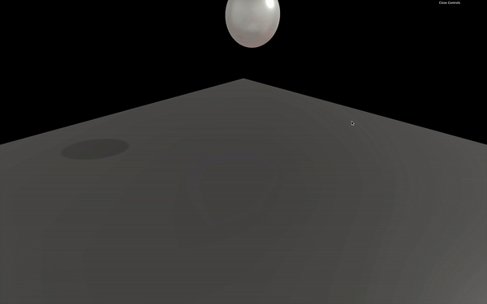

_https://threejs-journey.xyz/assets/lessons/20/step-07.mp4_

You can see the ball bounce to the right and roll.

Now let's use the `applyForce(...)` to apply some wind. Because the wind is permanent, we should apply this force to each frame before updating the [World](http://schteppe.github.io/cannon.js/docs/classes/World.html). To correctly apply this force, the point should be the `sphereBody.position`:

```js
const tick = () =>
{
    // ...

    // Update physics
    sphereBody.applyForce(new CANNON.Vec3(- 0.5, 0, 0), sphereBody.position)

    world.step(1 / 60, deltaTime, 3)

    // ...
}
```


_https://threejs-journey.xyz/assets/lessons/20/step-08.mp4_

## Handle multiple objects

Handling one or two objects is easy, but managing dozens of objects can be a mess. We need to automate things a little.

First, remove or comment the `sphere`, the `sphereShape` and the `sphereBody`.

### Automate with functions

To start with, let's improve how we create spheres with a function that will add both the Three.js and the Cannon.js versions.

As parameters of this function, we will only pass the `radius` and the `position`, but feel free to add other parameters such as `mass`, `material`, `subdivisions`, etc.

```js
/**
 * Utils
 */
const createSphere = (radius, position) =>
{
}
```

Now we can create the Three.js [Mesh](https://threejs.org/docs/#api/en/objects/Mesh):

```js
const createSphere = (radius, position) =>
{
    // Three.js mesh
    const mesh = new THREE.Mesh(
        new THREE.SphereGeometry(radius, 20, 20),
        new THREE.MeshStandardMaterial({
            metalness: 0.3,
            roughness: 0.4,
            envMap: environmentMapTexture
        })
    )
    mesh.castShadow = true
    mesh.position.copy(position)
    scene.add(mesh)
}
```

And the Cannon.js [Body](http://schteppe.github.io/cannon.js/docs/classes/Body.html):

```js
const createSphere = (radius, position) =>
{
    // ...

    // Cannon.js body
    const shape = new CANNON.Sphere(radius)

    const body = new CANNON.Body({
        mass: 1,
        position: new CANNON.Vec3(0, 3, 0),
        shape: shape,
        material: defaultMaterial
    })
    body.position.copy(position)
    world.addBody(body)
}
```

We can remove the previously created sphere and call the `createSphere(...)` (after creating the Cannon.js world and the Three.js scene). Don't forget to remove the sphere update in the `tick()` function:

```js
createSphere(0.5, { x: 0, y: 3, z: 0 })
```

As you can see, the position doesn't have to be a Three.js [Vector3](https://threejs.org/docs/#api/en/math/Vector3) or a Cannon.js [Vec3](http://schteppe.github.io/cannon.js/docs/classes/Vec3.html) and we can simply use an object with `x`, `y` and `z` properties (luckily for us).

You should see the sphere floating above the floor, but unfortunately, it's not moving anymore. And this is perfectly normal because we removed the code that was taking the Cannon.js [Body](http://schteppe.github.io/cannon.js/docs/classes/Body.html) `position` to apply it to the Three.js [Mesh](https://threejs.org/docs/#api/en/objects/Mesh) `position`.

### Use an array of objects

To handle this part, we will create an array of all objects that need to be updated. Then we'll add the newly created [Mesh](https://threejs.org/docs/#api/en/objects/Mesh) and [Body](http://schteppe.github.io/cannon.js/docs/classes/Body.html) inside an object to that array:

```js
const objectsToUpdate = []

const createSphere = (radius, position) =>
{
    // ...

    // Save in objects to update
    objectsToUpdate.push({
        mesh: mesh,
        body: body
    })
}
```

You can write this last part like this (no need to specify the property when the variable name is the same in JavaScript):

```js
objectsToUpdate.push({ mesh, body })
```

We can now loop on that array inside the `tick()` function (right after updating the world) and copy each `body.position` to the `mesh.position`:

```js
const tick = () =>
{
    // ...

    world.step(1 / 60, deltaTime, 3)

    for(const object of objectsToUpdate)
    {
        object.mesh.position.copy(object.body.position)
    }
}
```

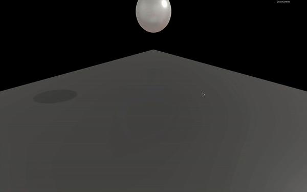

_https://threejs-journey.xyz/assets/lessons/20/step-10.mp4_

The sphere should start falling again.

### Add to Dat.GUI

Let's have fun and add a `createSphere` button to our Dat.GUI. The problem is that the first parameter when using the `gui.add(...)` method, should be an object, and the second parameter should be a property name. Unfortunately, our `createSphere` method is not in an object, and also need to passe parameters to it. This kind of situation can happen regularly. A not so bad solution would be to create an object which only purpose would be to have those lost functions as properties:

```js
const gui = new dat.GUI()
const debugObject = {}
```

And then add functions to it when needed (after creating the `createSphere` function):

```js
debugObject.createSphere = () =>
{
    createSphere(0.5, { x: 0, y: 3, z: 0 })
}
```

Finally, we can add this new `createSphere` property to Dat.GUI:

```js
gui.add(debugObject, 'createSphere')
```

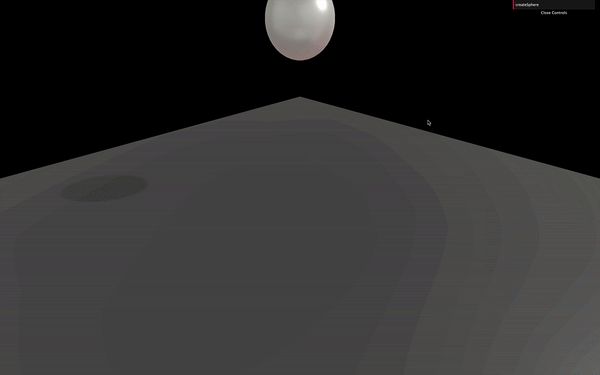

_https://threejs-journey.xyz/assets/lessons/20/step-11.mp4_

If you click on the newly created `createSphere` button, you should see spheres staking one on each other. That is due to the sphere popping on the exact same position. Let's add some randomness:

```js
debugObject.createSphere = () =>
{
    createSphere(
        Math.random() * 0.5,
        {
            x: (Math.random() - 0.5) * 3,
            y: 3,
            z: (Math.random() - 0.5) * 3
        }
    )
}
```


_https://threejs-journey.xyz/assets/lessons/20/step-12.mp4_

It's raining spheres!

Try not to burn your computer; this code needs optimization.

### Optimize

Because the geometry and the material of the Three.js [Mesh](https://threejs.org/docs/#api/en/objects/Mesh) are the same, we should get them out of the `createSphere` function. The problem is that we are using the `radius` to create our geometry. An easy solution would be to fix the radius of the [SphereGeometry](https://threejs.org/docs/#api/en/geometries/SphereGeometry) to `1` and then scale the [Mesh](https://threejs.org/docs/#api/en/objects/Mesh):

```js
const sphereGeometry = new THREE.SphereGeometry(1, 20, 20)
const sphereMaterial = new THREE.MeshStandardMaterial({
    metalness: 0.3,
    roughness: 0.4,
    envMap: environmentMapTexture
})
const createSphere = (radius, position) =>
{
    // Three.js mesh
    const mesh = new THREE.Mesh(sphereGeometry, sphereMaterial)
    mesh.castShadow = true
    mesh.scale.set(radius, radius, radius)
    mesh.position.copy(position)
    scene.add(mesh)

    // ...
}
```

You should get the same result.

## Add boxes

Now that our spheres are working well, let's do the same process but for the boxes.

To create a box, we must use a [BoxGeometry](https://threejs.org/docs/index.html#api/en/geometries/BoxGeometry) and a [Box](http://schteppe.github.io/cannon.js/docs/classes/Box.html) shape. Be careful; the parameters aren't the same. A [BoxGeometry](https://threejs.org/docs/index.html#api/en/geometries/BoxGeometry) needs a `width`, a `height`, and a `depth`. In the meantime, a [Box](http://schteppe.github.io/cannon.js/docs/classes/Box.html) shape needs a `halfExtents`. It is represented by a [Vec3](http://schteppe.github.io/cannon.js/docs/classes/Vec3.html) corresponding to a segment that starts at the center of the box and joining one of that box corners:

```js
// Create box
const boxGeometry = new THREE.BoxGeometry(1, 1, 1)
const boxMaterial = new THREE.MeshStandardMaterial({
    metalness: 0.3,
    roughness: 0.4,
    envMap: environmentMapTexture
})
const createBox = (width, height, depth, position) =>
{
    // Three.js mesh
    const mesh = new THREE.Mesh(boxGeometry, boxMaterial)
    mesh.scale.set(width, height, depth)
    mesh.castShadow = true
    mesh.position.copy(position)
    scene.add(mesh)

    // Cannon.js body
    const shape = new CANNON.Box(new CANNON.Vec3(width * 0.5, height * 0.5, depth * 0.5))

    const body = new CANNON.Body({
        mass: 1,
        position: new CANNON.Vec3(0, 3, 0),
        shape: shape,
        material: defaultMaterial
    })
    body.position.copy(position)
    world.addBody(body)

    // Save in objects
    objectsToUpdate.push({ mesh, body })
}

createBox(1, 1.5, 2, { x: 0, y: 3, z: 0 })

debugObject.createBox = () =>
{
    createBox(
        Math.random(),
        Math.random(),
        Math.random(),
        {
            x: (Math.random() - 0.5) * 3,
            y: 3,
            z: (Math.random() - 0.5) * 3
        }
    )
}
gui.add(debugObject, 'createBox')
```

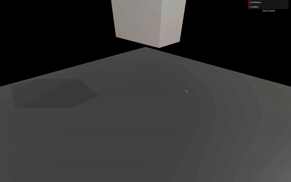

_https://threejs-journey.xyz/assets/lessons/20/step-13.mp4_

Don't forget to remove the first `createSphere(...)` call, or you'll have both the sphere and the box created in the same position simultaneously, which might get messy.

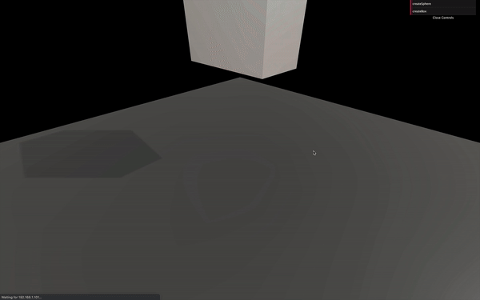

_https://threejs-journey.xyz/assets/lessons/20/step-14.mp4_

You should see a box falling and suddenly going through the floor. If you click on the `createBox` button of Dat.GUI, it should get even more acute.

We forgot one significant thing: our meshes are not rotating. What's happening here is that the box bounce on the floor and fall on its side. But all we can see is the box standing straight and going through the floor because the Three.js [Mesh](https://threejs.org/docs/#api/en/objects/Mesh) isn't rotating like the Cannon.js [Body](http://schteppe.github.io/cannon.js/docs/classes/Body.html) is.

We didn't see the problem before because we were using spheres and they looked the same wether we rotate them or not.

We can fix this by copying the [Body](http://schteppe.github.io/cannon.js/docs/classes/Body.html) `quaternion` to the [Mesh](https://threejs.org/docs/#api/en/objects/Mesh) `quaternion` just like we did with the `position`:

```js
const tick = () =>
{
    // ...

    for(const object of objectsToUpdate)
    {
        object.mesh.position.copy(object.body.position)
        object.mesh.quaternion.copy(object.body.quaternion)
    }

    // ...
}
```

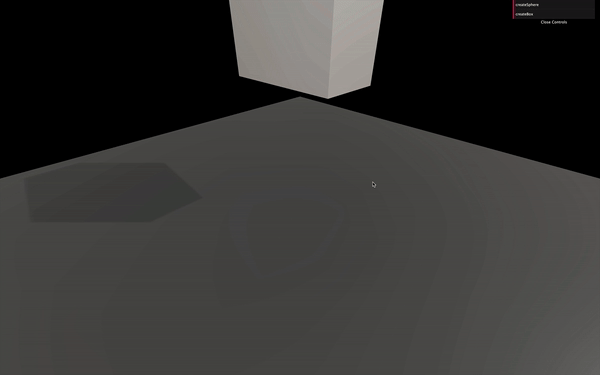

_https://threejs-journey.xyz/assets/lessons/20/step-15.mp4_

The boxes should fall adequately now. You can create spheres and boxes as you want. As always, try not to burn your computer.


_https://threejs-journey.xyz/assets/lessons/20/step-16.mp4_

## Performance

### Broadphase

When testing the collisions between objects, a naive approach is testing every [Body](http://schteppe.github.io/cannon.js/docs/classes/Body.html) against every other [Body](http://schteppe.github.io/cannon.js/docs/classes/Body.html). While this is easy to do, it's costly in terms of performance.

That is where broadphase comes up. The broadphase is doing a rough sorting of the [Bodies](http://schteppe.github.io/cannon.js/docs/classes/Body.html) before testing them. Imagine having two piles of boxes far from each other. Why would you test the boxes from one pile against the boxes in the other pile? They are too far to be colliding.

There are 3 broadphase algorithms available in Cannon.js:

- [NaiveBroadphase](http://schteppe.github.io/cannon.js/docs/classes/NaiveBroadphase.html): Tests every [Bodies](http://schteppe.github.io/cannon.js/docs/classes/Body.html) against every other [Bodies](http://schteppe.github.io/cannon.js/docs/classes/Body.html)
- [GridBroadphase](http://schteppe.github.io/cannon.js/docs/classes/GridBroadphase.html): Quadrilles the world and only tests [Bodies](http://schteppe.github.io/cannon.js/docs/classes/Body.html) against other [Bodies](http://schteppe.github.io/cannon.js/docs/classes/Body.html) in the same grid box or the neighbors' grid boxes.
- [SAPBroadphase](http://schteppe.github.io/cannon.js/docs/classes/SAPBroadphase.html) (Sweep and prune broadphase): Tests [Bodies](http://schteppe.github.io/cannon.js/docs/classes/Body.html) on arbitrary axes during multiples steps.

The default broadphase is [NaiveBroadphase](http://schteppe.github.io/cannon.js/docs/classes/NaiveBroadphase.html), and I recommend you to switch to [SAPBroadphase](http://schteppe.github.io/cannon.js/docs/classes/SAPBroadphase.html). Using this broadphase can eventually generate bugs where a collision doesn't occur, but it's rare, and it involves doing things like moving [Bodies](http://schteppe.github.io/cannon.js/docs/classes/Body.html) very fast.

To switch to [SAPBroadphase](http://schteppe.github.io/cannon.js/docs/classes/SAPBroadphase.html), simply instantiate it in the `world.broadphase` property and also use this same world as parameter:

```js
world.broadphase = new CANNON.SAPBroadphase(world)
```

### Sleep

Even if we use an improved broadphase algorithm, all the [Body](http://schteppe.github.io/cannon.js/docs/classes/Body.html) are tested, even those not moving anymore. We can use a feature called sleep.

When the [Body](http://schteppe.github.io/cannon.js/docs/classes/Body.html) speed gets incredibly slow (at a point where you can't see it moving), the [Body](http://schteppe.github.io/cannon.js/docs/classes/Body.html) can fall asleep and won't be tested unless a sufficient force is applied to it by code or if another [Body](http://schteppe.github.io/cannon.js/docs/classes/Body.html) hits it.

To activate this feature, simply set the `allowSleep` property to `true` on the [World](http://schteppe.github.io/cannon.js/docs/classes/World.html):

```js
world.allowSleep = true
```

You can also control how likely it is for the [Body](http://schteppe.github.io/cannon.js/docs/classes/Body.html) to fall asleep with the `sleepSpeedLimit` and `sleepTimeLimit` properties but we won't change those.

## Events

You can listen to events on the [Body](http://schteppe.github.io/cannon.js/docs/classes/Body.html). That can be useful if you want to do things like play a sound when objects collide or if you want to know if a projectile has touched an enemy.

You can listen to events on [Body](http://schteppe.github.io/cannon.js/docs/classes/Body.html) such as `'colide'`, `'sleep'` or `'wakeup'`.

Let's play a hit sound when our spheres and boxes collide with anything. First, create that sound in native JavaScript and create a function that should play the sound.

Some browsers like Chrome prevent sounds from playing unless the user has interacted with the page like clicking anywhere, so don't worry if you don't hear the first sounds.

```js
/**
 * Sounds
 */
const hitSound = new Audio('/sounds/hit.mp3')

const playHitSound = () =>
{
    hitSound.play()
}
```

A little far-fetched to just play a sound, but we will add more to that function later.

Now, let's listen to the `'collide'` event on our [Bodies](http://schteppe.github.io/cannon.js/docs/classes/Body.html). We will only focus on the `createBox` function and add it to the `createSphere` function once we are done.

Now, listen to the collide event and use the `playHitSound` function as the callback:

```js
const createBox = (width, height, depth, position) =>
{
    // ...

    body.addEventListener('collide', playHitSound)

    // ...
}
```

You should hear the hit sound when the cube touches the ground or when cubes collide. Don't forget to click on the page before the box hits the floor if you are using Chrome because Chrome refuse to play sounds if no user interaction occurred yet.

The sound seems pretty good. Unluckily, things get truly odd when we add multiples boxes.

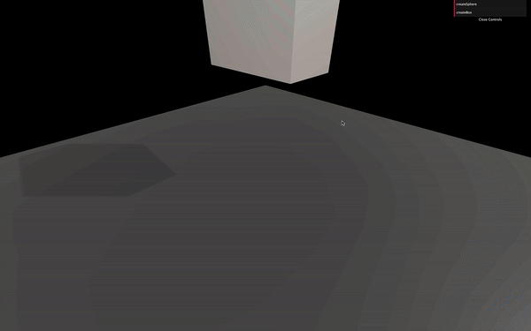

_https://threejs-journey.xyz/assets/lessons/20/step-18.mp4_

The first problem is that when we call `hitSound.play()` while the sound is playing, nothing happens because it is already playing. We can fix that by resetting the sound to `0` with the `currentTime` property:

```js
const playHitSound = () =>
{
    hitSound.currentTime = 0
    hitSound.play()
}
```

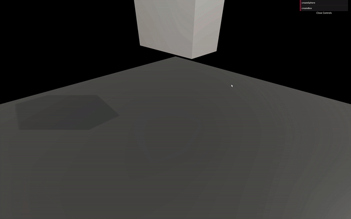

_https://threejs-journey.xyz/assets/lessons/20/step-19.mp4_

While this is better at the start, we hear too many hit sounds even when a cube slightly touches another. We need to know how strong the impact was and not play anything if it wasn't strong enough.

To get the impact strength, we first need to get information about the collision. We can do that by adding a parameter to the `'collide'` callback (which is our `playHitSound` function):

```js
const playHitSound = (collision) =>
{
    console.log(collision)

    // ...
}
```

The `collision` variable now contains a lot of information. The impact strength can be found by calling the `getImpactVelocityAlongNormal()` method on the `contact` property:

```js
const playHitSound = (collision) =>
{
    console.log(collision.contact.getImpactVelocityAlongNormal())

    // ...
}
```

If you look at the logs, you should see a number. The stronger the impact, the higher the number.

We test that value and only play the sound if the `impactStrength` is strong enough:

```js
const playHitSound = (collision) =>
{
    const impactStrength = collision.contact.getImpactVelocityAlongNormal()

    if(impactStrength > 1.5)
    {
        hitSound.currentTime = 0
        hitSound.play()
    }
}
```


_https://threejs-journey.xyz/assets/lessons/20/step-20.mp4_

For even more realism, we can add some randomness to the sound volume:

```js
const playHitSound = (collision) =>
{
    const impactStrength = collision.contact.getImpactVelocityAlongNormal()

    if(impactStrength > 1.5)
    {
        hitSound.volume = Math.random()
        hitSound.currentTime = 0
        hitSound.play()
    }
}
```

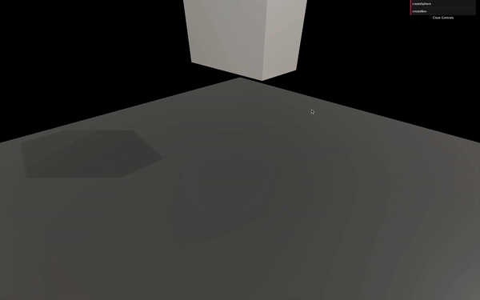

_https://threejs-journey.xyz/assets/lessons/20/step-21.mp4_

If we wanted to go even further, we could have multiple slightly different hit sounds. And to prevent having too many sounds playing simultaneously, we could add a very short delay where the sound cannot play again after being played once.

We won't do those in this lesson, but feel free to try stuff.

Let's copy the code we used in the `createBox` function to the `createSphere` function:

```js
const createSphere = (radius, position) =>
{
    // ...

    body.addEventListener('collide', playHitSound)

    // ...
}
```

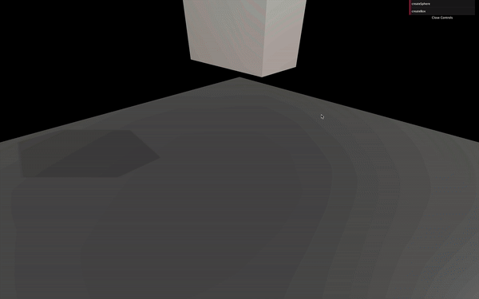

_https://threejs-journey.xyz/assets/lessons/20/step-22.mp4_

The sounds should be working for the spheres too.

## Remove things

Let's add a `reset` button.

Create a `reset` function and add it to your Dat.GUI as we did for `createBox` and `createSphere`:

```js
// Reset
debugObject.reset = () =>
{
    console.log('reset')
}
gui.add(debugObject, 'reset')
```

Now, let's loop on every object inside our `objectsToUpdate` array. Then remove both the `object.body` from the `world` and the `object.mesh` from the `scene`. Also, don't forget to remove the `eventListener` like you would have done in native JavaScript:

```js
debugObject.reset = () =>
{
    for(const object of objectsToUpdate)
    {
        // Remove body
        object.body.removeEventListener('collide', playHitSound)
        world.removeBody(object.body)

        // Remove mesh
        scene.remove(object.mesh)
    }
}
```

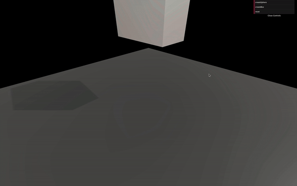

_https://threejs-journey.xyz/assets/lessons/20/step-23.mp4_

And that's it. You can click on the `reset` button to remove everything.

## Go further with Cannon.js

While we covered the basics and you can already do a lot of things, here are some areas of improvement.

### Constraints

Constraints, as the name suggests, enable constraints between two bodies. We won't cover those in this lesson, but here's the list of constraints:

- [HingeConstraint](http://schteppe.github.io/cannon.js/docs/classes/HingeConstraint.html): acts like a door hinge.
- [DistanceConstraint](http://schteppe.github.io/cannon.js/docs/classes/DistanceConstraint.html): forces the bodies to keep a distance between each other.
- [LockConstraint](http://schteppe.github.io/cannon.js/docs/classes/LockConstraint.html): merges the bodies like if they were one piece.
- [PointToPointConstraint](http://schteppe.github.io/cannon.js/docs/classes/PointToPointConstraint.html): glues the bodies to a specific point.

### Classes, methods, properties and events

There are many classes, and each one with different methods, properties, and events. Try to browse through all of them at least once just to know that they exist. It might save you some time in your future projects.

### Examples

The documentation isn't perfect. It would help if you spent some time in the [demos](https://schteppe.github.io/cannon.js/) and research to find out how to do things. Many people probably had the issues you might encounter. Don't hesitate to rely on the community.

### Workers

Running the physics simulation takes time. The component of your computer doing the work is the CPU. When you run Three.js, Cannon.js, your code logic, etc. everything is done by the same thread in your CPU. That thread can quickly overload if there is too much to do (like too many objects in the physics simulation), resulting in a frame rate drop.

The right solution is to use workers. Workers let you put a part of your code in a different thread to spread the load. You can then send and receive data from that code. It can result in a considerable performance improvement.

The problem is that the code has to be distinctly separated. You can find a good and simple example [here](https://schteppe.github.io/cannon.js/examples/worker.html) in the page source code.

### Cannon-es

As we said earlier, Cannon.js hasn't been updated for years. Fortunately, some guys forked the repository and started working on updates. Thanks to them, we have access to a better and maintained version of Cannon.js:

- Git repository: [https://github.com/pmndrs/cannon-es](https://github.com/pmndrs/cannon-es)
- NPM page: [https://www.npmjs.com/package/cannon-es](https://www.npmjs.com/package/cannon-es)

To use this version instead of the original, open the terminal in the project folder (or shut down the server), remove the previous cannon.js dependency with `npm uninstall --save cannon`, install the new version with `npm install --save cannon-es@0.15.1`, and change the way you import Cannon.js in the code:

```js
import * as CANNON from 'cannon-es'
```

Everything should be working just like before. You can check out the changes on the [Git repository page](https://github.com/react-spring/cannon-es).

## Ammo.js

We used Cannon.js because the library is easy to implement and understand. One of its biggest competitors is Ammo.js. While it's harder to use and to implement in your project, here are some features that might be of interest to you:

- It's a portage of Bullet, a well known and well-oiled physics engine written in C++.
- It has WebAssembly (wasm) support. WebAssembly is a low-level language supported by most recent browsers. Because it's a low level, it has better performance.
- It's more popular, and you can find more examples of Three.js.
- It supports more features.

If you need the best performance or have particular features in your project, you probably should go for Ammo.js instead of Cannon.js.

## Physijs

Physijs ease the implementation of physics in a Three.js project. It uses Ammo.js and supports workers natively.

- Website: [https://chandlerprall.github.io/Physijs/](https://chandlerprall.github.io/Physijs/)
- Git repository: [https://github.com/chandlerprall/Physijs](https://github.com/chandlerprall/Physijs)
- Documentation: [https://github.com/chandlerprall/Physijs/wiki](https://github.com/chandlerprall/Physijs/wiki)

Instead of creating the Three.js object and the physics object, you create both simultaneously:

```js
box = new Physijs.BoxMesh(
    new THREE.CubeGeometry(5, 5, 5),
    new THREE.MeshBasicMaterial({ color: 0x888888 })
)
scene.add(box)
```

Physijs will take care of the rest.

While it's fascinating, especially for beginners, things get complicated when you try to do something not supported by the library. Finding where a bug comes from can also be a hassle.

Like for Ammo.js, take your time and think about what is the best solution for your project.
