# Imported models

[](https://shields.io)

Learn in [https://threejs-journey.xyz/lessons/21](https://threejs-journey.xyz/lessons/21)

## Introduction

Three.js lets you create many primitive geometries, but when it comes to more complex shapes, we better use a dedicated 3D software.

In this lesson, we will use already made models, but we will learn how to create a model entirely within a 3D software in a future lesson.

## Formats

Through times, many 3D model formats have been used. Each one responded to a problem, such as what data is embedded in the model, the weight, its compression, compatibility, copyrights, etc.

That is why, today, we have access to hundreds of model formats: [https://en.wikipedia.org/wiki/List_of_file_formats#3D_graphics](https://en.wikipedia.org/wiki/List_of_file_formats#3D_graphics).

Some formats are dedicated to one software. Some are known to be very light but sometimes lack specific data. Some are known to have almost all data you could need in them but are heavy. Some formats are open source, some formats are not, some are binary, some are ASCII, and it goes on and on.

If you need precise data and can't find the adequate format supported by your software, you can even create your own quite easily.

Here's a list of popular formats you might come across:

- OBJ
- FBX
- STL
- PLY
- COLLADA
- 3DS
- GLTF

We won't cover all of these formats. It would be boring, and we don't need to because one format is becoming a standard and should cover most of your needs.

## GLTF

GLTF stands for GL Transmission Format. It's made by the Khronos Group (the guys behind OpenGL, WebGL, Vulkan, Collada and with many members like AMD / ATI, Nvidia, Apple, id Software, Google, Nintendo, etc.)

GLTF has become very popular these past few years.

It supports very different sets of data. You can obviously have data like the geometries and the materials but you can also have data like cameras, lights, scene graph, animations, skeletons, morphing and even multiple scene.

It also supports various file formats like json, binary, embed textures.

GLTF has become the standard when it comes to real-time. And because it's becoming a standard, most 3D softwares, game engines, and libraries support it. That means that you can easily have a similar result in different environments.

That doesn't mean that you have to use GLTF in all cases. If you merely need a geometry, you better use another format like OBJ, FBX, STL, or PLY. You should test different formats on every project to see if you have all the data you need, if the file isn't too heavy, how long it takes to uncompress the information if it's compressed, etc.

## Find a model

First, we need a model. As we said earlier, we will learn how to create our own model in a 3D software later, but for now, let's use a pre-made one.

The GLTF team also provides various models from a simple triangle to realistic models and things like animations, morphings, clearcoat materials, etc.

You can find them in this repository: [https://github.com/KhronosGroup/glTF-Sample-Models](https://github.com/KhronosGroup/glTF-Sample-Models)

If you want to test those models, you'll have to download or clone the whole repository and take the files you need. But we will start with a simple [duck](https://github.com/KhronosGroup/glTF-Sample-Models/tree/master/2.0/Duck) that you can already find in the `/static/models/` folder in the starter.

## GLTF formats

While GLTF is a format itself, it can have different file formats too. It's a little complex but for good reasons.

If you open the `/static/models/Duck/` folder, you'll see 4 different folders. Each one contains the duck but in different GLTF formats:

- glTF
- glTF-Binary
- glTF-Draco
- glTF-Embedded

You can even find other formats, but those 4 are the most important and cover what we need to learn.

Be careful; your OS might hide the extension of some of these files. Refer to the file names from your code editor that should show the extension.

### glTF

This format is kind of the default format. The `Duck.gltf` file is a JSON that you can open in your editor. It contains various information like cameras, lights, scenes, materials, objects transformations, but neither the geometries nor the textures. The `Duck0.bin` file is a binary that you can't read like this. It usually contains data like the geometries and all information associated with the vertices like UV coordinates, normals, vertex colors, etc. The `DuckCM.png` is simply the texture of the duck.

When we load this format, we only load the `Duck.gltf` that contains references to the other files that will then be loaded automatically.

### glTF-Binary

This format is composed of only one file. It contains all the data we talked about in the glTF default format. That is a binary file, and you can't just open it in your code editor to see what's inside.

This format can be a little lighter and more comfortable to load because there is only one file, but you won't be able to easily alter its data. For example, if you want to resize or compress the textures, you just can't because it's inside that binary file, merge with the rest.

### glTF-Draco

This format is like the **glTF default** format, but the buffer data (typically the geometry) is compressed using the [Draco algorithm](https://github.com/google/draco). If you compare the `.bin` file size, you'll see that it's much lighter.

While there is a separate folder for this format, you can apply the Draco compression to the other formats.

Let's put this one on the side, and we will talk more about it later.

### glTF-Embedded

This format is like the **glTF-Binary** format because it's only one file, but this file is actually a JSON that you can open in your editor.

The only benefit of this format is to have only one easily editable file.

### Choosing

Choosing the right format is a matter of how you want to handle the assets.

If you want to be able to alter the textures or the coordinates of the lights after exporting, you better go for the **glTF-default**. It also presents the advantage of loading the different files separately, resulting in a load speed improvement.

If you want only one file per model and don't care about modifying the assets, you better go for **glTF-Binary**.

In both cases, you must decide if you want to use the **Draco** compression or not, but we will cover this part later.

## Setup

The starter is composed of one empty plane.

Because GLTF is a standard, it clearly supports lights. Usually, when you import a GLTF into your Three.js project, you'll end up with [Meshes](https://threejs.org/docs/#api/en/objects/Mesh) that have [MeshStandardMaterial](https://threejs.org/docs/#api/en/materials/MeshStandardMaterial) and, as you probably remember, if you don't have lights in your scene, you won't see much of those materials.

There is already an [AmbientLight](https://threejs.org/docs/#api/en/lights/AmbientLight) and a [DirectionalLight](https://threejs.org/docs/#api/en/lights/DirectionalLight) in the starter.

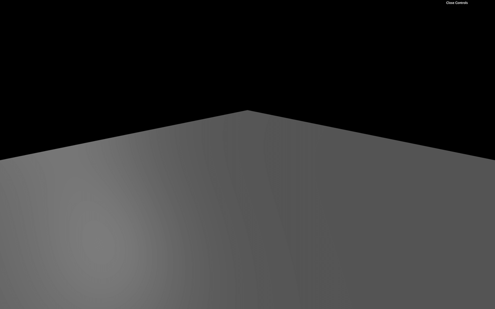

## Load the model in Three.js

To load GLTF files in Three.js, we must use the [GLTFLoader](https://threejs.org/docs/#examples/en/loaders/GLTFLoader). This class isn't available by default in the `THREE` variable. We need to import it from the `examples/` folder located in the `three` dependency:

```js
import { GLTFLoader } from 'three/examples/jsm/loaders/GLTFLoader.js'
```

then we can instantiate it like we did for the [TextureLoader](https://threejs.org/docs/index.html#api/en/loaders/TextureLoader):

```js
/**
 * Models
 */
const gltfLoader = new GLTFLoader()
```

And if we need it, we can also use a [LoadingManager](https://threejs.org/docs/#api/en/loaders/managers/LoadingManager) as we did in the **Textures** lesson.

To load models, great news, it's almost as easy as loading a texture. We call the `load(...)` method and use the right parameters:

- The path to the file
- The success callback function
- The progress callback function
- The error callback function

```js
gltfLoader.load(
    '/models/Duck/glTF/Duck.gltf',
    (gltf) =>
    {
        console.log('success')
        console.log(gltf)
    },
    (progress) =>
    {
        console.log('progress')
        console.log(progress)
    },
    (error) =>
    {
        console.log('error')
        console.log(error)
    }
)
```

You should see the progress and the success function being called. If the file couldn't be loaded, the error functions might be called. Check the path, and don't forget that we must not add the `/static` part.

Let's pretend we know what we are doing and remove the progress and error callback:

```js
gltfLoader.load(
    '/models/Duck/glTF/Duck.gltf',
    (gltf) =>
    {
        console.log(gltf)
    }
)
```

## Add the loaded model to our scene

If you look at the object logged in the console, you'll find a lot of elements. The most important part is the `scene` property because we have only one scene in the exported model.

This `scene` contains everything we need. But it also includes more. Always start by studying what is available in it and watch the `scale` property of the different [Groups](https://threejs.org/docs/#api/en/objects/Group), [Object3D](https://threejs.org/docs/#api/en/core/Object3D), and [Mesh](https://threejs.org/docs/#api/en/objects/Mesh).

We get something like this:

```js
THREE.Group: scene
└───Array: children
    └───THREE.Object3D
        └───Array: children
            ├───THREE.PerspectiveCamera
            └───THREE.Mesh
```

The Mesh should be our duck. We don't really care about the [PerspectiveCamera](https://threejs.org/docs/#api/en/cameras/PerspectiveCamera). Both the camera and the duck seem to be in the first and only [Object3D](https://threejs.org/docs/#api/en/core/Object3D) in the scene's children array. Even worst, that [Object3D](https://threejs.org/docs/#api/en/core/Object3D) has a `scale` set to a minimal value.

As you can see, it's a little complex even to get our duck, and it's where most beginners get lost.

All we want is to get our duck in the scene. We have multiples ways of doing it:

- Add the whole `scene` in our scene. We can do that because even if its name is `scene`, it's in fact a [Group](https://threejs.org/docs/#api/en/objects/Group).
- Add the children of the `scene` to our scene and ignore the unused [PerspectiveCamera](https://threejs.org/docs/#api/en/cameras/PerspectiveCamera).
- Filter the children before adding to the scene to remove the unwanted objects like the [PerspectiveCamera](https://threejs.org/docs/#api/en/cameras/PerspectiveCamera).
- Add only the [Mesh](https://threejs.org/docs/#api/en/objects/Mesh) but end up with a duck that could be wrongly scaled, positioned or rotated.
- Open the file in a 3D software and remove the [PerspectiveCamera](https://threejs.org/docs/#api/en/cameras/PerspectiveCamera) then export it again.

Because our model structure is simple, we will add the [Object3D](https://threejs.org/docs/#api/en/core/Object3D) to our scene, and ignore the unused [PerspectiveCamera](https://threejs.org/docs/#api/en/cameras/PerspectiveCamera) inside. In future lessons, we will add the whole scene as one object:

```js
gltfLoader.load(
    '/models/Duck/glTF/Duck.gltf',
    (gltf) =>
    {
        scene.add(gltf.scene.children[0])
    }
)
```


You should see the duck.

You can try with other formats, but not the Draco that won't work yet:

```js
gltfLoader.load(
    '/models/Duck/glTF/Duck.gltf', // Default glTF

// Or
gltfLoader.load(
    '/models/Duck/glTF-Binary/Duck.glb', // glTF-Binary

// Or
gltfLoader.load(
    '/models/Duck/glTF-Embedded/Duck.gltf', // glTF-Embedded
```

Another model named `FlightHelmet` (also taken from the [glTF model samples](https://github.com/KhronosGroup/glTF-Sample-Models/tree/master/2.0)) is available in the `/static/models/` folder. This model comes in only one format, which is the default glTF.

Try to load this model:

```js
gltfLoader.load(
    '/models/FlightHelmet/glTF/FlightHelmet.gltf',
    (gltf) =>
    {
        scene.add(gltf.scene.children[0])
    }
)
```

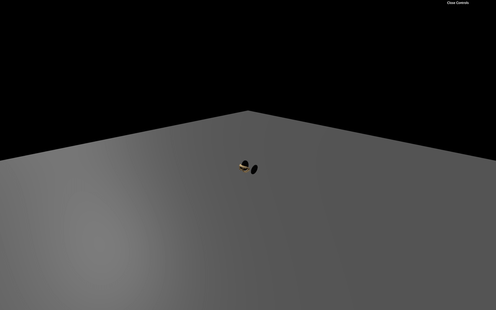

Instead of a beautiful helmet, we only get a few parts.

The problem is that we added only the first child of the loaded `scene` to our scene.

What we can try is to loop on the children and add them to the scene:

```js
for(const child of gltf.scene.children)
{
    scene.add(child)
}
```

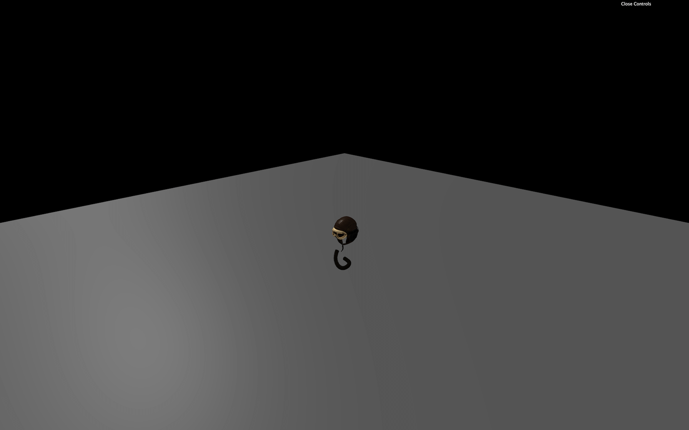

That will result in more elements, but not all of them. Even worst, when refreshing, you may get different parts.

The problem is that when we add a child from one scene to the other, it gets automatically removed from the first scene. That means that the first scene now has fewer children in it.

When we add the first object, it gets removed from the first scene, and the second element just moved to the first place. But your loop now takes the second element of the array. You'll always have elements left in the `children` array.

There are multiple solutions to this problem. The first solution is to take the first children of the loaded scene and add it to our scene until there is none left:

```js
while(gltf.scene.children.length)
{
    scene.add(gltf.scene.children[0])
}
```

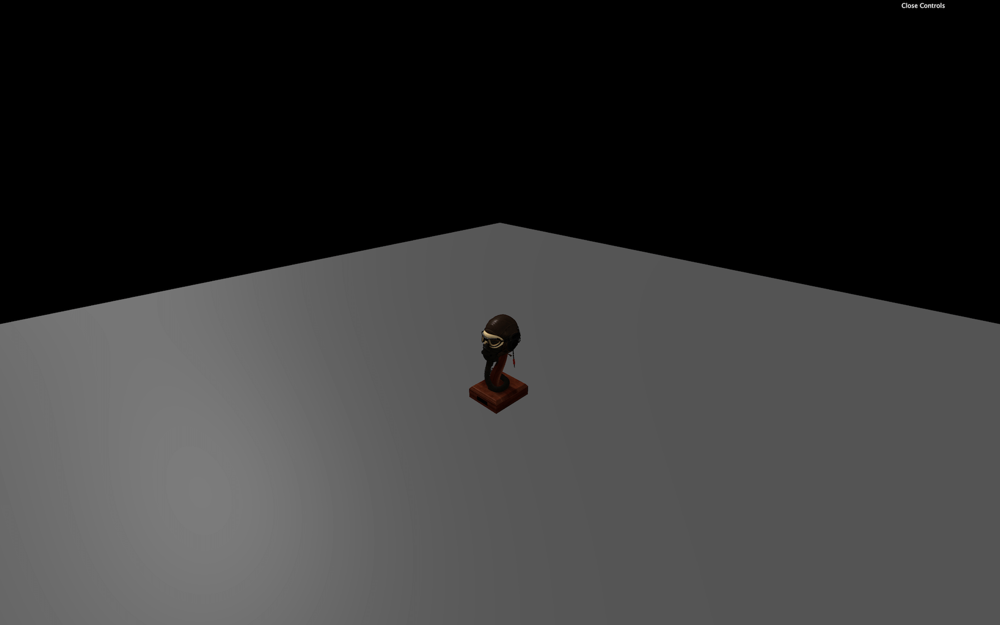

We now get the whole helmet.

Another solution would be to duplicate the `children` array in order to have an unaltered independent array. To do that, we can use the spread operator `...` and put the result in a brand new array `[]`:

```js
const children = [...gltf.scene.children]
for(const child of children)
{
    scene.add(child)
}
```

This is a native JavaScript technique to duplicate an array without touching the original one.

Finally, one good and simple solution we mentioned earlier is to add the `scene` property:

```js
scene.add(gltf.scene)
```

Our helmet is too small, and we could just increase the scale, but instead, we'll get back to our Duck and try the Draco compressed version.

## Draco compression

Let's get back to our duck but this time, we are going to use the Draco version:

```js
gltfLoader.load(
    '/models/Duck/glTF-Draco/Duck.gltf',
```


Sadly, we don't get any duck. If you look at the logs, you should see a warning looking like this `No DRACOLoader instance provided`. We need to provide a [DRACOLoader](https://threejs.org/docs/#examples/en/loaders/DRACOLoader) instance to our [GLTFLoader](https://threejs.org/docs/#examples/en/loaders/GLTFLoader) so it can load compressed files.

As we saw when browsing the files, the Draco version can be much lighter than the default version. Compression is applied to the buffer data (typically the geometry). It doesn't matter if you are using the **default glTF**, the **binary glTF** or the **embedded glTF**.

It's not even exclusive to glTF, and you can use it with other formats. But both glTF and Draco got popular simultaneously, so the implementation went faster with glTF exporters.

Google develops the algorithm under the open-source Apache License:

- Website: [https://google.github.io/draco/](https://google.github.io/draco/)
- Git repository: [https://github.com/google/draco](https://github.com/google/draco)

### Add the DRACOLoader

Three.js already supports Draco. We must start by importing the [DRACOLoader](https://threejs.org/docs/#examples/en/loaders/DRACOLoader):

```js
import { DRACOLoader } from 'three/examples/jsm/loaders/DRACOLoader.js'
```

Then we can instantiate the loader (before the `gltfLoader`):

```js
const dracoLoader = new DRACOLoader()
```

The decoder is available in native JavaScript but also Web Assembly (wasm), and it can run in a worker (another thread as we saw at the end of the Physics lesson). Those two features significantly improve performances, but they imply having a wholly separated code.

Three.js already provided this seperated code. To find it, we must browse into the Three.js dependency and copy the Draco decoder folder into our `/static/` folder.

This Draco folder is located in `/node_modules/three/examples/js/libs/`. Take the whole `/draco/` folder and copy it into your `/static/` folder. We can now provide the path to this folder to our `dracoLoader`:

```js
dracoLoader.setDecoderPath('/draco/')
```

Finally, we can provide the [DRACOLoader](https://threejs.org/docs/#examples/en/loaders/DRACOLoader) instance to the [GLTFLoader](https://threejs.org/docs/#examples/en/loaders/GLTFLoader) instance with the `setDRACOLoader(...)` method:

```js
gltfLoader.setDRACOLoader(dracoLoader)
```

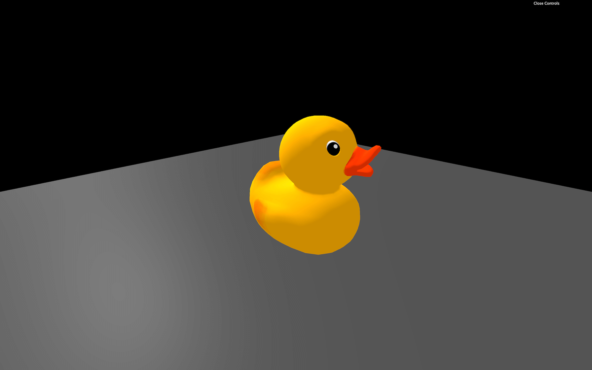

Your duck should be back but this time it's a Draco compressed version.

You can still load not compressed glTF file with the [GLTFLoader](https://threejs.org/docs/#examples/en/loaders/GLTFLoader) and the Draco decoder is only loaded when needed.

### When to use the Draco compression

While you might think that the Draco compression is a win-win situation, it is not. Yes, the geometries are lighter, but first, you have to load the [DRACOLoader](https://threejs.org/docs/#examples/en/loaders/DRACOLoader) class and the decoder. Secondly, it takes time and resources for your computer to decode a compressed file that can result in a short freeze at the start of the experience, even if we are using a worker and Web Assembly code.

You'll have to adapt and decide what the best solution is. If you only have one model with a 100kB geometry, you probably don't need Draco. But if you have many MB of models to load and don't care about some freezes at the start of the experience, you might need the Draco compression.

## Animations

As we said earlier, glTF also supports animations. And Three.js can handle those animations.

### Load an animated model

First, we need an animated model. We can use the fox located in `/static/models/Fox/` folder (also taken from the [glTF model samples](https://github.com/KhronosGroup/glTF-Sample-Models/tree/master/2.0/Fox)).

Change the path to load that fox:

```js
gltfLoader.load(
    '/models/Fox/glTF/Fox.gltf',
```

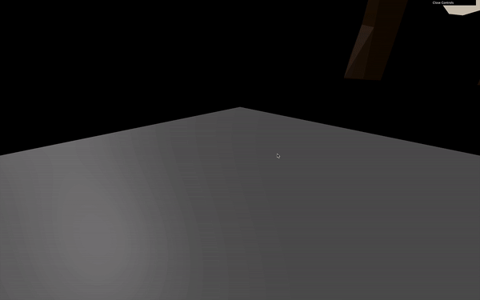

_https://threejs-journey.xyz/assets/lessons/21/step-08.mp4_

We have a problem; the fox is way too big. If you can't see it, look above or zoom out.

Before handling the animation, let's fix the scale. If you look at the composition of the imported scene, the fox is composed of one [Object3D](https://threejs.org/docs/#api/en/core/Object3D), itself made of a [Bone](https://threejs.org/docs/#api/en/objects/Bone) and a [SkinnedMesh](https://threejs.org/docs/#api/en/objects/SkinnedMesh). We won't explain what those are, but the idea is that we shouldn't simply scale the [Object3D](https://threejs.org/docs/#api/en/core/Object3D). Even if it would work in this case, it would probably not work with more complex models.

What we can do here, is scale the loaded scene and add it directly to our scene:

```js
gltfLoader.load(
    '/models/Fox/glTF/Fox.gltf',
    (gltf) =>
    {
        gltf.scene.scale.set(0.025, 0.025, 0.025)
        scene.add(gltf.scene)
    }
)
```

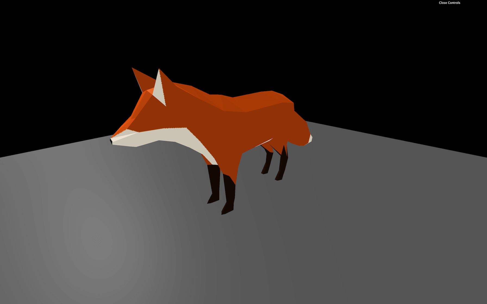

### Handle the animation

If you look at the loaded `gltf` object, you can see a property named `animations` containing multiple [AnimationClip](https://threejs.org/docs/#api/en/animation/AnimationClip).

These [AnimationClip](https://threejs.org/docs/#api/en/animation/AnimationClip) cannot be used easily. We first need to create an [AnimationMixer](https://threejs.org/docs/#api/en/animation/AnimationMixer). An [AnimationMixer](https://threejs.org/docs/#api/en/animation/AnimationMixer) is like a player associated with an object that can contain one or many [AnimationClips](https://threejs.org/docs/#api/en/animation/AnimationClip). The idea is to create one for each object that needs to be animated.

Inside the success function, create a mixer and send the `gltf.scene` as parameter:

```js
const mixer = new THREE.AnimationMixer(gltf.scene)
```

We can now add the [AnimationClips](https://threejs.org/docs/#api/en/animation/AnimationClip) to the mixer with the `clipAction(...)` method. Let's start with the first animation:

```js
const action = mixer.clipAction(gltf.animations[0])
```

This method returns a [AnimationAction](https://threejs.org/docs/#api/en/animation/AnimationAction), and we can finally call the `play()` method on it:

```js
action.play()
```

Regrettably, still no animation.

To play the animation, we must tell the mixer to update itself at each frame. The problem is that our `mixer` variable has been declared in the load callback function, and we don't have access to it in the `tick` function. To fix that, we can declare the `mixer` variable with a `null` value outside of the load callback function and update it when the model is loaded:

```js
let mixer = null

gltfLoader.load(
    '/models/Fox/glTF/Fox.gltf',
    (gltf) =>
    {
        gltf.scene.scale.set(0.03, 0.03, 0.03)
        scene.add(gltf.scene)

        mixer = new THREE.AnimationMixer(gltf.scene)
        const action = mixer.clipAction(gltf.animations[0])
        action.play()
    }
)
```

And finally, we can update the mixer in the `tick` function with the already calculated `deltaTime`.

But before updating it, we must test if the `mixer` variable is different from `null`. This way, we update the mixer if the model is loaded, meaning that the animation is not ready:

```js
const tick = () =>
{
    // ...

    if(mixer)
    {
        mixer.update(deltaTime)
    }

    // ...
}
```

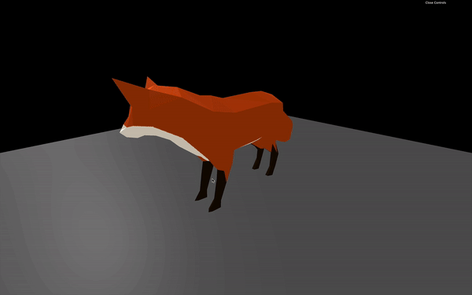

_https://threejs-journey.xyz/assets/lessons/21/step-10.mp4_

The animation should be running. You can test the other animations by changing the value in the `clipAction(...)` method.

```js
const action = mixer.clipAction(gltf.animations[2])
```

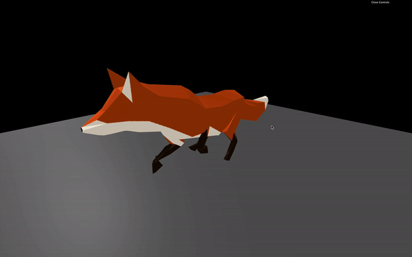

_https://threejs-journey.xyz/assets/lessons/21/step-11.mp4_

## Three.js editor

Three.js posses its own online editor. You can find it here: [https://threejs.org/editor/](https://threejs.org/editor/)

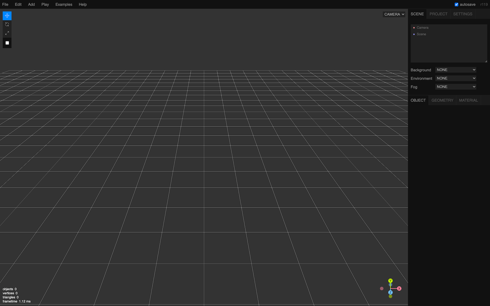

It's like a 3D software but online and with fewer features. You can create primitives, lights, materials, etc.

And because you can import models, it's a good way to test if your model is working fine. Though be careful; you can only test models composed of one file. You can try with the glTF-Binary or the glTF-Embedded duck.

Drag and drop the model into the editor.

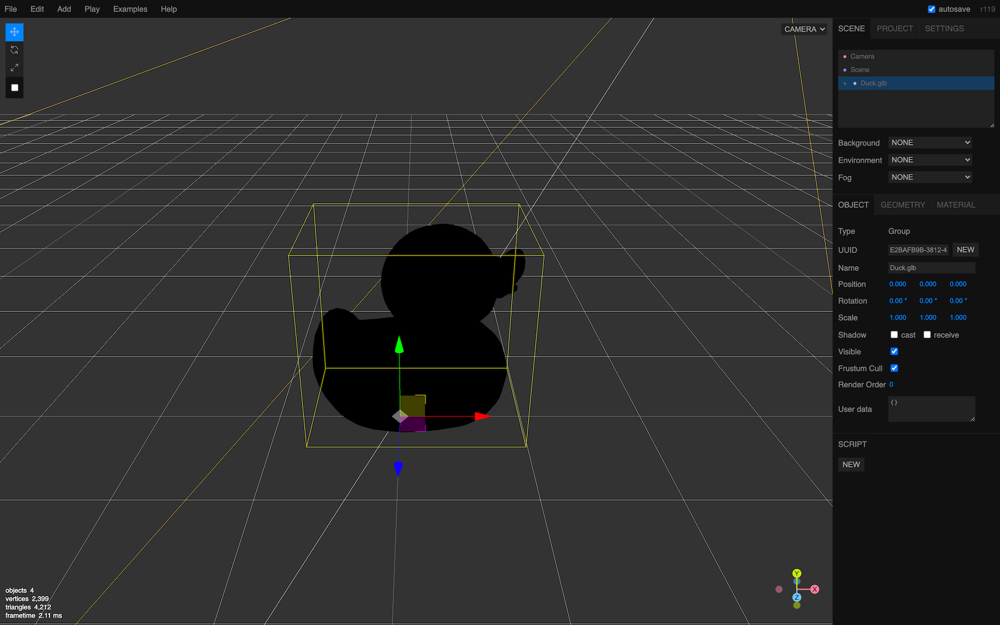

You should see a black duck because there is no light. Add an `AmbientLight` and a `DirectionalLight` from the `Add` menu to see it more clearly.

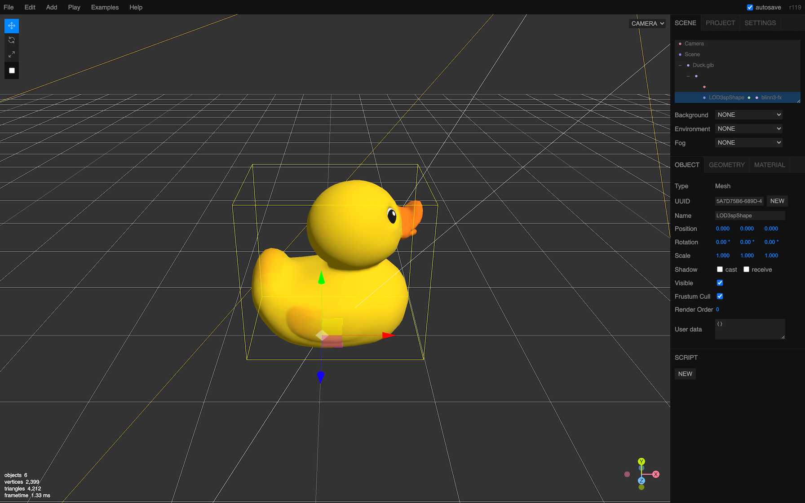

Finally, you can export your scene in various formats that you can re-use in your code but we are getting out of the scope.

That's it for the moment but we're going to use loaded models multiple time in the following lessons.
