# Custom model with Blender

[](https://shields.io)

Learn in [https://threejs-journey.xyz/lessons/22](https://threejs-journey.xyz/lessons/22)

## Introduction

Now that we know how to import a model into our scene; let's learn how to create our own model using a 3D software.

## Choosing a software

There are many software like Cinema 4D, Maya, 3DS Max, Blender, ZBrush, Marmoset Toolbag, Substance Painter, etc. These are great, and they differ on divers criteria like the UX, the performance, the features, the compatibility, the price, etc.

In this lesson, we are going to use Blender because it's free, the performances are remarkable, it works with all primary OS, it has many features, it has a vast community, and it became a lot easier since the 2.8 version.

Be aware that you won't be a Blender expert at the end of the lesson. It would take a full course to learn all its aspects, and they are already many great resources to learn. The idea is to understand the basics and de-mystify the software to have sufficient baggage to create simple models.

At the start, we will discover all the basics. That will be a lot to take in but don't worry; we will repeat most of the shortcuts, the mechanics, and the features multiple times.

If you pressed a wrong shortcut at some point, you lost your scene, or the interface is completely messed up, just close and re-open Blender.

## Downloading Blender

Go to the blender website download page and download the latest version: [https://www.blender.org/download/](https://www.blender.org/download/)

The software is pretty light, and it shouldn't take more than a few minutes.

Once downloaded, simply install it.

The lesson has been written and recorded with Blender `2.83.5`. While there shouldn't be major differences, keep an eye on potential changes.

## Interface

### Splash screen

The splash screen gives you access to some useful links, templates, and recently opened files.

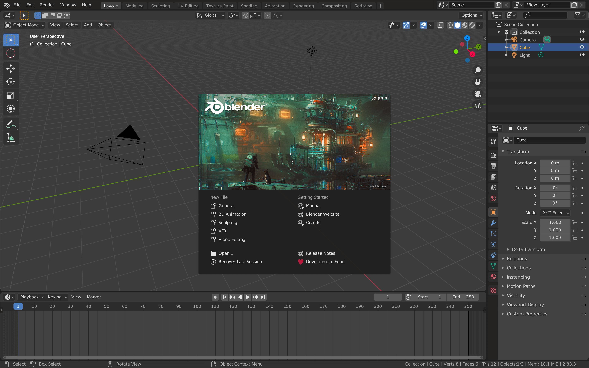

The image changes with the Blender version, so don't be surprised if you have a different one.

You can also see the exact version on the top right of it.

Click anywhere out of the splash screen to close it.

### Areas

The different parts of the interface are called areas. Areas are very flexible, and you can create the layout that you want.

#### Default areas

By default, you have the main area called the `3D Viewport`:

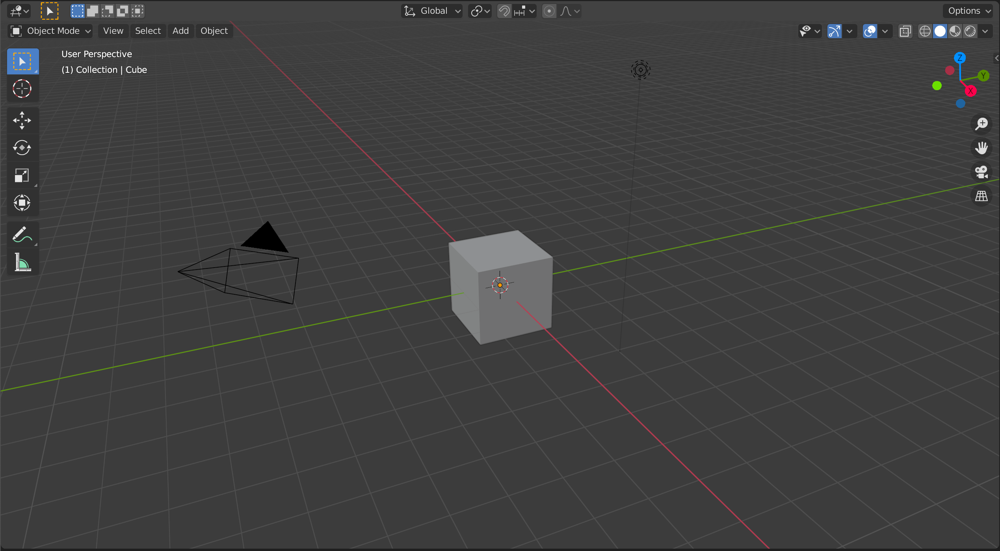

The `Timeline` to create animations:

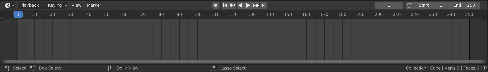

The `Outliner` to see and manage the scene graph (or scene tree):

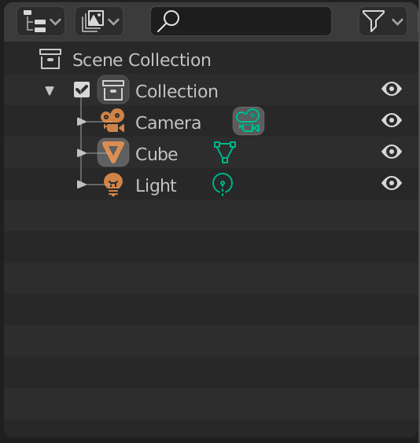

The `Properties` to manage the properties of the active object (selection) and the environment:

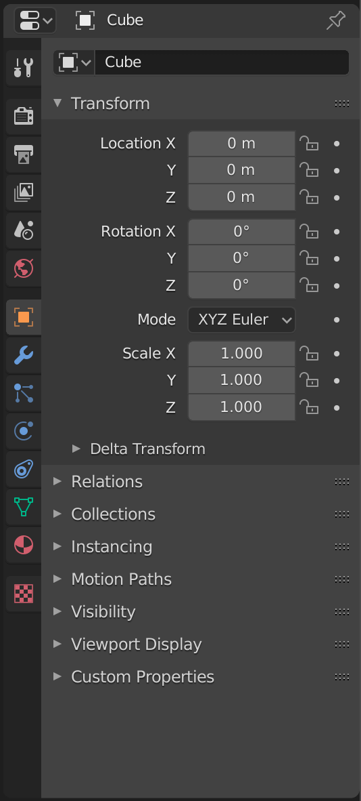

#### Change an area

To change what an area is displaying, click on the top-left button of that area. Here, we are going to change the **Timeline** area.

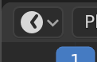

We are going to change the `Timeline` area for another `3D Viewport`:

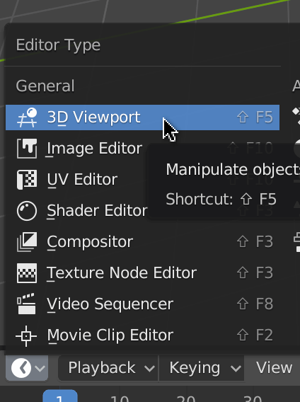

#### Resize an area

To resize an area, position your cursor between two areas and drag &amp; drop:

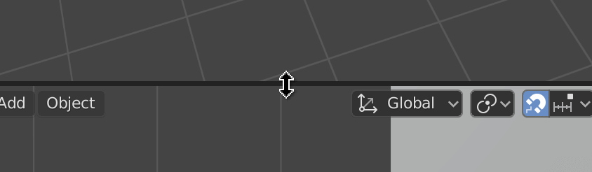

#### Create new areas

To create a new area, first, we must decide what area we want to split. Then, we must position our cursor in one of the four corners of our area (a few pixels inside the area):

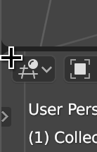

Finally, we drag and drop in the area we want to split:

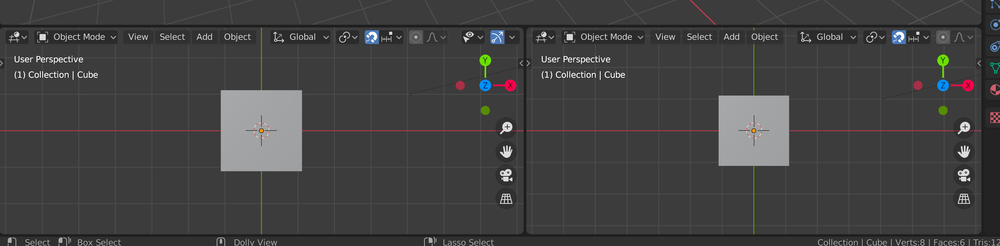

#### Remove an area

Removing an area is a little tricky, and you might end up with dozens of unwanted areas. Don't worry, once you get the idea, it will be fine.

In a way, we don't remove an area; we un-split two areas. First, you must decide which one of the two areas is going to take over the other. If you want to remove the right area, start from the left area. Then place your cursor in one of the two corners adjacent to the area we want to remove (few pixels inside the area that is supposed to take over the other):

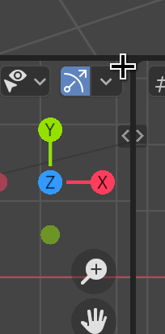

And then drag &amp; drop (just like we did to create an area) but this time in the opposite direction (toward the area we want to remove):

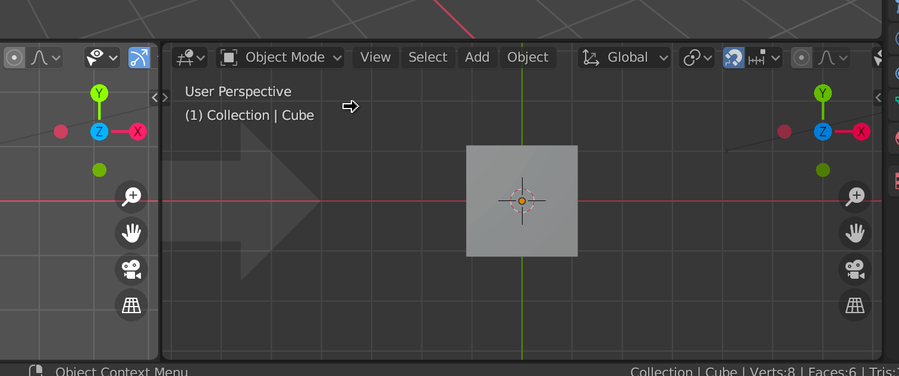

It can take a few tries but you'll get it.

## Shortcuts

One of the strengths of Blender is its shortcuts. There are tons of them, and once you master the basics, you can be very efficient. Don't worry; you can use all the shortcut actions through the interface or with the search panel that we will see later. Throughout this lesson, we will discover some of the more critical shortcuts.

Here's a non-exhaustive list of shortcuts: [https://docs.google.com/document/d/1wZzJrEgNye2ZQqwe8oBh54AXwF5cYIe56EGFe2bb0QU/edit?usp=sharing](https://docs.google.com/document/d/1wZzJrEgNye2ZQqwe8oBh54AXwF5cYIe56EGFe2bb0QU/edit?usp=sharing)

One important thing to understand is that shortcuts are hovered area sensitive. That means that the same shortcut can have different actions depending on what's behind our cursor. Most of the shortcuts we will see in this lesson concern the `3D Viewport`. You should always make sure to keep your cursor above one of these areas when pressing the shortcut keys.

The shortcuts are also mode sensitive, but we will talk about modes later.

Only one or two shortcuts that we will see are different between Mac and Windows. If there is a difference, both versions will be cited. If the shortcut includes the `CTRL` key and you are using a Mac, do not assume it's `CMD`. Use the `CTRL` key instead.

## View

As you can see, you can move the view in every possible direction. While you can use a trackpad, I recommend using a mouse with a wheel that you can press (or a third button) for productive reasons. From now, we will refer to the wheel button (the one that we can press) as `MIDDLE MOUSE`.

If you are using a trackpad, you can use two fingers.

If you are using a Magic Mouse, you can replicate the `MIDDLE MOUSE`. Go to the preferences through `Edit > Preferences`. Using the navigation menu on left, choose the `Input` section. Check the `Emulate 3 Button Mouse` checkbox.

It's also better to have a numeric pad.

### Orbit rotate

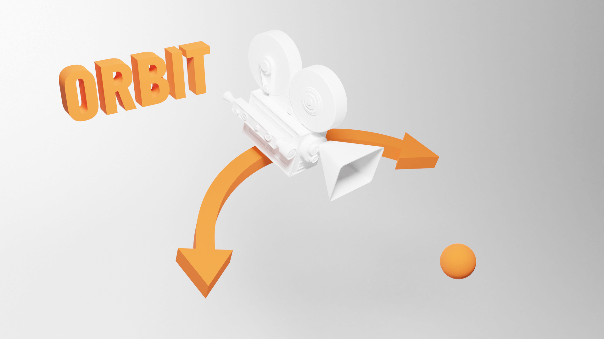

We can rotate the view by pressing the `MIDDLE MOUSE` and drag &amp; drop in the `3D Viewport`.

Or we can use the gizmo on the top-right part of each `3D Viewport`:


We call this rotation orbit (like the Three.js [OrbitControl](https://threejs.org/docs/#examples/en/controls/OrbitControls)) because the view rotates around an invisible center called view-point. We will talk about that point later.

### Truck and pedestal

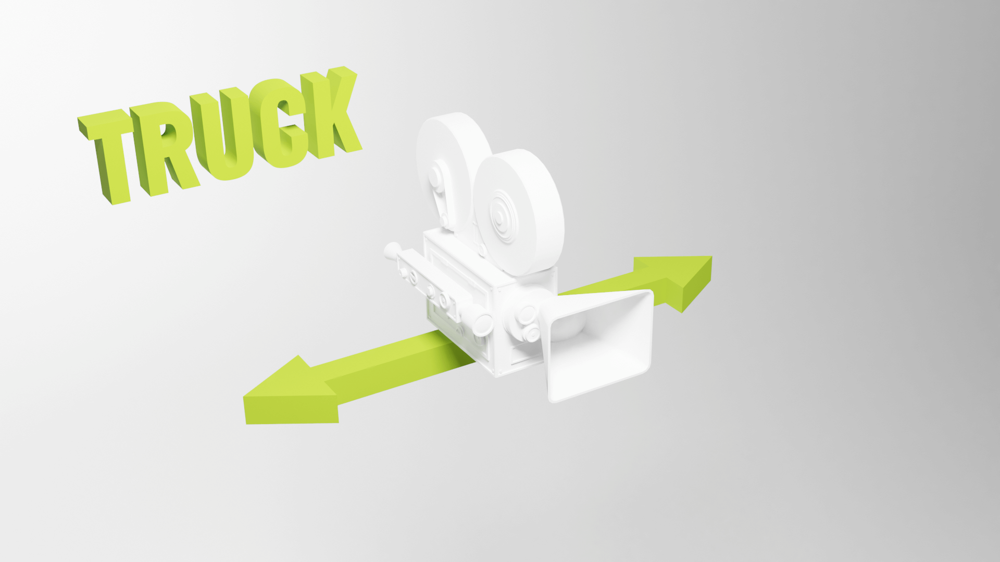

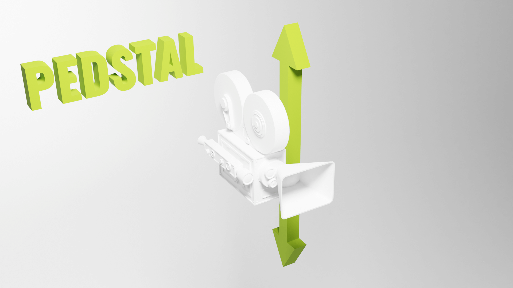

Truck is when the view moves on the left and right, while pedestal is when the view moves up and down. We can do both simultaneously by pressing the `MIDDLE MOUSE` again, but this time with the `SHIFT` key pressed.

Or we can use the hand icon on the top right:


Truck is also called track.

Some might also wrongly call those movements "pan".

### Dolly

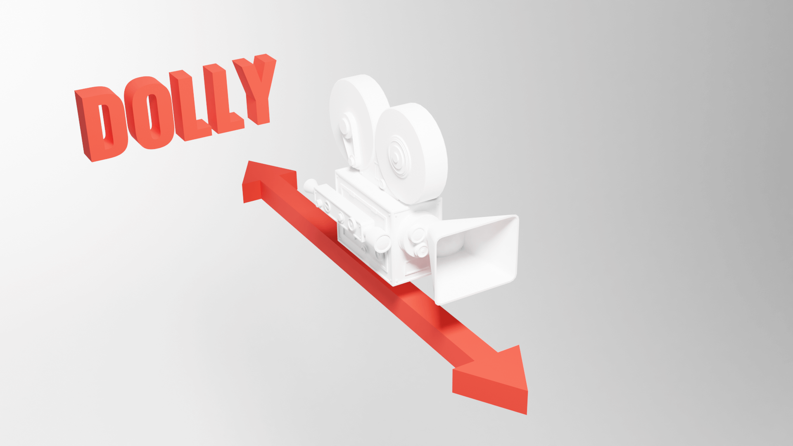

Dolly is when the view moves forward and backward. We can use the `WHEEL` to achieve that.

Or we can use the magnifier icon on the top right:

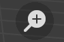

Be careful though; zooming isn't exactly like going forward and backward. We are getting closer or further from the view-point we talked about in the **Orbit** section, but we cannot zoom beyond that point, and zooming too much will result in a stuck view.

To resolve this zoom limit issue, we can move forward and backward by pressing `SHIFT + CTRL + MIDDLE MOUSE` and drag &amp; drop in the `3D Viewport` (won't work with the two fingers technique with a trackpad). This way, we won't get stuck at the view-point.

There is no icon in the interface to do that.

### Tilt and pan

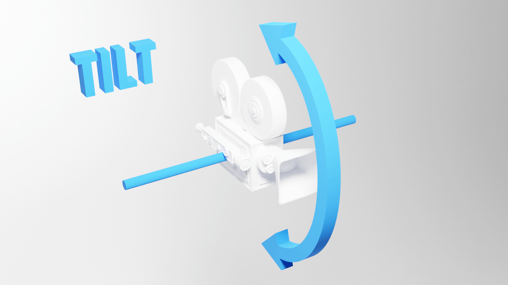

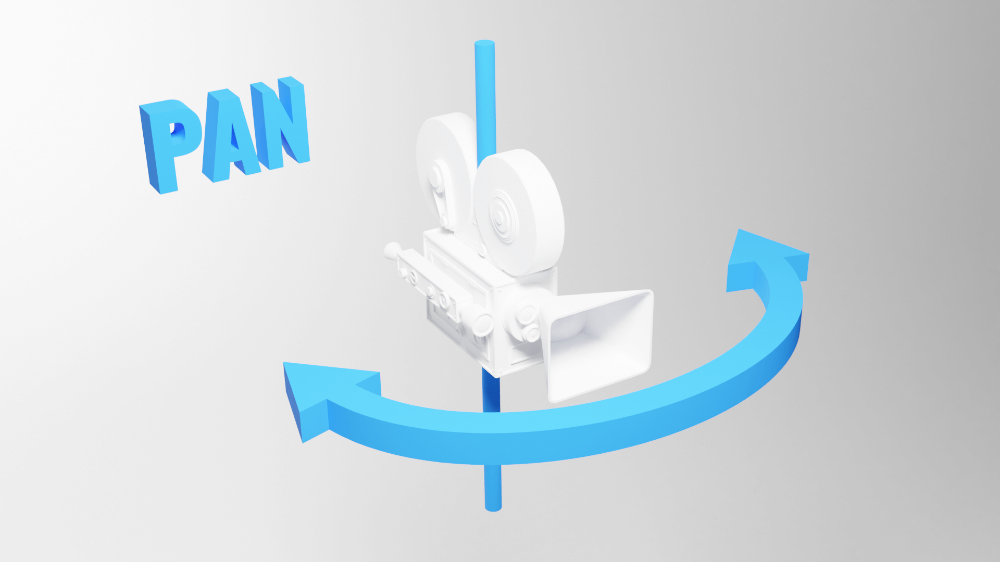

Tilt and pan are simple rotation on the camera point.

We have to go to the **Walk mode** —also called Fly mode— to use those moves.

To do that, if you are using a **QWERTY** keyboard, press `SHIFT + BACK QUOTE`. The back quote —also called backtick, acute or left quote— is an inclined simple quote that can be used to add a grave accent.

Finding that character might be a little hard because its position changes a lot depending on your keyboard. You can find it on the top right corner, on the bottom left corner or very close to the `ENTER` key.

If you are using an **AZERTY** keyboard, the shortcut won't work. We need to change the keymap. Go to the preferences through `Edit > Preferences`. Using the navigation menu on left, choose the `Keymap` section. In the search input, write `view navigation` and change the shortcut for `View Navigation (Walk/Fly)` to `SHIFT + F`.

That's it, you can use the walk mode with `SHIFT + F`.

You can also go forward, backward, and on the sides, in the walk mode with the `ARROWS` or `WASD` if using a `QWERTY`.

### Perspective / Orthographic

The default view uses perspective. We can toggle with the orthographic version with `NUMPAD 5` or the grid icon on the top right:

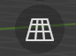

### Axes

We can align the camera on the `X`, `Y` and `Z` axes by pressing the `NUMPAD 1`, `NUMPAD 3`, and `NUMPAD 7`. We are talking about the numeric pad numbers, not the numbers at the top of the keyboard.

To position the camera at the opposite, press the same keys but with `CTRL`.

Or we can use the gizmo and click on the axes:


In Blender, we consider the top axes as the `Z`, unlike in Three.js, where it's `Y`.

### Camera

You might have seen the camera in the `3D Viewport`. To get the camera viewpoint, press `NUMPAD 0`:

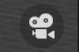

The camera will be used when doing renders. You can't render the scene without a camera.

### Reset

Sometimes, we get lost, and we don't even know where our scene is. We can focus back on our scene by pressing `SHIFT + C`.

### Focus

To focus the camera on an object, select the object with `LEFT MOUSE`, then press `NUMPAD ,` (we are talking about the comma on the numeric pad and it might be a dot depending on the keyboard you are using).

We can also focus on an object and hide everything else with `NUMPAD /`. Use the same shortcut to leave the focus mode.

## Selecting

As we just saw, we can select objects with the `LEFT MOUSE`. We can also select multiple objects with `SHIFT + LEFT MOUSE`.

You might have noticed that one of the objects always has a brighter outline. This object isn't just selected; it's also the **active** one. We will see more about that later.

To undo a selection, press `CMD + Z` (`CTRL + Z` on Windows). Yes, selecting objects is considered as an action we can undo. While this might seem strange, it's really helpful when you miss-click.

To unselect an object, use `SHIFT + LEFT MOUSE` again. If it's not the active one, it'll become active, and if it's active, it'll be unselected.

To select everything, press `A`.

To unselect everything, double press `A`.

To select a rectangle area, press `B`.

To select like if you were painting, press `C`. While in this mode, use `WHEEL` to change the radius.

## Creating objects

To create objects, with the cursor above a `3D Viewport`, press `SHIFT + A`. A menu should open behind your cursor. Navigate through this menu to create various objects. Most of what we will see in the lessons are in the `Mesh` sub-menu:


When you create an object, a small button should appear in the bottom left corner:

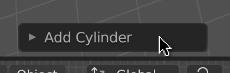

Click on it to change various properties like the size, the subdivision, and many other properties related to the object you're trying to make:

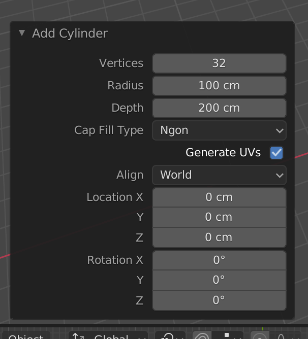

If you click anywhere else, you'll lose that menu. You can re-open it with `F9` but if you start doing modifications on the geometry, you won't be able to re-open this menu.

## Deleting objects

To delete an object, select it and, with the cursor above a `3D Viewport`, press `X`. A confirmation menu should open behind the cursor. Click on it to delete the object:

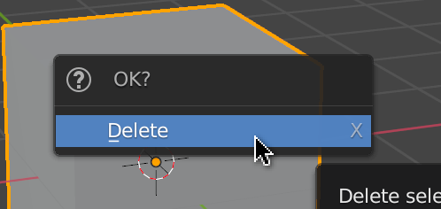

## Hiding objects

To hide selected objects, press `H`.

To show hidden objects, press `ALT + H`.

To hide non-selected objects, press `SHIFT + H`.

You can also manage this in the `Outliner` with the eye icon.

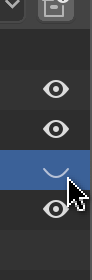

## Transforming objects

There are 3 types of transformations —as in Three.js. We can change the position, the rotation, and the scale.

We can use the menu on the left to activate each separately or activate them even all together with the fourth button:

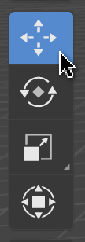

Or we can use shortcuts:

- `G` for the position
- `R` for the rotation
- `S` for the scale

After activating one of these shortcuts, you can force the transformation to operate in a specific axis by pressing the corresponding key (`X`, `Y`, and `Z`).

## Modes

We are currently in `Object Mode`, where we can create, delete, and transform objects. There are many other modes.

### Change mode

We can change the mode with the menu on the top-left select button of any `3D Viewport` area:

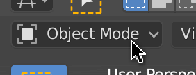

Or we can press `CTRL + TAB` to open a wheel menu (aka, the coolest kind of menu):

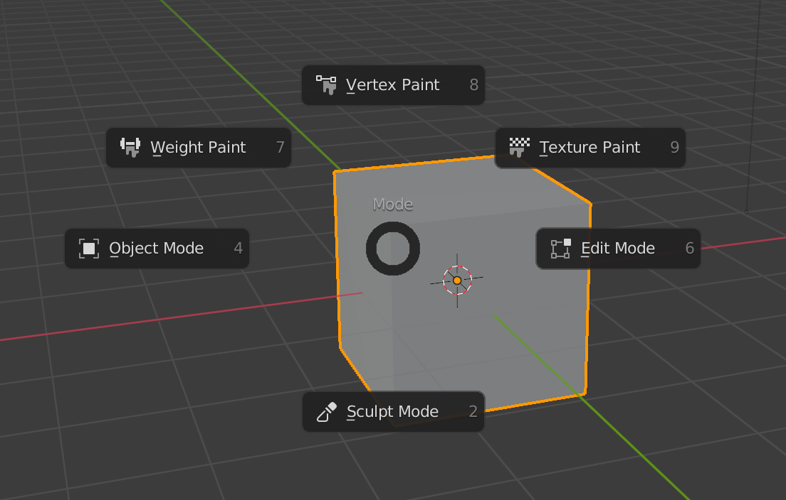

We won't cover all the modes, but we are going to use the `Edit Mode`. Select a mesh (or create one) and switch to the `Edit Mode`.

### Edit Mode

There is actually a shortcut to toggle the `Edit Mode`. Simply press `TAB`.

The `Edit Mode` is very similar to the `Object Mode` but we can edit the vertices, the edges and the faces. By default, we can change the vertex. Try to select vertices, transform them with the usual shortcuts —`G` for position, `R` for rotation, `S` for scale.

To switch to edges and faces, we can use the buttons on the top-right part of the `3D Viewport`:

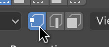

Or we can press the first three numbers on top of the keyboard `1`, `2`, and `3`.

Once you finish editing the object, leave the `Edit Mode` with `TAB`.

## Shading

Shading is how you see objects in the `3D Viewport`.

We are currently in `Solid` shading. This shading lets you see the objects with a default material and no light support. It's performant and convenient.

We can change the shading with the buttons on the top-right corner of the `3D Viewport`:

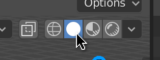

Or we can press `Z` to open a wheel menu:

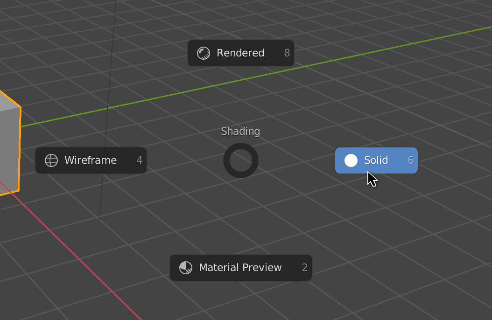

- `Solid`: The default with the same material for every objects.
- `Material`: Like the `Solid` shading, but with a preview of the materials and their textures.
- `Wireframe`: All the geometries are in wireframe.
- `Renderer`: Low quality render —it's the most realistic but the least performant.

If you can't see much in the `Render`, it might be because you don't have enough lights in your scene. Just add one or two by pressing `SHIFT + A` to open the `Add` menu.

## Properties

Unless you changed the layout, the bottom right area, named `Properties`, lets you play with render properties, environment properties and the active object's properties. Remember that the active object is the one with the brightest outline.

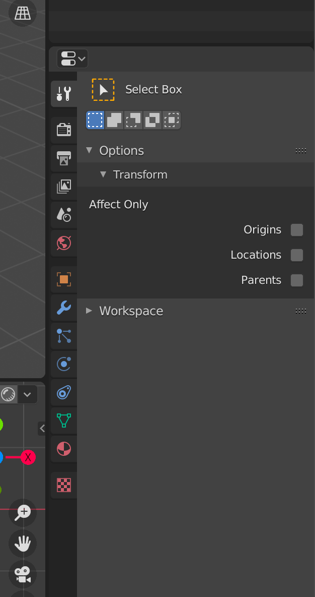

We won't cover all these tabs but the top ones deal with the renders and the environment:

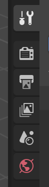

The ones below relate to the active object, and they can differ depending on the type of active object because we don't have the same properties for a cube as for a light:

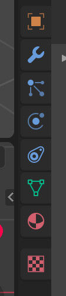

### Object Properties

The `Object Properties` let you change with accuracy properties such as transformations:

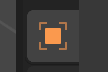

### Modifier Properties

The `Modifiers Properties` let you add what we call modifiers. These are non-destructive modifications. You can subdivide, bend, grow, shrink, etc. and turn them off as you please:

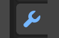

### Material Properties

The `Material Properties` let you play with materials:

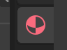

By default, you have access to one material named `Material`, and it should be applied to the default cube if you didn't delete it:

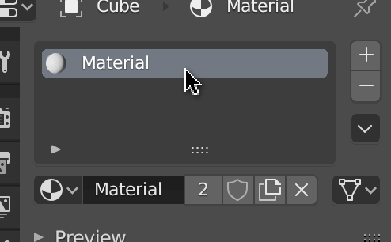

You can remove the material with the `-` button and combine them with the `+` button, but we usually use only one material per mesh:

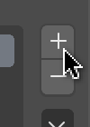

If there is no material on the mesh, we can choose an existing one, or we can create a new one with the `New` button:

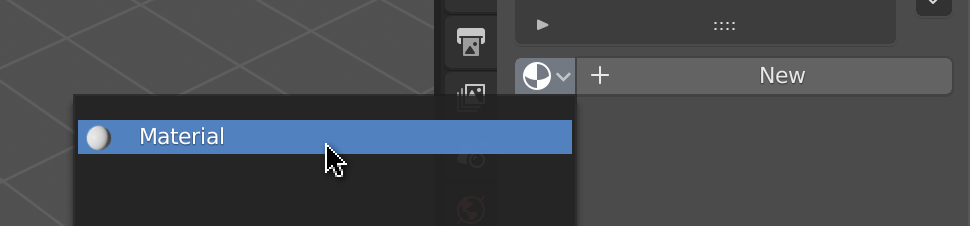

We can have different types of surfaces for one material. The default one is called `Principled BSDF` and this type of surface uses the PBR principles as the [MeshStandardMaterial](https://threejs.org/docs/index.html#api/en/materials/MeshStandardMaterial) does in Three.js. This means that we should get a very similar result if we export this kind of material to a Three.js scene.

We won't see other types of materials in this lesson.

## Render engines

Go to the `Render Properties` tab:

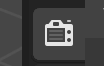

In this panel, we can change the `Render Engine`:

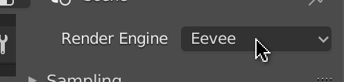

There are 3 types of render engine:

- `Eevee`: A real-time render engine. It uses the GPU just like Three.js, it's very performant, but it has limitations like realism, light bounce, reflection, and refraction.
- `Workbench`: A legacy render engine that we don't use a lot anymore. Its performance is pretty good, but the result isn't very realistic.
- `Cycles`: A raytracing engine. It's very realistic. It handles light bounce, deep reflection, deep refraction, and many other features, but it's very sluggish, and you might end up waiting hours or even days to render your scene.

You can change this property and see if anything changes in the scene. Make sure to use the `Renderer` shading —press `Z` to change the shading. Blender developers did an excellent job of keeping a very similar result between render engines.

The default one is `Eevee` and it's perfect in our case because it's real-time rendering, and Three.js is also real-time rendering.

If you want to render the scene, press `F12`. The render will be seen from the camera —make sure to have a camera well oriented in your scene.


## Search

There are so many possible actions that we cannot remember how to trigger them all. The right solution when we can't figure out where the button is, or the shortcut is to use the `Search` panel.

To open the `Search` panel, press `F3` (you might need to add the `fn` key depending on your keyboard and OS) and write the action name:

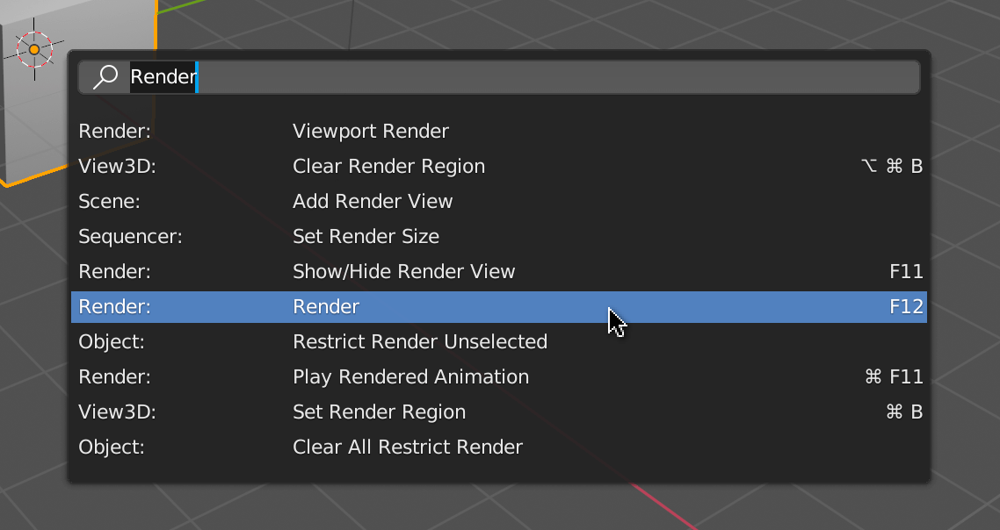

## Save our setup

Create a solid setup. It's up to you, but because we are using Blender to export for Three.js, we don't need a camera. We can also create two side views below the main `3D Viewport` on the `Z` and `Y` axis with `Wireframe` shading:

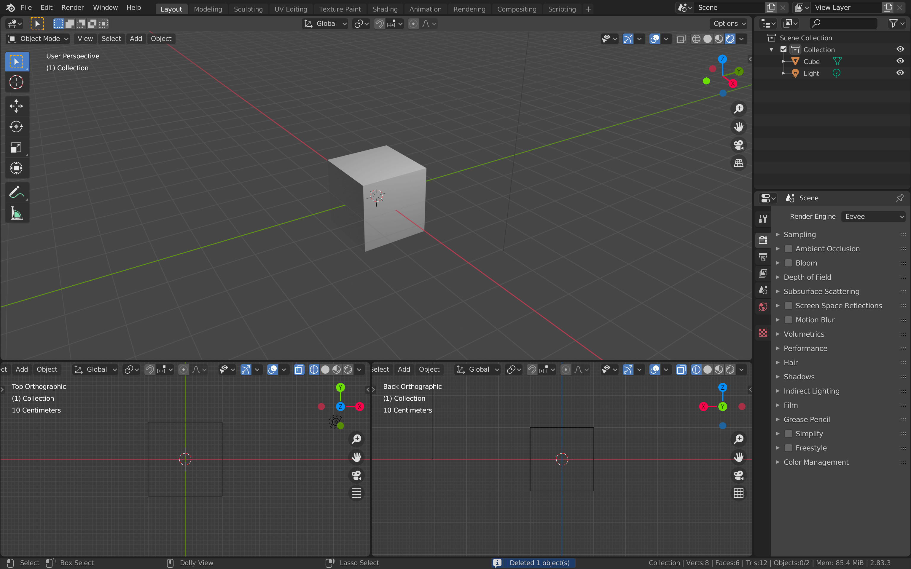

Once you're happy with your setup, go to `File > Defaults > Save Startup File`. That will set your current setup as the default one when opening Blender:

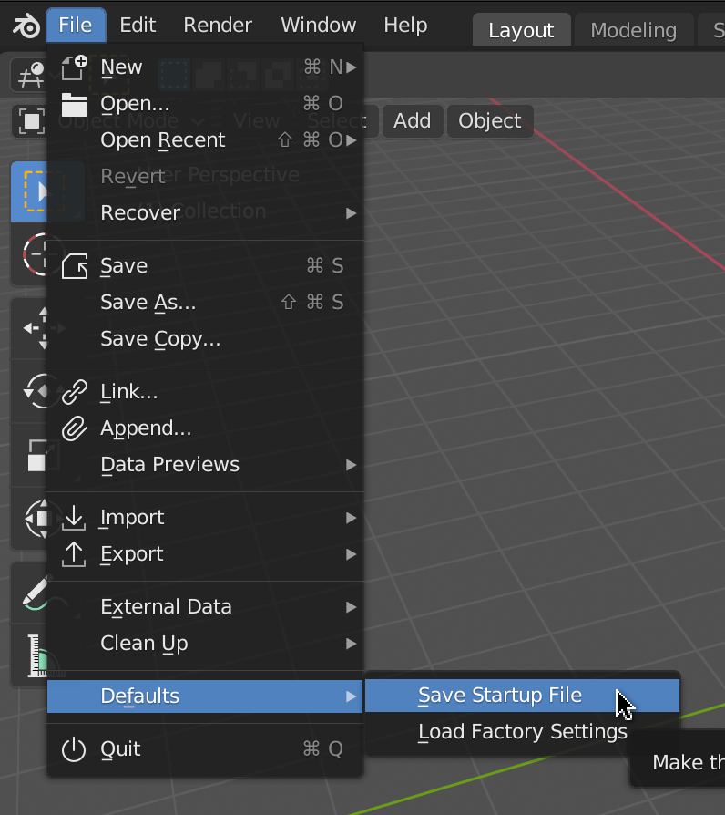

Be careful when clicking on `Save Startup File`; a confirmation menu should open and if you move the mouse out of it, you'll lose it. Click again to confirm:

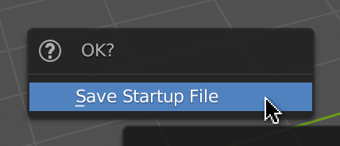

## Hamburger time

It's time to create our own model. In this lesson, we are going to make a hamburger and import it into Three.js.

Like in Three.js, a good practice is to decide on a unit scale. If you look at the grid, one square truly represents one unit, and by default, Blender considers that one unit means one meter:

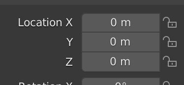

We could create a giant hamburger, but sorry, we better start with a regular-sized sandwich. We could just think of `1m` as `1cm` but if you don't like seeing this `m` you can remove it in the `Scene Properties` tab of the `Properties` area by choosing `None` as our `Unit System`:

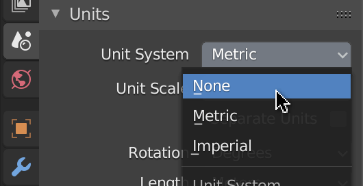

We can now consider `1` as `1cm`.

### Bottom bun

For our bottom bun, as strange as it may sound, we will start with a 10cm cube:

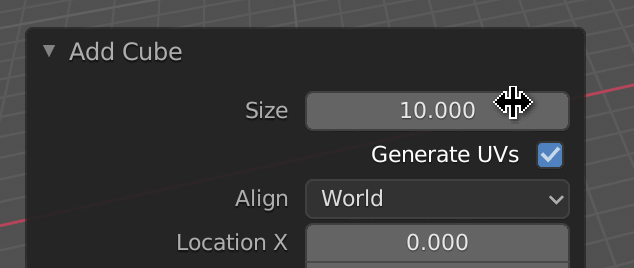

Then, after making sure that our cube is active, go to the `Modifier Properties` tab and add the `Subdivision Surface` modifier:

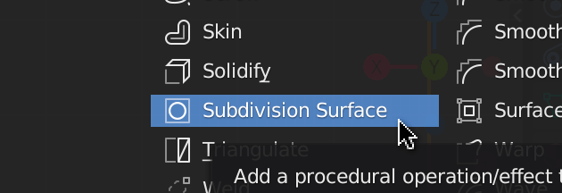

The cube now somewhat resembles a sphere.

The `Subdivision Surface` is one of the most famous modifiers. It subdivides the geometry but smoothes the angles at the same time.

Add more subdivision in the `Subdivisions > viewport` field:


The faces are flat but we want a smooth surface. To achieve this, right-click on the sphere and choose `Shade Smooth`:


The good thing with modifiers is that you preserve the original geometry. Go to the `Edit Mode` by pressing `TAB` and move the vertices until you get a pebble right above the ground:


So it's still not a bun. To get the right shape, we must add more vertices at the edge of the bun. What we need is a loop cut. Press `CTRL + R` while in `Edit Mode` and move the mouse on one of the four vertical edges:


Click once to create the cut but do not click again. At this point, you can move the loop cut up and down. Put the loop cut closer to the top edge:


Repeat the process for the down part of the bun. We want our bun to be flat at the bottom, but not too flat:


Improve your bun until you are satisfied but don't spend too much time on it. Don't worry, we'll come back to it once we have the whole scene.

### Save

It's time to save. Press `CMD + S` (`CTRL + S` on Windows) or go to `Files > Save`:


Save anywhere you want.

If you make some changes and you save again, you'll see a `.blend1` file in the same folder as your original `.blend` file. That is a backup of the latest save automatically generated by Blender. There was a time where Blender wasn't as stable as it is today. Saving your file could result in corrupting it. That is why they created those automatic backups. Today, Blender is very stable, but they keep the backup just in case or because the user can make a mistake like deleting an object, saving, and closing Blender. Fortunately, you only need to rename the `.blend1` file `.blend` to access your previous save.

### Meat

Repeat the same process for the meat. You can also duplicate the bottom bun with `SHIFT + D` in `Object Mode` (the default one)


Don't forget to save.

### Cheese

For the cheese, start with a plane right above the meat:


Go to `Edit Mode` (where you can edit the vertices, edges and faces) and subdivide the geometry. Select the only face, right click on it and select `Subdivide`. Set the `Number of Cuts` to `10`:


We are going to melt the cheese corners.

While we're still in `Edit Mode`, select one of the cheese corners. If we were to move one vertex at a time, it would take too long, and the result would probably look disappointing. What we can do is use the `Proportional Editing`. Press `O` —the letter— or click on the icon at the `3D Viewport` top center:


Now that the `Proportional Editing` is active, transforming one vertex will also transform the neighbor vertices. Increase the area of effect by using the `WHEEL` after pressing a transformation key —like `G` to move:


The way the neighbor vertices move isn't correct. To change that click on the `Proportional Editing Falloff` icon and choose `Sharp`:


Now play with the vertices and the `Proportional Editing` size until you get a nice cheesy shape:


In `Object Mode`, right click and choose `Shade Smooth` for a smooth surface:


Our cheese doesn't look thick enough. To solve this, go to the `Modifier Properties` and add the `Solidify` modifier:


Then increase the thickness to `0.08`:


Change the shading to wireframe if you want to appreciate the result even more —press `Z` to open the shading wheel menu:


Not to sound too picky but, the `Shade Smooth` on the edges looks kind of strange:


To fix that, go to the `Object Data Properties` panel, then the `Normals` section, and check `Auto Smooth`:


This feature will smooth the surface only if its edge's angle is inferior to 30°. At that point, you should get a realistic and appetizing melted cheese:


### Top bun

Add the top bun just like we did for the bottom one but make it rounder:


### Final tweaks

Now that we have all the ingredients, we can fix the proportions, go back to the previous ingredients, and improve the general shape.

Don't forget to save.

### Materials

It's time to add some colors and surface properties to our hamburger. For simplicity reasons, we won't apply textures or use painting.

We need 3 materials —one for the buns, one for the meat and one for the cheese.

Select the bottom bun and go to the `Material Properties` panel:


You should have no material associated with the bun. If you have one, click on it and press the `-` button.

To create a new material, click on the `New` button:


It's good practice to rename materials. Double click on its name and call it `BunMaterial`:


Now, tweak the properties to get a tasty color. We only need to change the `Base Color` and the `Roughness`:


If you can't see the color on the `3D Viewport`, it might be because you are not using proper shading. To change the shading, press `Z` and choose `Renderer`:


If the hamburger looks really dark, it's probably because of the light. Select the light, position it a little further away from the hamburger, go to the `Object Data Properties` panel, and increase its power to `5000`:


Repeat the material process for the meat and the cheese:


For the top bun, you only need to select the `BunMaterial` you already worked on:


Take your time, delete and try again, until you get a delicious looking hamburger.


You can even add other ingredients like salad, tomatoes, maybe a pickle slice if you're one of these people— but does anybody even likes pickles?

Don't forget to save.

## Export

It's finally time to export our hamburger. Download and run the starter. The Three.js scene is ready, and the only thing left is to provide the model.

Select all the ingredients of the hamburger. If you select other elements like lights or cameras, you might export them as well. That can be useful but not in our case.

Go to `File > Export > glTF 2.0 (.glb/.gltf)`:


A panel should open in the middle of the screen. Use it to navigate to the `/static/models/` folder of the project (ignore the `.gitkeep` file if you see it).

In the bottom part of the panel, choose a name for your file. We will go for `hamburger`. Do not add the extension:


In the right section, we can choose the `Format`. The choices correspond to the GLTF formats we talked about in the previous lesson. We will go for `glTF Binary` because we don't have any texture, and we want the smallest possible file:


For the rest of the properties, here are the settings:


Most of those are obvious but here's the list

- `Remember Export Settings`: To keep these settings the next time we export.
- Include:
  - `Selected Objects`: Only the selected objects.
  - `Custom Properties`: A text information that we can add to any object in Blender, but we didn't add any.
  - `Cameras`: The cameras.
  - `Punctual Lights`: The lights.
- Transform:
  - `+Y Up`: Convert the axes so that positive Y is the upper one —the default property for Three.js.
- Geometry:
  - `Apply Modifiers`: Applies the modifiers like the `Subdivision Surface`. If you don't check this one, you'll end up with the original cubes instead of your round buns.
  - `UVs`: Adds the UV coordinates. These are the coordinates that Three.js —and other environments— use to apply textures on a geometry. Because we don't have textures, we don't need those coordinates.
  - `Normals`: The outside direction of each face. We do need this one if we want the light to work properly.
  - `Tangents`: Works in tandem with the normals, but they are perpendicular to them.
  - `Vertex Colors`: The color associated with each vertex. Useful if we painted the vertices, but we didn't.
  - `Materials`: The different materials we used.
  - `Compression`: The legendary Draco compression.
- Animation
  - Everything related to the animations, but we don't need any of those because we don't have animations.

Click `Export glTF 2.0` and check the file. The file size should be pretty light. Try to export the same hamburger without the `compression`, and it should be much bigger. In a real project, this would be when you have to decide between using the compressed version and win a few `kB` load the whole Draco decoder or go for the uncompressed version.

It doesn't matter as long as we have our file.

## Test in Three.js

Run the project and change the hamburger path if needed:

```js
gltfLoader.load(
    '/models/hamburger.glb',

// ...
```


You should see your burger in your Three.js scene.

Regrettably, our hamburger appears way too orange compared to the Blender version. That is due to Three.js settings, and we have to do some tweaks. That will be the next lesson's topic, but feel free to come back to your burger once you finish applying the features we will learn.

## Go further

There are tons of great online tutorials, and most of them are free. Here's a non-exhaustive list of ressources you can use:

- Blender Youtube Channel: [https://www.youtube.com/user/BlenderFoundation](https://www.youtube.com/user/BlenderFoundation)
- Blender Guru Youtube Channel: [https://www.youtube.com/channel/UCOKHwx1VCdgnxwbjyb9Iu1g](https://www.youtube.com/channel/UCOKHwx1VCdgnxwbjyb9Iu1g)
- Grant Abbitt Youtube Channel: [https://www.youtube.com/channel/UCZFUrFoqvqlN8seaAeEwjlw](https://www.youtube.com/channel/UCZFUrFoqvqlN8seaAeEwjlw)
- CGFastTrack: [https://www.youtube.com/c/CGFastTrack/videos](https://www.youtube.com/c/CGFastTrack/videos)
- CGCookie: [https://cgcookie.com/](https://cgcookie.com/)

Make sure always to follow tutorials using at least version 2.8 of Blender.
