# Shaders

[](https://shields.io)

Learn in [https://threejs-journey.xyz/lessons/24](https://threejs-journey.xyz/lessons/24)

## Introduction

This lesson is probably the most anticipated one. We already talked about shaders, and that is the most demanding topic.

The funny thing is that we have been using them since the beginning. When we are creating Three.js built-in materials, those materials are composed of shaders. Everything sowing up on the WebGL render is made possible because of shaders, but it's time to create them on our own.

We will start by explaining what shaders are and when to use them. Then we will create our own very simple shaders. We will, of course, cover the syntax of the shader language. And finally, we will do some exercises to practice classic situations.

## What is a shader

A shader is, in fact, one of the main components of WebGL. If we had started WebGL without Three.js, it would have been one of the first things we would have to learn, and this is why native WebGL is so hard.

A shader is a program written in GLSL that is sent to the GPU. They are used to **position each vertex of a geometry** and to **colorize each visible pixel of that geometry**. The term "pixel" isn't accurate because each point in the render doesn't necessarily match each pixel of the screen and this is why we prefer to use the term "fragment" so don't be surprised if you see both terms.

Then we send a lot of data to the shader such as the vertices coordinates, the mesh transformation, information about the camera and its field of view, parameters like the color, the textures, the lights, the fog, etc. The GPU then processes all of this data following the shader instructions, and our geometry appears in the render.

There are two types of shaders, and we need both of them.

### Vertex shader

The vertex shader's purpose is to position the vertices of the geometry. The idea is to send the vertices positions, the mesh transformations (like its position, rotation, and scale), the camera information (like its position, rotation, and field of view). Then, the GPU will follow the instructions in the vertex shader to process all of this information in order to project the vertices on a 2D space that will become our render —in other words, our canvas.

When using a vertex shader, its code will be applied on every vertex of the geometry. But some data like the vertex position will change between each vertex. This type of data —the one that changes between vertices— is called an **attribute**. But some data doesn't need to switch between each vertex like the position of the mesh. Yes, the location of the mesh will impact all the vertices, but in the same way. This type of data —the one that doesn't change between vertices— is called a **uniform**. We will get back to **attributes** and **uniforms** later.

The vertex shader happens first. Once the vertices are placed, the GPU knows what pixels of the geometry are visible and can proceed to the fragment shader.

### Fragment shader

The fragment shader purpose is to color each visible fragment of the geometry.

The same fragment shader will be used for every visible fragment of the geometry. We can send data to it like a color by using **uniforms** —just like the vertex shader, or we can send data from the vertex shader to the fragment shader. We call this type of data —the one that comes from the vertex shader to the fragment shader— **varying**. We will get back to this later.

The most straightforward instruction in a fragment shader can be to color all the fragments with the same color. We get the equivalent of the [MeshBasicMaterial](https://threejs.org/docs/index.html#api/en/materials/MeshBasicMaterial) —if we had set only the `color` property.

Or we can send more data to the shader, for instance, a light position. We can then color the fragments according to how much the face is in front of the light source. We would get the [MeshPhongMaterial](https://threejs.org/docs/index.html#api/en/materials/MeshPhongMaterial) equivalent—if we had one light in the scene.

### Summary

The **vertex shader** position the vertices on the render.

The **fragment shader** color each visible fragment (or pixel) of that geometry.

The **fragment shader** is executed after the **vertex shader**.

Data that changes between each vertices (like their position) is called **attribute** and can only be used in the **vertex shader**.

Data that doesn't change between vertices (like the mesh position or a color) is called **uniform** and can be use in both the **vertex shader** and the **fragment shader**.

We can send data from the **vertex shader** to the **fragment shader** using **varying**.

## Why writing our own shaders

Three.js materials try to cover as many situations as possible, but they have limitations. If we want to break those limits, we have to write our own shaders.

It can also be for performance reasons. Materials like [MeshStandardMaterial](https://threejs.org/docs/index.html#api/en/materials/MeshStandardMaterial) are very elaborate and involve a lot of code and calculations. If we write our own shader, we can keep the features and calculations to the minimum. We have more control over the performance.

Writing our own shader is also an excellent way to add post-process to our render, but we will see this in a dedicated lesson.

Once you master the shaders, they'll become a must in all your projects.

## Create our first shaders with RawShaderMaterial

To create our first shader, we need to create a particular material. This material can be a [ShaderMaterial](https://threejs.org/docs/index.html#api/en/materials/ShaderMaterial) or a [RawShaderMaterial](https://threejs.org/docs/index.html#api/en/materials/RawShaderMaterial). The difference between these two is that the [ShaderMaterial](https://threejs.org/docs/index.html#api/en/materials/ShaderMaterial) will have some code automatically added to the shader codes while the [RawShaderMaterial](https://threejs.org/docs/index.html#api/en/materials/RawShaderMaterial), as its name suggests, will have nothing.

We will start with the [RawShaderMaterial](https://threejs.org/docs/index.html#api/en/materials/RawShaderMaterial) to better understand what's happening.

The starter contains a simple plane with a [MeshBasicMaterial](https://threejs.org/docs/index.html#api/en/materials/MeshBasicMaterial) on it.

Replace that [MeshBasicMaterial](https://threejs.org/docs/index.html#api/en/materials/MeshBasicMaterial) with a [RawShaderMaterial](https://threejs.org/docs/index.html#api/en/materials/RawShaderMaterial):

```js
const material = new THREE.RawShaderMaterial()
```

You should get an error.

As we said earlier, we need to provide both the vertex and the fragment shader. You can do this with the `vertexShader` and `fragmentShader` properties:

```js
const material = new THREE.RawShaderMaterial({
    vertexShader: '',
    fragmentShader: ''
})
```

The problem with that technique is that simple quotes can contain only one line inside —double-quotes too. Our shaders —as simple as they are at the start, will be too long to be written on one line.

A reliable solution is to use back quotes —also called backtick, acute or left quote. Most modern browsers support them. This technique is called [template literals](https://developer.mozilla.org/docs/Web/JavaScript/Reference/Template_literals), and we can use line breaks in it.

The key or shortcut to write this character depends on your keyboard. Here's a thread on the subject to help you: [https://superuser.com/questions/254076/how-do-i-type-the-tick-and-backtick-characters-on-windows/879277](https://superuser.com/questions/254076/how-do-i-type-the-tick-and-backtick-characters-on-windows/879277)

Once you've found the key, change your simple quotes with back quotes:

```js
const material = new THREE.RawShaderMaterial({
    vertexShader: ``,
    fragmentShader: ``
})
```

We can finally write our shaders. Just copy the code, we will explain everything later:

```js
const material = new THREE.RawShaderMaterial({
    vertexShader: `
        uniform mat4 projectionMatrix;
        uniform mat4 viewMatrix;
        uniform mat4 modelMatrix;

        attribute vec3 position;

        void main()
        {
            gl_Position = projectionMatrix * viewMatrix * modelMatrix * vec4(position, 1.0);
        }
    `,
    fragmentShader: `
        precision mediump float;

        void main()
        {
            gl_FragColor = vec4(1.0, 0.0, 0.0, 1.0);
        }
    `
})
```


You should get a red plane. Congratulations, you might not yet understand what's written here, but it's your first shader and a good start for an incredible journey.

## Separate the shaders in different files

Before we get into the code itself, let's try to improve the way we work. The back quotes are an excellent solution for small code, and we will use it in future lessons with shaders, but we are missing syntax coloration. Once we have multiple shaders with a lot of code in it, our script will become unbearable. Having a good and comfortable setup is essential.

### Shader files

We are going to move the code into separate files. First, move the vertex shader code and the fragment shader codes respectively in `/src/shaders/test/vertex.glsl` and `/src/shaders/test/fragment.glsl`.

Even if we will have only one shader in our project, it's a healthy habit to separate and organize our code as best as possible. Consequential projects can have dozens of custom shaders.

Unless your code editor already supports glsl, the syntax coloration probably doesn't work for those two new files. To add the syntax coloration, if you are using VSCode, go to your plugins, search for `shader`, and install the `Shader languages support for VS Code` plugin. If you are using another code editor, look for compatible plugins and keep an eye on the popularity and the reviews.

Once installed, you should have a nice syntax coloration on the `.glsl` files. If not, try to restart your code editor.

Syntax coloration is cool, but having a linter is even better. A linter will validate your code and find potential errors while you are writing it. It can be really useful to avoid basic mistakes without having to test the result on the browser.

We won't use one in the following lessons because installing it can be hard but if you want to give it a try, I recommend you watching this video in the [Lewis Lepton Youtube Channel](https://www.youtube.com/channel/UC8Wzk_R1GoPkPqLo-obU_kQ): [https://www.youtube.com/watch?v=NQ-g6v7GtoI](https://www.youtube.com/watch?v=NQ-g6v7GtoI)

The linter will also produce errors on incomplete shaders which is a problem because we are going to write partial shaders a little later in the lesson. It's up to you, but you can give it a try.

### Import

Let's try to import the files into our script:

```js
import testVertexShader from './shaders/test/vertex.glsl'
import testFragmentShader from './shaders/test/fragment.glsl'
```

Unfortunately, we get a Webpack error. We need to tell Webpack how to handle `.glsl` files.

To do this, go to the `/bundler/webpack.common.js` where loaders are set in the `rules` array property.

Add the following rule at the `rules` —or anywhere, as long as it's in the array —and don't forget the comma between those `rules`:

```js
module.exports = {
    // ...

    module:
    {
        rules:
        [
            // ...

            // Shaders
            {
                test: /\.(glsl|vs|fs|vert|frag)$/,
                exclude: /node_modules/,
                use: [
                    'raw-loader'
                ]
            }
        ]
    }
}
```

This rule solely tells Webpack to provide the raw content of the files having `.glsl`, `.vs`, `.fs`, `.vert` or `.frag` as extension. We might as well have used `.glsl`, but some people feel more comfortable using other file extensions.

Re-launch the server with `npm run dev` and the Webpack error will disappear.

If you log `testVertexShader` and `testFragmentShader`, you'll get the shader code as a plain string. We can use these two variables in our [RawShaderMaterial](https://threejs.org/docs/index.html#api/en/materials/RawShaderMaterial):

```js
const material = new THREE.RawShaderMaterial({
    vertexShader: testVertexShader,
    fragmentShader: testFragmentShader
})
```

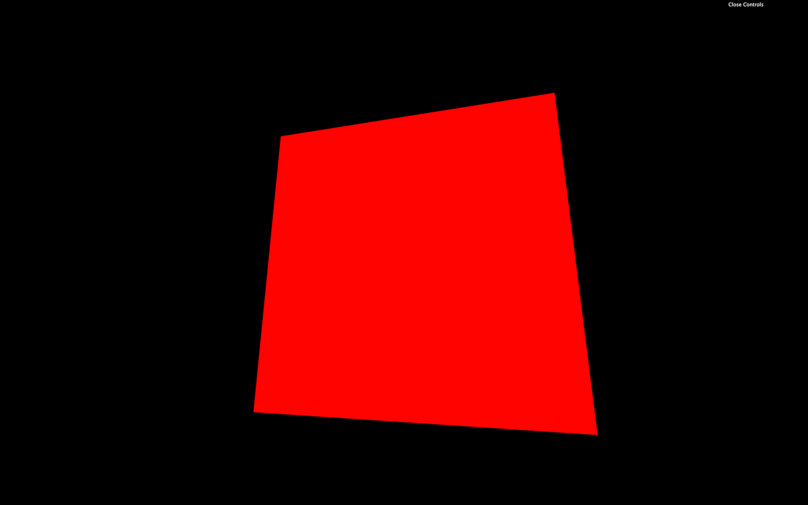

### Properties

Most of the common properties we've covered with other materials such as `wireframe`, `side`, `transparent` or `flatShading` are still available for the [RawShaderMaterial](https://threejs.org/docs/index.html#api/en/materials/RawShaderMaterial):

```js
const material = new THREE.RawShaderMaterial({
    vertexShader: testVertexShader,
    fragmentShader: testFragmentShader,
    wireframe: true
})
```

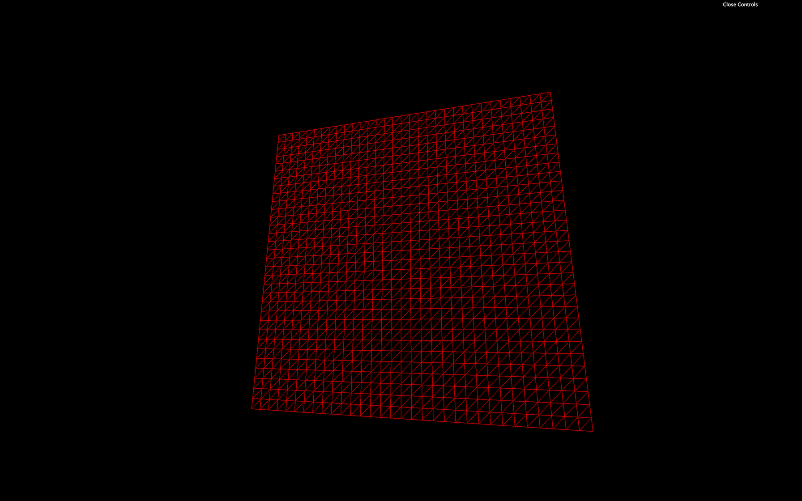

But properties like `map`, `alphaMap`, `opacity`, `color`, etc. won't work anymore because we need to write these features in the shaders ourselves.

Comment or delete the wireframe line.

## GLSL

The language used to code the shaders is called GLSL and stands for OpenGL Shading Language. It's close to C language. Let's learn the basics of its syntax.

### Logging

There is no console and, thus, no way to log values. That is due to the code being executed for every vertex and every fragment. It would make no sense to log one value.

### Indentation

The indentation is not essential. You can indent as you like.

### Semicolon

The semicolon is required to end any instruction. Forgetting even one semicolon will probably result in a compilation error, and the whole material won't work.

### Variables

It's a typed language, meaning that we must specify a variable's type, and we cannot assign any other type to that variable.

To declare a variable, we must start by the type, followed by the name (usually in camelCase), then the `=` sign, then the value, and end with a `;`:

```glsl
float fooBar = 0.123;
```

There are multiple different types.

#### Float

Floats are decimals. They can be negative or positive. We must always provide the `.` of the decimals even if the value is rounded:

```glsl
float foo = - 0.123;
float bar = 1.0;
```

We can do mathematic operations like `+`, `-`, `*` and `/`:

```glsl
float a = 1.0;
float b = 2.0;
float c = a / b;
```

#### Integer

Integers work just like the floats, but without the decimals' `.`:

```glsl
int foo = 123;
int bar = - 1;
```

We can also do mathematic operations:

```glsl
int a = 1;
int b = 2;
int c = a * b;
```

But we can't mix `float` and `int` in these operations:

```glsl
float a = 1.0;
int b = 2;
float c = a * b;
```

But we can convert types on the fly:

```glsl
float a = 1.0;
int b = 2;
float c = a * float(b);
```

#### Boolean

Booleans are just booleans:

```glsl
bool foo = true;
bool bar = false;
```

#### Vector 2

This is where things get interesting. If we want to store values like 2 coordinates with `x` and `y` properties, we can use a `vec2`:

```glsl
vec2 foo = vec2(1.0, 2.0);
```

An empty `vec2` will result in an error:

```glsl
vec2 foo = vec2();
```

We can change these properties after creating the `vec2`:

```glsl
vec2 foo = vec2(0.0  );
foo.x = 1.0;
foo.y = 2.0;
```

Doing operations like multiplying a `vec2` with a `float` will operate both the `x` and the `y` properties:

```glsl
vec2 foo = vec2(1.0, 2.0);
foo *= 2.0;
```

#### Vector 3

`vec3` is just like `vec2`, but with a third property named `z`. It's very convenient when one needs 3D coordinates:

```glsl
vec3 foo = vec3(0.0);
vec3 bar = vec3(1.0, 2.0, 3.0);
bar.z = 4.0;
```

While we can use `x`, `y`, and `z`, we can also work with `r`, `g`, and `b`. This is just syntax sugar and the result is exactly the same. It's very effective when we use a `vec3` to store colors:

```glsl
vec3 purpleColor = vec3(0.0);
purpleColor.r = 0.5;
purpleColor.b = 1.0;
```

A `vec3` can also be partially created from a `vec2`:

```glsl
vec2 foo = vec2(1.0, 2.0);
vec3 bar = vec3(foo, 3.0);
```

We can also take a part of the `vec3` to generate a `vec2`:

```glsl
vec3 foo = vec3(1.0, 2.0, 3.0);
vec2 bar = foo.xy;
```

Here, the `bar` will be a `vec2` with `1.0`, and `2.0` as values.

This is called a **swizzle** and we can also use the properties in a different order:

```glsl
vec3 foo = vec3(1.0, 2.0, 3.0);
vec2 bar = foo.yx;
```

#### Vector 4

Finally, the `vec4` works like it's two predecessors but with a fourth value named `w` or `a` —`w` because there is no letter after `z` in the alphabet and `a` for "alpha":

```glsl
vec4 foo = vec4(1.0, 2.0, 3.0, 4.0);
vec4 bar = vec4(foo.zw, vec2(5.0, 6.0));
```

There are other types of variables such as `mat2`, `mat3`, `mat4`, or `sampler2D`, but we will see those later.

### Functions

Just like in most programming languages, we can create and use functions.

A function must start with the type of the value that will be returned:

```glsl
float loremIpsum()
{
    float a = 1.0;
    float b = 2.0;

    return a + b;
}
```

If the function isn't supposed to return anything, we set the type to `void`:

```glsl
void justDoingStuff()
{
    float a = 1.0;
    float b = 2.0;
}
```

We can specify parameters, but we also have to provide their type:

```glsl
float add(float a, float b)
{
    return a + b;
}
```

This function is, as you can imagine, worthless.

### Native function

GLSL has many built-in classic functions such as `sin`, `cos`, `max`, `min`, `pow`, `exp`, `mod`, `clamp`, but also very practical functions like `cross`, `dot`, `mix`, `step`, `smoothstep`, `length`, `distance`, `reflect`, `refract`, `normalize`.

Unluckily, there is no beginner-friendly documentation and, most of the time, we do naive searches on the web and usually end up on these three websites:

#### **Shaderific documentation**

[https://www.shaderific.com/glsl-functions](https://www.shaderific.com/glsl-functions)

Shaderific is an iOS application that lets you play with GLSL. The application is not something to care about, but the documentation isn't too bad.

#### Kronos Group OpenGL reference pages

[https://www.khronos.org/registry/OpenGL-Refpages/gl4/html/indexflat.php](https://www.khronos.org/registry/OpenGL-Refpages/gl4/html/indexflat.php)

This documentation deals with OpenGL, but most of the standard functions you'll see will be compatible with WebGL. Let's not forget that WebGL is just a JavaScript API to access OpenGL.

#### Book of shaders documentation

[https://thebookofshaders.com/](https://thebookofshaders.com/)

The book of shaders mainly focus on fragment shaders and has nothing to do with Three.js but it is a great resource to learn and it has its own [glossary](https://thebookofshaders.com/glossary/).

## Understanding the vertex shader

Now that we know the GLSL syntax, let's try to understand what's in our shaders.

Keep in mind that the vertex shader purpose is to position each vertex of the geometry on the render 2D space. In other words, the vertex shader will convert the 3D vertices coordinates to our 2D canvas coordinates.

### Main function

```glsl
void main()
{
}
```

This `main` function will be called automatically. As you can see, it doesn't return anything (`void`).

### gl_Position

The `gl_Position` variable already exists. We need to assign it. This variable will contain the position of the vertex on the screen. The goal of the instructions in the `main` function is to set this variable properly.

At the end of this instruction, we get a `vec4`. This means that we can play with its `x`, `y`, `z`, and `w` properties directly on the `gl_Position` variable:

```glsl
void main()
{
    gl_Position = projectionMatrix * viewMatrix * modelMatrix * vec4(position, 1.0);
    gl_Position.x += 0.5;
    gl_Position.y += 0.5;
}
```

The plane should move on the top right corner. But be careful; we didn't truly move the plane in a 3D space as if we were playing with the `position` in Three.js. We did move the projected plane on a 2D space.

Think of it like a drawing you did on a paper. In this drawing, you have respected the perspective with vanishing points. Then, you move the whole picture to the top right corner of your desk. The perspective didn't change inside the drawing.

You're probably wondering why we need 4 values for the `gl_Position` if its final goal is to position vertices on a 2D space. It's actually because of the coordinates or not precisely in 2D space; they are in what we call **clip space** which needs 4 dimensions.

A clip space is a space that goes in all 3 directions (`x`, `y` , and `z`) in a range from `-1` to `+1`. It's like positioning everything in a 3D box. Anything out of this range will be "clipped" and disappear. The fourth value (`w`) is responsible for the perspective.

Fortunately, all of this is automatic, and, as a beginner, we don't need to master everything. It's just for the sake of knowing.

But what are we exactly sending to this `gl_Position`?

### Position attributes

First, we retrieve the vertex `position` with:

```glsl
attribute vec3 position;
```

Remember that the same code applies to every vertices of the geometry. **Attributes** are the only variable that will change between the vertices. The same vertex shader will be applied for each vertex and the `position` attribute will contain the `x`, `y`, and `z` coordinates of that specific vertex.

Then, we convert this `vec3` to a `vec4`:

```glsl
gl_Position = /* ... */ vec4(position, 1.0);
```

This is because the following matrices and the `gl_Position` need to use `vec4` as we saw earlier.

### Matrices uniforms

Each matrix will transform the `position` until we get the final clip space coordinates.

There are 3 matrices in our code, and because their values are the same for all the vertices of the geometry, we retrieve them by using **uniforms**.

```glsl
uniform mat4 projectionMatrix;
uniform mat4 viewMatrix;
uniform mat4 modelMatrix;
```

Each matrix will do a part of the transformation:

- The `modelMatrix` will apply all transformations relative to the [Mesh](https://threejs.org/docs/#api/en/objects/Mesh). If we scale, rotate or move the [Mesh](https://threejs.org/docs/#api/en/objects/Mesh), these transformations will be contained in the `modelMatrix` and applied to the `position`.
- The `viewMatrix` will apply transformations relative to the camera. If we rotate the camera to the left, the vertices should be on the right. If we move the camera in direction of the [Mesh](https://threejs.org/docs/#api/en/objects/Mesh), the vertices should get bigger, etc.
- The `projectionMatrix` will finally transform our coordinates into the final clip space coordinates.

If you want to find out more about those matrices and coordinates, here's a good article: [https://learnopengl.com/Getting-started/Coordinate-Systems](https://learnopengl.com/Getting-started/Coordinate-Systems).

To apply a matrix, we multiply it. If want to apply a `mat4` to a variable, this variable has to be a `vec4`. We can also multiply matrices with other matrices:

```glsl
gl_Position = projectionMatrix * viewMatrix * modelMatrix * vec4(position, 1.0);
```

There is actually a shorter version where the `viewMatrix` and the `modelMatrix` are combined into a `modelViewMatrix`:

```glsl
uniform mat4 projectionMatrix;
uniform mat4 modelViewMatrix;

attribute vec3 position;

void main()
{
    gl_Position = projectionMatrix * modelViewMatrix * vec4(position, 1.0);
}
```

This is shorter, but we have less control over each step.

We will actually make our code even longer to have a better understanding and more control on the position:

```glsl
uniform mat4 projectionMatrix;
uniform mat4 viewMatrix;
uniform mat4 modelMatrix;

attribute vec3 position;

void main()
{
    vec4 modelPosition = modelMatrix * vec4(position, 1.0);
    vec4 viewPosition = viewMatrix * modelPosition;
    vec4 projectedPosition = projectionMatrix * viewPosition;

    gl_Position = projectedPosition;
}
```

Those changes have the exact same result but we can now move the whole model just by tweaking the values of the `modelPosition`:

```glsl
void main()
{
    vec4 modelPosition = modelMatrix * vec4(position, 1.0);
    modelPosition.y += 1.0;

    // ...
}
```

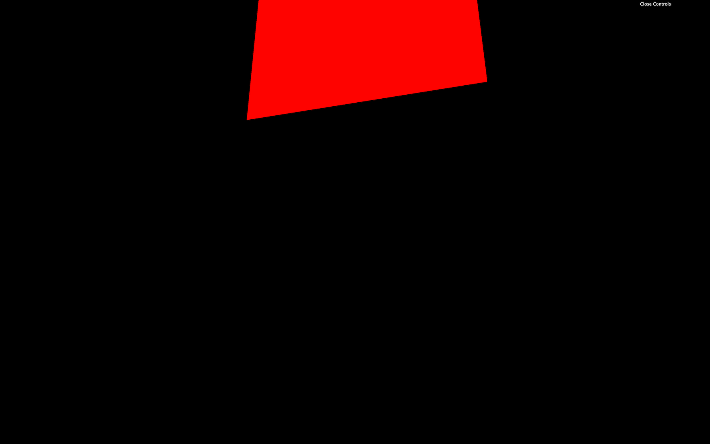

The whole plane should appear higher.

Or we can do cooler things such as transforming our plane wave:

```glsl
void main()
{
    vec4 modelPosition = modelMatrix * vec4(position, 1.0);
    modelPosition.z += sin(modelPosition.x * 10.0) * 0.1;

    // ...
}
```

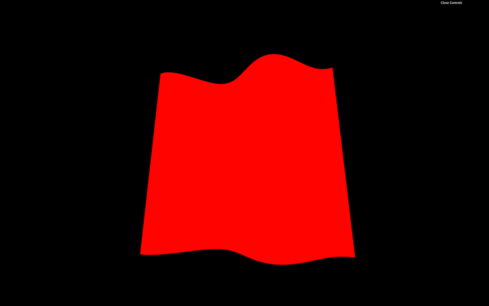

We changed the `z` by using the `x` coordinate through a `sin(...)` function. Good luck getting this result with Three.js built-in materials.

## Understanding the fragment shader

The fragment shader code will be applied to every visible fragment of the geometry. That is why the fragment shader comes after the vertex shader.

The code is more manageable than the vertex shader.

### Main function

Again, we face the `main` function:

```glsl
void main()
{
}
```

### Precision

We also have an instruction at the top of the code:

```glsl
precision mediump float;
```

This instruction lets us decide how precise can a `float` be. There are different possible values:

- `highp`
- `mediump`
- `lowp`

`highp` can have performance hit and might not even work on some devices. `lowp` can create bugs by the lack of precision. We ordinarily use `mediump`. We also could have set the precision for the vertex shader but it's not required.

This part is automatically handled when we are using [ShaderMaterial](https://threejs.org/docs/index.html#api/en/materials/ShaderMaterial) instead of [RawShaderMaterial](https://threejs.org/docs/index.html#api/en/materials/RawShaderMaterial).

### gl_FragColor

The `gl_FragColor` is like the `gl_Position` but for the color. It's already declared, and we need to assign it in the `main` function.

It's a `vec4` with the first three values being the red, green, and blue channels (`r`, `g`, `b`) and the fourth value being the alpha (`a`):

```glsl
gl_FragColor = vec4(0.5, 0.0, 1.0, 1.0);
```


This code will result on a purple color for the whole geometry.

Each property of `gl_FragColor` goes from `0.0` to `1.0`. We can go beyond those values with no error, but it won't help us.

If we want to set an alpha below `1.0`, we also need to set the `transparent` property to `true` in the [RawShaderMaterial](https://threejs.org/docs/index.html#api/en/materials/RawShaderMaterial):

```js
const material = new THREE.RawShaderMaterial({
    vertexShader: testVertexShader,
    fragmentShader: testFragmentShader,
    transparent: true
})
```

## Attributes

Attributes are values that change between each vertex. We already have one attribute named `position` that contains a `vec3` of the coordinates of each vertex.

We can add our own attributes directly to the [BufferGeometry](https://threejs.org/docs/#api/en/core/BufferGeometry) as we did during the Geometries lesson.

We will add a random value for each vertex and move that vertex on the `z` axis according to that value for this lesson.

Let's get back to the JavaScript and create a [Float32Array](https://developer.mozilla.org/docs/Web/JavaScript/Reference/Global_Objects/Float32Array) of the right size right after creating the `geometry`. To know how much vertices we have in the geometry, we can use the already existing `position` attribute:

```js
const count = geometry.attributes.position.count
const randoms = new Float32Array(count)
```

Then we fill this array with random values:

```js
for(let i = 0; i < count; i++)
{
    randoms[i] = Math.random()
}
```

Finally, we use that array in a [BufferAttribute](https://threejs.org/docs/#api/en/core/BufferAttribute) and add it to our geometry attributes:

```js
geometry.setAttribute('aRandom', new THREE.BufferAttribute(randoms, 1))
```

The first parameter of `setAttribute(...)` is the name of the attribute. That is the name we will use in the shader. We can choose any name but it's good practice to prefix with `a` for "attribute".

The first parameter of `BufferAttribute` is the data array and the second parameter is how many values compose one attribute. If we were to send a position, we would use `3` because positions are composed of 3 values (`x`, `y` and `z`). But here, it's just 1 random value per vertex so we use `1`.

We can now retrieve this attribute in the vertex shader and use it to move the vertices:

```glsl
// ...
attribute float aRandom;

void main()
{
    // ...
    modelPosition.z += aRandom * 0.1;

    // ...
}
```

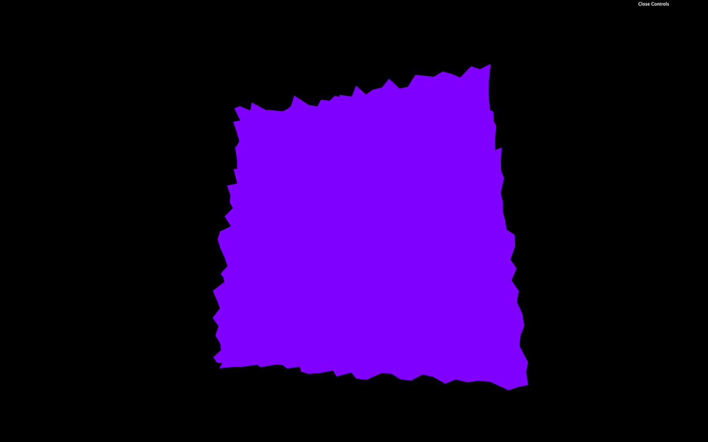

Now you get a plane composed of random spikes.

## Varyings

We now want to color the fragments also with the `aRandom` attribute.

Unfortunately, we cannot use attributes directly in the fragment shader.

Fortunately, there is a way of sending data from the vertex shader to the fragment shader called `varyings`.

We have to do it on both the vertex and the fragment shader.

In the vertex shader, we need to create the varying before the `main` function. We will call our varying `vRandom`:

```glsl
// ...

varying float vRandom;

void main()
{
    // ...
```

You can call your varying as you want but I recommend prefixing with a `v` to distinguish them easily.

Then, we update the varying value in the `main` function:

```glsl
varying float vRandom;

void main()
{
    // ...

    vRandom = aRandom;
}
```

Finally, we get the varying value in the fragment shader with the same declaration, and we use it as we want in the `main` function:

```glsl
precision mediump float;

varying float vRandom;

void main()
{
    gl_FragColor = vec4(0.5, vRandom, 1.0, 1.0);
}
```

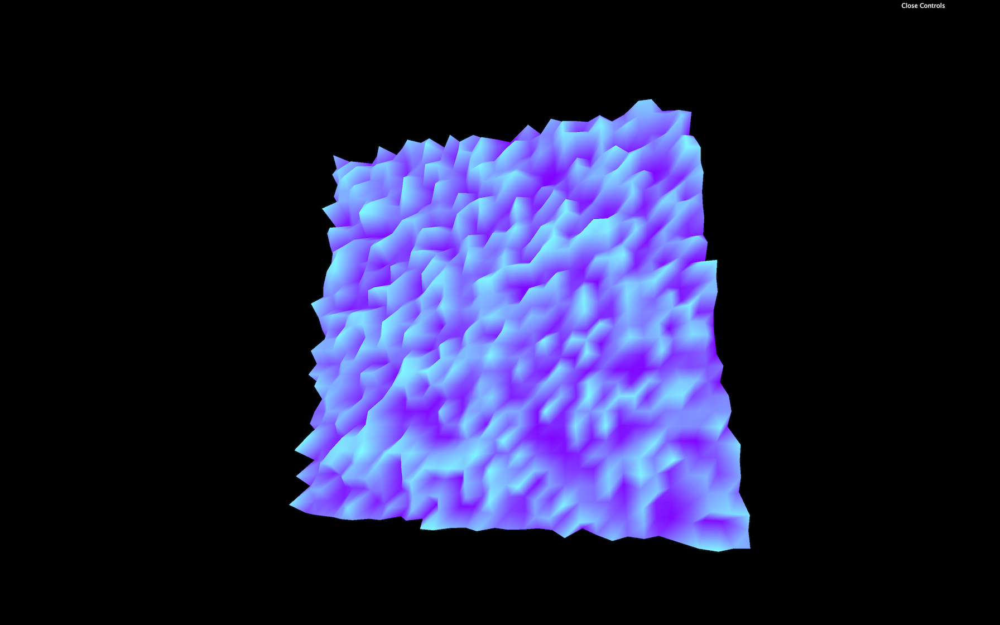

You now obtain a striking looking shape with colored spikes on it.

One interesting thing with varyings is that the values between the vertices are **interpolated**. If the GPU is drawing a fragment right between two vertices —one having a varying of `1.0` and the other having a varying of `0.0`—the fragment value will be `0.5`.

Let's remove or comment the elevation part and the varying, so we get back to our purple plane.

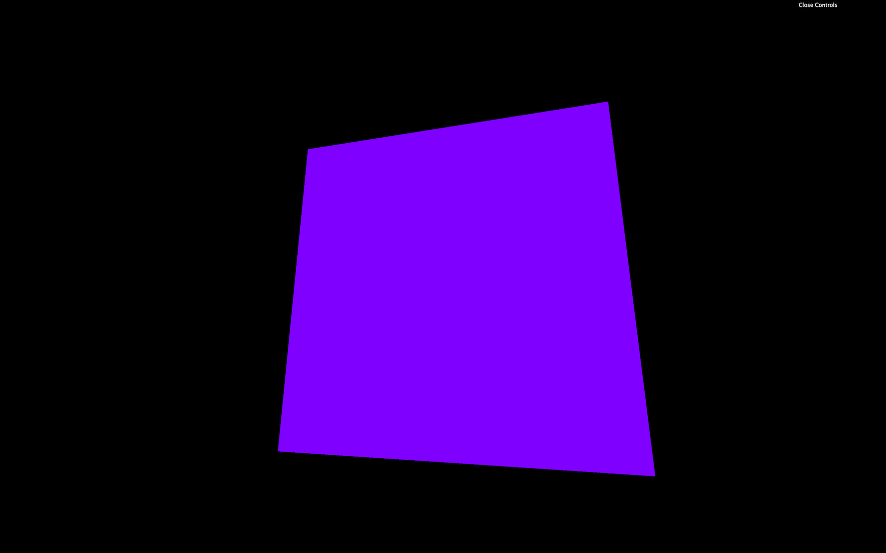

We will use attributes later on.

## Uniforms

Uniforms are a way to send data from the JavaScript to the shader.

That can be valuable if we want to use the same shader but with different parameters, and it's also the occasion to have parameters that can change during the experience.

We can use uniforms with both vertex and fragment shaders, and the data will be the same for every vertex and every fragment. We already have uniforms in our code with `projectionMatrix`, `viewMatrix`, and `modelMatrix` but we didn't create these. Three.js did.

Let's create our own uniforms.

To add uniforms to our `material`, use the `uniforms` property. We are going to make our plane wave and we want to control the waves frequency:

```js
const material = new THREE.RawShaderMaterial({
    vertexShader: testVertexShader,
    fragmentShader: testFragmentShader,
    uniforms:
    {
        frequency: { value: 10 }
    }
})
```

Here, the name of the uniform we chose is `frequency`. While it's not mandatory, it's considered a good practice to prefix with the letter `u` to distinguish "uniforms" from other data.

Change the name of the uniform to `uFrequency`:

```js
const material = new THREE.RawShaderMaterial({
    vertexShader: testVertexShader,
    fragmentShader: testFragmentShader,
    uniforms:
    {
        uFrequency: { value: 10 }
    }
})
```

If you're looking at other tutorials or examples, you might see uniforms being declared like this `uFrequency: { value: 10, type: 'float' }`. There was a time when we had to specify the type but it's deprecated now.

We can now retrieve the value in our shader code and use it in our `main` function:

```glsl
uniform mat4 projectionMatrix;
uniform mat4 viewMatrix;
uniform mat4 modelMatrix;
uniform float uFrequency;

attribute vec3 position;

void main()
{
    // ...
    modelPosition.z += sin(modelPosition.x * uFrequency) * 0.1;

    // ...
}
```

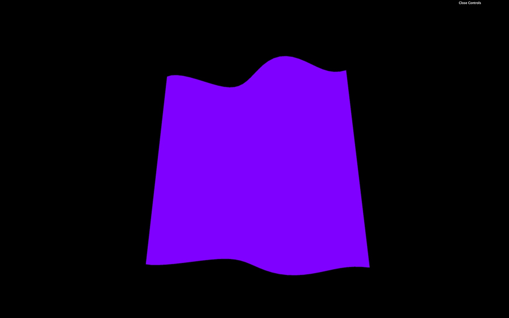

The result is the same, but we can now control the frequency from the JavaScript.

Let's change our frequency to a `vec2` to control waves horizontally and vertically. We simply use a Three.js [Vector2](https://threejs.org/docs/#api/en/math/Vector2):

```js
const material = new THREE.RawShaderMaterial({
    vertexShader: testVertexShader,
    fragmentShader: testFragmentShader,
    uniforms:
    {
        uFrequency: { value: new THREE.Vector2(10, 5) }
    }
})
```

In our shader, we change the `float` to `vec2`, and we apply the displacement on the `z` axis by using the `y` axis too:

```glsl
// ...
uniform vec2 uFrequency;

// ...

void main()
{
    // ...
    modelPosition.z += sin(modelPosition.x * uFrequency.x) * 0.1;
    modelPosition.z += sin(modelPosition.y * uFrequency.y) * 0.1;

    // ...
}
```

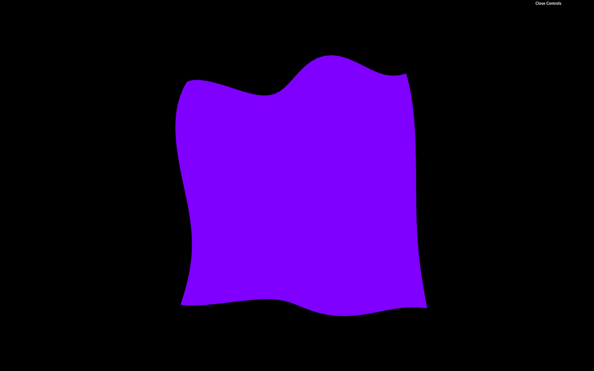

Take your time on this one. It's easy to make mistakes.

Because those values are now controlled in the JavaScript, we can add them to our Dat.GUI:

```js
gui.add(material.uniforms.uFrequency.value, 'x').min(0).max(20).step(0.01).name('frequencyX')
gui.add(material.uniforms.uFrequency.value, 'y').min(0).max(20).step(0.01).name('frequencyY')
```

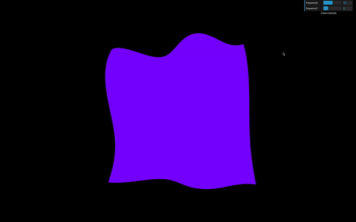

_https://threejs-journey.xyz/assets/lessons/24/step-12.mp4_

Let's add a new uniform to animate our plane like a flag in the wind. We send a time value to the shader by using a **uniform** and we use this value inside the `sin(...)` function. First, update the material to add the `uTime` uniform:

```js
const material = new THREE.RawShaderMaterial({
    vertexShader: testVertexShader,
    fragmentShader: testFragmentShader,
    uniforms:
    {
        uFrequency: { value: new THREE.Vector2(10, 5) },
        uTime: { value: 0 }
    }
})
```

Then, update this `uTime` uniform in the `tick` function. To do so, use the `getElapsedTime` function from the [Clock](https://threejs.org/docs/#api/en/core/Clock) to know how much time passed:

```js
const tick = () =>
{
    const elapsedTime = clock.getElapsedTime()

    // Update material
    material.uniforms.uTime.value = elapsedTime

    // ...
}
```

Finally, we get the uniform value in our vertex shader, and we use it in the two `sin(...)` functions:

```glsl
// ...
uniform float uTime;

// ...

void main()
{
    // ...
    modelPosition.z += sin(modelPosition.x * uFrequency.x + uTime) * 0.1;
    modelPosition.z += sin(modelPosition.y * uFrequency.y + uTime) * 0.1;

    // ...
}
```


_https://threejs-journey.xyz/assets/lessons/24/step-13.mp4_

You should see the flag wave as if it was flying the wind.

Let's invert the direction by using a `-` before the `uTime` instead of a `+`:

```glsl
modelPosition.z += sin(modelPosition.x * uFrequency.x - uTime) * 0.1;
modelPosition.z += sin(modelPosition.y * uFrequency.y - uTime) * 0.1;
```

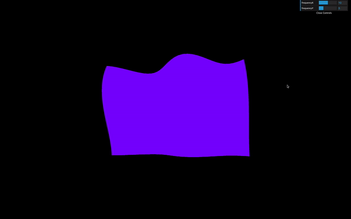

_https://threejs-journey.xyz/assets/lessons/24/step-14.mp4_

Be careful with `uTime`: if we were to use native JavaScript solution like `Date.now()`, it wouldn't work. That is due to `Date.now()` returning the number of milliseconds spent since January 1st, 1970 and this value is too big for a shader. To put it in a shell, remember that we cannot send uniform values too big or too small.

Don't forget that this is still a plane and we can transform the [Mesh](https://threejs.org/docs/#api/en/objects/Mesh) as we used to. Let's give our plane a flag shape.

We could do it in the shader by multiplying the `modelPosition.y` value but don't forget that you can still change the `position`, `scale` and `rotation` directly on the `mesh`:

```js
const mesh = new THREE.Mesh(geometry, material)
mesh.scale.y = 2 / 3
scene.add(mesh)
```

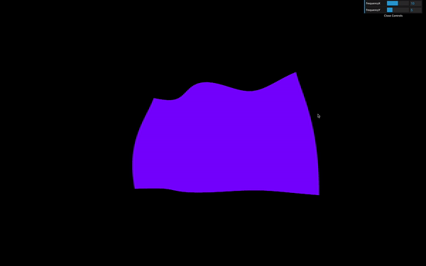

_https://threejs-journey.xyz/assets/lessons/24/step-15.mp4_

Uniforms are also available in the fragment shader. Let's add a new uniform to control the color. For a color value, we can use a Three.js a [Color](https://threejs.org/docs/#api/en/math/Color):

```js
const material = new THREE.RawShaderMaterial({
    vertexShader: testVertexShader,
    fragmentShader: testFragmentShader,
    uniforms:
    {
        uFrequency: { value: new THREE.Vector2(10, 5) },
        uTime: { value: 0 },
        uColor: { value: new THREE.Color('orange') }
    }
})
```

Then, in our fragment shader, we retrieve the value, and we use it inside our `gl_FragColor` `vec4`:

```glsl
precision mediump float;

uniform vec3 uColor;

void main()
{
    gl_FragColor = vec4(uColor, 1.0);
}
```

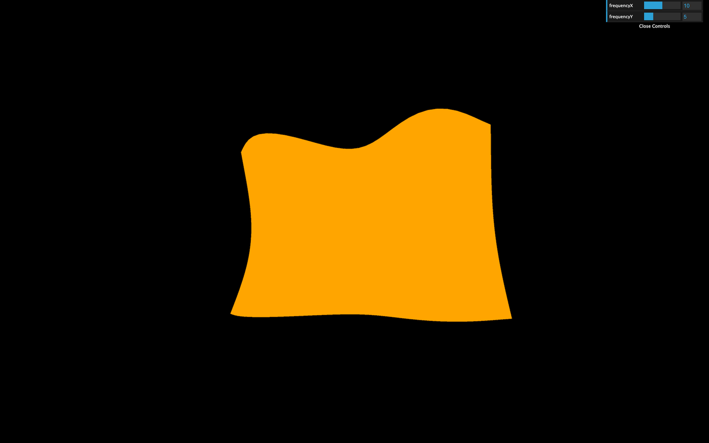

The flag should now be orange.

## Textures

Textures are a little harder, but we almost have everything we need.

First, we have to load a texture as we did in previous lessons. We already have a flag texture in the `/static/textures/` folder and we can use the `textureLoader` already available in the JavaScript starter:

```js
const flagTexture = textureLoader.load('/textures/flag-french.jpg')
```

Then we can send the texture as a uniform. We can call it `uTexture`:

```js
const material = new THREE.RawShaderMaterial({
    // ...
    uniforms:
    {
        // ...
        uTexture: { value: flagTexture }
    }
})
```

While it's tempting to send it to the fragment shader immediately, we have a problem. To take fragment colors from a texture and apply them in the fragment shader, we must use the `texture2D(...)` function. The first parameter of `texture2D(...)` is the texture (easy, it's our `uTexture`), but the second parameter consists of the coordinates of where to pick the color on that texture, and we don't have these coordinates yet.

That information should sound familiar. We are looking for coordinates that should help us project a texture on a geometry. We are talking about UV coordinates.

The [PlaneGeometry](https://threejs.org/docs/index.html#api/en/geometries/PlaneGeometry) automatically generates these coordinates, and we can see that if we log `geometry.attributes.uv`.

```js
console.log(geometry.attributes.uv)
```

Because it's an attribute, we can retrieve it in the vertex shader:

```glsl
attribute vec2 uv;
```

Still, we need those coordinates in the fragment shader. To send data from the vertex shader to the fragment shader, we need to create a `varying`. We are going to call that varying `vUv` and update its value in the `main` function:

```glsl
// ...
attribute vec2 uv;

varying vec2 vUv;

void main()
{
    // ...

    vUv = uv;
}
```

We can now retrieve the varying `vUv` in the fragment shader, retrieve the uniform `uTexture` and eventually get the fragment color with `texture2D(...)`:

```glsl
precision mediump float;

uniform vec3 uColor;
uniform sampler2D uTexture;

varying vec2 vUv;

void main()
{
    vec4 textureColor = texture2D(uTexture, vUv);
    gl_FragColor = textureColor;
}
```

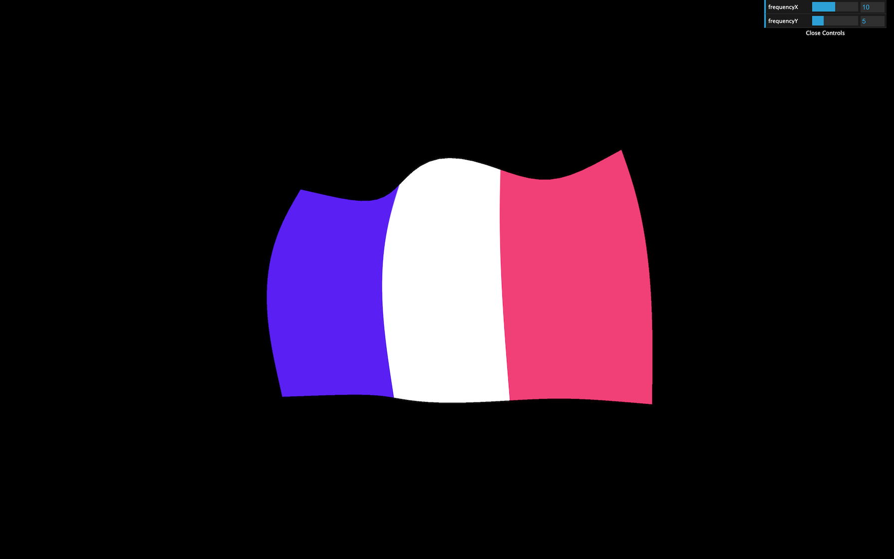

The output of `texture2D(...)` is a `vec4` because it contains `r`, `g`, `b`,and `a` —even if our texture has no alpha variation.

You should get a nice looking flag.

Again, take your time. Doing mistakes here is easy.

## Color variations

Our flag color doesn't vary much. It would be great to have a brightness variation as if there are shadows.

The technique we are going to use isn't physically accurate, but it should do the trick.

First, in the vertex shader, we are going to store the wind elevation in a variable:

```glsl
void main()
{
    // ...

    float elevation = sin(modelPosition.x * uFrequency.x - uTime) * 0.1;
    elevation += sin(modelPosition.y * uFrequency.y - uTime) * 0.1;

    modelPosition.z += elevation;

    // ...
}
```

Then, we send the elevation to the fragment by using a varying:

```glsl
// ...
varying float vElevation;

void main()
{
    // ...

    vElevation = elevation;
}
```

Finally, we retrieve the `vElevation` varying in our fragment shader, and use it to change the `r`, `g`, and `b` properties of our `textureColor`:

```glsl
// ...
varying float vElevation;

void main()
{
    vec4 textureColor = texture2D(uTexture, vUv);
    textureColor.rgb *= vElevation * 2.0 + 0.5;
    gl_FragColor = textureColor;
}
```

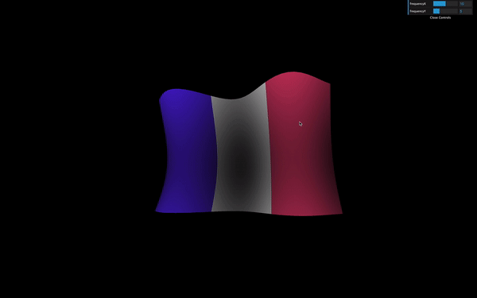

_https://threejs-journey.xyz/assets/lessons/24/step-18.mp4_

You should see brightness variations on the flag as if we had light and shadows. It's a cheap technique, but it works.

## ShaderMaterial

Until now, we have used [RawShaderMaterial](https://threejs.org/docs/#api/en/materials/RawShaderMaterial). The [ShaderMaterial](https://threejs.org/docs/#api/en/materials/ShaderMaterial) works just the same, but with pre-built uniforms and attributes prepended in the shader codes. The precision will also be automatically set.

To use it, simply replace your [RawShaderMaterial](https://threejs.org/docs/#api/en/materials/RawShaderMaterial) by [ShaderMaterial](https://threejs.org/docs/#api/en/materials/ShaderMaterial):

```js
const material = new THREE.ShaderMaterial({
    // ...
```

Then remove the following `uniform` and `attribute` and `precision` in both shaders:

- `uniform mat4 projectionMatrix;`
- `uniform mat4 viewMatrix;`
- `uniform mat4 modelMatrix;`
- `attribute vec3 position;`
- `attribute vec2 uv;`
- `precision mediump float;`

```glsl
uniform vec2 uFrequency;
uniform float uTime;

attribute float aRandom;

varying float vElevation;
varying vec2 vUv;

void main()
{
    // ...
}
```

The shader should work just like before because the [ShaderMaterial](https://threejs.org/docs/#api/en/materials/ShaderMaterial) will add these automatically.

## Debugging

Debugging a shader is hard. We cannot log data as in JavaScript because it's the GPU that execute the shader code and it does it for every vertices and every fragment.

Favorably for us, Three.js is doing a great job passing on the errors at compilation.

### Finding the error

If we forget a semicolon, Three.js will log the full shader and tell us the line where the error occurred with a short description like `ERROR: 0:71: 'vec4' : syntax error`.

This message means that the error occurred at line `71`, but the problem might come from the line right before. Take your time, read the error, and you'll find what is wrong.

### Read the shader

Having the whole shader code logged is also an excellent way to see what Three.js prepends to our shaders when using a [ShaderMaterial](https://threejs.org/docs/#api/en/materials/ShaderMaterial).

### Test values

Another solution to debug values is to use them in the `gl_FragColor`. That isn't precise because all we can see are color variations, but sometimes it's enough.

If the values are in the vertex shader, we can use a varying to pass it on to the fragment shader.

Let's say we want to see what the `uv` looks like. We can send it to the fragment with a varying —already done with `vUv`— and use it in the `gl_FragColor`:

```glsl
gl_FragColor = vec4(vUv, 1.0, 1.0);
```

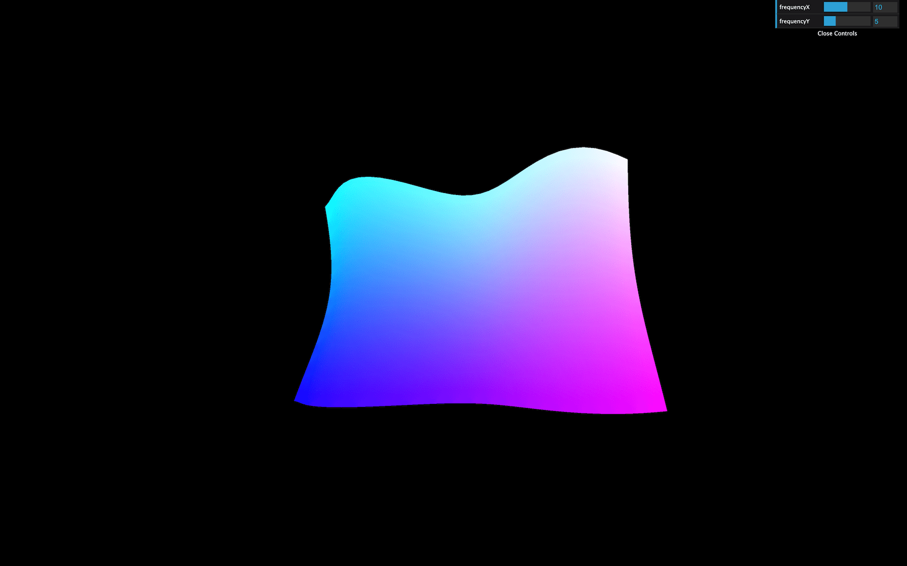

## Go further

Once we understand the basics of the shaders, it's all about practice. Your first shaders will take countless hours, but you'll learn techniques that you'll frequently use.

In the next lessons, we will practice those techniques and even learn how to draw shapes in shaders, but if you want to go further, here are some links:

- The Book of Shaders: [https://thebookofshaders.com/](https://thebookofshaders.com/)
- ShaderToy: [https://www.shadertoy.com/](https://www.shadertoy.com/)
- The Art of Code Youtube Channel: [https://www.youtube.com/channel/UCcAlTqd9zID6aNX3TzwxJXg](https://www.youtube.com/channel/UCcAlTqd9zID6aNX3TzwxJXg)
- Lewis Lepton Youtube Channel: [https://www.youtube.com/channel/UC8Wzk_R1GoPkPqLo-obU_kQ](https://www.youtube.com/channel/UC8Wzk_R1GoPkPqLo-obU_kQ)

## Glslify

GLSLify is a node module that improves what we can do with our glsl files. With glslify, we can import and export glsl codes like modules. That is good to separate our code into multiple smaller and reusable parts.

We won't be using it in this course, but if your glsl code is getting too big, or let's say you need the same code in multiple files, you should try adding it to your project.

You can use the [glslify-loader](https://www.npmjs.com/package/glslify-loader) and add it to the rules of your webpack configuratfion.
