# Raging sea

[](https://shields.io)

Learn in [https://threejs-journey.xyz/lessons/26](https://threejs-journey.xyz/lessons/26)

## Introduction

Now that we know how to use shaders and draw some patterns let's make fair use of it and create a raging sea.

We are going to animate the waves and keep control of the parameters with the debug panel.

## Setup

For now, all we have is a rotated plane using [MeshBasicMaterial](https://threejs.org/docs/#api/en/materials/MeshBasicMaterial). The geometry has a `128x128` subdivision. We are going to animate the vertices to get the waves and we need quite a lot of vertices. `128x128` might not be enough, but we will increase the value if required.

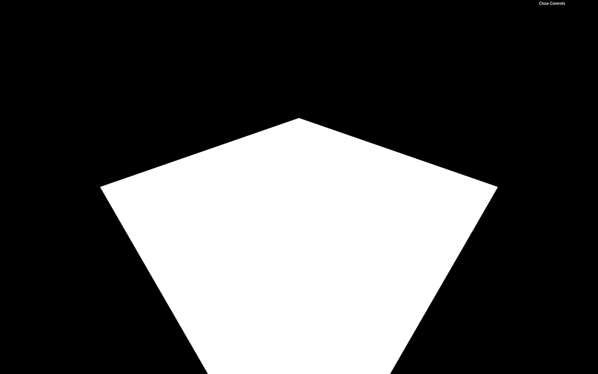

## Base

Let's replace the material by a [ShaderMaterial](https://threejs.org/docs/#api/en/materials/ShaderMaterial):

```js
const waterMaterial = new THREE.ShaderMaterial()
```

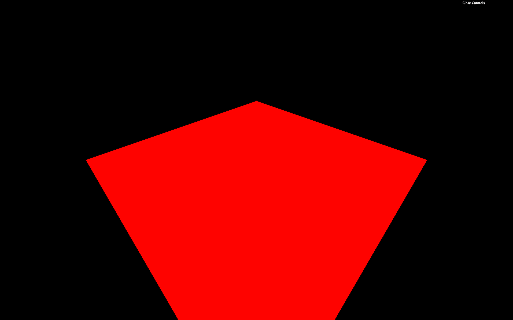

Our Webpack configuration already supports GLSL files, but we need to create these files.

Create the vertex shader in `/src/shaders/water/vertex.glsl`:

```glsl
void main()
{
    vec4 modelPosition = modelMatrix * vec4(position, 1.0);
    vec4 viewPosition = viewMatrix * modelPosition;
    vec4 projectedPosition = projectionMatrix * viewPosition;
    gl_Position = projectedPosition;
}
```

Now create the fragment shader in `/src/shaders/water/fragment.glsl`:

```glsl
void main()
{
    gl_FragColor = vec4(0.5, 0.8, 1.0, 1.0);
}
```

Finally, import those shaders in your script and use them in a [ShaderMaterial](https://threejs.org/docs/#api/en/materials/ShaderMaterial):

```js
// ...

import waterVertexShader from './shaders/water/vertex.glsl'
import waterFragmentShader from './shaders/water/fragment.glsl'

// ...

const waterMaterial = new THREE.ShaderMaterial({
    vertexShader: waterVertexShader,
    fragmentShader: waterFragmentShader
})
```

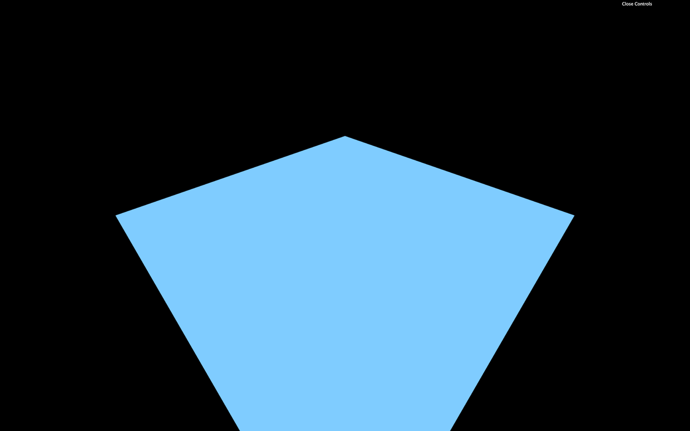

You should get a blue plane. If not, check the logs.

If you did all of this from memory, congratulation, you are a genius. If not, it's perfectly normal, and you only need time.

## Big waves

We begin with the big waves to get significant results quickly. What's better than a sinus to create waves?

In the vertex shader, let's move the `y` value of the `modelPosition` with a `sin(...)` based on the `x`:

```glsl
vec4 modelPosition = modelMatrix * vec4(position, 1.0);
modelPosition.y += sin(modelPosition.x);
```

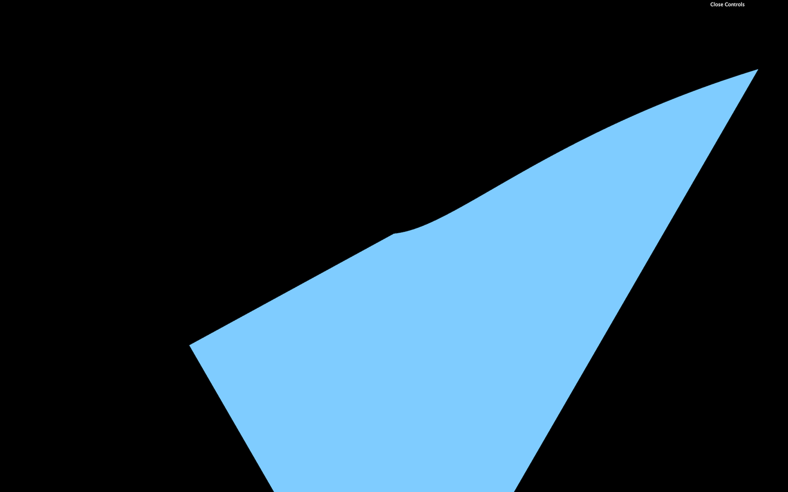

The displacement and frequency should be way too high. Instead of just multiplying the values numbers coming out from nowhere in the shader, we will use uniforms to have more control over them.

Let's start with the elevation.

### Elevation

Add a `uBigWavesElevation` uniform to the [ShaderMaterial](https://threejs.org/docs/#api/en/materials/ShaderMaterial):

```js
const waterMaterial = new THREE.ShaderMaterial({
    vertexShader: waterVertexShader,
    fragmentShader: waterFragmentShader,
    uniforms:
    {
        uBigWavesElevation: { value: 0.2 }
    }
})
```

We can now retrieve and use the `uBigWavesElevation` uniform in the vertex shader:

```glsl
uniform float uBigWavesElevation;

void main()
{
    // ...
    modelPosition.y += sin(modelPosition.x) * uBigWavesElevation;

    // ...
}
```

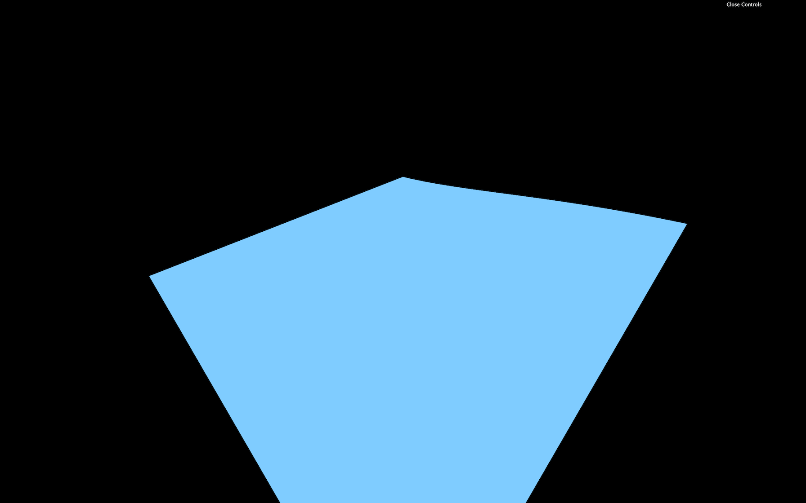

Instead of updating the `y` property directly, we should use a variable named `elevation`. This will get handy later when we are going to color those waves:

```glsl
uniform float uBigWavesElevation;

void main()
{
    vec4 modelPosition = modelMatrix * vec4(position, 1.0);

    // Elevation
    float elevation = sin(modelPosition.x) * uBigWavesElevation;
    modelPosition.y += elevation;

    // ...
}
```

Because the elevation is now handled in the JavaScript, we can add it to our Dat.GUI:

```js
gui.add(waterMaterial.uniforms.uBigWavesElevation, 'value').min(0).max(1).step(0.001).name('uBigWavesElevation')
```


_https://threejs-journey.xyz/assets/lessons/26/step-06.mp4_

### Frequency

We can now take care of the frequency. Currently, the waves elevation only changes on the `x` axis but it would be even better to control both `x` and `z` axes.

Create a `uBigWavesFrequency` uniform with a [Vector2](https://threejs.org/docs/#api/en/math/Vector2):

```js
const waterMaterial = new THREE.ShaderMaterial({
    vertexShader: waterVertexShader,
    fragmentShader: waterFragmentShader,
    uniforms:
    {
        uBigWavesElevation: { value: 0.2 },
        uBigWavesFrequency: { value: new THREE.Vector2(4, 1.5) } 
    } 
})
```

In the vertex shader, retrieve the uniform —be careful, it's a `vec2`— and apply it in the `sin(...)` with only the `x` property to begin with:

```glsl
// ...
uniform vec2 uBigWavesFrequency;

void main()
{
    // ...

    float elevation = sin(modelPosition.x * uBigWavesFrequency.x) * uBigWavesElevation;

    // ...
}
```

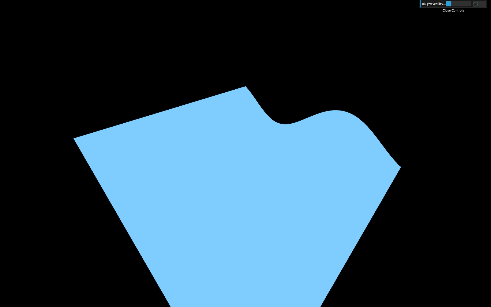 This should result in more waves because the frequency is higher.

Let's use the second value of the `uBigWavesFrequency` (`y`) to control the waves on the `z` axis. We can do that by multiplying the first `sin(...)` by another `sin(...)`:

```glsl
float elevation = sin(modelPosition.x * uBigWavesFrequency.x) * sin(modelPosition.z * uBigWavesFrequency.y) * uBigWavesElevation;
```

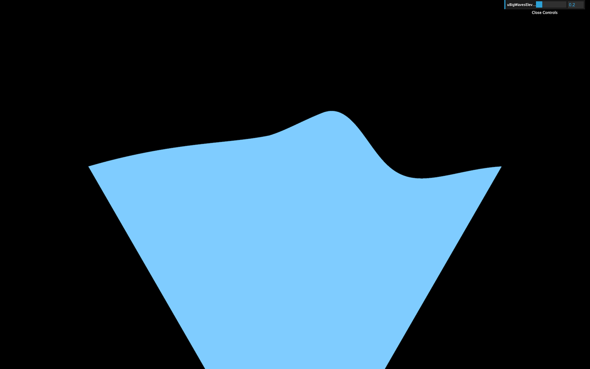 You should get waves on the `z` axis too.

We can now add those `x` and `y` properties to our Dat.GUI:

```js
gui.add(waterMaterial.uniforms.uBigWavesFrequency.value, 'x').min(0).max(10).step(0.001).name('uBigWavesFrequencyX')
gui.add(waterMaterial.uniforms.uBigWavesFrequency.value, 'y').min(0).max(10).step(0.001).name('uBigWavesFrequencyY')
```

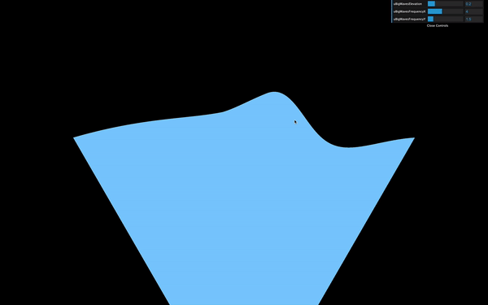

_https://threejs-journey.xyz/assets/lessons/26/step-09.mp4_

### Animate

Let's animate these big waves. We are going to use the elapsed time as we did in a previous lesson to offset the value in the `sin(...)` and create the animation.

First, create a `uTime` uniform in the [ShaderMaterial](https://threejs.org/docs/#api/en/materials/ShaderMaterial):

```js
const waterMaterial = new THREE.ShaderMaterial({
    // ...
    uniforms:
    {
        uTime: { value: 0 },
        // ...
    } 
})
```

Then, update the value in the tick `function`:

```js
const clock = new THREE.Clock()

const tick = () =>
{
    const elapsedTime = clock.getElapsedTime()

    // Water
    waterMaterial.uniforms.uTime.value = elapsedTime

    // ...
}
```

In the vertex shader, retrieve and use the `uTime` in both `sin(...)` functions:

```glsl
uniform float uTime;
// ...

void main()
{
    // ...

    float elevation = sin(modelPosition.x * uBigWavesFrequency.x + uTime) * sin(modelPosition.z * uBigWavesFrequency.y + uTime) * uBigWavesElevation;

    // ...
}
```

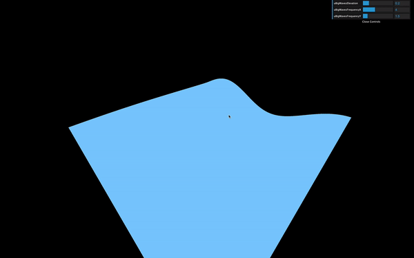

_https://threejs-journey.xyz/assets/lessons/26/step-10.mp4_

You now get animated waves. While the speed is ok for a raging sea, it would be great to be able to control it.

Let's create a `uBigWavesSpeed` uniform and multiply our `uTime` by it. We will use a `float` to make it more simple, but if you want to control both axes speed separately, you can use a `vec2`.

Create the `uBigWavesSpeed` uniform in the [ShaderMaterial](https://threejs.org/docs/#api/en/materials/ShaderMaterial) and add the tweak:

```js
const waterMaterial = new THREE.ShaderMaterial({
    // ...
    uniforms:
    {
        // ...
        uBigWavesSpeed: { value: 0.75 } 
    } 
})

// ...
gui.add(waterMaterial.uniforms.uBigWavesSpeed, 'value').min(0).max(4).step(0.001).name('uBigWavesSpeed')
```

In the vertex shader, retrieve the `uBigWavesSpeed` uniform and multiply the `uTime` by it in both `sin(...)` functions:

```glsl
// ...
uniform float uBigWavesSpeed;

void main()
{
    // ...

    float elevation = sin(modelPosition.x * uBigWavesFrequency.x + uTime * uBigWavesSpeed) * sin(modelPosition.z * uBigWavesFrequency.y + uTime * uBigWavesSpeed) * uBigWavesElevation;

    // ...
}
```

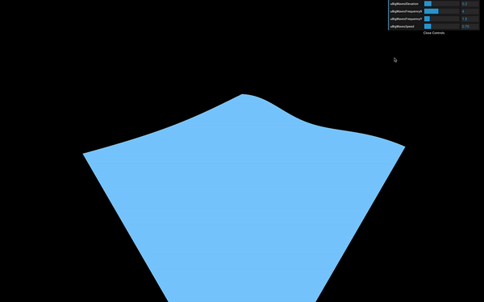

_https://threejs-journey.xyz/assets/lessons/26/step-11.mp4_

Our `elevation` formula is taking way too long. Don't hesitate to refactor a little by using variables or simple line breaks:

```glsl
float elevation = sin(modelPosition.x * uBigWavesFrequency.x + uTime * uBigWavesSpeed) * sin(modelPosition.z * uBigWavesFrequency.y + uTime * uBigWavesSpeed) * uBigWavesElevation;
```

## Colors

Our waves are starting to look great, but that uniform blue color doesn't help.

Let's produce two colors, one for the depth and one for the surface. If you remember, adding Three.js colors to Dat.GUI is a little complicated.

First, we need to create a `debugObject` right after the `gui` instantiation:

```js
const gui = new dat.GUI({ width: 340 })
const debugObject = {}
```

Then, right before the `waterMaterial` instantiation, we can create these two colors as properties of `debugObject`, and use them in two new uniforms that we will call `uDepthColor` and `uSurfaceColor`. These colors will be using the [Color](https://threejs.org/docs/#api/en/math/Color) class:

```js
// Colors
debugObject.depthColor = '#0000ff'
debugObject.surfaceColor = '#8888ff'

// Material
const waterMaterial = new THREE.ShaderMaterial({
    vertexShader: waterVertexShader,
    fragmentShader: waterFragmentShader,
    uniforms:
    {
        // ...
        uDepthColor: { value: new THREE.Color(debugObject.depthColor) },
        uSurfaceColor: { value: new THREE.Color(debugObject.surfaceColor) }
    } 
})
```

We can then add them to our Dat.GUI with the `addColor` method. We also need to update the `waterMaterial` uniforms when the color changes with `onChange(...)`:

```js
debugObject.depthColor = '#0000ff'
debugObject.surfaceColor = '#8888ff'

gui.addColor(debugObject, 'depthColor').onChange(() => { waterMaterial.uniforms.uDepthColor.value.set(debugObject.depthColor) })
gui.addColor(debugObject, 'surfaceColor').onChange(() => { waterMaterial.uniforms.uSurfaceColor.value.set(debugObject.surfaceColor) })
```

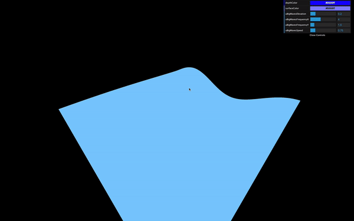

_https://threejs-journey.xyz/assets/lessons/26/step-12.mp4_

You should see the color tweaks, but changing them doesn't affect the material. That is because we haven't use the `uDepthColor` and `uSurfaceColor` uniforms in our shader yet.

In the fragment shader, start by retrieving these colors:

```glsl
uniform vec3 uDepthColor;
uniform vec3 uSurfaceColor;
```

And use only one color to verify that everything is working:

```glsl
// ...

void main()
{
    gl_FragColor = vec4(uDepthColor, 1.0);
}
```

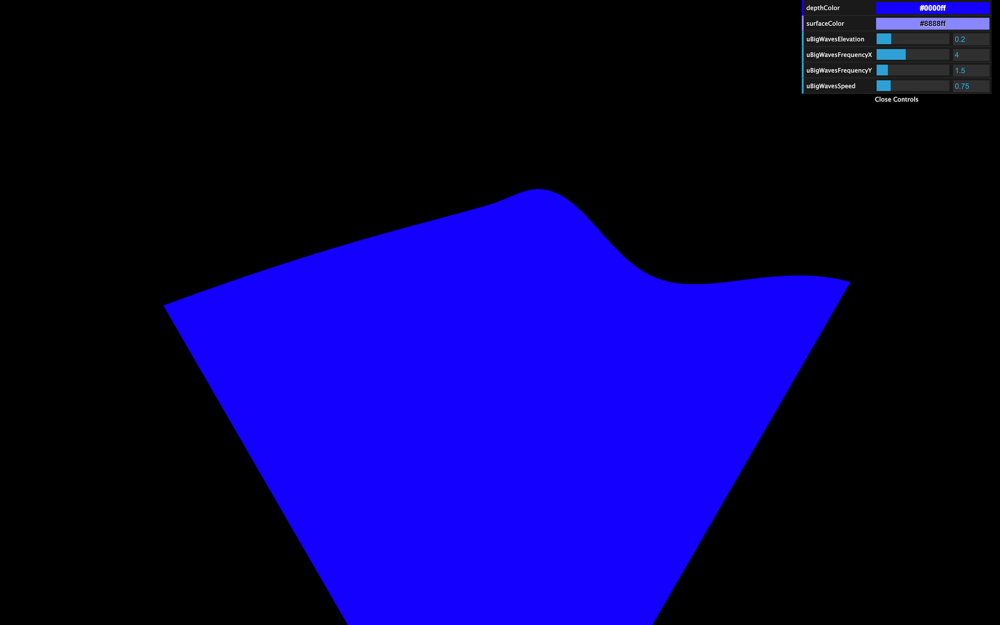

What we need to do now is use more of the `uDepthColor` if the wave is low and more of the `uSurfaceColor` if it is high.

Remember the previous lesson, we are going to use the `mix(...)`. This function needs a first input, a second input, and a value that will dictate how to mix these two first inputs.

- If that third value is `0.0`, the result will be the first input.
- If that third value is `1.0`, the result will be the second input.
- If that third value is `0.5`, the result will be a perfect mix of the two inputs.
- If that third value is below `0.0` or above `1.0` the value will be extrapolated.

The two first parameters are, as you can imagine, the `uDepthColor` and the `uSurfaceColor`. But what about the third value that controls the mix?

We could use the `elevation`, unfortunately this variable is in the vertex shader.

To transmit this variable to the fragment shader —like we did in the previous lessons— we are going to use a `varying`. In the vertex shader, create a `vElevation` varying and update it in the `main` function:

```glsl
// ...

varying float vElevation;

void main()
{
    // ...

    // Varyings
    vElevation = elevation;
}
```

In the fragment shader, retrieve the varying. Then create a `color` variable that mixes the `uDepthColor` and the `uSurfaceColor` according to the `vElevation`:

```glsl
uniform vec3 uDepthColor;
uniform vec3 uSurfaceColor;

varying float vElevation;

void main()
{
    vec3 color = mix(uDepthColor, uSurfaceColor, vElevation);
    gl_FragColor = vec4(color, 1.0);
}
```

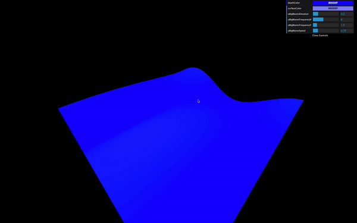

_https://threejs-journey.xyz/assets/lessons/26/step-14.mp4_

You should see a very slight variation in the color. The problem is that our `vElevation` currently only goes from `- 0.2` to `+ 0.2` according to our code. We need to find a way to control this `vElevation`, but only in the fragment shader.

Let's add some uniforms! We will create a `uColorOffset` and `uColorMultiplier`, and add both of them to our Dat.GUI:

```js
const waterMaterial = new THREE.ShaderMaterial({
    vertexShader: waterVertexShader,
    fragmentShader: waterFragmentShader,
    uniforms:
    {
        // ...
        uColorOffset: { value: 0.25 },
        uColorMultiplier: { value: 2 },
    } 
})

// ...
gui.add(waterMaterial.uniforms.uColorOffset, 'value').min(0).max(1).step(0.001).name('uColorOffset')
gui.add(waterMaterial.uniforms.uColorMultiplier, 'value').min(0).max(10).step(0.001).name('uColorMultiplier')
```

Now retrieve the `uColorOffset` and `uColorMultiplier` uniforms in the fragment shader, create a `mixStrength` variable —to make it easier to read— based on these two uniforms, and use that variable in the `mix(...)` function:

```glsl
uniform vec3 uDepthColor;
uniform vec3 uSurfaceColor;
uniform float uColorOffset;
uniform float uColorMultiplier;

varying float vElevation;

void main()
{
    float mixStrength = (vElevation + uColorOffset) * uColorMultiplier;
    vec3 color = mix(uDepthColor, uSurfaceColor, mixStrength);

    gl_FragColor = vec4(color, 1.0);
}
```


You obtain a much better gradient. Tweak the values to secure colors you like:

```glsl
debugObject.depthColor = '#186691'
debugObject.surfaceColor = '#9bd8ff'

// ...

const waterMaterial = new THREE.ShaderMaterial({
    vertexShader: waterVertexShader,
    fragmentShader: waterFragmentShader,
    uniforms:
    {
        // ...

        uColorOffset: { value: 0.08 },
        uColorMultiplier: { value: 5 }
    }
})
```

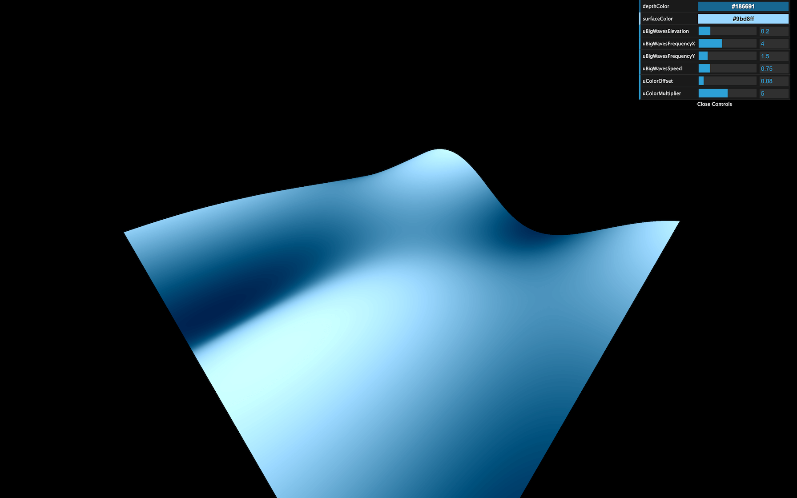

## Small waves

For the small waves, we are going to use a perlin noise. We used a 2D perlin noise in the previous lesson, where we sent 2D coordinates and got a float value in return. This time, we are going to use a 3D perlin. That will enable variations of that noise in time for a more realistic result.

Go to the same gist as during the previous lesson and copy the **Classic Perlin 3D Noise** by **Stefan Gustavson**: [https://gist.github.com/patriciogonzalezvivo/670c22f3966e662d2f83](https://gist.github.com/patriciogonzalezvivo/670c22f3966e662d2f83)

Or copy the code below to the vertex shader:

```glsl
// Classic Perlin 3D Noise 
// by Stefan Gustavson
//
vec4 permute(vec4 x)
{
    return mod(((x*34.0)+1.0)*x, 289.0);
}
vec4 taylorInvSqrt(vec4 r)
{
    return 1.79284291400159 - 0.85373472095314 * r;
}
vec3 fade(vec3 t)
{
    return t*t*t*(t*(t*6.0-15.0)+10.0);
}

float cnoise(vec3 P)
{
    vec3 Pi0 = floor(P); // Integer part for indexing
    vec3 Pi1 = Pi0 + vec3(1.0); // Integer part + 1
    Pi0 = mod(Pi0, 289.0);
    Pi1 = mod(Pi1, 289.0);
    vec3 Pf0 = fract(P); // Fractional part for interpolation
    vec3 Pf1 = Pf0 - vec3(1.0); // Fractional part - 1.0
    vec4 ix = vec4(Pi0.x, Pi1.x, Pi0.x, Pi1.x);
    vec4 iy = vec4(Pi0.yy, Pi1.yy);
    vec4 iz0 = Pi0.zzzz;
    vec4 iz1 = Pi1.zzzz;

    vec4 ixy = permute(permute(ix) + iy);
    vec4 ixy0 = permute(ixy + iz0);
    vec4 ixy1 = permute(ixy + iz1);

    vec4 gx0 = ixy0 / 7.0;
    vec4 gy0 = fract(floor(gx0) / 7.0) - 0.5;
    gx0 = fract(gx0);
    vec4 gz0 = vec4(0.5) - abs(gx0) - abs(gy0);
    vec4 sz0 = step(gz0, vec4(0.0));
    gx0 -= sz0 * (step(0.0, gx0) - 0.5);
    gy0 -= sz0 * (step(0.0, gy0) - 0.5);

    vec4 gx1 = ixy1 / 7.0;
    vec4 gy1 = fract(floor(gx1) / 7.0) - 0.5;
    gx1 = fract(gx1);
    vec4 gz1 = vec4(0.5) - abs(gx1) - abs(gy1);
    vec4 sz1 = step(gz1, vec4(0.0));
    gx1 -= sz1 * (step(0.0, gx1) - 0.5);
    gy1 -= sz1 * (step(0.0, gy1) - 0.5);

    vec3 g000 = vec3(gx0.x,gy0.x,gz0.x);
    vec3 g100 = vec3(gx0.y,gy0.y,gz0.y);
    vec3 g010 = vec3(gx0.z,gy0.z,gz0.z);
    vec3 g110 = vec3(gx0.w,gy0.w,gz0.w);
    vec3 g001 = vec3(gx1.x,gy1.x,gz1.x);
    vec3 g101 = vec3(gx1.y,gy1.y,gz1.y);
    vec3 g011 = vec3(gx1.z,gy1.z,gz1.z);
    vec3 g111 = vec3(gx1.w,gy1.w,gz1.w);

    vec4 norm0 = taylorInvSqrt(vec4(dot(g000, g000), dot(g010, g010), dot(g100, g100), dot(g110, g110)));
    g000 *= norm0.x;
    g010 *= norm0.y;
    g100 *= norm0.z;
    g110 *= norm0.w;
    vec4 norm1 = taylorInvSqrt(vec4(dot(g001, g001), dot(g011, g011), dot(g101, g101), dot(g111, g111)));
    g001 *= norm1.x;
    g011 *= norm1.y;
    g101 *= norm1.z;
    g111 *= norm1.w;

    float n000 = dot(g000, Pf0);
    float n100 = dot(g100, vec3(Pf1.x, Pf0.yz));
    float n010 = dot(g010, vec3(Pf0.x, Pf1.y, Pf0.z));
    float n110 = dot(g110, vec3(Pf1.xy, Pf0.z));
    float n001 = dot(g001, vec3(Pf0.xy, Pf1.z));
    float n101 = dot(g101, vec3(Pf1.x, Pf0.y, Pf1.z));
    float n011 = dot(g011, vec3(Pf0.x, Pf1.yz));
    float n111 = dot(g111, Pf1);

    vec3 fade_xyz = fade(Pf0);
    vec4 n_z = mix(vec4(n000, n100, n010, n110), vec4(n001, n101, n011, n111), fade_xyz.z);
    vec2 n_yz = mix(n_z.xy, n_z.zw, fade_xyz.y);
    float n_xyz = mix(n_yz.x, n_yz.y, fade_xyz.x); 
    return 2.2 * n_xyz;
}
```

No fix needed this time.

We can now use the `cnoise` function with a `vec3` as parameter.

Here are the three values of the `vec3`:

- `x` will be the `x` of `modelPosition`
- `y` will be the `z` of `modelPosition`
- `z` will be `uTime`. That third value will make the noise evolve in a natural and realistic style.

```glsl
elevation += cnoise(vec3(modelPosition.xz, uTime));
```

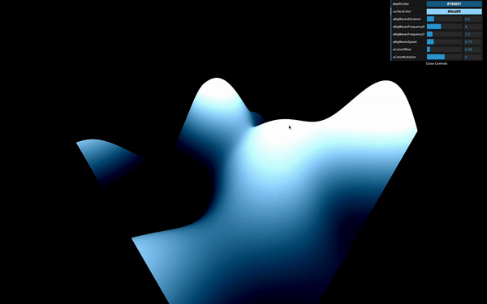

_https://threejs-journey.xyz/assets/lessons/26/step-17.mp4_

This is not the expected result. First, the waves speed is too fast. So you must multiply the `uTime` by `0.2`:

```glsl
elevation += cnoise(vec3(modelPosition.xz, uTime * 0.2));
```

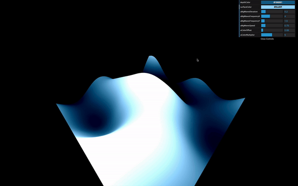

_https://threejs-journey.xyz/assets/lessons/26/step-18.mp4_

Secondly, the frequency is too small. That results in waves as large as the big ones we created previously. To increase the frequency, multiply `modelPosition.xz` by `3.0`:

```glsl
elevation += cnoise(vec3(modelPosition.xz * 3.0, uTime * 0.2));
```


_https://threejs-journey.xyz/assets/lessons/26/step-19.mp4_

Thirdly, the waves are way too high. Let's reduce that by multiplying the noise by `0.15`:

```glsl
elevation += cnoise(vec3(modelPosition.xz * 3.0, uTime * 0.2)) * 0.15;
```


_https://threejs-journey.xyz/assets/lessons/26/step-20.mp4_

Finally, real-life waves aren't that smooth. Realistic waves have rounded troughs and high crests. To achieve this result, we can use the `abs(...)` function:

```glsl
elevation += abs(cnoise(vec3(modelPosition.xz * 3.0, uTime * 0.2)) * 0.15);
```


_https://threejs-journey.xyz/assets/lessons/26/step-21.mp4_

We got exactly the opposite of what we wanted with rounded crests and high troughs. To invert the waves, replace `+` by `-`:

```glsl
elevation -= abs(cnoise(vec3(modelPosition.xz * 3.0, uTime * 0.2)) * 0.15);
```


_https://threejs-journey.xyz/assets/lessons/26/step-22.mp4_

That's better, but when you look at waves in a raging sea, they seem more chaotic with different and unpredictable frequencies.

We need to apply even more noises at higher frequencies. We could repeat the previous line with different values, but it's the perfect occasion to use a `for(...)` loop.

`for(...)` loops work in GLSL. Just make sure to user a `float` type variable. We are going to use 3 iterations starting from `1.0`:

```glsl
for(float i = 1.0; i <= 3.0; i++)
{
}
```

Then move our previous formula in the loop:

```glsl
for(float i = 1.0; i <= 3.0; i++)
{
    elevation -= abs(cnoise(vec3(modelPosition.xz * 3.0, uTime * 0.2)) * 0.15);
}
```

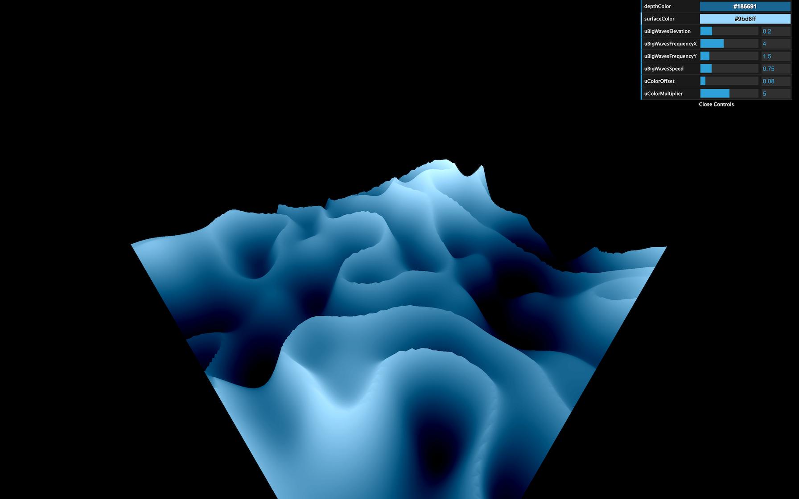

Right now, we are applying 3 times the same formula, which should result in the same waves, but their amplitude is much more prominent.

Let's increase the frequency and reduce the amplitude according to the `i` variable:

```glsl
for(float i = 1.0; i <= 3.0; i++)
{
    elevation -= abs(cnoise(vec3(modelPosition.xz * 3.0 * i, uTime * 0.2)) * 0.15 / i);
}
```

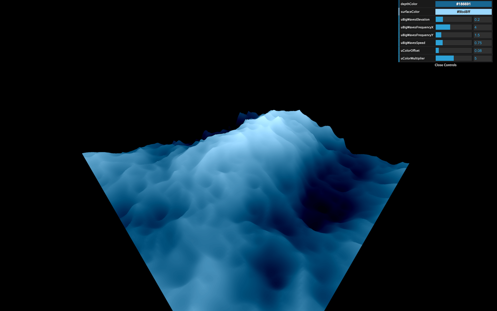

That's much better. Maybe you haven't noticed it, but we can barely see the smaller waves. That is because our geometry is missing vertices. Increase the subdivisions to `512x512`:

```js
const waterGeometry = new THREE.PlaneGeometry(2, 2, 512, 512)
```

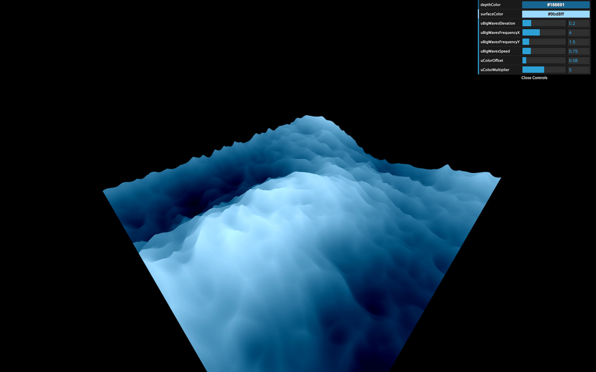

That represents a lot of triangles, but the plane is the only geometry we have in the scene, and we are animating almost everything in the shader, meaning that the GPU is doing the heavy lifting.

Let's add some uniforms and tweaks to control these small waves:

```js
const waterMaterial = new THREE.ShaderMaterial({
    vertexShader: waterVertexShader,
    fragmentShader: waterFragmentShader,
    uniforms:
    {
        // ...

        uSmallWavesElevation: { value: 0.15 },
        uSmallWavesFrequency: { value: 3 },
        uSmallWavesSpeed: { value: 0.2 },
        uSmallIterations: { value: 4 },

        // ...
    }
})

// ...

gui.add(waterMaterial.uniforms.uSmallWavesElevation, 'value').min(0).max(1).step(0.001).name('uSmallWavesElevation')
gui.add(waterMaterial.uniforms.uSmallWavesFrequency, 'value').min(0).max(30).step(0.001).name('uSmallWavesFrequency')
gui.add(waterMaterial.uniforms.uSmallWavesSpeed, 'value').min(0).max(4).step(0.001).name('uSmallWavesSpeed')
gui.add(waterMaterial.uniforms.uSmallIterations, 'value').min(0).max(5).step(1).name('uSmallIterations')
```

And in the vertex shader:

```glsl
uniform float uSmallWavesElevation;
uniform float uSmallWavesFrequency;
uniform float uSmallWavesSpeed;
uniform float uSmallIterations;

// ...

void main()
{
    // ...

    for(float i = 1.0; i <= uSmallIterations; i++)
    {
        elevation -= abs(cnoise(vec3(modelPosition.xz * uSmallWavesFrequency * i, uTime * uSmallWavesSpeed)) * uSmallWavesElevation / i);
    }

    // ...
}
```


_https://threejs-journey.xyz/assets/lessons/26/step-26.mp4_

And that's it.

## Go further

If you wanted to go further, you could try to add foam.

You could also attempt to enlarge the plane.

Adding fog would be a great way to get a more immersive experience that would enhance the feeling of being lost in the sea. Be careful though, adding fog will be more challenging than what we saw because you need to write the code for that fog on your own.
