# Animated galaxy

[](https://shields.io)

Learn in [https://threejs-journey.xyz/lessons/27](https://threejs-journey.xyz/lessons/27)

## Introduction

You can also use shaders with the particles. As we saw in the **Particles** lesson, animating each vertex of the geometry isn't an efficient solution for performance reasons. That is where the GPU comes in by animating those vertices directly in the vertex shader.

In this lesson, we are going to start with our particle galaxy. We will animate the particles in the vertex shader to make the stars rotate but at different speeds depending on the center's distance, and we will draw a pattern in the particles instead of those ugly squares.

## Setup

The starter is almost the same as the **Galaxy Generator** lesson starter. The only difference is the spin formula is missing because we will do the spin animation in the shader.

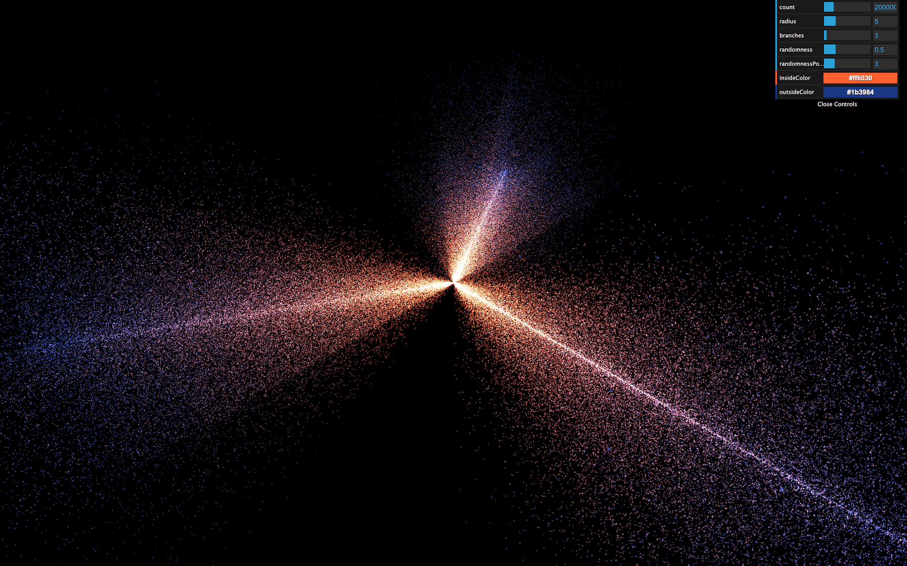

## Replacing PointsMaterial by ShaderMaterial

The particles are currently using a [PointsMaterial](https://threejs.org/docs/index.html#api/en/materials/PointsMaterial), but we need to use a [ShaderMaterial](https://threejs.org/docs/index.html#api/en/materials/ShaderMaterial) if we want to write our own shaders.

Replace `PointsMaterial` by `ShaderMaterial`:

```js
material = new THREE.ShaderMaterial({
    // ...
})
```

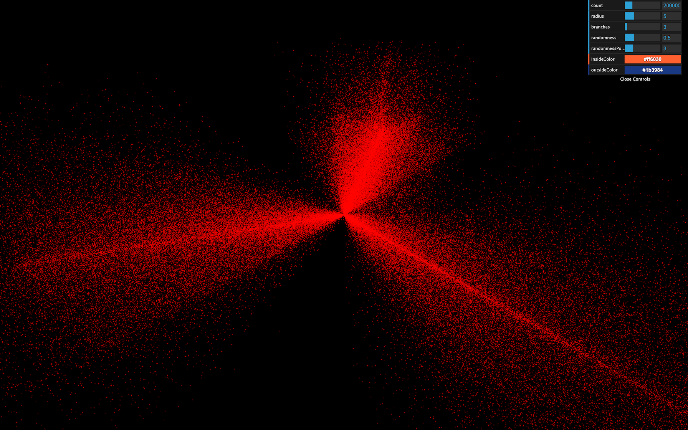

If you look at the logs, you should see two warnings telling us that the [ShaderMaterial](https://threejs.org/docs/index.html#api/en/materials/ShaderMaterial) supports neither `size` nor `sizeAttenuation`. We will have to add these features on our own. For now, remove these properties:

```js
material = new THREE.ShaderMaterial({
    depthWrite: false,
    blending: THREE.AdditiveBlending,
    vertexColors: true
})
```

At this exact moment, some might see the particles like tiny red dots, and some might get a black screen. That depends on how your GPU handles the particles when no size is provided. We won't waste time on this because we will give a size anyway, and everyone should see the particles.

Clearly, we need to provide our own shaders. Add the following `vertexShader`:

```js
material = new THREE.ShaderMaterial({

    // ...

    vertexShader: `
        void main()
        {
            /**
             * Position
             */
            vec4 modelPosition = modelMatrix * vec4(position, 1.0);
            vec4 viewPosition = viewMatrix * modelPosition;
            vec4 projectedPosition = projectionMatrix * viewPosition;
            gl_Position = projectedPosition;

            /**
             * Size
             */
            gl_PointSize = 2.0;
        }
    `
})
```

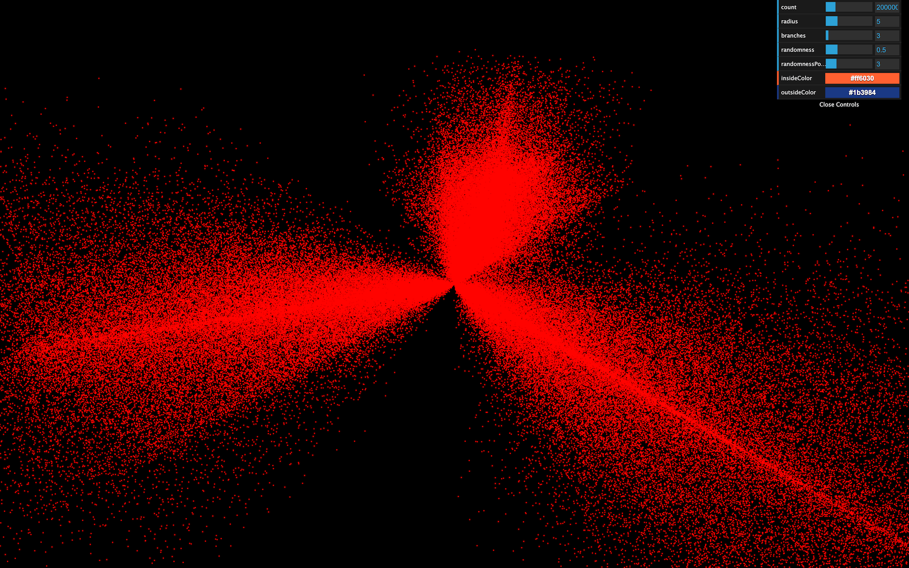

The beginning of the shader is the same as we've already seen. We update the `position` by using successively the `modelMatrix`, the `viewMatrix`, and the `projectionMatrix`. But then, we assign a new variable called `gl_PointSize` with `2.0` as the value.

`gl_PointSize` is precisely what you might think. The particles will have a `2x2` size, and you should see `2x2` particles regardless of the distance of the camera.

The unit here are fragments and if you are using a normal screen with a pixel ratio of `1`, you'll get 2 pixels by 2 pixels because 1 fragment = 1 pixel. But if you are using a screen with a higher pixel ratio like a retina screen, 1 fragment will be smaller than 1 pixel and you should get smaller particles. We'll fix that later in order to get a consistent result through any pixel ratio.

Before we improve the particles size, let's change the color.

The particles are currently red because we didn't provide any `fragmentShader` and Three.js uses a default one with a red output.

Add the following fragment shader with a white color:

```js
material = new THREE.ShaderMaterial({

        // ...

        fragmentShader: `
            void main()
            {
                gl_FragColor = vec4(1.0, 1.0, 1.0, 1.0);
            }
        `
    })
```

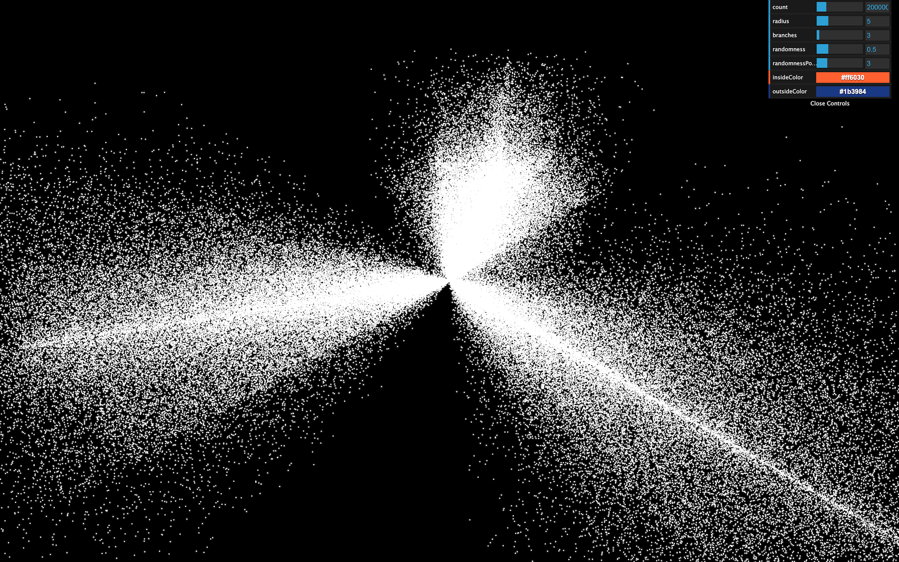

All the particles should be white.

## Move the shaders to separate files

Now is an excellent time to move the shaders to separate files before they get too long and unmanageable.

In `/src/`, create a `shaders/`, and then a `galaxy/` folder inside.

Inside that folder, create a `vertex.glsl` file with the `vertexShader` property content:

```glsl
void main()
{
    /**
     * Position
     */
    vec4 modelPosition = modelMatrix * vec4(position, 1.0);
    vec4 viewPosition = viewMatrix * modelPosition;
    vec4 projectedPosition = projectionMatrix * viewPosition;
    gl_Position = projectedPosition;

    /**
     * Size
     */
    gl_PointSize = 2.0;
}
```

And a `fragment.glsl`:

```glsl
void main()
{
    gl_FragColor = vec4(1.0, 1.0, 1.0, 1.0);
}
```

The Webpack configuration already supports `.glsl` files. We only need to import these in the JavaScript, and use them in the material:

```js
import galaxyVertexShader from './shaders/galaxy/vertex.glsl'
import galaxyFragmentShader from './shaders/galaxy/fragment.glsl'

// ...

material = new THREE.ShaderMaterial({
    // ...

    vertexShader: galaxyVertexShader,
    fragmentShader: galaxyFragmentShader
})
```

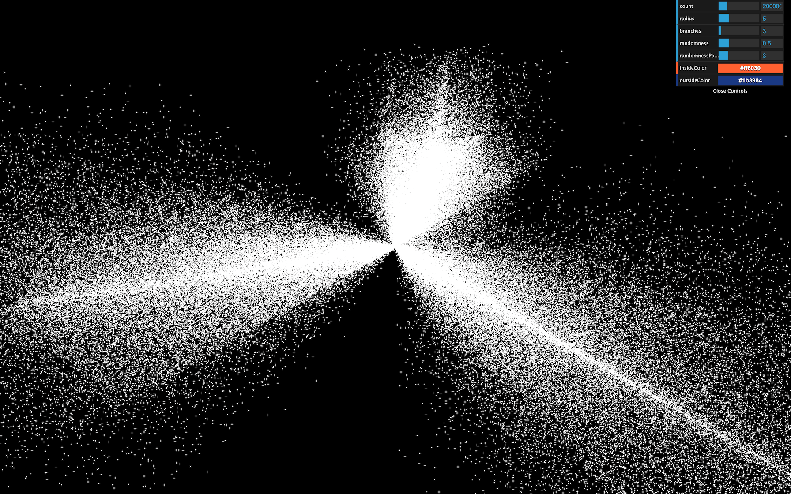

The result should be the same.

You don't need to put the shaders in separate files, but it's good practice, and the syntax coloration might prevent you from making mistakes.

Also, if you installed a linter like suggested in a previous lesson, you'll see potential errors before refreshing.

## Handling the size

### Base size

First, we will add a base size for every particles, and we want to be able to change the value from the JavaScript. To do that, let's add the usual `uniforms` property to our material with a `uSize` uniform:

```js
material = new THREE.ShaderMaterial({

    // ...

    uniforms:
    {
        uSize: { value: 8 }
    },

    // ...
})
```

We can now retrieve the value in the `vertexShader` and use it in the `gl_PointSize`:

```glsl
uniform float uSize;

void main()
{
    // ...

    gl_PointSize = uSize;
}
```

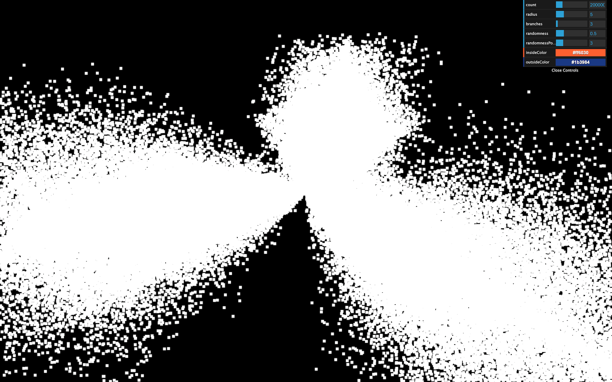

They appear quite big here, but they'll look smaller very soon.

### Randomized size

In real life, stars have different sizes. Let's add some randomness. We want to associate a distinct value for each vertex. We are going to use an attribute.

Add a `aScale` attribute to the geometry. We already have a `position`, and a `color` attribute and we can easily add the new attribute following the same instructions:

```js
geometry = new THREE.BufferGeometry()

const positions = new Float32Array(parameters.count * 3)
const colors = new Float32Array(parameters.count * 3)
const scales = new Float32Array(parameters.count * 1)

// ...

for(let i = 0; i < parameters.count; i++)
{
    // ...

    // Scale
    scales[i] = Math.random()
}

geometry.setAttribute('position', new THREE.BufferAttribute(positions, 3))
geometry.setAttribute('color', new THREE.BufferAttribute(colors, 3))
geometry.setAttribute('aScale', new THREE.BufferAttribute(scales, 1))
```

Make sure to use `1` instead of `3` when creating the `Float32Array` and the `BufferAttribute` because this value is a `float` and not a `vec3` like the others —we need only one value per vertex. We also named the attribute `aScale` with a prepended `a`.

You might be tempted to change the `position` and `color` attributes for `aPosition` and `aColor`, but that would result in a bug because we are using a [ShaderMaterial](https://threejs.org/docs/index.html#api/en/materials/ShaderMaterial) which pre-pend code to our vertex shader and that code add something like `attribute vec3 position;` and `attribute vec3 color;`.

We can now retrieve the attribute in the vertex shader and multiply the `uSize` by it:

```glsl
uniform float uSize;

attribute float aScale;

void main()
{
    // ...

    gl_PointSize = uSize * aScale;
}
```

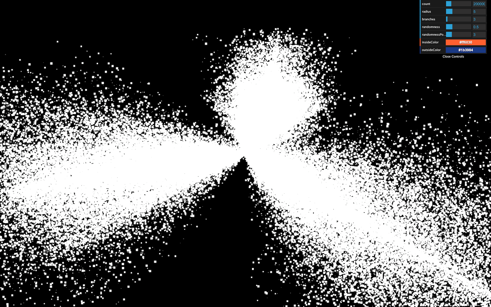

You should see particles with random sizes.

### Fixing the pixel ratio

However, we have a problem with our particles. Their size depends on the screen's pixel ratio. Remember that we updated the pixel ratio of the renderer by using the following line:

```js
renderer.setPixelRatio(Math.min(window.devicePixelRatio, 2))
```

If you have a screen with a pixel ratio of `1`, the particles will look 2 times bigger than if you had a screen with a pixel ratio of `2`.

We need a solution to get the same particle size regardless of the pixel ratio.

They are multiple ways of doing so. The easiest one is to multiply the `uSize` value by the pixel ratio of the `renderer`. We can retrieve this pixel ratio with the `getPixelRatio()` method:

```js
material = new THREE.ShaderMaterial({

    // ...

    uniforms:
    {
        uSize: { value: 8 * renderer.getPixelRatio() }
    }

    // ...
})
```

Unhappily, this code won't work because we are creating the `material` before we create the `renderer`. To fix that, simply move the first call of `generateGalaxy` after the instantiating the `renderer`:

```js
/**
 * Renderer
 */
const renderer = new THREE.WebGLRenderer({
    canvas: canvas
})

// ...

/**
 * Generate the first galaxy
 */
generateGalaxy()
```


We now have particles that look the same regardless of the pixel ratio.

### Size attenuation

We removed the property `sizeAttenuation` because the [ShaderMaterial](https://threejs.org/docs/index.html#api/en/materials/ShaderMaterial) does not support it. We need to apply this size attenuation on our own.

As a reminder, the size attenuation makes the particles far from the camera smaller, and the ones close to the camera bigger. That simulates the perspective.

Instead of trying to guess the formula to get the right size, we will directly go to the Three.js dependency folder and get the code that handles this part in the [PointsMaterial](https://threejs.org/docs/index.html#api/en/materials/PointsMaterial) code.

While there is a lot of code in the Three.js library folder, it's well organized and easy to navigate. Don't hesitate to spend some time in it and get use to it.

You can find the shader handling this part in `/node_modules/three/src/renderers/shaders/ShaderLib/point_vert.glsl.js` and it should look like this:

```glsl
#ifdef USE_SIZEATTENUATION

    bool isPerspective = isPerspectiveMatrix( projectionMatrix );

    if ( isPerspective ) gl_PointSize *= ( scale / - mvPosition.z );

#endif
```

The only part we need is this one:

```glsl
gl_PointSize *= ( scale / - mvPosition.z );
```

To get the size attenuation, we need to multiply `gl_PointSize` by this formula `( scale / - mvPosition.z )`

According to Three.js, the `scale` is a value related to the render height. To make things manageable, we can replace it with `1.0`.

The `mvPosition` corresponds to the position of the vertex once the `modelMatrix` and the `viewMatrix` have been applied. In our case, it's our `viewPosition` variable.

This might sound a little complex, but we can write it like that:

```glsl
gl_PointSize = uSize * aScale;
gl_PointSize *= (1.0 / - viewPosition.z);
```

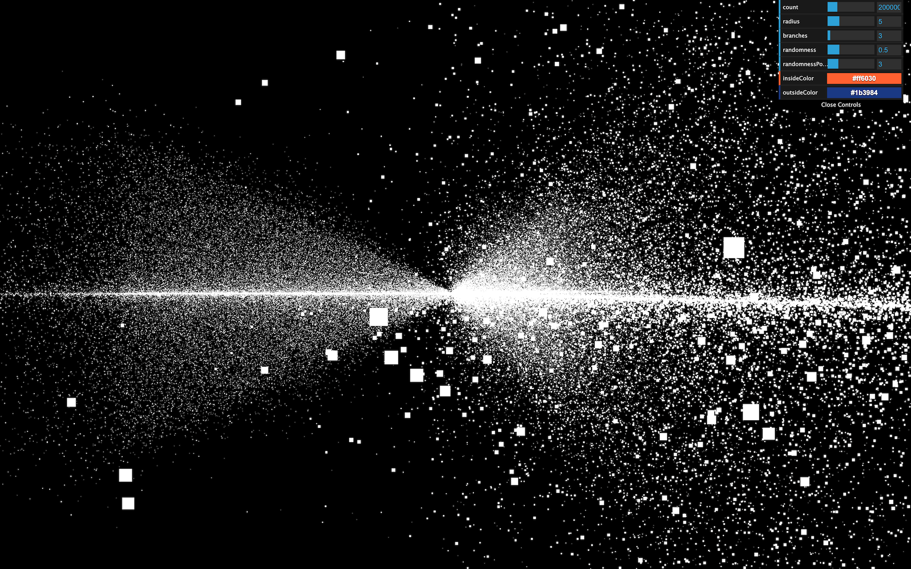

Get the camera close to the particles to see them getting bigger. We have our size attenuation.

## Drawing our particle pattern

It's time to draw a better-looking particle. Just like in the **Shader Patterns** lesson, we first need the UV coordinates. Sadly, we cannot send the UV from the vertex shader to the fragment shader. Remember that the vertex shader controls each particle position and a square plane facing the camera appears in place of the vertex.

The good news is that we already have access to the UV in the fragment shader with `gl_PointCoord`. This variable is specific to the particles.

Add it to the fragment shader to see the result:

```glsl
void main()
{
    gl_FragColor = vec4(gl_PointCoord, 1.0, 1.0);
}
```

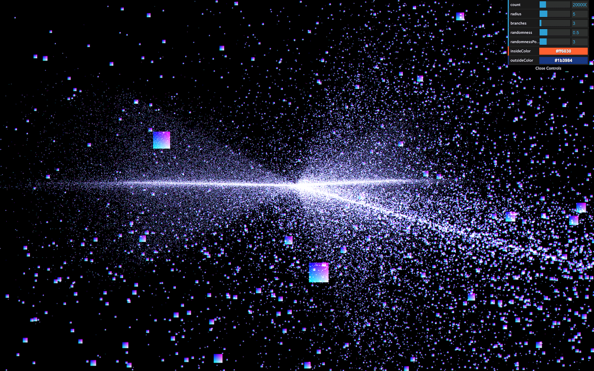

You should see the usual UV pattern on each particle.

Now would be a good time for you to try to draw some star shapes. You can start with a disc, then a point light and why not a star shape in the cartoons or anything you want. Keep in mind that it takes practice to be able to do that and your first attempts might not get the work done but still, you'll gain experience.

### Disc pattern

To get a disc:

- Get the distance between `gl_PointCoord` and the center (`vec2(0.5)`).
- Apply a step function to get `0.0` if the distance is below `0.5`, and `1.0` if the distance is above `0.5`.
- Invert the value.

Then, we use the `strength` for `r`, `g`, and `b`:

```glsl
void main()
{
    // Disc
    float strength = distance(gl_PointCoord, vec2(0.5));
    strength = step(0.5, strength);
    strength = 1.0 - strength;

    gl_FragColor = vec4(vec3(strength), 1.0);
}
```

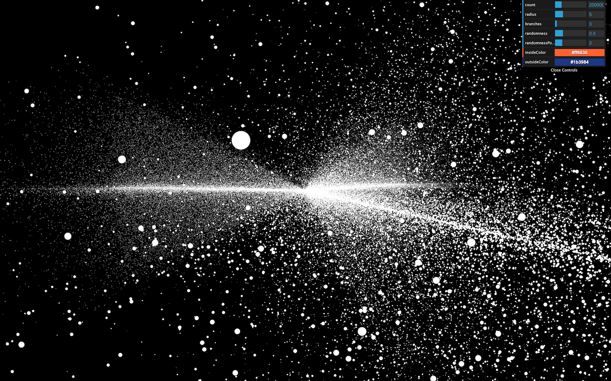

### Diffuse point pattern

To get a diffuse point:

- Get the distance between `gl_PointCoord` and the center (`vec2(0.5)`).
- Multiply it by `2.0`, so it reaches `1.0` before touching the edge.
- Invert the value.

```glsl
void main()
{
    // Diffuse point
    float strength = distance(gl_PointCoord, vec2(0.5));
    strength *= 2.0;
    strength = 1.0 - strength;

    gl_FragColor = vec4(vec3(strength), 1.0);
}
```

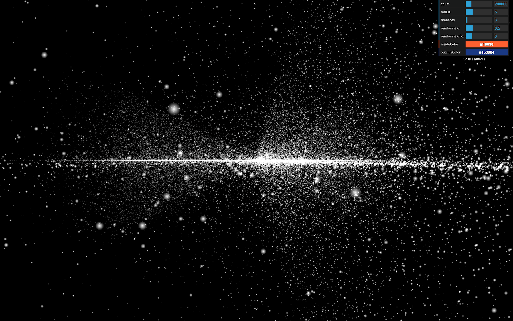

That's better, but it still lacks realism. What we are missing here is a very intense center that dims fast.

### Light point pattern

To get a light point:

- Get the distance between `gl_PointCoord` and the center (`vec2(0.5)`).
- Invert the value.
- Apply a power on it with a high number.

```glsl
void main()
{
    // Light point
    float strength = distance(gl_PointCoord, vec2(0.5));
    strength = 1.0 - strength;
    strength = pow(strength, 10.0);

    gl_FragColor = vec4(vec3(strength), 1.0);
}
```

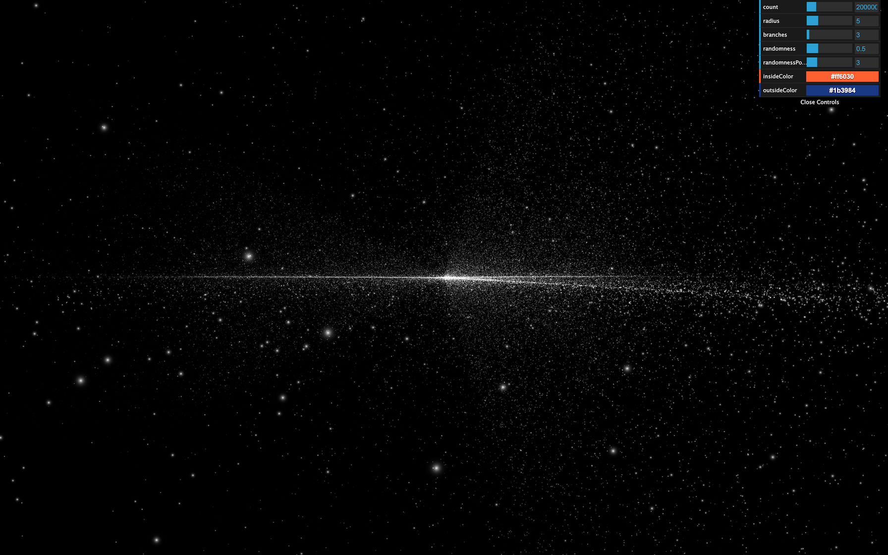

The good thing with that solution is that we can control how condensed the glow is with the `pow()` value.

We will stick with that pattern. Because the lights look smaller, let's increase the `uSize` a little:

```js
material = new THREE.ShaderMaterial({

    // ...

    uniforms:
    {
        uSize: { value: 30 * renderer.getPixelRatio() }
    },

    // ...
})
```

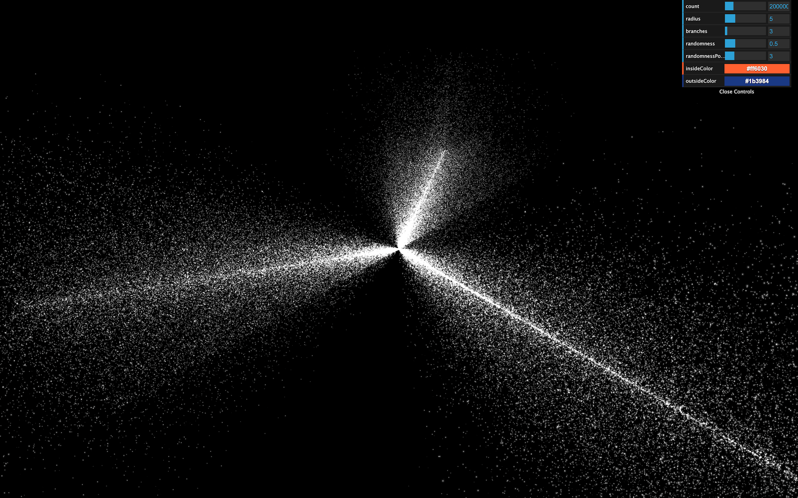

Unfortunately, we are reaching performance limits for some computers, and you might experience frame rate drops. If so, reduce the number of particles or their size.

## Handling the color

In the process, we lost the colors. The good news is that our shader partially supports these colors. We merely need to use their values.

To retrieve the `color` attribute, we should have written something like this in the vertex shader:

```glsl
attribute vec3 color;
```

Because we are using a [ShaderMaterial](https://threejs.org/docs/index.html#api/en/materials/ShaderMaterial) and not a [RawShaderMaterial](https://threejs.org/docs/index.html#api/en/materials/RawShaderMaterial) there's no need to. The code will be prepended once the shader is compiled. All we need to do is send it to the fragment shader. To do that, we are going to use a `varying` named `vColor` and update that varying with the `color` attribute:

```glsl
// ...

varying vec3 vColor;

void main()
{
    // ...

    /**
     * Color
     */
    vColor = color;
}
```

We can then retrieve it in the fragment shader with the same `varying` declaration and use it in a `mix(...)` between black and `vColor` according to the `strength`:

```glsl
varying vec3 vColor;

void main()
{
    // Light point
    float strength = distance(gl_PointCoord, vec2(0.5));
    strength = 1.0 - strength;
    strength = pow(strength, 10.0);

    // Final color
    vec3 color = mix(vec3(0.0), vColor, strength);
    gl_FragColor = vec4(color, 1.0);
}
```

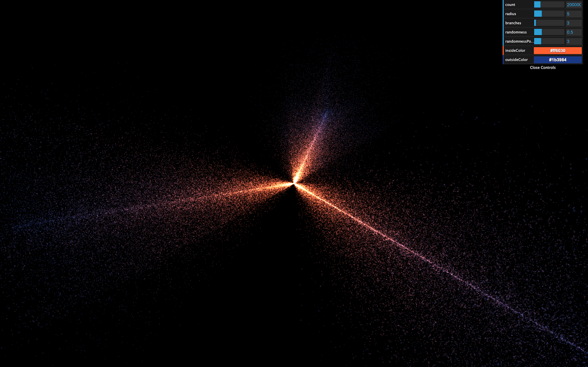

Now you see the original colors.

## Animate

It's time to animate. First, we are going to use the usual `uTime` uniform. Add it to the uniforms and update its value in the `tick` function:

```js
material = new THREE.ShaderMaterial({

    // ...

    uniforms:
    {
        uTime: { value: 0 },
        uSize: { value: 30 * renderer.getPixelRatio() }
    },

    // ...
})

// ...

const clock = new THREE.Clock()

const tick = () =>
{
    const elapsedTime = clock.getElapsedTime()

    // Update material
    material.uniforms.uTime.value = elapsedTime

    // ...
}
```

Then we can add `uTime` to our shader:

```glsl
uniform float uTime;
```

The animation will be very average. We will make the stars rotate, but the closer to the center, the faster the rotation.

The following codes happen right after the `modelPosition` declaration in the vertex shader. As a reminder, the `modelPosition` is the position of the vertex after applying the `position`, `rotation`, and `scale` of the mesh. We must now update that variable.

Here's the process:

- We calculate the particle angle —seen from above the galaxy— and its distance to the center.
- We increase that angle using the distance from the center and the `uTime`. The furthest from the center the slower.
- We update the position according to that new angle.

We are going to use some trigonometry.

The rotation only occurs on the `x` and `z` axes and we can let the `y` value as it is, which greatly simplifies the whole thing.

First, retrieve the angle using `atan(...)`:

```glsl
vec4 modelPosition = modelMatrix * vec4(position, 1.0);

// Rotate
float angle = atan(modelPosition.x, modelPosition.z);
```

`atan` stands for **arc-tangent** and you can find more about it here: [https://thebookofshaders.com/glossary/?search=atan](https://thebookofshaders.com/glossary/?search=atan)

Then, fetch the distance from the center using `length()` which is simple the length of the vector:

```glsl
vec4 modelPosition = modelMatrix * vec4(position, 1.0);

// Rotate
float angle = atan(modelPosition.x, modelPosition.z);
float distanceToCenter = length(modelPosition.xz);
```

Then, we calculate an offset angle. As we said earlier, the closer to the center, the higher the angle. We also multiply that value by `uTime` itself multiplied by `0.2` to slow the effect down:

```glsl
vec4 modelPosition = modelMatrix * vec4(position, 1.0);

// Rotate
float angle = atan(modelPosition.x, modelPosition.z);
float distanceToCenter = length(modelPosition.xz);
float angleOffset = (1.0 / distanceToCenter) * uTime * 0.2;
```

We then apply that `angleOffset` to the base `angle`:

```glsl
vec4 modelPosition = modelMatrix * vec4(position, 1.0);

// Rotate
float angle = atan(modelPosition.x, modelPosition.z);
float distanceToCenter = length(modelPosition.xz);
float angleOffset = (1.0 / distanceToCenter) * uTime * 0.2;
angle += angleOffset;
```

Finally, we update the `modelPosition` on the `x` and `z` axes with `cos(...)` and `sin(...)`:

```glsl
vec4 modelPosition = modelMatrix * vec4(position, 1.0);

// Rotate
float angle = atan(modelPosition.x, modelPosition.z);
float distanceToCenter = length(modelPosition.xz);
float angleOffset = (1.0 / distanceToCenter) * uTime * 0.2;
angle += angleOffset;
modelPosition.x = cos(angle);
modelPosition.z = sin(angle);
```

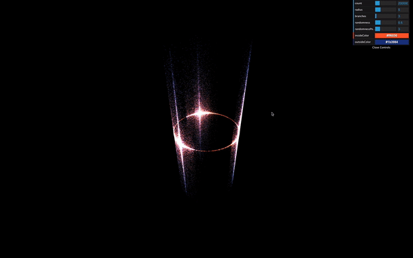

_https://threejs-journey.xyz/assets/lessons/27/step-16.mp4_

While this looks great, it's not the intended result. `cos(...)` and `sin(...)` return a position on a circle of radius `1`. That is why all the particles seem the rotate on a cylinder.

To fix it, we can simply multiply the `cos(...)` and `sin(...)` by the initial radius of the vertex, which we already have in `distanceToCenter`:

```glsl
vec4 modelPosition = modelMatrix * vec4(position, 1.0);

// Rotate
float angle = atan(modelPosition.x, modelPosition.z);
float distanceToCenter = length(modelPosition.xz);
float angleOffset = (1.0 / distanceToCenter) * uTime * 0.2;
angle += angleOffset;
modelPosition.x = cos(angle) * distanceToCenter;
modelPosition.z = sin(angle) * distanceToCenter;
```


_https://threejs-journey.xyz/assets/lessons/27/step-17.mp4_

All the vertices should rotate beautifully.

## Fix the randomness

If you wait for a little, you'll see that the stars seem to create a ribbon shape. It's like if the randomness doesn't work anymore on the `x` and `z` axes. That is due to the rotation formula that stretches the stars on a spin pattern.

To fix that, we can remove the randomness from the `position` attribute, save it in a new attribute named `aRandomness`. Then apply this randomness **after** rotating the stars in the vertex shader.

Create the attribute and store the randomness in it. Don't forget to remove the randomness from the `positions`:

```js
geometry = new THREE.BufferGeometry()

const positions = new Float32Array(parameters.count * 3)
const randomness = new Float32Array(parameters.count * 3)

// ...

for(let i = 0; i < parameters.count; i++)
{
    // ...

    positions[i3    ] = Math.cos(branchAngle) * radius
    positions[i3 + 1] = 0
    positions[i3 + 2] = Math.sin(branchAngle) * radius

    randomness[i3    ] = randomX
    randomness[i3 + 1] = randomY
    randomness[i3 + 2] = randomZ

    // ...
}

geometry.setAttribute('position', new THREE.BufferAttribute(positions, 3))
geometry.setAttribute('aRandomness', new THREE.BufferAttribute(randomness, 3))

// ...
```

In the vertex shader, retrieve the attribute and apply it on the `xyz` of the `modelPosition` after applying the rotation:

```glsl
// ...

attribute vec3 aRandomness;
attribute float aScale;

 // ...

void main()
{
    /**
     * Position
     */
    vec4 modelPosition = modelMatrix * vec4(position, 1.0);

    // Rotate
    float angle = atan(modelPosition.x, modelPosition.z);
    float distanceToCenter = length(modelPosition.xz);
    float angleOffset = (1.0 / distanceToCenter) * uTime * 0.2;
    angle += angleOffset;
    modelPosition.x = cos(angle) * distanceToCenter;
    modelPosition.z = sin(angle) * distanceToCenter;

    // Randomness
    modelPosition.xyz += aRandomness;

    // ...
}
```


_https://threejs-journey.xyz/assets/lessons/27/step-18.mp4_

The result should look much better and the ribbon shape should be gone.

Reduce the randomness parameter for a better result:

```js
parameters.randomness = 0.2
```


_https://threejs-journey.xyz/assets/lessons/27/step-19.mp4_

## Go further

You could also add the `uSize` uniform to the debug panel.

After a few minutes, we cannot fully distinguish the galaxy branches. You could add a reset button or slow down the speed.

Galaxies usually have a massive black hole in their center. Why not try to create one?
