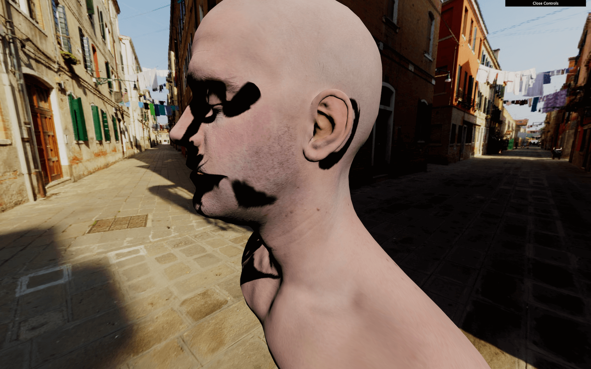
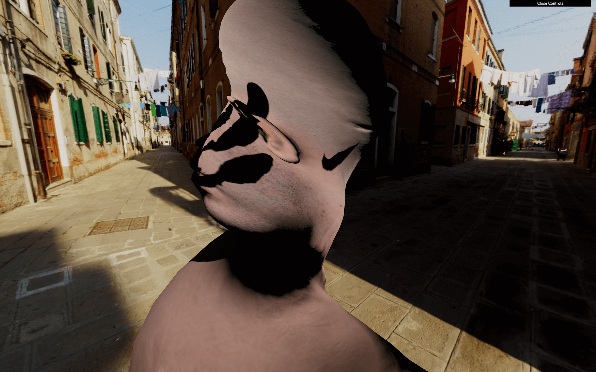

# Modified materials

[](https://shields.io)

Learn in [https://threejs-journey.xyz/lessons/28](https://threejs-journey.xyz/lessons/28)

## Introduction

Until now, we were creating brand new shader materials. But what if we only want to modify one of the Three.js built-in materials? Maybe we are happy with the result of the [MeshStandardMaterial](https://threejs.org/docs/#api/en/materials/MeshStandardMaterial), but we want to add vertex animations to it. If we were to rewrite the whole [MeshStandardMaterial](https://threejs.org/docs/#api/en/materials/MeshStandardMaterial), it would take too much time to handle the lights, the environment maps, physically based rendering, all the types of textures, etc.

Instead, we will start from the [MeshStandardMaterial](https://threejs.org/docs/#api/en/materials/MeshStandardMaterial) and try to integrate our code in its shaders.

There are two ways of doing it:

- By using a Three.js hook triggered before the shader is compiled that let us play with the shaders and inject our code.
- By recreating the material as a brand new one, but following what is done in Three.js code and then using the same parameters, plus the ones that we want to add.

While the second option is perfectly acceptable, we would need to spend a lot of time in the Three.js source code to understand how to set everything right.

Instead, we will use the first technique. We still will spend some time in the Three.js code, but it will be much easier.

In this lesson, we will make the model vertices twist in a funny way but with all the base features of the material still working like shadows, texture, normal map, etc.

## Setup

We will use the same setup as the **Realistic Model Render** lesson but with the famous **Lee Perry-Smith** head model. It's just a popular model with only one mesh and realistic textures that should go well with our twist animation.


Both the loading and base material setup is already done. A [MeshStandardMaterial](https://threejs.org/docs/#api/en/materials/MeshStandardMaterial) with a `map` and a `normalMap` are created before loading the model. This material is then used on the only [Mesh](https://threejs.org/docs/#api/en/objects/Mesh) of the model. This [Mesh](https://threejs.org/docs/#api/en/objects/Mesh) is finally added to the scene.

Most of the following code will concern the material.

## Hooking the material

We have our [MeshStandardMaterial](https://threejs.org/docs/#api/en/materials/MeshStandardMaterial), but we want to modify its shader.

To modify a material, we first need access to its original shaders. To do that, we can use the `onBeforeCompile` property on the material.

If we assign a function to it, this function will be called with the shader options as the first parameter right before being compiled:

```js
material.onBeforeCompile = (shader) =>
{
    console.log(shader)
}
```

We now have access to the `vertexShader`, the `fragmentShader`, and the `uniforms` and we can modify these and see the result.

## Adding content to the vertex shader

If you look at the `vertexShader`, there isn't much code. Three.js uses its own system to include shader parts to prevent repeating the same code between the different materials. Each `#include ...` will inject a code located in specific folder of the Three.js dependency.

That is, in a way, suitable for us because we can replace those parts with a simple native JavaScript [replace(...)](https://developer.mozilla.org/docs/Web/JavaScript/Reference/Global_Objects/String/replace).

The problem is that we don't know which part is doing what and which one to replace. To understand the code, we need to dive into the `three` dependency.

Go to the `/node_modules/three/src/renderers/shaders/` folder. That is where you'll find most of the Three.js shader codes.

All the included parts are called chunks, and you can find them in the `ShaderChunk/` folder.

If we look at the different chunks, it seems that `begin_vertex` is handling the position first by creating a variable named `transformed`.

Let's build our code on that. First, we need to replace this part of the code. Because the chunk is named `begin_vertex`, we need to replace `#include <begin_vertex>`:

```js
material.onBeforeCompile = (shader) =>
{
    shader.vertexShader = shader.vertexShader.replace('#include <begin_vertex>', '')
}
```

That should break the material because we are replacing the previous code with nothing. Our code will be a few lines long, so we are going to use back quotes.

Put the `include ...` back, to begin with, and not break anything:

```js
material.onBeforeCompile = (shader) =>
{
    shader.vertexShader = shader.vertexShader.replace(
        '#include <begin_vertex>',
        `
            #include <begin_vertex>
        `
    )
}
```


This code is useless because we are replacing something with the same thing, but now we can add our own code after the `include`.

As an example, let's move our head on the `y` axis. We saw in the `/node_modules/three/src/renderers/shaders/ShaderChunks/begin_vertex.glsl.js` file that a `transformed` variable is created and should contain the position of the vertex. It's `y` property to move all the vertices:

```js
shader.vertexShader = shader.vertexShader.replace(
    '#include <begin_vertex>',
    `
        #include <begin_vertex>

        transformed.y += 3.0;
    `
)
```


As you can see, it's working, but the shadow seems bugged. We will fix that later.

Remove the `transformed.y += 3.0;`.

## Twisting

Let's do the twist... on our vertices. There are multiple mathematics ways of doing the twist effect and this time, we are going to create a matrix.

Only the GLSL part will be present in the following code.

First, we will try to rotate all the vertices at the same angle. Then we will offset that angle depending on the elevation of the vertex and animate it.

Create an `angle` variable with any value:

```glsl
#include <begin_vertex>

float angle = 0.3;
```

Even if we aren't moving the vertices yet, you can still refresh to see if an error occurred.

If you remember, matrices are like a pipe where you send data —like a vector. The pipe will apply a transformation on that vector and output the result. We can create a matrix that scales the vector, one that rotates, one that moves, and we can even combine them. Those matrices can handle 2D transformations, 3D transformations, and even more.

In our case, we want to do a 2D transformations. Indeed, our vertices have 3D coordinates, but to do the twist animation, we are just rotating the vertices on the `x` and `z` axes, not up and down on the `y` axis.

To create the 2D rotation matrix, we won't go into mathematic details. Instead, we'll use this function that returns a 2 dimensions matrix (`mat2`):

```glsl
mat2 get2dRotateMatrix(float _angle)
{
    return mat2(cos(_angle), - sin(_angle), sin(_angle), cos(_angle));
}
```

If you want to know more about it, you can find details on The Book of Shaders: [https://thebookofshaders.com/08/](https://thebookofshaders.com/08/)

But where should we add this function exactly? If it were our own shader, we would have put it before the `main` function, and this is exactly what we are going to do. One chunk outside of the `main` function is `common`. This chunk has the advantage of being present on all shaders. Let's replace this part as we did with the `begin_vertex` chunk:

```js
material.onBeforeCompile = (shader) =>
{
    shader.vertexShader = shader.vertexShader.replace(
        '#include <common>',
        `
            #include <common>
        `
    )

    // ...
}
```

We can now add our `get2dRotateMatrix`:

```js
material.onBeforeCompile = (shader) =>
{
    shader.vertexShader = shader.vertexShader.replace(
        '#include <common>',
        `
            #include <common>

            mat2 get2dRotateMatrix(float _angle)
            {
                return mat2(cos(_angle), - sin(_angle), sin(_angle), cos(_angle));
            }
        `
    )

    // ...
}
```

Nothing changed, but we now have access to the `get2dRotateMatrix` anywhere in the shader, as in the `begin_vertex` chunk. That is because all the chunks are merged as if it was only one code.

Create the `rotateMatrix` variable using the `get2dRotateMatrix` function:

```glsl
#include <begin_vertex>

float angle = 0.3;
mat2 rotateMatrix = get2dRotateMatrix(angle);
```

We now have access to a matrix named `rotateMatrix` that should rotate a `vec2`. Let's apply this matrix to the `x` and `z` properties together:

```glsl
#include <begin_vertex>

float angle = 0.3;
mat2 rotateMatrix = get2dRotateMatrix(angle);

transformed.xz = rotateMatrix * transformed.xz;
```



The head should have rotate. Again, don't mind the shadows; we will handle that later.

We almost have our twist rotation. We only need to vary the `angle` according to the elevation:

```glsl
float angle = position.y * 0.9;
```



Poor head. It's time to animate the angle.

## Animating

We will use the same technique as before, and send a `uTime` uniform to our shader. We already have access to the uniforms with `shader.uniforms`. Let's update it the same way we update a [ShaderMaterial](https://threejs.org/docs/#api/en/materials/ShaderMaterial):

```js
material.onBeforeCompile = function(shader)
{
    shader.uniforms.uTime = { value: 0 }

    // ...
}
```

We can now retrieve our `uTime` uniform in the `common` chunk:

```glsl
#include <common>

uniform float uTime;

mat2 get2dRotateMatrix(float _angle)
{
    return mat2(cos(_angle), - sin(_angle), sin(_angle), cos(_angle));
}
```

And use it in the `begin_vertex` chunk:

```glsl
#include <begin_vertex>

float angle = (position.y + uTime) * 0.9;
mat2 rotateMatrix = get2dRotateMatrix(angle);

transformed.xz = rotateMatrix * transformed.xz;
```

You should get the same result because we aren't animating the `uTime` value. Unluckily, we have a JavaScript problem. We have no apparent way to access the uniform in the `tick` function. Unlike a [ShaderMaterial](https://threejs.org/docs/#api/en/materials/ShaderMaterial), we cannot just access the `uniforms` of `material`, and this is due to the Three.js structure.

There are many ways of fixing that. All we need is access to those uniforms. Let's create a `customUniforms` object before the material and add our `uTime` inside:

```glsl
const customUniforms = {
    uTime: { value: 0 }
}
```

Then, we use that object in the `onBeforeCompile` function:

```js
material.onBeforeCompile = (shader) =>
{
    shader.uniforms.uTime = customUniforms.uTime

    // ...
}
```

And because our `customUniforms` has been declared outside of any scope, we can simply update it in the `tick` function with the `elapsedTime` variable:

```js
const clock = new THREE.Clock()

const tick = () =>
{
    const elapsedTime = clock.getElapsedTime()

    // Update material
    customUniforms.uTime.value = elapsedTime

    // ...
}
```


_https://threejs-journey.xyz/assets/lessons/28/step-06.mp4_

Now, the head is rotating.

Let's fix the shadows.

## Fixing the shadow

As we saw in previous lessons, when using shadows, Three.js makes renders for the scene from the light point of view. Those renders result in pictures of what is in the shadow or the light. When those renders occur, all the materials are replaced by another set of materials dedicated to that specific render. The problem is that this kind of material doesn't twist because it has nothing to do with our modified [MeshStandardMaterial](https://threejs.org/docs/#api/en/materials/MeshStandardMaterial).

We can see that if we add a plane right behind the head:

```js
/**
 * Plane
 */
const plane = new THREE.Mesh(
    new THREE.PlaneGeometry(15, 15, 15),
    new THREE.MeshStandardMaterial()
)
plane.rotation.y = Math.PI
plane.position.y = - 5
plane.position.z = 5
scene.add(plane)
```


_https://threejs-journey.xyz/assets/lessons/28/step-07.mp4_

We need to find a way to twist that material too.

The material used for the shadows is a [MeshDepthMaterial](https://threejs.org/docs/#api/en/materials/MeshDepthMaterial) and we cannot access that material easily, but we can override it with the property `customDepthMaterial` on the mesh in order to tell Three.js to use a custom material.

First, let's create a this custom material. We are going to use a [MeshDepthMaterial](https://threejs.org/docs/#api/en/materials/MeshDepthMaterial) because this is exactly what Three.js is using during those renders. We will call it `depthMaterial` and add `THREE.RGBADepthPacking` to its `depthPacking` property:

```js
const depthMaterial = new THREE.MeshDepthMaterial({
    depthPacking: THREE.RGBADepthPacking
})
```

We won't explain what the `depthPacking` is in detail here, but it's just a better way of storing the depth by using the `r`, `g`, `b`, and `a` separately for better precision and Three.js needs it.

To apply our custom depth material, when our model is loaded, we change the `customDepthMaterial` property with our own `depthMaterial`:

```js
gltfLoader.load(
    '/models/LeePerrySmith/LeePerrySmith.glb',
    (gltf) =>
    {
        // ...

        mesh.material = material // Update the material
        mesh.customDepthMaterial = depthMaterial // Update the depth material

        // ...
    }
)
```

Here, we did it on the only mesh in the model but if we had a more complex model with multiple meshes, we would have to traverse it and update all the materials.

We can now apply all the changes to the shader we've made before but for the `depthMaterial`.

Copy and paste the `onBeforeCompile` part:

```js
depthMaterial.onBeforeCompile = (shader) =>
{
    shader.uniforms.uTime = customUniforms.uTime
    shader.vertexShader = shader.vertexShader.replace(
        '#include <common>',
        `
            #include <common>

            uniform float uTime;

            mat2 get2dRotateMatrix(float _angle)
            {
                return mat2(cos(_angle), - sin(_angle), sin(_angle), cos(_angle));
            }
        `
    )
    shader.vertexShader = shader.vertexShader.replace(
        '#include <begin_vertex>',
        `
            #include <begin_vertex>

            float angle = (position.y + uTime) * 0.9;
            mat2 rotateMatrix = get2dRotateMatrix(angle);

            transformed.xz = rotateMatrix * transformed.xz;
        `
    )
}
```

If you look at the shadow on the plane, you should see the twist too. But still, we have a problem. The drop shadow is fine, but the core shadow on the model seems wrong and it looks like the shadow is rotating with the vertices.


_https://threejs-journey.xyz/assets/lessons/28/step-08.mp4_

This is an issue related to the **normals**.

## Fixing the normals

In the previous lessons, we saw that normals are coordinates associated with each vertices that tell what direction the faces are facing. If we were to see those normals, they would be arrows all over the model pointing on the outside. Those normals are used for things like lighting, reflecting and shadowing.

When we rotated our vertices, we merely rotated the positions, but we didn't rotate the normals. We need to modify the chunk that handles normals.

Hang on; this part is a little tricky.

The chunk handling the normals first is called `beginnormal_vertex`. Let's replace it for the `material` —not the `depthMaterial` because this one doesn't need the normals:

```js
material.onBeforeCompile = (shader) =>
{
    // ...

    shader.vertexShader = shader.vertexShader.replace(
        '#include <beginnormal_vertex>',
        `
            #include <beginnormal_vertex>
        `
    )

    // ...
}
```

If you look at the chunk located in `/node_modules/three/src/renderers/shaders/ShaderChunks/beginnormal_vertex.glsl.js`, you'll see that the normal variable name is `objectNormal`. We could be tempted to do the same thing we did for the `transformed` variable:

```glsl
#include <beginnormal_vertex>

float angle = (position.y + 4.0) * sin(uTime) * 0.9;
mat2 rotateMatrix = get2dRotateMatrix(angle);

objectNormal.xz = objectNormal.xz * rotateMatrix;
```

Unfortunately, this will result in a shader error, containing the following messages: `'angle' : redefinition` and `'rotateMatrix' : redefinition`.

That happens because we forgot that all those shaders chunks, in the end, will be merged into a unique shader. The code we added to the `beginnormal_vertex` chunk will be aside of the code added to the `begin_vertex`, and we cannot have two variable declarations with the same name.

We need to remove the double declarations. If you look at the initial `vertexShader`, you'll see that the `beginnormal_vertex` happens before the `begin_vertex`. This means that we should remove the `angle` and `rotateMatrix` from the `begin_vertex`:

```js
material.onBeforeCompile = function(shader)
{
    // ...

    shader.vertexShader = shader.vertexShader.replace(
        '#include <beginnormal_vertex>',
        `
            #include <beginnormal_vertex>

            float angle = (position.y + uTime) * 0.9;
            mat2 rotateMatrix = get2dRotateMatrix(angle);

            objectNormal.xz = objectNormal.xz * rotateMatrix;
        `
    )
    shader.vertexShader = shader.vertexShader.replace(
        '#include <begin_vertex>',
        `
            #include <begin_vertex>

            transformed.xz = rotateMatrix * transformed.xz;
        `
    )
}
```


_https://threejs-journey.xyz/assets/lessons/28/step-09.mp4_

Everything should be working fine now, and our `begin_vertex` is using the `angle` and `rotateMatrix` from the `beginnormal_vertex` chunk.

## Go further

That concludes our lesson, but you can go even further if you want.

You could control the twist with the debug panel or even the mouse.

You could test other animations. For instance, this formula for the `angle` looks even more disturbing —make sure to change both the `material` and the `depthMaterial`:

```glsl
float angle = (sin(position.y + uTime)) * 0.4;
```


_https://threejs-journey.xyz/assets/lessons/28/step-10.mp4_

You could also improve the way we handle the GLSL codes. Having dedicated files could be handy.
