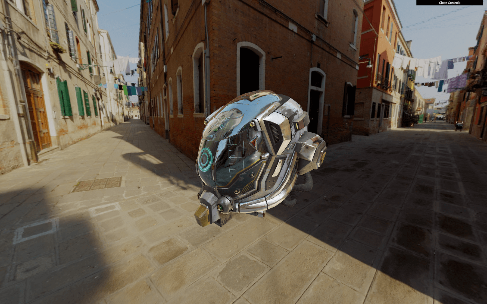
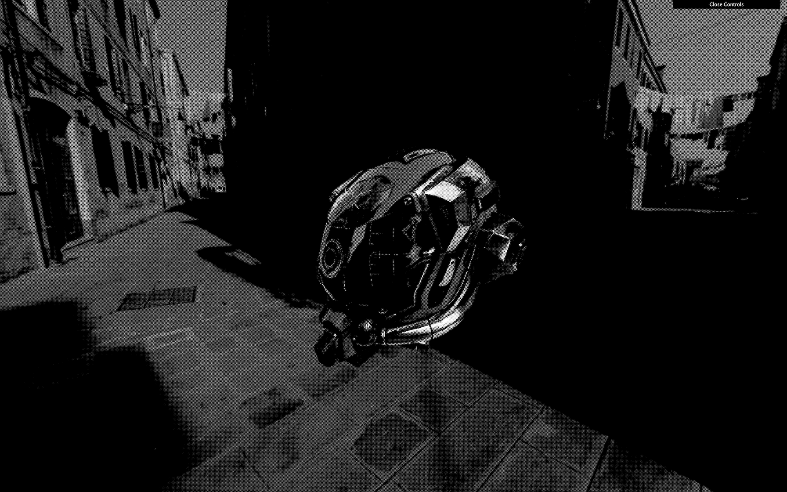
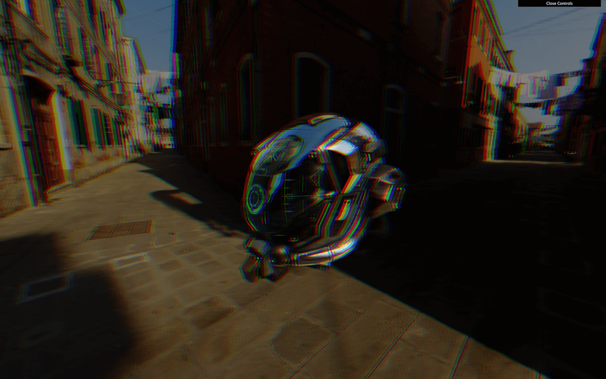
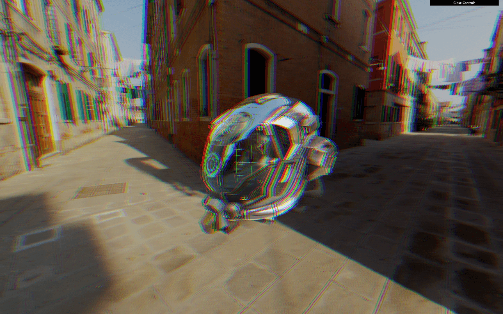
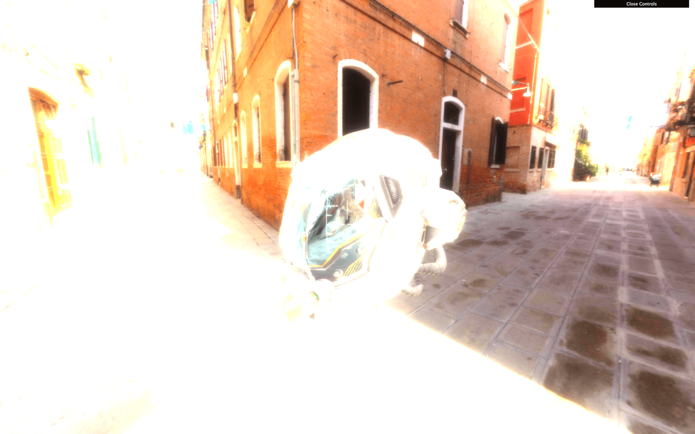
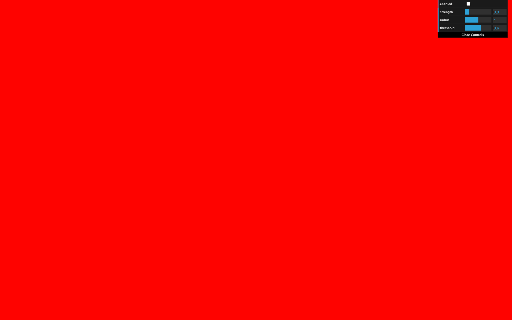
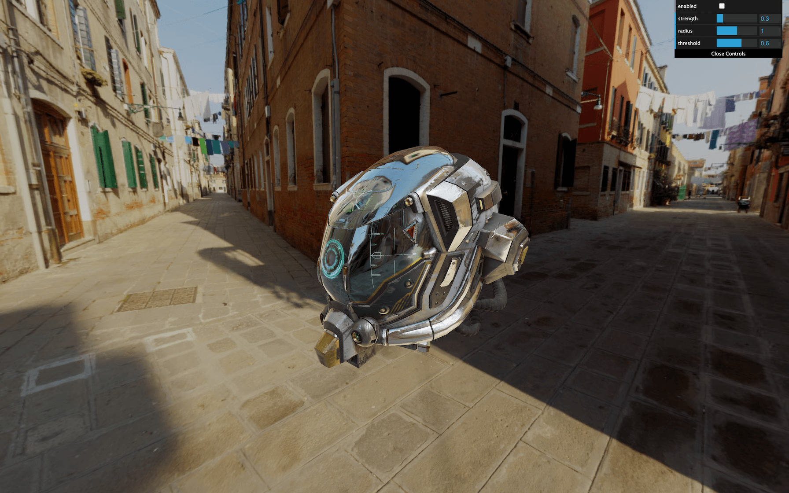
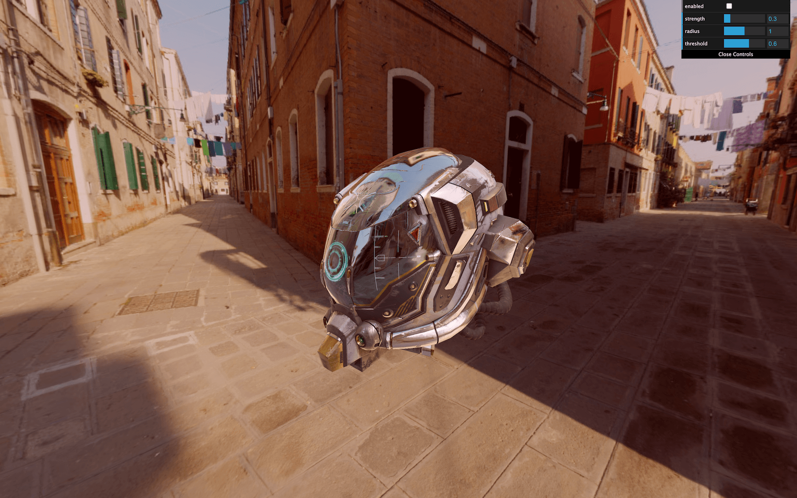

# Post-processing

[](https://shields.io)

Learn in [https://threejs-journey.xyz/lessons/29](https://threejs-journey.xyz/lessons/29)

## Introduction

Post-processing is about adding effects on the final image (the render). People mostly use this technique in filmmaking, but we can do it in WebGL too.

Post-processing can be subtle to improve the image slightly or to create huge effects.

Here are some examples of what you can use post-processing for:

- Depth of field
- Bloom
- God ray
- Motion blur
- Glitch effect
- Outlines
- Color variations
- Antialiasing
- Reflections and refractions
- Etc.

## Setup

We will use the same setup as the **Realistic Model Render** lesson but with the **[Damaged Helmet](https://github.com/KhronosGroup/glTF-Sample-Models/tree/master/2.0/DamagedHelmet)** model by [Leonardo Carrion](http://www.leonardocarrion.com/). It's a popular model with many details and good textures that should go well with our post-processing.



## How it works

Most of the time, post-processing works the same way.

### Render target

Instead of rendering in the canvas, we do the render in what we call a render target. That render target will give us a texture very similar to the usual texture. In a simpler way, we render in a texture instead of the canvas on the screen.

The term "render target" is specific to Three.js. Other contexts mostly use the word "buffer".

This texture is then applied to a plane facing the camera and covering the whole view. This plane uses a material with a special fragment shader that will do the post-processing effect. If the post-processing effect consists of redden the image, it would merely multiply the red value of the pixel in that fragment shader.

Most post-process effects are doing more than just tweaking the color values, but you get the idea.

In Three.js those "effects" are called "passes". We will refer to that term from now on.

### Ping-pong buffering

We can have multiple passes on our post-process: one doing the motion blur, one doing the color changes, one doing the depth of field, etc. Because we can have multiples passes, the post-processing needs two render targets. The reason is that we can't get the texture of a render target while drawing in it at the same time. The idea is to draw in the first render target while taking the texture from the second one. At the next pass, we switch those render targets, take the texture from the second, and draw on the first. And again at the next pass, we switch them, and again, and again. That is what we call **ping pong buffering**.

### Final pass on the canvas

The last pass won't be in a render target because we can put it directly on the canvas so the user can see the final result.

### In the end

All of these can be very complicated for beginners, but, fortunately, we don't have to do it on our own.

Actually, we could have start without even explaining those render target, textures, ping pong buffering, etc. but it's always good to understand what is really going on behind the scene.

All we have to do is use the [EffectComposer](https://threejs.org/docs/index.html#examples/en/postprocessing/EffectComposer) class that will handle most of the heavy lifting for us.

## EffectComposer

As we said, [EffectComposer](https://threejs.org/docs/index.html#examples/en/postprocessing/EffectComposer) will handle all the process of creating the render targets, doing the ping-pong thing, sending the texture of the previous pass to the current pass, drawing the last one on the canvas, etc.

First, we need to import it because it's not available in the `THREE` variable:

```js
import { EffectComposer } from 'three/examples/jsm/postprocessing/EffectComposer.js'
```

We will also need a first pass called `RenderPass`. This pass is in charge of the first render of our scene, but instead of doing it in the canvas, it will happen in a render target created inside the [EffectComposer](https://threejs.org/docs/index.html#examples/en/postprocessing/EffectComposer):

```js
import { RenderPass } from 'three/examples/jsm/postprocessing/RenderPass.js'
```

We can now instantiate our [EffectComposer](https://threejs.org/docs/index.html#examples/en/postprocessing/EffectComposer) and use our `renderer` as parameter. Like the [WebGLRenderer](https://threejs.org/docs/index.html#api/en/renderers/WebGLRenderer), we need to provide a pixel ratio with `setPixelRatio(...)` and resize it with `setSize(...)`. We will use the same parameters as for the `renderer`:

```js
/**
 * Post processing
 */
const effectComposer = new EffectComposer(renderer)
effectComposer.setPixelRatio(Math.min(window.devicePixelRatio, 2))
effectComposer.setSize(sizes.width, sizes.height)
```

Then we can instantiate our first pass and add it to our `effectComposer` with the `addPass(...)` method. The RenderPass needs the `scene` and the `camera` as parameters:

```js
const renderPass = new RenderPass(scene, camera)
effectComposer.addPass(renderPass)
```

In the `tick` function, instead of doing the renders like we used to, we will achieve the renders with `effectComposer`. Replace the `renderer.render(...)` with the following code:

```js
const tick = () =>
{
    // ...

    // Render
    // renderer.render(scene, camera)
    effectComposer.render()

    // ...
}
```

The `effectComposer` will start doing the renders with the ping pong thing and its render targets. But because we only have one pass —the `renderPass`— it will render it directly in the canvas like before.

It's time to add some neat post-process passes.

You can find a list of available passes in the documentation: [https://threejs.org/docs/index.html#examples/en/postprocessing/EffectComposer](https://threejs.org/docs/index.html#examples/en/postprocessing/EffectComposer)

We will use some of them to see how we can set things up, and then we will create our own pass.

## DotScreenPass

The `DotScreenPass` will apply some kind of black and white raster effect. We just need to import the `DotScreenPass`:

```js
import { DotScreenPass } from 'three/examples/jsm/postprocessing/DotScreenPass.js'
```

Instantiate it and add it to the `effectComposer`. Make sure to add it after the `renderPass`:

```js
const dotScreenPass = new DotScreenPass()
effectComposer.addPass(dotScreenPass)
```



To disable a pass, simply comment it or change its `enabled` property to `false`:

```js
const dotScreenPass = new DotScreenPass()
dotScreenPass.enabled = false
effectComposer.addPass(dotScreenPass)
```


Use this to test the different passes separately.

## GlitchPass

The `GlitchPass` will add screen glitches like when the cameras get hacked in the movies.

Import it and add it just like the `DotScreenPass`:

```js
import { GlitchPass } from 'three/examples/jsm/postprocessing/GlitchPass.js'

// ...

const glitchPass = new GlitchPass()
effectComposer.addPass(glitchPass)
```


_https://threejs-journey.xyz/assets/lessons/29/step-04.mp4_

Some passes also have editable properties. The `GlitchPass` have a `goWild` property that, if `true`, will result in a non-stop glitch:

**Be careful if you are sensible to flashes or fast movements!**

```js
glitchPass.goWild = true
```

## RGBShiftPass

Some passes need extra work like the RGBShift pass.

The RGBShift isn't available as a pass but as a shader. We need to import this shader and apply it to a `ShaderPass` and then add this ShaderPass to the `effectComposer`. That is precisely what happens in the `DotScreenPass` and the `GlitchPass` but we have to do it ourselves this time.

First, import the `ShaderPass` and the `RGBShiftShader` located in `three/examples/jsm/shaders/`:

```js
import { ShaderPass } from 'three/examples/jsm/postprocessing/ShaderPass.js'
import { RGBShiftShader } from 'three/examples/jsm/shaders/RGBShiftShader.js'
```

Then instantiate the `ShaderPass` with the `RGBShiftShader` as parameter and add it to the `effectComposer`:

```js
// ...

const rgbShiftPass = new ShaderPass(RGBShiftShader)
effectComposer.addPass(rgbShiftPass)
```



And that's all.

## Fixing the color

You might have noticed a color change in the render, as if everything became darker, and you are right. Disable the previous shaders `dotScreenPass` and the `rgbShiftPass` to see it more clearly with the `glitchPass` —without the `goWild`.

What's happening here is that the `renderer.outputEncoding = THREE.sRGBEncoding` doesn't work anymore. You can comment it, and you'll see no difference. Passes are rendered in render targets, and those aren't configured the same.

Fortunately, we can provide our own render target to [EffectComposer](https://threejs.org/docs/index.html#examples/en/postprocessing/EffectComposer) as the second parameter.

If you look at the code of the [EffectComposer](https://threejs.org/docs/index.html#examples/en/postprocessing/EffectComposer) located in `/node_modules/three/examples/jsm/postprocessing/EffectComposer.js` you'll see the `renderTarget` being made from a [WebGLRenderTarget](https://threejs.org/docs/index.html#api/en/renderers/WebGLRenderTarget) with specific parameters.

The first two parameters are the `width` and `height`. We can use random values because the render target will be resized when the `setSize(...)` function will be called on `effectComposer`.

The third parameter is an object and we can copy the object from the Three.js code and add the `encoding: THREE.sRGBEncoding`.

```js
const renderTarget = new THREE.WebGLRenderTarget(
    800,
    600,
    {
        minFilter: THREE.LinearFilter,
        magFilter: THREE.LinearFilter,
        format: THREE.RGBAFormat,
        encoding: THREE.sRGBEncoding
    }
)
```

Then, we can send that `renderTarget` to `effectComposer`:

```js
const effectComposer = new EffectComposer(renderer, renderTarget)
```



The color should be fixed.

## Resizing

Reduce the window to a minimal resolution, refresh and increase the resolution to the maximum size. Everything should look bad, like a small image that we stretched up.


_https://threejs-journey.xyz/assets/lessons/29/step-07.mp4_

That is because the [EffectComposer](https://threejs.org/docs/index.html#examples/en/postprocessing/EffectComposer) and its passes need to be resized.

In the `window.addEventListener('resize', ...)` callback function, call the `setSize(...)` method as we did when we instantiated [EffectComposer](https://threejs.org/docs/index.html#examples/en/postprocessing/EffectComposer):

```js
window.addEventListener('resize', () =>
{
    // ...

    // Update effect composer
    effectComposer.setSize(sizes.width, sizes.height)
})
```


_https://threejs-journey.xyz/assets/lessons/29/step-08.mp4_

You can resize the window as you want; the resolution should be fine.

## Fixing the antialias

There's another feature that seems to stop working. If you look at edges on the helmet, you'll see that the aliasing is back —if you are using a screen with a pixel ratio above `1`, you probably can't see the problem.

Be careful; if you only have the `renderPass` available, you won't see the problem because the render is done in the canvas with antialias support. Enable at least one pass to see the problem.

That is because [WebGLRenderTarget](https://threejs.org/docs/index.html#api/en/renderers/WebGLRenderTarget) does not support the default antialias. We have four available options:

- Say goodbye to the antialias.
- Use a particular type of render target that does manage antialias, but that won't work on all the modern browsers.
- Use a pass to do the antialias but with lesser performances.
- A combination of the two previous options where we test if the browser supports this unique type of render target, and if not, we use an antialias pass.

Things suddenly got complicated.

### Using WebGLMultisampleRenderTarget

The [WebGLMultisampleRenderTarget](https://threejs.org/docs/index.html#api/en/renderers/WebGLMultisampleRenderTarget) is like the [WebGLRenderTarget](https://threejs.org/docs/index.html#api/en/renderers/WebGLRenderTarget) but with support of the Multi Sample Antialias (MSAA).

We can replace the `WebGLRenderTarget` by `WebGLMultisampleRenderTarget` and see an immediate result where the aliasing is gone:

```js
const renderTarget = new THREE.WebGLMultisampleRenderTarget(
    // ...
)
```

Sadly, this won't work for modern browsers. That is a matter of WebGL 2 support. People updated WebGL a few years ago, and browsers slowly add support to the different features. You can see how the support is going on here: [https://caniuse.com/#feat=webgl2](https://caniuse.com/#feat=webgl2)

At the moment of writing this lesson, major browsers like Safari and iOS Safari still don't support it. If you test the website on those, you'll get a black screen.

### Using an antialias pass

Let's get back to the [WebGLRenderTarget](https://threejs.org/docs/index.html#api/en/renderers/WebGLRenderTarget) and try to get the antialias working with a pass:

```js
const renderTarget = new THREE.WebGLRenderTarget(
    // ...
)
```

We have different choices for the antialias pass:

- FXAA: Performant, but the result is just "ok" and can be blurry
- SMAA: Usually better than FXAA but less performant —not to be confused with MSAA
- SSAA: Best quality but the worst performance
- TAA: Performant but limited result
- And many others.

Choosing the best antialias pass is a matter of performance and visual expectations. Try them until you're satisfied with what you see at a reasonable frame rate.

For this lesson, we will go for the SMAA.

Import the `SMAAPass`, instantiate it and add it to `effectComposer`:

```js
import { SMAAPass } from 'three/examples/jsm/postprocessing/SMAAPass.js'

// ...

const smaaPass = new SMAAPass()
effectComposer.addPass(smaaPass)
```

The antialias should be gone.

### Combining the two solutions

Now that we know the two leading solutions, we will mix them depending on different criteria:

- If the pixel ratio is above `1`, we use the [WebGLRenderTarget](https://threejs.org/docs/index.html#api/en/renderers/WebGLRenderTarget) and no antialias pass.
- If the pixel ratio is `1` and the browser supports WebGL 2, we use a [WebGLMultisampleRenderTarget](https://threejs.org/docs/index.html#api/en/renderers/WebGLMultisampleRenderTarget).
- If the pixel ratio is `1` but the browser doesn't support WebGL 2, we use the [WebGLRenderTarget](https://threejs.org/docs/index.html#api/en/renderers/WebGLRenderTarget) and enable the `SMAAPass`.

To get the pixel ratio, we can use the `getPixelRatio()` method on the `renderer`.

To know if the browser supports WebGL 2 we can use the `capabilities` property on the `renderer`. This property contains many details about what is supported. The property we need is `isWebGL2`.

First, let's handle the render target. If the pixel ratio is equal to `1` and the browser supports WebGL 2, we use the `WebGLMultisampleRenderTarget` otherwise, we use the `WebGLRenderTarget`:

```js
let RenderTargetClass = null

if(renderer.getPixelRatio() === 1 && renderer.capabilities.isWebGL2)
{
    RenderTargetClass = THREE.WebGLMultisampleRenderTarget
    console.log('Using WebGLMultisampleRenderTarget')
}
else
{
    RenderTargetClass = THREE.WebGLRenderTarget
    console.log('Using WebGLRenderTarget')
}

const renderTarget = new RenderTargetClass(
    // ...
)
```

Then we handle the pass. If the pixel ratio is equal to `1` and the browser doesn't support WebGL2, we add the `SMAAPass`:

```js
if(renderer.getPixelRatio() === 1 && !renderer.capabilities.isWebGL2)
{
    const smaaPass = new SMAAPass()
    effectComposer.addPass(smaaPass)

    console.log('Using SMAA')
}
```

And we get a nice picture on every browser with a minimal drawback.

## UnrealBloomPass

Let's get back to our passes with probably the coolest one, the UnrealBloomPass.

This pass will add bloom on our render that looks amazing. It's useful to recreate things like light glows, fire heat, lasers, lightsabers or radioactive stuff.

Import the `UnrealBloomPass` and add it to the `effectComposer`:

```js
import { UnrealBloomPass } from 'three/examples/jsm/postprocessing/UnrealBloomPass'

// ...

const unrealBloomPass = new UnrealBloomPass()
effectComposer.addPass(unrealBloomPass)
```



Everything appears way too bright. We need to tweak some parameters. There are 3 main parameters:

- `strength`: How strong is the glow.
- `radius`: How far that brightness can spread.
- `threshold`: At what luminosity limit things start to glow.

Use the following parameters and add the tweaks to your Dat.GUI:

```js
unrealBloomPass.strength = 0.3
unrealBloomPass.radius = 1
unrealBloomPass.threshold = 0.6

gui.add(unrealBloomPass, 'enabled')
gui.add(unrealBloomPass, 'strength').min(0).max(2).step(0.001)
gui.add(unrealBloomPass, 'radius').min(0).max(2).step(0.001)
gui.add(unrealBloomPass, 'threshold').min(0).max(1).step(0.001)
```


_https://threejs-journey.xyz/assets/lessons/29/step-10.mp4_

This is probably too much glow but you get the idea.

## Creating our own pass

Creating our own pass is as easy as making a custom shader.

### Tint pass

We are going to start with an effortless pass that lets us control the color tint.

First, we create a shader. The shader is a simple object with the following properties:

- `uniforms`: Same format as the uniforms we are used too.
- `vertexShader`: This one has almost always the same code and will put the plane in front of the view.
- `fragmentShader`: The fragment shader that will do the post-processing effect.

Let's create that shader with minimal code:

```js
const TintShader = {
    uniforms:
    {
    },
    vertexShader: `
        void main()
        {
            gl_Position = projectionMatrix * modelViewMatrix * vec4(position, 1.0);
        }
    `,
    fragmentShader: `
        void main()
        {
            gl_FragColor = vec4(1.0, 0.0, 0.0, 1.0);
        }
    `
}
```

Then we create the pass with `ShaderPass` and add it to our `effectComposer`:

```js
const tintPass = new ShaderPass(TintShader)
effectComposer.addPass(tintPass)
```



The screen should become red because our fragment shader sets the `gl_FragColor` to a red color.

We need to get the texture from the previous pass. This texture is automatically stored in the `tDiffuse` uniform. We must add the uniform with a `null` value —[EffectComposer](https://threejs.org/docs/index.html#examples/en/postprocessing/EffectComposer) will update it— and retrieve the value in the `fragmentShader`:

```js
const TintShader = {
    uniforms:
    {
        tDiffuse: { value: null }
    },

    // ...

    fragmentShader: `
        uniform sampler2D tDiffuse;

        void main()
        {
            gl_FragColor = vec4(1.0, 0.0, 0.0, 1.0);
        }
    `
}
```

Now that we have the texture of the previous pass, we need to retrieve the pixels as we've already done in a previous lesson. To get the pixels from a `sampler2D` (a texture), we need to use `texture2D(...)`. It would require a texture as the first parameter and UV coordinates as the second parameter.

The problem is that we don't have those UV coordinates right now. We need to do as usual and create a `varying` named `vUv` containing the `uv` from the vertex shader:

```js
const TintShader = {

    // ...

    vertexShader: `
        varying vec2 vUv;

        void main()
        {
            gl_Position = projectionMatrix * modelViewMatrix * vec4(position, 1.0);

            vUv = uv;
        }
    `,
    fragmentShader: `
        uniform sampler2D tDiffuse;

        varying vec2 vUv;

        void main()
        {
            vec4 color = texture2D(tDiffuse, vUv);
            gl_FragColor = color;
        }
    `
}
```



The render is back. But now, we can play with the texture in the `fragmentShader`.

To change the tint, play with the `r`, `g`, and `b` properties of `color`:

```js
const TintShader = {

    // ...

    fragmentShader: `
        uniform sampler2D tDiffuse;

        varying vec2 vUv;

        void main()
        {
            vec4 color = texture2D(tDiffuse, vUv);
            color.r += 0.1;

            gl_FragColor = color;
        }
    `
}
```



To go further, let's create a uniform to control the tint. First, add the `uTint` to the `uniforms`:

```js
const TintShader = {
    uniforms:
    {
        tDiffuse: { value: null },
        uTint: { value: null }
    },

    // ...

    fragmentShader: `
        uniform sampler2D tDiffuse;
        uniform vec3 uTint;

        varying vec2 vUv;

        void main()
        {
            vec4 color = texture2D(tDiffuse, vUv);
            color.rgb += uTint;

            gl_FragColor = color;
        }
    `
}
```

As you can see, we let the value to `null`. Do not set the values directly in the shader object. You must set them on the material once you have created the pass because the shader is intended to be used multiple times —even if you don't. It's like a template for the pass:

```js
const tintPass = new ShaderPass(TintShader)
tintPass.material.uniforms.uTint.value = new THREE.Vector3()
```

Then we can add the tweaks to our Dat.GUI:

```js
gui.add(tintPass.material.uniforms.uTint.value, 'x').min(- 1).max(1).step(0.001).name('red')
gui.add(tintPass.material.uniforms.uTint.value, 'y').min(- 1).max(1).step(0.001).name('green')
gui.add(tintPass.material.uniforms.uTint.value, 'z').min(- 1).max(1).step(0.001).name('blue')
```


_https://threejs-journey.xyz/assets/lessons/29/step-14.mp4_

### Displacement pass

Let's try another custom pass. This time, we won't fiddle with the color but with the UV to produce what we call a displacement.

Create a new shader named `DisplacementShader`, then a new pass named `displacementPass` from the `ShaderPass` and add it to `effectComposer`:

```js
const DisplacementShader = {
    uniforms:
    {
        tDiffuse: { value: null }
    },
    vertexShader: `
        varying vec2 vUv;

        void main()
        {
            gl_Position = projectionMatrix * modelViewMatrix * vec4(position, 1.0);

            vUv = uv;
        }
    `,
    fragmentShader: `
        uniform sampler2D tDiffuse;

        varying vec2 vUv;

        void main()
        {
            vec4 color = texture2D(tDiffuse, vUv);

            gl_FragColor = color;
        }
    `
}

const displacementPass = new ShaderPass(DisplacementShader)
effectComposer.addPass(displacementPass)
```

Now, let's create a `newUv` based on `vUv` but with some distortion:

```js
const DisplacementShader = {

    // ...

    fragmentShader: `
        uniform sampler2D tDiffuse;

        varying vec2 vUv;

        void main()
        {
            vec2 newUv = vec2(
                vUv.x,
                vUv.y + sin(vUv.x * 10.0) * 0.1
            );
            vec4 color = texture2D(tDiffuse, newUv);

            gl_FragColor = color;
        }
    `
}
```


_https://threejs-journey.xyz/assets/lessons/29/step-15.mp4_

Here, we solely applied a `sin(...)` on the `y` axis based on the `x` axis. You should see the render waving.

Let's animate it. Add a `uTime` uniform:

```js
const DisplacementShader = {
    uniforms:
    {
        tDiffuse: { value: null },
        uTime: { value: null }
    },

    // ...

    fragmentShader: `
        uniform sampler2D tDiffuse;
        uniform float uTime;

        varying vec2 vUv;

        void main()
        {
            vec2 newUv = vec2(
                vUv.x,
                vUv.y + sin(vUv.x * 10.0 + uTime) * 0.1
            );
            vec4 color = texture2D(tDiffuse, newUv);

            gl_FragColor = color;
        }
    `
}
```

Set its value to `0` after creating the pass:

```js
const displacementPass = new ShaderPass(DisplacementShader)
displacementPass.material.uniforms.uTime.value = 0
effectComposer.addPass(displacementPass)
```

And as always, update it in the `tick` function:

```js
const clock = new THREE.Clock()

const tick = () =>
{
    const elapsedTime = clock.getElapsedTime()

    // Update passes
    displacementPass.material.uniforms.uTime.value = elapsedTime

    // ...
}
```


_https://threejs-journey.xyz/assets/lessons/29/step-16.mp4_

The waves are now animated.

### Futuristic interface displacement

Instead of a sinus displacement, we can use a texture. You can find a very plain beehive futuristic interface with normal texture in `/static/textures/interfaceNormalMap.png`.

Add a `uNormalMap` uniform:

```js
const DisplacementShader = {
    uniforms:
    {
        // ...
        uNormalMap: { value: null }
    },

    // ...
}
```

Update it while loading the texture —the [TextureLoader](https://threejs.org/docs/index.html#api/en/loaders/TextureLoader) is already in the code:

```js
displacementPass.material.uniforms.uNormalMap.value = textureLoader.load('/textures/interfaceNormalMap.png')
```

Now update the fragmentShader of the `DisplacementShader`:

```js
const DisplacementShader = {
    // ...

    fragmentShader: `
        uniform sampler2D tDiffuse;
        uniform float uTime;
        uniform sampler2D uNormalMap;

        varying vec2 vUv;

        void main()
        {
            vec3 normalColor = texture2D(uNormalMap, vUv).xyz * 2.0 - 1.0;
            vec2 newUv = vUv + normalColor.xy * 0.1;
            vec4 color = texture2D(tDiffuse, newUv);

            vec3 lightDirection = normalize(vec3(- 1.0, 1.0, 0.0));
            float lightness = clamp(dot(normalColor, lightDirection), 0.0, 1.0);
            color.rgb += lightness * 2.0;

            gl_FragColor = color;
        }
    `
}
```


_https://threejs-journey.xyz/assets/lessons/29/step-17.mp4_

We won't disclose what's happening here because it's not the proper way to achieve this effect, but you should see a compelling interface displacement. Regrettably, the texture fits the screen, and if your resolution isn't proportional, it won't look terrific. No worries, it was just for the show anyway.

## Go further

What you can do now is try other passes and possibly add new custom passes if you get some ideas or if there are things you want to try.

Keep in mind that each pass you add will have to be rendered on each frame. That can have severe performances drawback.

You could also separate the custom passes into different files and even split the shaders in the `.glsl` files. This way, you get a cleaner and reusable code.
