# Intro and loading progress

[](https://shields.io)

Learn in [https://threejs-journey.xyz/lessons/31](https://threejs-journey.xyz/lessons/31)

## Introduction

Until now, all we had was a WebGL canvas on our page with things showing up once they are ready.

In this lesson, we will learn how to add a very simple loader composed of a bar that fills while the assets are loading. The whole scene will be black and only show once everything is loaded with a nice fade.

For the loader, we will use HTML and CSS. That is an excellent opportunity to see how to combine HTML with WebGL.

## Setup

Our starter contains what we did in the Realistic Render lesson with the Flight Helmet.


## Overlay

First, we need a way to fade the scene. There are many ways of doing so. We could animate the `<canvas>`'s CSS `opacity`. We could also put a black `<div>` above the `<canvas>` and animate its CSS `opacity`. But instead, we are going to keep things inside the WebGL and draw a black rectangle that covers the whole render and fade it out when we need it.

The problem is: how do we draw a rectangle in front of the camera. With the knowledge we have now, we could create a plane and put it right inside of the `camera` instead of the `scene`, it should work fine because `camera` inherit from `Object3D`, but it looks a bit patched up.

Instead, we will draw a plane that doesn't follow the rules of position, perspective, and projection so that it just get drawn in front of the view. Don't worry; it's easier than what you might think.

### Base plane

First, we are going to start from a classic plane.

Create a [PlaneGeometry](https://threejs.org/docs/index.html#api/en/geometries/PlaneGeometry), a [MeshBasicMaterial](https://threejs.org/docs/#api/en/materials/MeshBasicMaterial) and a [Mesh](https://threejs.org/docs/#api/en/objects/Mesh). Then add it all to the scene:

```js
/**
 * Overlay
 */
const overlayGeometry = new THREE.PlaneGeometry(1, 1, 1, 1)
const overlayMaterial = new THREE.MeshBasicMaterial({ color: 0xff0000 })
const overlay = new THREE.Mesh(overlayGeometry, overlayMaterial)
scene.add(overlay)
```

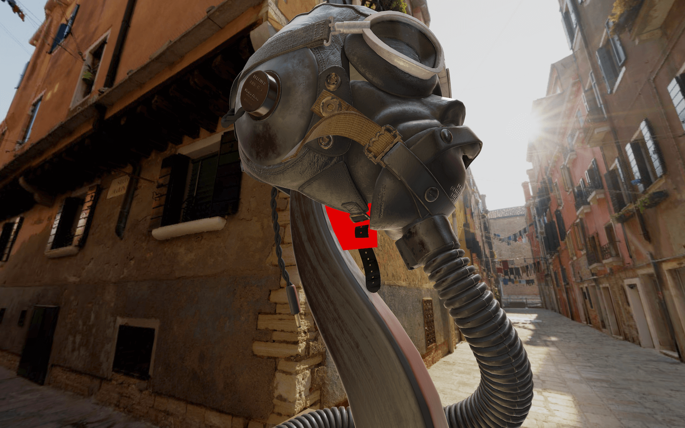

The plane should be visible from the other side of the helmet.

### Fill the render

We now want this plane to be always in front of the camera. We want it to fill the render regardless of the camera position. To do that, we are going to use a [ShaderMaterial](https://threejs.org/docs/#api/en/materials/ShaderMaterial).

Replace the [MeshBasicMaterial](https://threejs.org/docs/#api/en/materials/MeshBasicMaterial) by a [ShaderMaterial](https://threejs.org/docs/#api/en/materials/ShaderMaterial) and write the default shaders that we have learned previously with the `vertexShader` property and the `fragmentShader` property. You can try to do this from memory but don't be frustrated if you can't. It takes time:

```js
const overlayMaterial = new THREE.ShaderMaterial({
    vertexShader: `
        void main()
        {
            gl_Position = projectionMatrix * modelViewMatrix * vec4(position, 1.0);
        }
    `,
    fragmentShader: `
        void main()
        {
            gl_FragColor = vec4(1.0, 0.0, 0.0, 1.0);
        }
    `
})
```

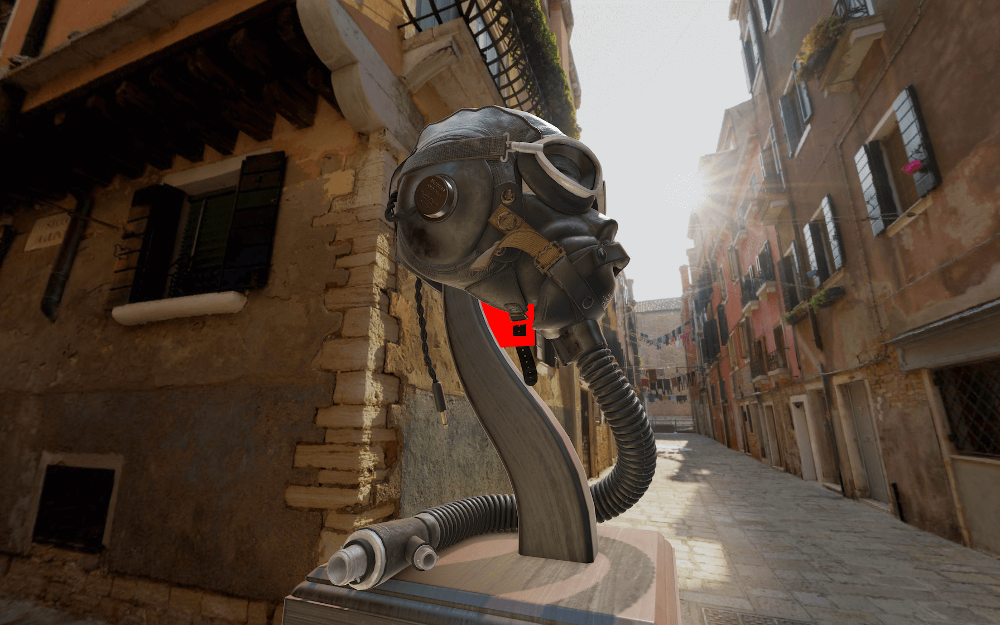

You should get the same result, but this time, we have control over the shaders.

To make the plane fill the render, we need to **not** apply the matrices:

```js
const overlayMaterial = new THREE.ShaderMaterial({
    vertexShader: `
        void main()
        {
            gl_Position = vec4(position, 1.0);
        }
    `,
    fragmentShader: `
        void main()
        {
            gl_FragColor = vec4(1.0, 0.0, 0.0, 1.0);
        }
    `
})
```

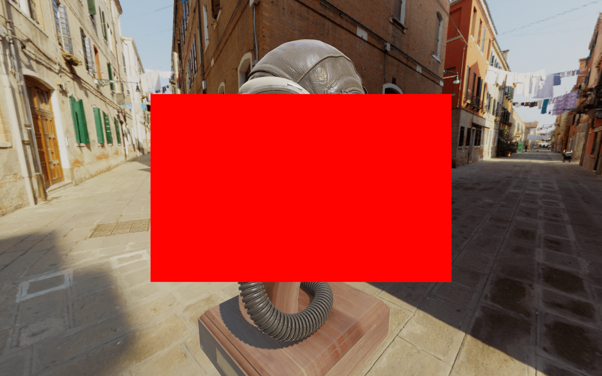

Now you get a big rectangle in the middle. Neither its position, the camera position, the field of view or anything else transform it because none of the matrices are used.

The coordinates of the plane's vertices go from `-0.5` to `+0.5` because our plane has a size of `1`.

The vertex shader, stripped like that, draws the triangles on the screen in the specified coordinates without considering anything else. We can see these triangles by setting the `wireframe` property to `true`:

```js
const overlayMaterial = new THREE.ShaderMaterial({
    wireframe: true,
    // ...
})
```

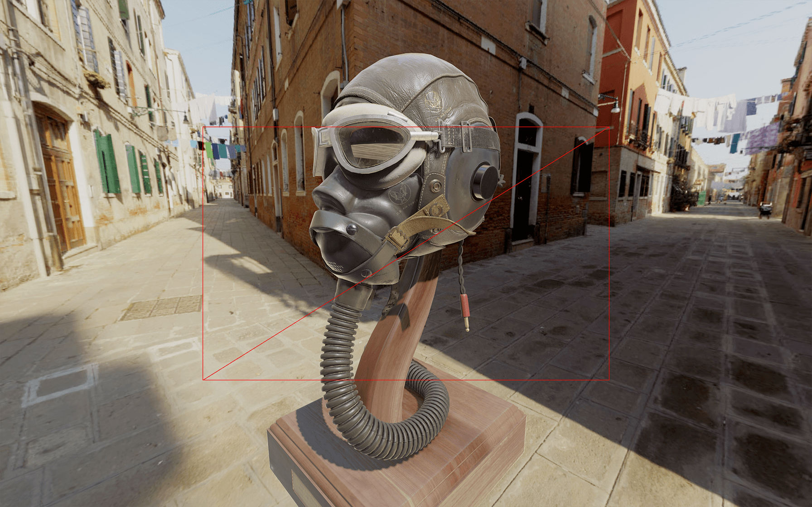

Comment or remove the `wireframe`.

To get a bigger rectangle, we need the coordinates to go from `-1` to `+1`. To do that, double the size of the [PlaneGeometry](https://threejs.org/docs/index.html#api/en/geometries/PlaneGeometry):

```js
const overlayGeometry = new THREE.PlaneGeometry(2, 2, 1, 1)
```


The rectangle is now filling the whole render.

### Color and alpha

Let's say instead of this red color, we want black.

Change the `gl_FragColor`:

```js
const overlayMaterial = new THREE.ShaderMaterial({
    // ...
    fragmentShader: `
        void main()
        {
            gl_FragColor = vec4(0.0, 0.0, 0.0, 1.0);
        }
    `
})
```


Everything appears to be black.

Now, we want to be able to control the alpha. As you know, the fourth value of the `gl_FragColor`.

Set this fourth parameter to `0.5` to see if it's working:

```js
const overlayMaterial = new THREE.ShaderMaterial({
    // ...
    fragmentShader: `
        void main()
        {
            gl_FragColor = vec4(0.0, 0.0, 0.0, 0.5);
        }
    `
})
```


Unfortunately, everything is still fully black, and it's because we forgot an easy to forget a thing. We need to set the `transparent` property to `true` on our [ShaderMaterial](https://threejs.org/docs/#api/en/materials/ShaderMaterial):

```js
const overlayMaterial = new THREE.ShaderMaterial({
    transparent: true,
    // ...
})
```

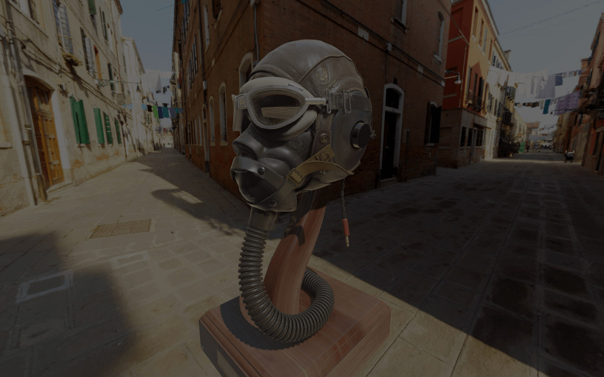

The whole scene should look darker.

### Uniform

Now that we have our overlay set, we need a way to control the alpha value. We are going to use a uniform.

Add a `uAlpha` uniform as we did before:

```js
const overlayMaterial = new THREE.ShaderMaterial({
    // ...
    uniforms:
    {
        uAlpha: { value: 1 }
    },
    // ...
})
```

Then use it in the `fragmentShader` instead of the raw `0.5`:

```js
const overlayMaterial = new THREE.ShaderMaterial({
    // ...
    fragmentShader: `
        uniform float uAlpha;

        void main()
        {
            gl_FragColor = vec4(0.0, 0.0, 0.0, uAlpha);
        }
    `
})
```


You should get the same result, but we can control the alpha directly from the JavaScript with the `uAlpha` uniform this time.

Let's change the value of that uniform to `1` to start with an entirely black screen.

```js
const overlayMaterial = new THREE.ShaderMaterial({
    // ...
    uniforms:
    {
        uAlpha: { value: 1 }
    },
    // ...
})
```

### Loading

Now that we have our overlay ready to be animated, we want to know when everything is loaded.

While there is only one model in the scene, we are genuinely loading many assets. We are loading the 6 images that compose the environment map, the model's geometries, and all the textures used in the model.

To load these assets, we used a [GLTFLoader](https://threejs.org/docs/#examples/en/loaders/GLTFLoader) and a [CubeTextureLoader](https://threejs.org/docs/#api/en/loaders/CubeTextureLoader). Both can receive a [LoadingManager](https://threejs.org/docs/#api/en/loaders/managers/LoadingManager) as parameter. That [LoadingManager](https://threejs.org/docs/#api/en/loaders/managers/LoadingManager) —as we saw at the beginning of the course— can be used to stay informed of the global loading progress.

Instantiate a [LoadingManager](https://threejs.org/docs/#api/en/loaders/managers/LoadingManager) and use it in the [GLTFLoader](https://threejs.org/docs/#examples/en/loaders/GLTFLoader) and [CubeTextureLoader](https://threejs.org/docs/#api/en/loaders/CubeTextureLoader):

```js
/**
 * Loaders
 */
const loadingManager = new THREE.LoadingManager()
const gltfLoader = new GLTFLoader(loadingManager)
const cubeTextureLoader = new THREE.CubeTextureLoader(loadingManager)
```

Nothing should have changed, but we can now send two functions to the [LoadingManager](https://threejs.org/docs/#api/en/loaders/managers/LoadingManager).

The first one will be triggered when everything is loaded, and the second one will be trigger when the loading progress.

Add these two functions with the following parameters:

```js
const loadingManager = new THREE.LoadingManager(
    // Loaded
    () =>
    {
        console.log('loaded')
    },

    // Progress
    () =>
    {
        console.log('progress')
    }
)
```

You should get multiple `"progress"` in the logs and one `"loaded"` at the end.

The progress function will be helpful later. For now, all we need is the loaded function.

### Animate

To fade out the overlay, we need a way to animate the `uAlpha` uniform value. While this is a little far-fetched, just for that, we will use the GSAP library as we did at the beginning of the course.

First, in the terminal, install the `gsap` library with `npm install --save gsap@3.5.1` —relaunch the server if you stopped it.

Now that we have `gsap` in the dependencies, we can import it:

```js
import { gsap } from 'gsap'
```

Finally, we can use it to animate the `uAlpha` uniform value in the loaded function:

```js
const loadingManager = new THREE.LoadingManager(
    // Loaded
    () =>
    {
        gsap.to(overlayMaterial.uniforms.uAlpha, { duration: 3, value: 0 })
    },

    // ...
)
```


_https://threejs-journey.xyz/assets/lessons/31/step-11.mp4_

The overlay should fade out nicely once everything is loaded.

## Loading bar

The assets are quite heavy, and the whole project weighs around 50MB. The model could use some optimizations, but this is not the subject of the lesson. It's the perfect opportunity to see the assets loading with a nice loading bar.

### Simulating a normal bandwidth

The problem is that we are testing in local, and everything loads remarkably fast. If you are using Chrome, you can simulate a slower bandwidth.

The following instructions concern Chrome, but all those features are available in Firefox too.

In the **Developer Tools** panel, go to the **Network** tab.

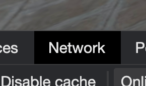

First, check the **Disable cache**.

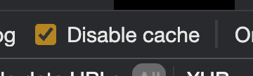

This will force the assets to load without cache like if it was the first time you visite the website.

Then, we need a way to throttle the bandwidth. To do that, click on the dropdown menu with the **Online** value.

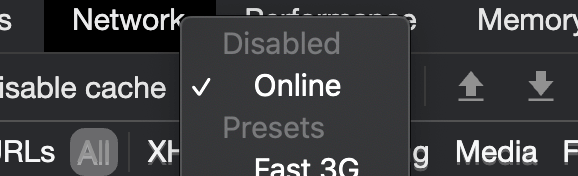

Here, we can choose various throttle values. Unfortunately, the available options don't fit the project.

To add a custom value, click on **Add**:

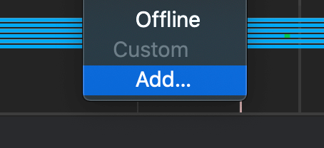

In the panel that should open, click on **Add custom profile...**, choose a name like "Pretty fast" and set the **Download** value to `100000`.

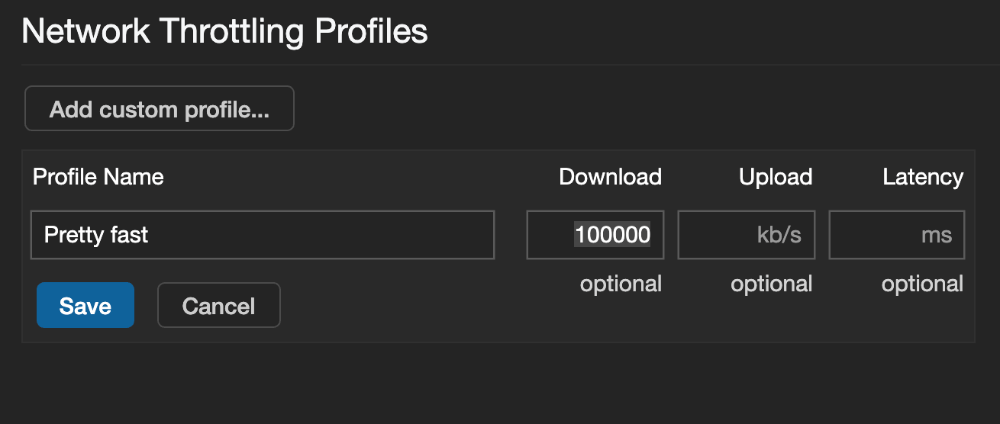

The meaning of this value isn't that important as long as we have time to see the assets loading. For a typical project, you should create a lower value that simulates an ADSL connexion.

Save it, close the panel, and choose this value in the dropdown menu.

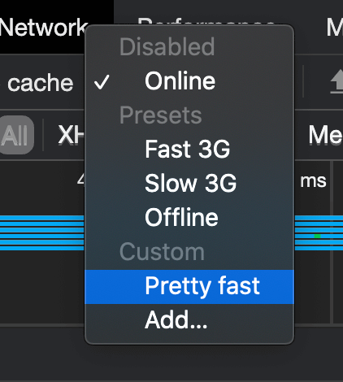

The network now simulates a pretty fast bandwidth.

If you reload, you'll see that you now have to wait for something like 3 seconds before the overlay fade out.

### Create the HTML loading bar

Now that we can test the loading progress, it's time to add the loading bar. This time, for the sake of the lesson, we will add this bar in HTML but we could have create a new plane with a shader animating it like we did for the overlay.

Open the `/src/index.html` file and add a `<div>` with a `loading-bar` class right after the `<canvas>`:

```html
<!-- ... -->
<body>
    <canvas class="webgl"></canvas>
    <div class="loading-bar"></div>
</body>
</html>
```

Then, in the `/src/style.css` file, position the bar, so it fits the whole width in the middle of the screen:

```css
.loading-bar
{
    position: absolute;
    top: 50%;
    width: 100%;
    height: 2px;
    background: #ffffff;
}
```


That is classic CSS and we won't explain it.

We want the bar to fill from the left. To do that, we are going to scale it using the `transform` CSS property.

Set a `transform` property with a `scaleX`, and a value of `0.3`:

```css
.loading-bar
{
    /* ... */
    transform: scaleX(0.3);
}
```


The scale worked; sadly, the bar seems to scale in its middle. To change that, use the `transform-origin` property:

```css
.loading-bar
{
    /* ... */
    transform: scaleX(0.3);
    transform-origin: top left;
}
```

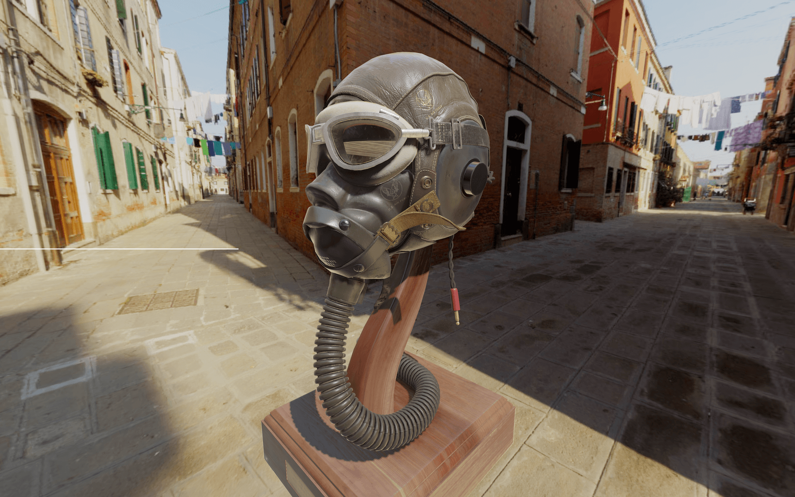

The bar should stay on the left.

Finally, set the `scaleX` value to `0`:

```css
.loading-bar
{
    /* ... */
    transform: scaleX(0);
    transform-origin: top left;
}
```

### Update the bar

Now that we have the bar let's get back to the `/src/script.js` and animate it when the loading progress.

To know when the loading progress, we can use the second function we sent to the [LoadingManager](https://threejs.org/docs/#api/en/loaders/managers/LoadingManager):

```js
const loadingManager = new THREE.LoadingManager(
    // ...

    // Progress
    () =>
    {
        console.log('progress')
    }
)
```

This function will be triggered each time an asset has been loaded and can have 3 arguments:

- The URL of the assets
- How much assets were loaded
- The total number of assets to load

You can test these values:

```js
const loadingManager = new THREE.LoadingManager(
    // ...

    // Progress
    (itemUrl, itemsLoaded, itemsTotal) =>
    {
        console.log(itemUrl, itemsLoaded, itemsTotal)
    }
)
```

You should see each asset load in the logs.

Now, we need to update the `scaleX` value. To do that, we just need to update the `loading-bar` element style.

First, let's retrieve that element. To do so, we will use `document.querySelector`:

```js
const loadingBarElement = document.querySelector('.loading-bar')
```

That is classic JavaScript technique to get an element with a selector—like in CSS.

In the progress function, we first need to calculate the progress ratio. This value should go from `0` when no asset is loaded to `1` when all assets are loaded.

To calculate this ratio, we can simply divide `itemsLoaded` by `itemsTotal`:

```js
const loadingManager = new THREE.LoadingManager(
    // ...

    // Progress
    (itemUrl, itemsLoaded, itemsTotal) =>
    {
        const progressRatio = itemsLoaded / itemsTotal
        console.log(progressRatio)
    }
)
```

You should see the `progressRatio` going from `0` to `1` in the logs.

We can now update the `transform` of the `loadingBarElement`:

```js
const loadingManager = new THREE.LoadingManager(
    // ...

    // Progress
    (itemUrl, itemsLoaded, itemsTotal) =>
    {
        const progressRatio = itemsLoaded / itemsTotal
        loadingBarElement.style.transform = `scaleX(${progressRatio})`
    }
)
```


_https://threejs-journey.xyz/assets/lessons/31/step-15.mp4_

The bar should fill according to the loading progress.

Don't forget to keep the **Developer tools** open with the **Disable cache** checked and the throttling set to the **Pretty fast**.

### Smooth the animation

Let's make the animation a little more flowing by smoothing the transition. There are many ways of doing so, but the most simplistic solution is to add a `transition` to the CSS.

In the `/src/style.css` file, add a `0.5s` transition on the `transform` property:

```css
.loading-bar
{
    /* ... */
    transition: transform 0.5s;
}
```


_https://threejs-journey.xyz/assets/lessons/31/step-16.mp4_

You should have the same result but with a smoother animation on the bar.

### Hide the bar

There are many ways to hide the bar once everything is loaded, but to make it cool and keep the flow, we will make the bar disappear on the right.

First, in the `/src/style.css` file, add a new selector with the following properties:

```css
.loading-bar.ended
{
    transform: scaleX(0);
    transform-origin: 100% 0;
    transition: transform 1.5s ease-in-out;
}
```

Be sure not to add a space between `.loading-bar` and `.ended` so that the properties only apply when both classes are present on the element.

The properties simply scale the bar to `0` with a transformation aligned to the right and a more extended transition using an `ease-in-out` timing function.

All we need to do now is add the `ended` class to the element when everything is loaded.

We can do that in the loaded function with the `classList.add(...)` method:

```js
const loadingManager = new THREE.LoadingManager(
    // Loaded
    () =>
    {
        gsap.to(overlayMaterial.uniforms.uAlpha, { duration: 3, value: 0, delay: 1 })

        loadingBarElement.classList.add('ended')
    },

    // ...
)
```

Unfortunately, this won't work because there is still a `scaleX` applied to the element from the progress function.

We simply need to set the transform to an empty string to solve that:

```js
const loadingManager = new THREE.LoadingManager(
    // Loaded
    () =>
    {
        gsap.to(overlayMaterial.uniforms.uAlpha, { duration: 3, value: 0, delay: 1 })

        loadingBarElement.classList.add('ended')
        loadingBarElement.style.transform = ''
    },

    // ...
)
```


_https://threejs-journey.xyz/assets/lessons/31/step-17.mp4_

The bar should disappear on the right as planned. The animation looks a little jumpy, which isn't ideal.

There are two reasons for that. First, it takes time to render the elements on the scene for the first time, and the computer freeze for a moment. Secondly, we added a `0.5s` transition to the bar. That means that when the loaded function is triggered, the bar didn't finish its transition to the end.

To solve these problems, we can ask the JavaScript to wait for `0.5s` before starting the intro animation with a `setTimeout(...)`:

```js
const loadingManager = new THREE.LoadingManager(
    // Loaded
    () =>
    {
        window.setTimeout(() =>
        {
            gsap.to(overlayMaterial.uniforms.uAlpha, { duration: 3, value: 0, delay: 1 })

            loadingBarElement.classList.add('ended')
            loadingBarElement.style.transform = ''
        }, 500)
    },

    // ...
)
```


_https://threejs-journey.xyz/assets/lessons/31/step-18.mp4_

The bar now disappears more smoothly.

And that's it. You now have a less brutal intro with an HTML loading bar.
