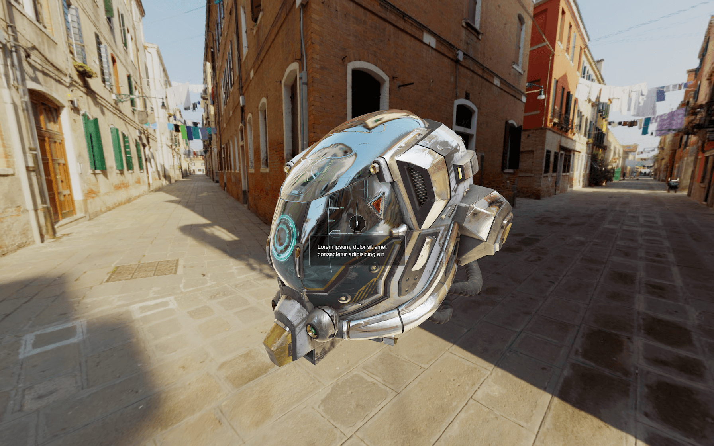
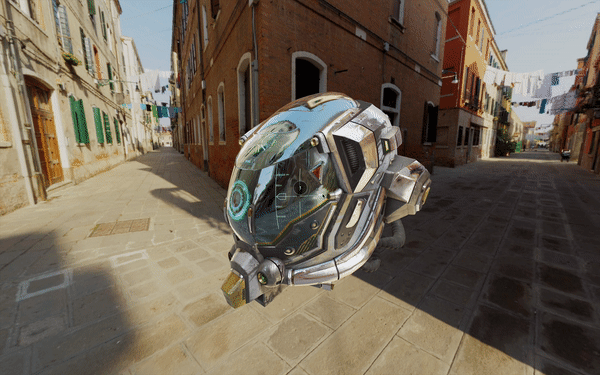
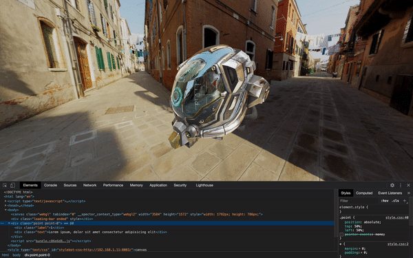
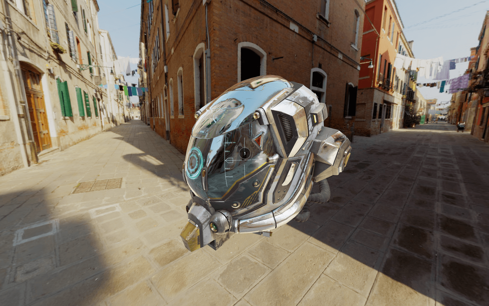

# Mixing HTML and WebGL

[](https://shields.io)

Learn in [https://threejs-journey.xyz/lessons/32](https://threejs-journey.xyz/lessons/32)

## Introduction

In this lesson, we will learn how to integrate HTML into the scene. By that, I mean to have an interactive HTML element that follows a specific 3D position on the scene, so it looks like they are part of the WebGL.

To demonstrate that, we are going to add interest points to a model. Those interest points will be made with HTML and will always stick to their associated 3D position. And because those points will be made of HTML, we will be able to design them using CSS, add interactions like `:hover` and add transitions.

## Setup

The starter is composed of what we did in the **Intro and loading progress** lesson on in the **Post-processing** lesson with the [Damaged Helmet](https://github.com/KhronosGroup/glTF-Sample-Models/tree/master/2.0/DamagedHelmet) by [Leonardo Carrion](http://www.leonardocarrion.com/).


## HTML

First, let's create one HTML point. At the end of the lesson, we will add more points.

In the `/src/index.html` file, add the point after the `<canvas>` and the loading bar:

```html
<canvas class="webgl"></canvas>

<div class="loading-bar"></div>

<div class="point point-0">
    <div class="label">1</div>
    <div class="text">Lorem ipsum, dolor sit amet consectetur adipisicing elit</div>
</div>
```

The text we put inside that point shouldn't be visible on the page because it's hidden behind the `<canvas>`.

We used the `point` class to be able to target all the points in CSS but also the `point-0` class to target this specific element in the JavaScript. Next points will have `point-1`, `point-2`, etc.

Our point is composed of a `<div>` with a `label` class and a `<div>` with a `text` class.

The label will be the small round number that looks like it's stuck onto the model, and the text will show up when we hover that label.

## CSS

We are going to add the whole CSS in one raw. Usually, you would have to do it progressively, but we know where we are going.

Go to the `/src/style.css` file and start by positioning the point in the middle of the screen:

```css
.point
{
    position: absolute;
    top: 50%;
    left: 50%;
}
```


You should see the black text in the middle of the screen. We start from the center because Three.js will provide coordinates where `0` is the center of the screen.

Let's design the label first:

```css
.point .label
{
    position: absolute;
    top: -20px;
    left: -20px;
    width: 40px;
    height: 40px;
    border-radius: 50%;
    background: #00000077;
    border: 1px solid #ffffff77;
    color: #ffffff;
    font-family: Helvetica, Arial, sans-serif;
    text-align: center;
    line-height: 40px;
    font-weight: 100;
    font-size: 14px;
}
```


You should see the label.

Nothing too hard here. We simply rounded the element with `border-radius: 50%;`, used a black background having a reduced opacity with `background: #00000077;`; and did the same for the border with `border: 1px solid #ffffff77;`. Then, we centered the white text in the middle of the element.

Let's do the same for the text:

```css
.point .text
{
    position: absolute;
    top: 30px;
    left: -120px;
    width: 200px;
    padding: 20px;
    border-radius: 4px;
    background: #00000077;
    border: 1px solid #ffffff77;
    color: #ffffff;
    line-height: 1.3em;
    font-family: Helvetica, Arial, sans-serif;
    font-weight: 100;
    font-size: 14px;
}
```



You should see the text below the label.

What we achieved here is very similar to the label, but with a fixed `border-radius`, a specific `line-height`, and a `padding`.

Now that we have our two elements let's prepare the interactions. First, we want our text to be hidden by default.

Set its `opacity` to `0`:

```css
.point .text
{
   /* ... */
    opacity: 0;
}
```

When the `.point` is being hovered, we want the text to appear:

```css
.point:hover .text
{
    opacity: 1;
}
```


_https://threejs-journey.xyz/assets/lessons/32/step-05.mp4_

The text should show up when the label is hovered.

Instead of this crude apparition, we want the text to fade in and out. To do so, we can use a `transition`.

Add the transition to the text but not just when it's hovered. This way, the transition will also occur when the cursor leaves the point:

```css
.point .text
{
    /* ... */
    transition: opacity 0.3s;
}
```


_https://threejs-journey.xyz/assets/lessons/32/step-06.mp4_

The text should fade in and out.

We have a small problem. We can hover the text directly while it is invisible.


_https://threejs-journey.xyz/assets/lessons/32/step-07.mp4_

To fix that, we can deactivate the pointer events on the text. This can be done with the `pointer-events` CSS property:

```css
.point .text
{
    /* ... */
    pointer-events: none;
}
```


_https://threejs-journey.xyz/assets/lessons/32/step-08.mp4_

The text shouldn't be "hoverable".

Currently, the cursor changes to a text selection when we hover the number in the label. To fix that, we can change the cursor on the whole label with the `cursor` CSS property.

```css
.point .label
{
    /* ... */
    cursor: help;
}
```



_https://threejs-journey.xyz/assets/lessons/32/step-09.mp4_

A "?" should appear in place of the cursor when hovering the label.

We almost completed our work with the CSS. What we need to do now is prepare a way to show and hide the label. So, we will hide them by default and show them only when there is a `visible` class on the point.

To hide them, we are going to use a `transform` with a `scale`, and we will also add a transition so that the scale will be animated:

```css
.point .label
{
    /* ... */
    transform: scale(0, 0);
    transition: transform 0.3s;
}

.point.visible .label
{
    transform: scale(1, 1);
}
```

The labels should be gone. But if we add the `visible` class directly to the element using the **Developer Tools** panel, we should see the label showing up.



_https://threejs-journey.xyz/assets/lessons/32/step-10.mp4_

For now, let's add the `visible` class directly in the HTML so that we can position the points. We will remove the class later.

```html
<div class="point point-0 visible">
```



The point should now be visible.

## JavaScript

Now that everything is ready in both the HTML and the CSS, we can switch to the JavaScript.

### Storing the points

First, we need a way to store all the points —even if we only have one right now. We are going to use an array of objects with each object corresponding to one point.

Each point object will have two properties: the 3D position and a reference to the HTML element.

Create the `points` array with one point inside:

```js
const points = [
    {
        position: new THREE.Vector3(1.55, 0.3, - 0.6),
        element: document.querySelector('.point-0')
    }
]
```

We used a [Vector3](https://threejs.org/docs/#api/en/math/Vector3) for the position and `document.querySelector(...)` to retrieve the element from the HTML.

### Updating the point positions

We are going to update the points HTML elements on each frame directly in the `tick` function.

In the `tick` function, right after updating the controls, loop through each element in the `points` array —even if we only have one. You can use any loop technique, but we will go for a `for(... of ...)`:

```js
const tick = () =>
{
    // Update controls
    controls.update()

    // Go through each point
    for(const point of points)
    {

    }

    // ...
}
```

We need to get the 2D screen position of the 3D scene position of the point. This part is pretty straightforward.

First, we need to clone the point's position. This is important because the following code will directly modify the [Vector3](https://threejs.org/docs/#api/en/math/Vector3). To clone the position, use the `clone()` method:

```js
const tick = () =>
{
    // ...

    for(const point of points)
    {
        const screenPosition = point.position.clone()
    }

    // ...
}
```

To get the 2D screen position, we need to call the `project(...)` method and use the `camera` as parameter:

```js
const tick = () =>
{
    // ...

    for(const point of points)
    {
        const screenPosition = point.position.clone()
        screenPosition.project(camera)

        console.log(screenPosition.x)
    }

    // ...
}
```

You should see a value close to `0` in the logs. If you move the camera so that the helmet is on the far left —use right-click and drag &amp; drop— you'll get a value close to `-1`. If you move the camera so that the helmet is on the far right, you'll get a value close to `+1`.

Let's focus on the `x` value and we will see the `y` later on.

The problem is that we cannot use this value like that. We want to be able to move the point element using pixels.

To go from that projected screen position to the pixels on the screen, we need to multiply by half the size of the render, and we already have this value in the `sizes` object:

```js
const tick = () =>
{
    // ...

    for(const point of points)
    {
        const screenPosition = point.position.clone()
        screenPosition.project(camera)

        const translateX = screenPosition.x * sizes.width * 0.5
        console.log(translateX)
    }

    // ...
}  
```

Again, move the camera to position the helmet on the far sides and look at the value in the logs. It should be a few hundred.

Now that the value seems right let's update the point element. To do that, we will apply the translation in the `style`'s `transform` property. Don't forget to write `px` at the end of the `translateX` function:

```js
const tick = () =>
{
    // ...

    for(const point of points)
    {
        const screenPosition = point.position.clone()
        screenPosition.project(camera)

        const translateX = screenPosition.x * sizes.width * 0.5
        point.element.style.transform = `translateX(${translateX}px)`
    }

    // ...
}
```


_https://threejs-journey.xyz/assets/lessons/32/step-12.mp4_

The point seems to be moving well on the X axis. Let's add the Y axis.

Add a `translateY` variable using the `y` property and the `sizes.height` value. Then, apply it to the transform:

```js
const tick = () =>
{
    // ...

    for(const point of points)
    {
        const screenPosition = point.position.clone()
        screenPosition.project(camera)

        const translateX = screenPosition.x * sizes.width * 0.5
        const translateY = screenPosition.y * sizes.height * 0.5
        point.element.style.transform = `translateX(${translateX}px) translateY(${translateY}px)`
    }

    // ...
}
```


_https://threejs-journey.xyz/assets/lessons/32/step-13.mp4_

We are almost there, sadly, the Y axis seems inverted. Indeed, in CSS, a positive `translateY` goes down while in Three.js, a positive `y` goes up.

We need to negate the `translateY` variable:

```js
const tick = () =>
{
    // ...

    for(const point of points)
    {
        const screenPosition = point.position.clone()
        screenPosition.project(camera)

        const translateX = screenPosition.x * sizes.width * 0.5
        const translateY = - screenPosition.y * sizes.height * 0.5
        point.element.style.transform = `translateX(${translateX}px) translateY(${translateY}px)`
    }

    // ...
}
```


_https://threejs-journey.xyz/assets/lessons/32/step-14.mp4_

The point element should follow its 3D position perfectly.

### Showing and hiding the element

To finish, we need to hide the point if there is something in front of it.

First, remove the `visible` class in the HTML:

```html
<div class="point point-0">
```

To test if something is in front of the point, we will use [Raycaster](https://threejs.org/docs/#api/en/core/Raycaster). We'll shoot a ray from the camera to the point. If there is no intersecting object, we show the point. If there is something, we test the distance of the intersection. If the intersection point is further than the point, it means the object is behind the point, and we can show it. If the intersection point is closer than the point, the intersecting object is in front of the point, and we hide it.

Let's create a [Raycaster](https://threejs.org/docs/#api/en/core/Raycaster) anywhere out of the `tick` function:

```js
const raycaster = new THREE.Raycaster()
```

In the `tick` function, update the [Raycaster](https://threejs.org/docs/#api/en/core/Raycaster), so it goes from the camera to the point. To do so, use the `setFromCamera(...)`.

If you remember from the **Raycaster** lesson, the first parameter of `setFromCamera(...)` should be a [Vector2](https://threejs.org/docs/#api/en/math/Vector2) corresponding to the position on the screen and the second parameter should be the camera.

In the **Raycaster** lesson, we had to convert the cursor's screen position (in pixel) to a value adapted to Three.js coordinates. Yet, in our case, we already have those values. We can instead use the `screenPosition`. Yes `screenPosition` is a [Vector3](https://threejs.org/docs/#api/en/math/Vector3), but only its `x` and `y` properties will be used:

```js
const tick = () =>
{
    // ...

    for(const point of points)
    {
        const screenPosition = point.position.clone()
        screenPosition.project(camera)

        raycaster.setFromCamera(screenPosition, camera)

        // ...
    }

    // ...
}
```

We are going to test the [Raycaster](https://threejs.org/docs/#api/en/core/Raycaster) with the `intersectObjects(...)` method against every objects in the scene.

To do that, use the `scene.children` as the first parameter, and `true` as the second parameter. This second parameter will enable recursive testing, meaning that the algorithm will go through the children of the children too and children of the children of the children, etc:

```js
const tick = () =>
{
    // ...

    for(const point of points)
    {
        const screenPosition = point.position.clone()
        screenPosition.project(camera)

        raycaster.setFromCamera(screenPosition, camera)
        const intersects = raycaster.intersectObjects(scene.children, true)

        // ...
    }

    // ...
}
```

First, what we can do is test if there are intersects. If there is no intersection, there is no object in front of the point, and we can show it. If there are intersects, we will have to do more tests, but for now, let's just hide the point.

To show the point, we can add the `visible` class with `classList.add(...)`. Whereas to hide the point, we can remove the `visible` class with `classList.remove(...)`:

```js
const tick = () =>
{
    // ...

    for(const point of points)
    {
        const screenPosition = point.position.clone()
        screenPosition.project(camera)

        raycaster.setFromCamera(screenPosition, camera)
        const intersects = raycaster.intersectObjects(scene.children, true)

        if(intersects.length === 0)
        {
            point.element.classList.add('visible')
        }
        else
        {
            point.element.classList.remove('visible')
        }

        // ...
    }

    // ...
}
```


_https://threejs-journey.xyz/assets/lessons/32/step-15.mp4_

Not exactly what we want, but we are getting there.

The problem is that we are hiding the point if anything intersects with the ray. But if the intersection is behind the point, this one shouldn't hide.

We need to calculate the distance to the point, then calculate the intersection's distance and compare them.

The `intersectObjects(...)` methods return an array of intersections. These intersections are sorted by distance, with the closest first. That means that we don't have to test all of the intersections if there are multiple, and we can merely test the first one.

To get the intersection distance, it's manageable because this value is already available in the intersection object as the `distance` property:

```js
const tick = () =>
{
    // ...

    for(const point of points)
    {
        const screenPosition = point.position.clone()
        screenPosition.project(camera)

        raycaster.setFromCamera(screenPosition, camera)
        const intersects = raycaster.intersectObjects(scene.children, true)

        if(intersects.length === 0)
        {
            point.element.classList.add('visible')
        }
        else
        {
            const intersectionDistance = intersects[0].distance
        }

        // ...
    }

    // ...
}
```

Getting the point distance is a little harder. We need to start from the point `position`, and because it's a [Vector3](https://threejs.org/docs/#api/en/math/Vector3), we can use its `distanceTo()` method.

This method needs another [Vector3](https://threejs.org/docs/#api/en/math/Vector3) as parameter. It will calculate the distance between the first one and the second one. We can use the `position` of the `camera`:

```js
const tick = () =>
{
    // ...

    for(const point of points)
    {
        const screenPosition = point.position.clone()
        screenPosition.project(camera)

        raycaster.setFromCamera(screenPosition, camera)
        const intersects = raycaster.intersectObjects(scene.children, true)

        if(intersects.length === 0)
        {
            point.element.classList.add('visible')
        }
        else
        {
            const intersectionDistance = intersects[0].distance
            const pointDistance = point.position.distanceTo(camera.position)
        }

        // ...
    }

    // ...
}
```

All we need to do now is compare those two distances. If `intersectionDistance` is inferior to `pointDistance`, it means that the object intersecting is closer than the point and should be hidden. Otherwise, the point should appear:

```js
const tick = () =>
{
    // ...

    for(const point of points)
    {
        const screenPosition = point.position.clone()
        screenPosition.project(camera)

        raycaster.setFromCamera(screenPosition, camera)
        const intersects = raycaster.intersectObjects(scene.children, true)

        if(intersects.length === 0)
        {
            point.element.classList.add('visible')
        }
        else
        {
            const intersectionDistance = intersects[0].distance
            const pointDistance = point.position.distanceTo(camera.position)

            if(intersectionDistance < pointDistance)
            {
                point.element.classList.remove('visible')
            }
            else
            {
                point.element.classList.add('visible')
            }
        }

        // ...
    }

    // ...
}
```


_https://threejs-journey.xyz/assets/lessons/32/step-16.mp4_

Everything is working fine now.

### Wait for the scene to be ready

The problem we have now is that the keypoints are visible when the scene is loading. An easy fix would be to create a variable to `false` and set it to `true` once everything is ready. In the `tick` function, we would only update the points if this variable is `true`.

Create a `sceneReady` variable to `false` and, in the `loadingManager` success function, after `2000ms` set it to `true`:

```js
let sceneReady = false
const loadingManager = new THREE.LoadingManager(
    // Loaded
    () =>
    {
        // ...

        window.setTimeout(() =>
        {
            sceneReady = true
        }, 2000)
    },

    // ...
)
```

Finally, in the `tick` function, put the whole points loop in a `if` statement:

```js
const tick = () =>
{
    // ...

    if(sceneReady)
    {
        for(const point of points)
        {
            // ...
        }
    }

    // ...
}
```


_https://threejs-journey.xyz/assets/lessons/32/step-17.mp4_

The points should only show when the scene is ready, and the intro almost fully gone.

## Add more points

That's it! We have our point working nicely. We can now add more points and change the texts for something a little more convincing.

In the HTML:

```html
<div class="point point-0">
    <div class="label">1</div>
    <div class="text">Front and top screen with HUD aggregating terrain and battle informations.</div>
</div>
<div class="point point-1">
    <div class="label">2</div>
    <div class="text">Ventilation with air purifier and detection of environment toxicity.</div>
</div>
<div class="point point-2">
    <div class="label">3</div>
    <div class="text">Cameras supporting night vision and heat vision with automatic adjustment.</div>
</div>
```

In the JavaScript:

```js

const points = [
    {
        position: new THREE.Vector3(1.55, 0.3, - 0.6),
        element: document.querySelector('.point-0')
    },
    {
        position: new THREE.Vector3(0.5, 0.8, - 1.6),
        element: document.querySelector('.point-1')
    },
    {
        position: new THREE.Vector3(1.6, - 1.3, - 0.7),
        element: document.querySelector('.point-2')
    }
]
```


_https://threejs-journey.xyz/assets/lessons/32/step-18.mp4_

## Going further

What we did here is one way, among many others. You probably would have done it differently, and it might be even better. It depends on you, the project, the animations, the performances, how flexible the code should be, etc.

There is also room for performance improvement. Currently, we are updating all the points on each frame. We could only update the visible ones.

Keep in mind that combining HTML with WebGL is usually bad for performances. Avoid doing it, and if you have no other choice, keep an eye on the frame rate and regularly test on different devices.
